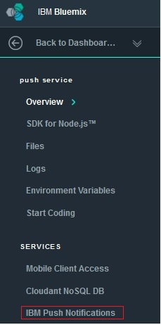

---

copyright:
 years: 2015, 2016

---

{:new_window: target="_blank"}
# Configuración de credenciales para Google Cloud Messaging (GCM)
{: #create-push-enable-gcm}

Obtenga las credenciales de Google Cloud Messaging (GCM) y, a continuación, configure el servicio de notificaciones push
        en el panel de control de Push.

##Cómo obtener el ID de remitente y la clave de la API

La clave de la API se almacena de forma segura y la utiliza el servicio de notificaciones Push para conectarse al servidor de GCM y el ID de remitente (número de proyecto) lo utilizará el SDK de Android en el lado del cliente. Para obtener más información sobre el ID de remitente, consulte [Google Cloud Messaging](https://developers.google.com/cloud-messaging/gcm#arch).

1. Obtenga una cuenta de Google Development en [Google Dev Console](https://console.developers.google.com/start){: new_window}. Para obtener más información sobre Google Cloud Messaging (GCM), consulte [Creación de un proyecto API de Google](https://developers.google.com/console/help/new/){: new_window}.

2. En la Google Developers Console, cree un nuevo proyecto. Por ejemplo, "hello
                        world".

	

3. En **Nombre de proyecto**, especifique el nombre del proyecto y, a continuación,
                        pulse el botón **Crear**.
4. Pulse **Inicio** para ver el número de
                        proyecto. Archive el número de proyecto.

	

	**Nota**: Al crear el proyecto, se creará un número de proyecto (ID de remitente). Utilice este número para configurar el Servicio de notificaciones Push en la pantalla de panel de control de
                            Push.

5. Pulse **API y autorizaciones** y, en la sección **API para móvil**, pulse **Cloud Messaging for Android**.

	

6. Pulse **API** y, a continuación, pulse el botón **Habilitar API
                        ** para crear la Clave de la API para el proyecto.

	

7. Vaya a la pantalla **Automatizaciones de las API -> Credenciales**. Pulse **Añadir credenciales** y, a continuación, pulse **Clave de la
                            API**.

	

8. Pulse la opción **Clave del servidor** para generar una clave de API de GCM
                        que utilizará en el panel de control de Push de Bluemix.
9. En el campo **Nombre**, especifique el nombre de la clave API del servidor.

	

10. Pulse el botón **Crear**. 
Se mostrará la clave de la
                        API.

	

11. Copie la clave de la API de GCM y, a continuación, pulse el botón **Aceptar**. Necesitará el número de proyecto (ID del remitente) y la clave de la API para configurar las credenciales en la pantalla Configuración del Panel de control de notificaciones Push de Bluemix. 
12. Siguientes pasos. Configuración del servicio de notificaciones Push para Android.

##Configuración del servicio de notificaciones Push para Android

**Antes de empezar**

Obtenga una clave API de GCM y un ID de remitente (número de proyecto). 

1. Abra la aplicación de fondo en el panel de control de Bluemix y, a continuación, pulse el servicio Notificaciones Push de IBM para abrir el panel de control del Servicio de notificaciones Push.
 
	

	Se mostrará el panel de control de Push.
	
	

2. Pulse el botón **Configurar Push** para configurar las credenciales de
                        GCM.
1. En el separador **Configuración**, vaya a la sección **Google Cloud Messaging** y configure el ID del remitente (número de proyecto de GCM) y una clave de API.

4. Pulse el botón **Guardar**. 
5. Siguientes pasos. [Habilitación de notificaciones para Android](c_enable_push.html).
