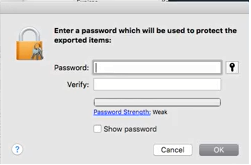
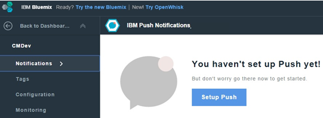

---

copyright:
 years: 2015, 2016

---

{:new_window: target="_blank"}
# Configuración de credenciales para notificaciones push de Apple (APN)

{: #create-push-credentials-apns}

El servicio de notificaciones Push de Apple (APN) permite al desarrollador de la aplicación enviar
        notificaciones remotas desde la instancia de servicio Push en Bluemix (el proveedor) en dispositivos y aplicaciones
        de iOS. Los mensajes se envían a una aplicación de destino del dispositivo. Obtenga y
        configure las credenciales del APN. Los certificados de APN se gestionan de forma segura mediante el servicio de notificaciones Push
        y se utilizan para conectarse al servidor del APN como proveedor.

1. Obtenga una cuenta de [Apple Developers](https://developer.apple.com/).
2. [Registrar un ID de
                    App](#create-push-credentials-apns-register)
3. [Crear un certificado SSL de APN de desarrollo y distribución](#create-push-credentials-apns-ssl)
4. [Crear un perfil de suministro de
                        desarrollo](#create-push-credentials-dev-profile)
5. [Crear un perfil de suministro de distribución del
                        almacén](#create-push-credentials-apns-distribute_profile)
6. [Configurar APN en el Panel de control de
                        Push](#create-push-credentials-apns-dashboard)

##Registrar un ID de App
{: #create-push-credentials-apns-register}

El ID de app (el identificador de paquete) es un identificador exclusivo que identifica una
            aplicación específica. Cada aplicación requiere un ID de app. Los servicios como por ejemplo el Servicio de notificaciones Push se configuran en el ID de App.

1. Vaya al portal [Desarrollador de Apple](https://developer.apple.com), pulse **Centro de miembros**, y seleccione **Certificados, identificadores y perfiles**.
2. Vaya a la sección **Registro de ID de App** de la [Apple Developer Library](https://developer.apple.com/library/mac/documentation/IDEs/Conceptual/AppDistributionGuide/MaintainingProfiles/MaintainingProfiles.html#//apple_ref/doc/uid/TP40012582-CH30-SW991), y siga las instrucciones para registrar el ID de App.

	**Nota**: Al registrar un ID de App, seleccione las opciones siguientes:
	* Notificaciones push

	

	* Sufijo de ID explícito

	
3. Siguientes pasos. Crear un certificado SSL de APN de desarrollo y distribución.

##Crear un certificado SSL de APN de desarrollo y distribución
{: #create-push-credentials-apns-ssl}

Para poder obtener un certificado del APN, debe generar en primer lugar una solicitud de firma de certificado
            (CSR) y enviarla a Apple, la entidad emisora de certificados (CA). La CSR
            contiene información que identifica a la empresa y a la clave pública y privada que
            utilice para firmar las notificaciones push de Apple. A continuación, genere el certificado SSL en el
            Portal de desarrollador de iOS. El certificado, junto con su clave pública y privada, se almacena
            en el Acceso de cadena de claves.

**Antes de empezar**

[Registrar un ID de
                    App](#create-push-credentials-apns-register)

El APN se puede utilizar en dos modalidades: pruebas y producción.

* La modalidad de pruebas se utiliza durante el desarrollo y la prueba.
* La modalidad de producción se utiliza al distribuir aplicaciones mediante la tienda de apps
                            (u otros mecanismos de distribución de empresa).

Debe obtener certificados independientes para los entornos de desarrollo y de
                    distribución. Los certificados están asociados con un ID de App para la app que es
                    el destinatario de las notificaciones remotas. Para la producción, puede crear un máximo de dos
                    certificados. Bluemix utiliza los certificados para establecer una conexión SSL con
                    APN.

Crear un certificado SSL de desarrollo y distribución.

1. Vaya a [Desarrollador de Apple](https://developer.apple.com), pulse **Centro de miembros**, y seleccione **Certificados, identificadores y perfiles**.
2. En el área **Identificadores**, pulse **ID de
                            app**.
3. Desde la lista de ID de App, seleccione el ID de App recién creado y, a continuación, seleccione
                            **Configuración**.
4. En el área **Notificaciones Push**, cree un certificado SSL de desarrollo
                        y, a continuación, un certificado SSL de producción.
 
	

	Se mostrará la pantalla Acerca de la creación de una solicitud de firma de certificado.

	

5. En el Mac, inicie la aplicación **Acceso de cadena de claves**
                        para crear una Solicitud de firma de certificado (CSR).
6. Seleccione **Acceso de cadena de claves > Asistente de certificado > Solicitud de un certificado a partir de una entidad emisora de certificados…** 
7. En **Información del certificado**, especifique la dirección de correo electrónico
                        asociada con la cuenta de Desarrollador de apps y un nombre común. Otorgue un
                        nombre significativo que le ayude a identificar si es un certificado para
                        desarrollo (pruebas) o distribución (producción); por ejemplo,**                            sandbox_apns_certificate** o
                            **production_apns_certificate**.

8. Seleccione **Guardado en disco** para descargar el archivo
                            **.certSigningRequest** en su escritorio y, a continuación,
                        pulse **Continuar**.
9. En **Guardar como**, nombre el archivo
                            **.certSigningRequest**; por ejemplo
                            **sandbox.certSigningRequest** y, a continuación, pulse
                            **Guardar**.
10. Pulse **Hecho**. Ahora tiene un CSR.
11. Desde **Acerca de la creación de una solicitud de firma de certificado (CSR)**, pulse **Continuar**. 12. 
12. Desde la pantalla **Generar**, pulse **Elegir
                            archivo...** y seleccione el archivo CSR que ha guardado en el
                        escritorio. A continuación, pulse **Generar**. 

	

13. Cuando el certificado esté listo, pulse **Hecho**.
14. En la pantalla **Notificaciones Push**, pulse **Descargar** para descargar el certificado y, a continuación, pulse **Hecho**. 
15. En el Mac, vaya a **Acceso de cadena de claves > Mis certificados**, y ubique el certificado recién instalado. Efectúe una doble pulsación en el certificado para instalarlo en el Acceso de cadena de claves.
16. Seleccione el certificado y la clave privada y, a continuación, seleccione **Exportar** para convertir el certificado en el formato de intercambio de información personal (formato .p12).

	

17. En el campo **Guardar como**, proporcione al certificado un nombre significativo para que lo pueda identificar posteriormente; por ejemplo **sandbox_apns.p12_certifcate** o
**production_apns.p12** y, a continuación, pulse **Guardar**.

   	

18. En el campo **Escriba una contraseña**, especifique una contraseña para proteger los elementos exportados y, a continuación, pulse **Aceptar**.Utilice esta contraseña para configurar posteriormente los valores de APN en el panel de control de
                            Push.

	
19. **Key Access.app** le solicita que exporte su clave desde la pantalla **Cadena de claves**. Especifique la contraseña de administración para Mac para permitir al sistema exportar estos elementos y, a continuación, seleccione la opción **Permitir siempre**. Se generará un certificado .p12 en
                        el escritorio.

##Creación de un perfil de suministro de desarrollo
{: #create-push-credentials-dev-profile}

El perfil de suministro funciona con el ID de App para determinar qué dispositivos pueden
            instalar y ejecutar la app y a qué servicios puede acceder la app. Para cada ID de App, cree
            dos perfiles de suministro: uno para desarrollo y otro para distribución. Xcode utiliza el perfil de suministro de desarrollo para determinar qué desarrolladores están
            permitidos para crear la aplicación y qué dispositivos están permitidos para probarse en la
            aplicación.

**Antes de empezar**

Asegúrese de que ha registrado un ID de App, de que lo ha habilitado
                    para el Servicio de notificaciones Push y de que lo ha configurado para utilizar un certificado SSL de APN de desarrollo y
                    producción.

Crear un perfil de suministro de desarrollo.

1. Vaya al portal de [Desarrollador de Apple](https://developer.apple.com), pulse **Centro de miembros**, y seleccione **Certificados, identificadores y perfiles**.
2. Vaya a [Mac Developer Library ](https://developer.apple.com/library/mac/documentation/IDEs/Conceptual/AppDistributionGuide/MaintainingProfiles/MaintainingProfiles.html#//apple_ref/doc/uid/TP40012582-CH30-SW62site), desplácese a la sección **Creación de perfiles de suministro de desarrollo**, y siga las instrucciones para crear un perfil de desarrollo.

	**Nota**: Al configurar un perfil de suministro de desarrollo, seleccione las opciones siguientes:
	* **Desarrollo de apps de iOS**
	* **Para aplicaciones iOS y watchOS**

##Creación de un perfil de suministro de distribución del almacén
{: #create-push-credentials-apns-distribute_profile}

Utilice el perfil de suministro del almacén para enviar la app para su distribución a la
            App Store.

1. Vaya al portal de [Desarrollador de Apple](https://developer.apple.com), pulse **Centro de miembros**, y seleccione **Certificados, identificadores y perfiles**.
2. Efectúe una doble pulsación en el perfil de suministro descargado para instalarlo en Xcode.

##Configuración de APN en el Panel de control de notificaciones Push
{: #create-push-credentials-apns-dashboard}

Para utilizar el Servicio de notificaciones Push para enviar notificaciones, cargue los certificados SSL
            que son necesarios para el servicio de Notificaciones Push de Apple (APN). También se puede utilizar la API REST para subir un certificado APN.

**Antes de empezar**

Obtenga el certificado SSL APN de producción y desarrollo y la contraseña
                    asociada con cada tipo de certificado. Para obtener más información, consulte Creación y configuración de las credenciales de push para APN.

Los certificados que son necesarios para las APN son certificados p12, que contienen la clave privada y certificados SSL que son necesarios para crear y publicar la aplicación. Debe generar los certificados desde el Centro de miembros del
                    sitio web Desarrollador de Apple (es necesaria una cuenta válida de desarrollador de Apple). Los certificados independientes son necesarios para el entorno de desarrollo (pruebas) y
                    el entorno de producción (distribución).

**Nota**: Después de que el .**cer** se encuentre en el acceso de cadena de claves, expórtelo al sistema para crear un certificado .p12.

Para obtener más información sobre la utilización de APN, consulte [iOS Developer Library: Local and Push Notification Programming Guide](https://developer.apple.com/library/ios/documentation/NetworkingInternet/Conceptual/RemoteNotificationsPG/Chapters/ProvisioningDevelopment.html#//apple_ref/doc/uid/TP40008194-CH104-SW4).

Configurar APN en el Panel de control de Push.

1. Abra la aplicación de fondo en el panel de control de Bluemix y, a continuación, pulse el
                            servicio **Notificaciones Push de IBM** para abrir el panel de control de
                        Push.

	

	Se mostrará el panel de control de Push.
	
	
1
2. En el separador **Configuración**, vaya a la sección **Certificado Push de Apple**, seleccione **Pruebas** (desarrollo) o **Producción** (distribución) y, a continuación, cargue el certificado p.12 en Bluemix.

	
3. En el campo **Contraseña**, especifique la contraseña asociada con el archivo de certificado **.p12** y, a continuación, pulse **Guardar**.
Después de
                    subir los certificados satisfactoriamente con una contraseña válida, inicie
                    el envío de notificaciones.

