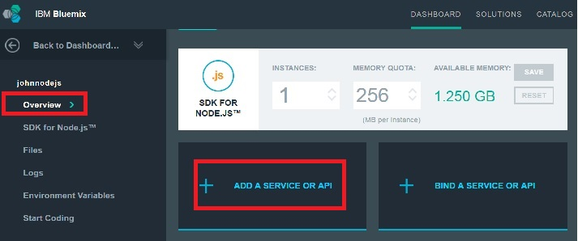

---

copyright:
 años: 2015, 2016

---

# Creación de una instancia de servicio Push
{: #create-push-instance}

Para comenzar con {{site.data.keyword.IBM}} {{site.data.keyword.mobilepushshort}}, cree en primer lugar una aplicación {{site.data.keyword.Bluemix}}; por ejemplo, una app Node.js. A continuación, cree una instancia de un servicio Push, {{site.data.keyword.mobilepushfull}}, que debe estar enlazada a esta aplicación Bluemix. También puede hacerlo yendo a la sección de Contenedor modelo del catálogo de Bluemix y pulsando el MobileFirst Services Starter.

**Nota**: Si ha configurado organizaciones para gestionar el entorno, seleccione la organización en la que desea crear el tiempo de ejecución y los servicios para la app de móvil.

1. Si no tiene una aplicación Bluemix, debe
                                        crearla; por ejemplo, la app Node.js. Para crear una aplicación Bluemix, vaya al Panel de control de Bluemix y pulse **Crear app**.
	
	**Nota**: Si dispone de una aplicación, vaya al paso 7 para añadir un servicio.

1. Desde **Elija su plantilla de app**, pulse **WEB**

3. En el área **Seleccionar punto de inicio**, seleccione **SDK para Node.js** y, a continuación, pulse **CONTINUAR**. 

4. Desde el menú desplegable **Espacio**, seleccione
                                        el espacio de la organización.

	
1. En **Nombre**, especifique el nombre de la app y,
                                        en el host, especifique el nombre del host.

1. Desde el menú desplegable **Plan seleccionado**,
                                        seleccione un plan y, a continuación, pulse el botón **CREATE**. Espere a que la aplicación se transfiera.

1. Pulse el enlace **Visión general**.
1. Pulse **Añadir un servicio**. Se mostrará la pantalla CATALOG.

1. Seleccione **Notificaciones Push de IBM:** y, desde el menú desplegable **Espacio**, seleccione la organización.

	
1. En el nombre **Servicio**, especifique el nombre de servicio de la Notificación Push.

1. En el **Plan seleccionado**, seleccione un plan y
                                        pulse el botón **CREATE**.

1. Pulse **Sí** para volver a transferir la aplicación.

	

1. Pulse **Notificaciones Push** para mostrar el panel de control Notificaciones Push.
