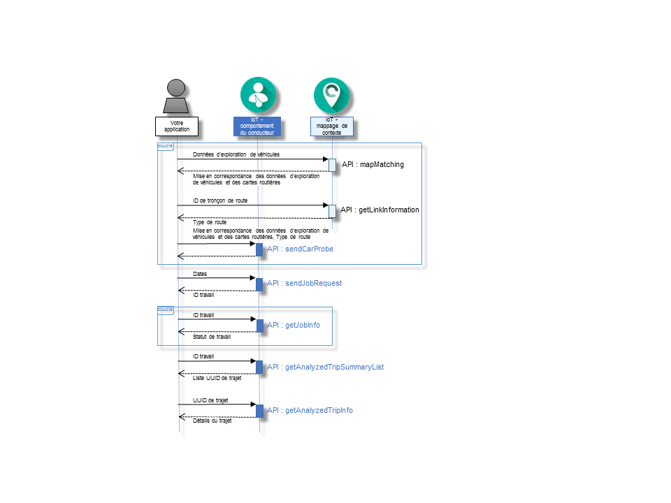

---

copyright:
  2016

---

{:new_window: target="_blank"}
{:shortdesc: .shortdesc}
{:screen: .screen}
{:codeblock: .codeblock}
{:pre: .pre}

# Initiation à {{site.data.keyword.iotdriverinsights_short}}
{: #gettingstartedtemplate}
*Dernière mise à jour : 13 mai 2016*

Avec {{site.data.keyword.iotdriverinsights_full}}, vous pouvez effectuer des analyses sur les conducteurs de véhicules en utilisant l'API {{site.data.keyword.iotdriverinsights_short}} pour collecter et analyser des données de détection des véhicules et des données contextuelles.
{:shortdesc}

Procédez comme suit pour intégrer votre application à l'API {{site.data.keyword.iotdriverinsights_short}} après avoir créé et déployé une instance de service non lié. 

1. (Facultatif) Avant d'envoyer des données de détection de véhicules vers l'API {{site.data.keyword.iotdriverinsights_short}}, vous pouvez ajouter des données supplémentaires à ces données en utilisant l'API {{site.data.keyword.iotmapinsights_short}}.
     - Obtenez une mise en correspondance des données de détection de véhicules et des cartes routières en utilisant l'API `mapMatching`.
        - [Demande] Données de détection de véhicules
        - [Réponse] Mise en correspondance des données de détection de véhicules et des cartes routières
     - Obtenez des données de type de route en utilisant l'API `getLinkInformation`.
        - [Demande] ID de tronçon de route
        - [Réponse] Type de route
2. Envoyez les données de détection de véhicules à stocker et analyser en utilisant l'API `sendCarProbe`.
   - [Demande] Mise en correspondance des données de détection de véhicules et des types de route
3. Envoyez une demande de travail pour analyser les données de détection de véhicules en utilisant l'API `sendJobRequest`.
   - [Demande] Données de détection
   - [Réponse] ID travail
4. Vérifiez le statut de travail en utilisant l'API `getJobInfo`.
   - [Demande] ID travail
   - [Réponse] Statut de travail
5. Obtenez la liste récapitulative des trajets analysés en utilisant l'API `getAnalyzedTripSummaryList`.
   - [Demande] ID travail
   - [Réponse] Liste récapitulative des trajets analysés
6. Obtenez des informations de trajets analysées et détaillées en utilisant l'API `getAnalyzedTripInfo`.
   - [Demande] Identificateur UUID de trajet
   - [Réponse] Détail du trajet analysé 

Le diagramme de séquence suivant montre la séquence des étapes.

Voir la rubrique [A propos de {{site.data.keyword.iotdriverinsights_short}}](iotdriverinsights_overview.html) pour plus de détails sur les comportements et contextes analysables.
Utilisez le [tutoriel - partie 1 - {{site.data.keyword.iotmapinsights_short}} / {{site.data.keyword.iotdriverinsights_short}}](https://github.com/IBM-Bluemix/car-data-management){:new_window} pour tester une application exemple avec des données exemple de détection de véhicules.

# Liens connexes
{: #rellinks}
## Tutoriels et exemples
{: #samples}

* [Tutoriel - Partie 1 - {{site.data.keyword.iotmapinsights_short}} / {{site.data.keyword.iotdriverinsights_short}}](https://github.com/IBM-Bluemix/car-data-management){:new_window}
* [Tutoriel - Partie Z - {{site.data.keyword.iotmapinsights_short}} / {{site.data.keyword.iotdriverinsights_short}}](https://github.com/IBM-Bluemix/map-driver-insights){:new_window}

## Référence d'API
{: #api}

* [Docs API](http://ibm.biz/IoTDriverBehavior_APIdoc){:new_window}

## Liens connexes
{: #general}

* [Initiation à {{site.data.keyword.iotmapinsights_short}}](../IotMapInsights/index.html){:new_window}
* [Initiation à {{site.data.keyword.iot_full}}](https://www.ng.bluemix.net/docs/services/IoT/index.html){:new_window}
* [dW Answers sur IBM developerWorks](https://developer.ibm.com/answers/topics/iot-driver-behavior){:new_window}
* [Stack Overflow](http://stackoverflow.com/questions/tagged/iot-driver-behavior){:new_window}
* [Nouveautés dans les services Bluemix](http://www.ng.bluemix.net/docs/whatsnew/index.html#services_category){:new_window}

