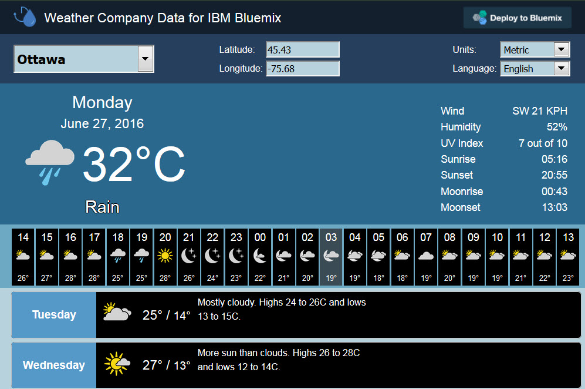

---

copyright:
  years: 2015, 2016

---

{:new_window: target="_blank"}
{:shortdesc: .shortdesc}
{:screen:.screen}
{:codeblock:.codeblock}

# Exemples
{: #tutorials_samples}

*Dernière mise à jour : 6 avril 2016*

Apprenez à utiliser le service Insights for Weather à l'aide des exemples ci-après.
{: shortdesc}

## Démonstration Insights for Weather
{: #insights_weather_demo}

Un exemple d'application vous permet de visualiser les données météorologiques fournies par le service Insights for Weather.
L'application est accessible en accédant à [http://insights-for-weather-demo.mybluemix.net/](http://insights-for-weather-demo.mybluemix.net/).
Elle s'ouvre dans votre navigateur et vous demande si vous souhaitez partager votre emplacement en cours avec elle.

L'application vous permet de visualiser les conditions météorologiques en cours observées là où vous êtes.



Vous pouvez également visualiser les prévisions heure par heure pour les 24 prochaines heures et les prévisions journalières pour les 10 prochains jours.
En survolant les zones de l'exemple, vous voyez les résultats des appels d'API au format JSON, avec les métadonnées utilisées pour l'extraction des données.

Dans l'application de démonstration, cliquez sur **Deploy to Bluemix** pour créer une version clonées de l'application ou [clonez l'appli directement à partir de GitHub](https://github.com/IBM-Bluemix/insights-for-weather-demo).

## Extraction des prévisions standard sur 10 jours
{: #getting_ten_day_forecast}

Vous pouvez exécuter une opération `GET` dans votre application pour extraire les données des prévisions sur 10 jours.
Par exemple, vous pouvez utiliser la demande `GET` suivante pour extraire les prévisions sur 10 jours pour la ville d'Ottawa, Ontario, au Canada :

```
GET https://<username>:<password>@twcservice.mybluemix.net:443/api/weather/v2/forecast/daily/10day?units=m&geocode=45.42%2C75.69&language=en-US
}
```

Le nom d'utilisateur (`username`) et le mot de passe (`password`) sont spécifiques à votre application et à votre instance du service.
Ces informations figurent dans les variables d'environnement `VCAP_SERVICES`.

Le service renvoie des réponses au format JSON. Si la demande a abouti, la réponse contient le code 200.
Si la demande a échoué, la réponse contient un code d'erreur.

Le corps de la réponse contient des métadonnées et un tableau de prévisions journalières pour les 10 prochains jours.
Par exemple, les métadonnées peuvent contenir les données suivantes :

```
{
  "metadata": {
    "language": "en-US",
    "transaction_id": "1443712484194:-1546029161",
    "version": "1",
    "latitude": 45.42,
    "longitude": 75.69,
    "units": "m",
    "expire_time_gmt": 1443714284,
    "status_code": 200
  },
  "forecasts": [
  ]
}
```

Chaque prévision jour par jour contient des informations générales qui s'appliquent à la période de 24 heures correspondant au jour de la semaine (`dow`).
Par exemple, la prévision jour par jour peut contenir les données suivantes :

```
    {
      "class": "fod_long_range_daily",
      "expire_time_gmt": 1443714284,
      "fcst_valid": 1444525200,
      "fcst_valid_local": "2015-10-11T07:00:00+0600",
      "num": 11,
      "max_temp": 14,
      "min_temp": 4,
      "torcon": null,
      "stormcon": null,
      "blurb": null,
      "blurb_author": null,
      "lunar_phase_day": 28,
      "dow": "Sunday",
      "lunar_phase": "Waning Crescent",
      "lunar_phase_code": "WNC",
      "sunrise": "2015-10-11T07:07:25+0600",
      "sunset": "2015-10-11T18:19:57+0600",
      "moonrise": "2015-10-11T05:17:47+0600",
      "moonset": "2015-10-11T17:40:49+0600",
      "qualifier_code": null,
      "qualifier": null,
      "narrative": "Times of sun and clouds. Highs 13 to 15C and lows 3 to 5C.",
      "qpf": 0,
      "snow_qpf": 0,
      "snow_range": "",
      "snow_phrase": "",
      "snow_code": "",
      "night": {
      },
      "day": {
      }
    }
```

Chaque prévision jour par jour contient un segment nuit et un segment jour pour le jour de la semaine spécifié.
Par exemple, ces deux segments peuvent contenir les données prévisionnelles suivantes :

```
      "night": {
        "fcst_valid": 1444568400,
        "fcst_valid_local": "2015-10-11T19:00:00+0600",
        "day_ind": "N",
        "thunder_enum": 0,
        "daypart_name": "Sunday night",
        "long_daypart_name": "Sunday night",
        "alt_daypart_name": "Sunday night",
        "thunder_enum_phrase": "No thunder",
        "num": 21,
        "temp": 4,
        "hi": 10,
        "wc": 3,
        "pop": 10,
        "icon_extd": 2900,
        "icon_code": 29,
        "wxman": "wx1650",
        "phrase_12char": "P Cloudy",
        "phrase_22char": "Partly Cloudy",
        "phrase_32char": "Partly Cloudy",
        "subphrase_pt1": "Partly",
        "subphrase_pt2": "Cloudy",
        "subphrase_pt3": "",
        "precip_type": "precip",
        "rh": 65,
        "wspd": 10,
        "wdir": 98,
        "wdir_cardinal": "E",
        "clds": 40,
        "pop_phrase": "",
        "temp_phrase": "Low 4C.",
        "accumulation_phrase": "",
        "wind_phrase": "Winds E at 10 to 15 km/h.",
        "shortcast": "Partly cloudy",
        "narrative": "A few clouds. Low 4C. Winds E at 10 to 15 km/h.",
        "qpf": 0,
        "snow_qpf": 0,
        "snow_range": "",
        "snow_phrase": "",
        "snow_code": "",
        "vocal_key": "D22:DA05:X3000300044:S300042:TL4:W04R02",
        "qualifier_code": null,
        "qualifier": null,
        "uv_index_raw": 0,
        "uv_index": 0,
        "uv_warning": 0,
        "uv_desc": "Low",
        "golf_index": null,
        "golf_category": ""
      },
```

## Extraction des prévisions standard sur 24 heures
{: #getting_twenty_four_hour_forecast}

Vous pouvez exécuter une opération `GET` dans votre applicaiton pour extraire les données des prévisions sur 24 heures.
Par exemple, vous pouvez utiliser la demande `GET` suivante pour extraire les prévisions sur 24 heures pour la ville d'Ottawa, Ontario, au Canada :

```
GET https://<username>:<password>@twcservice.mybluemix.net:443/api/weather/v2/forecast/hourly/24hour?units=m&geocode=45.42%2C75.69&language=en-US
```

Le corps de la réponse contient des métadonnées et un tableau de prévisions heure par heure pour les 24 prochaines heures. Par exemple, les métadonnées peuvent contenir les données suivantes :

```
{
  "metadata": {
    "language": "en-US",
    "transaction_id": "1443722945280:-1956318185",
    "version": "1",
    "latitude": 45.42,
    "longitude": 75.69,
    "units": "m",
    "expire_time_gmt": 1443723545,
    "status_code": 200
  },
  "forecasts": [
  ]
}
```

Chaque prévision heure par heure contient des informations générales qui s'appliquent à l'heure définie par `num`. Par exemple, la prévision heure par heure peut contenir les données suivantes :

```
    {
      "class": "fod_short_range_hourly",
      "expire_time_gmt": 1443723545,
      "fcst_valid": 1443726000,
      "fcst_valid_local": "2015-10-02T01:00:00+0600",
      "num": 1,
      "day_ind": "N",
      "temp": 12,
      "dewpt": 1,
      "hi": 12,
      "wc": 11,
      "feels_like": 11,
      "icon_extd": 3100,
      "wxman": "wx1550",
      "icon_code": 31,
      "dow": "Friday",
      "phrase_12char": "Clear",
      "phrase_22char": "Clear",
      "phrase_32char": "Clear",
      "subphrase_pt1": "Clear",
      "subphrase_pt2": "",
      "subphrase_pt3": "",
      "pop": 0,
      "precip_type": "rain",
      "qpf": 0,
      "snow_qpf": 0,
      "rh": 48,
      "wspd": 15,
      "wdir": 208,
      "wdir_cardinal": "SSW",
      "gust": null,
      "clds": 17,
      "vis": 16.1,
      "mslp": 1018.6,
      "uv_index_raw": 0,
      "uv_index": 0,
      "uv_warning": 0,
      "uv_desc": "Low",
      "golf_index": null,
      "golf_category": "",
      "severity": 1
    },
```

## Extraction des conditions en cours
{: #current_conditions}

Vous pouvez exécuter une opération `GET` dans votre application pour extraire les conditions météorologiques en cours.
Par exemple, vous pouvez utiliser la demande `GET` suivante pour extraire les conditions en cours pour la ville d'Ottawa, Ontario, au Canada :

```
GET https://<username>:<password>@twcservice.mybluemix.net:443/api/weather/v2/observations/current?units=m&geocode=45.42%2C75.69&language=en-US
```

Le corps de la réponse contient des métadonnées et les données météorologiques en cours observées.
Par exemple, les métadonnées peuvent contenir les données suivantes :

```
{
  "metadata": {
    "language": "en-US",
    "transaction_id": "1443724606672:1993259329",
    "version": "1",
    "latitude": 45.42,
    "longitude": 75.69,
    "units": "m",
    "expire_time_gmt": 1443725206,
    "status_code": 200
  },
  "observation": {
  }
}
```

Les données d'observations contiennent des informations générales et des valeurs spécifiques aux unités de mesure. Par exemple, les conditions en cours peuvent contenir les données suivantes si l'unité de mesure définie est Metric :

```
  "observation": {
    "class": "observation",
    "expire_time_gmt": 1443725206,
    "obs_time": 1443724606,
    "obs_time_local": "2015-10-02T00:36:46+0600",
    "wdir": 210,
    "icon_code": 33,
    "icon_extd": 3300,
    "sunrise": "2015-10-02T06:55:47+0600",
    "sunset": "2015-10-02T18:36:42+0600",
    "day_ind": "N",
    "uv_index": 0,
    "uv_warning": 0,
    "wxman": "wx1550",
    "obs_qualifier_code": null,
    "ptend_code": 2,
    "dow": "Friday",
    "wdir_cardinal": "SSW",
    "uv_desc": "Low",
    "phrase_12char": "Fair",
    "phrase_22char": "Fair",
    "phrase_32char": "Fair",
    "ptend_desc": "Falling",
    "sky_cover": "Partly Cloudy",
    "clds": "FEW",
    "obs_qualifier_severity": null,
    "vocal_key": "OT53:OX3300",
    "metric": {
      "wspd": 13,
      "gust": null,
      "vis": 16.09,
      "mslp": 1018.7,
      "altimeter": 1018.63,
      "temp": 12,
      "dewpt": 3,
      "rh": 54,
      "wc": 11,
      "hi": 12,
      "temp_change_24hour": -16,
      "temp_max_24hour": 19,
      "temp_min_24hour": 6,
      "pchange": -1.02,
      "feels_like": 11,
      "snow_1hour": 0,
      "snow_6hour": 0,
      "snow_24hour": 0,
      "snow_mtd": null,
      "snow_season": null,
      "snow_ytd": null,
      "snow_2day": null,
      "snow_3day": null,
      "snow_7day": null,
      "ceiling": null,
      "precip_1hour": 0,
      "precip_6hour": 0,
      "precip_24hour": 0,
      "precip_mtd": null,
      "precip_ytd": null,
      "precip_2day": null,
      "precip_3day": null,
      "precip_7day": null,
      "obs_qualifier_100char": null,
      "obs_qualifier_50char": null,
      "obs_qualifier_32char": null
    }
  }
```


