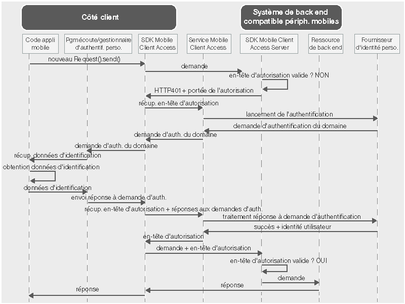

---

Copyright : 2015, 2016

---

# Utilisation d'un fournisseur d'identité personnalisé pour authentifier les utilisateurs
{: #custom-id}
Vous pouvez créer un fournisseur d'identité personnalisé et implémenter votre propre logique pour la collecte et la validation des données d'identification. Un fournisseur d'identité est une application Web qui expose une interface RESTful. Vous pouvez héberger un fournisseur d'identité personnalisé sur site ou sur {{site.data.keyword.Bluemix}}. La seule exigence est qu'il soit accessible sur l'Internet public pour pouvoir communiquer avec le service {{site.data.keyword.amashort}}.

## Présentation de {{site.data.keyword.amashort}}
{: #custom-id-ovr}
 Le diagramme suivant représente l'intégration entre {{site.data.keyword.amashort}} et un fournisseur d'identité personnalisé.



1. Utilisez le SDK {{site.data.keyword.amashort}} pour envoyer une demande à vos ressources de back end qui sont protégées par le SDK serveur de {{site.data.keyword.amashort}}.
* Le SDK serveur de {{site.data.keyword.amashort}} détecte une demande non autorisée et renvoie une erreur HTTP 401 et la portée d'autorisation.
* Le SDK client de {{site.data.keyword.amashort}} détecte automatiquement l'erreur HTTP 401 et lance le processus d'authentification.
* Le SDK client de {{site.data.keyword.amashort}} contacte le service {{site.data.keyword.amashort}} et lui demande d'émettre un en-tête d'autorisation.
* Le service {{site.data.keyword.amashort}} communique avec le fournisseur d'identité personnalisé afin de démarrer le processus d'authentification.
* Le fournisseur d'identité renvoie une demande d'authentification au service {{site.data.keyword.amashort}}.
* Le service {{site.data.keyword.amashort}} renvoie la demande d'authentification au SDK client de {{site.data.keyword.amashort}}.
* Le SDK client de {{site.data.keyword.amashort}} délègue l'authentification à une classe personnalisée que vous avez créée. Vous devez collecter les données d'identification et les fournir au SDK client de {{site.data.keyword.amashort}}.
* Les données d'identification fournies au SDK {{site.data.keyword.amashort}} par le développeur sont envoyées au service {{site.data.keyword.amashort}} en tant que réponse à la demande d'authentification.
* Le service {{site.data.keyword.amashort}} valide la réponse à la demande d'authentification auprès du fournisseur d'identité.
* Si la validation aboutit, le service {{site.data.keyword.amashort}} génère un en-tête d'autorisation et le renvoie au SDK client de {{site.data.keyword.amashort}}. L'en-tête d'autorisation contient deux jetons : un jeton qui contient des informations sur les droits d'accès, et un autre jeton qui contient des informations sur l'utilisateur, le périphérique et l'application.
* A partir de ce moment, toutes les demandes faites avec le SDK client de {{site.data.keyword.amashort}} contiennent un nouvel en-tête d'autorisation.
* Le SDK client de {{site.data.keyword.amashort}} renvoie automatiquement la demande d'origine qui avait déclenché le flux d'autorisation.
* Le SDK serveur de {{site.data.keyword.amashort}} extrait l'en-tête d'autorisation de la demande, la valide auprès du service {{site.data.keyword.amashort}}, et donne l'accès à la ressource de back end.

## Présentation des fournisseurs d'identité personnalisés
{: #custom-id-about}

Avec un fournisseur d'identité personnalisé, vous pouvez créer des demandes d'authentification personnalisées destinées au client. Il permet de personnaliser l'ensemble du flux d'authentification.

Lorsque vous créez un fournisseur d'identité personnalisé, vous pouvez :

1. Personnaliser une demande d'authentification qui doit être envoyée par le service {{site.data.keyword.amashort}} à l'application de client mobile. Une demande d'authentification est un objet JSON qui contient des données personnalisées. Le client mobile peut les utiliser pour personnaliser les flux d'authentification.

Exemple de demande d'authentification personnalisée :

	```JavaScript
	{
		status: "challenge",
		challenge: {
			message:"Enter username and password",
			retriesLeft: 2,
			minUsernameLenth: 8
		}
	}
	```

1. Implémenter le flux de collecte des données d'identification sur le client mobile, en prenant en compte les différentes étapes et les différents formulaires d'authentification. De la même manière que pour la demande d'authentification personnalisée, vous devez créer la structure de la réponse personnalisée.

Exemple de réponse personnalisée à une demande d'authentification envoyée par le client mobile :

	```JavaScript
	{
		username:"bob.smith",
		password:"abcd1234",
		pincode:"1234"
	}
	```
1. Implémenter la logique personnalisée de la validation fournie par la réponse à la demande d'authentification.

1. Définir un objet identité de l'utilisateur personnalisé contenant les propriétés personnalisées requises. Exemple d'objet identité de l'utilisateur personnalisé obtenu par le client mobile après une authentification réussie :

	```JavaScript
	{
		username:"bob.smith",
		displayName:"Bob Smith",
		attributes:{
			age: 30,
			accountNumber: 12345,
			lastLogin: "Sept 1st, 2015"
		}
	}
	```

### Exemple d'implémentation d'un fournisseur d'identité personnalisé
{: #custom-sample}
Vous pouvez utiliser comme référence l'un des exemples d'implémentation Node.js suivants de fournisseur d'identité personnalisé
lorsque vous développez votre fournisseur d'identité personnalisé. Téléchargez le code d'application complet depuis les référentiels
GitHub.

 * [Exemple simple](https://github.com/ibm-bluemix-mobile-services/bms-mca-custom-identity-provider-sample)
 * [Exemple avancé](https://github.com/ibm-bluemix-mobile-services/bms-mca-custom-identity-provider-with-user-management)
 
## Communications standard entre le serveur {{site.data.keyword.amashort}} et un fournisseur d'identité personnalisé
{: #custom-id-comm}
1. Le service {{site.data.keyword.amashort}} envoie une demande `startAuthorization` au fournisseur
d'identité personnalisé.
1. Le fournisseur d'identité personnalisé fournit une demande d'authentification personnalisée à renvoyer au client.
1. Le service {{site.data.keyword.amashort}} envoie la demande d'authentification personnalisée issue du fournisseur d'identité personnalisé au client mobile,
puis reçoit sa réponse.
1. Le service {{site.data.keyword.amashort}} envoie au fournisseur d'identité personnalisé une demande `handleChallengeAnswer` avec la réponse
à la demande d'authentification.
1. Le fournisseur d'identité personnalisé vérifie la réponse à la demande d'authentification et répond favorablement en renvoyant
les informations d'identité de l'utilisateur.
1. Facultativement, le fournisseur d'identité personnalisé fournit d'autres demandes d'authentification après avoir reçu la réponse du client. L'envoi de plusieurs demandes d'authentification permet de mettre en oeuvre un processus d'authentification en plusieurs étapes.

## Avec ou sans état
{: #custom-id-state}
Par défaut, le fournisseur d'identité personnalisé est considéré comme une application sans état. Dans certains cas, il peut être amené à stocker l'état associé au processus d'authentification. L'authentification en plusieurs étapes constitue un exemple de cas d'utilisation, dans lequel le fournisseur d'identité personnalisé doit stocker le résultat de la
première étape d'authentification avant de passer à l'étape suivante. Pour prendre en charge les états, un fournisseur d'identité personnalisé doit générer un ID d'état (stateID) et le fournir au service {{site.data.keyword.amashort}} dans sa réponse. Le service {{site.data.keyword.amashort}}
doit transmettre l'ID d'état dans les demandes qui font partie de la suite du processus d'authentification du client.

## Domaine personnalisé
{: #custom-id-custom}

Un fournisseur d'identité personnalisé prend en charge un domaine d'authentification personnalisé. Pour gérer les demandes d'authentification entrantes, créez et enregistrez une instance AuthenticationDelegate/AuthenticationListener dans votre application de client mobile. Définissez le nom du domaine d'authentification personnalisé lorsque vous configurez un fournisseur d'identité personnalisé dans le tableau de bord {{site.data.keyword.amashort}}. Il peut permettre d'identifier l'instance de service {{site.data.keyword.amashort}} dont provient la demande.

## Etapes suivantes
{: #next-steps}
* [Création d'un fournisseur d'identité personnalisé](custom-auth-identity-provider.html)
* [Configuration de {{site.data.keyword.amashort}} pour l'authentification personnalisée](custom-auth-config-mca.html)
* [Configuration de l'authentification personnalisée pour Android](custom-auth-android.html)
* [Configuration de l'authentification personnalisée pour iOS](custom-auth-ios.html)
* [Configuration de l'authentification personnalisée pour Cordova](custom-auth-cordova.html)
