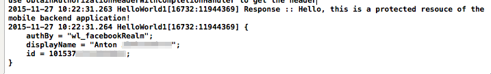

---

Copyright : 2015, 2016

---

# Activation de l'authentification Facebook dans les applications iOS (SDK Objective-C)
{: #facebook-auth-ios}

Pour utiliser Facebook comme fournisseur d'identité dans vos applications iOS, ajoutez et configurez la plateforme iOS pour votre application Facebook.

**Astuce :** Si vous développez votre application iOS dans Swift, vous pouvez envisager d'utiliser le SDK Swift client de {{site.data.keyword.amashort}}. Les instructions de cette page s'appliquent au SDK client Objective-C de {{site.data.keyword.amashort}}. Pour les instructions d'utilisation du SDK Swift, voir [Activation de l'authentification Facebook dans les applications iOS (SDK Swift)](https://console.{DomainName}/docs/services/mobileaccess/facebook-auth-ios-swift-sdk.html)

## Avant de commencer
{: #facebook-auth-ios-before}
* Vous devez disposer d'une ressource protégée par {{site.data.keyword.amashort}} et d'un projet iOS instrumenté avec le SDK client de {{site.data.keyword.amashort}}.  Pour plus d'informations, voir [Initiation à {{site.data.keyword.amashort}}](https://console.{DomainName}/docs/services/mobileaccess/getting-started.html) et [Configuration du SDK Objective-C d'iOS](https://console.{DomainName}/docs/services/mobileaccess/getting-started-ios.html).  
* Protégez manuellement votre application de back end avec le SDK serveur de {{site.data.keyword.amashort}}. Pour plus d'informations, voir [Protection des ressources](https://console.{DomainName}/docs/services/mobileaccess/protecting-resources.html).
* Créez un ID d'application Facebook. Pour plus d'informations, voir [Acquisition d'un ID d'application Facebook sur le portail Facebook Developer](https://console.{DomainName}/docs/services/mobileaccess/facebook-auth-overview.html#facebook-appID).

## Configuration d'une application Facebook pour la plateforme iOS
{: #facebook-auth-ios-config}


1. Ouvrez votre application Facebook dans le portail Facebook Developer et cliquez sur **Settings (Paramètres)> Add Platform (Ajouter une plateforme) > iOS**.

1. Entrez l'ID de bundle (*bundleId*) de votre application iOS. Pour trouver l'ID *bundleId*, recherchez la valeur de **Bundle Identifier (ID de bundle)** dans le fichier `info.plist` ou dans l'onglet **General** du projet Xcode.
**Astuce** : Vous pouvez activer le suffixe de schéma d'URL et l'authentification unique (SSO) si vous prévoyez d'utiliser ces fonctions.

1. Cliquez sur **Save Settings (Sauvegarder les paramètres)**.

## Configuration de {{site.data.keyword.amashort}} pour l'authentification Facebook
{: #facebook-auth-ios-configmca}

Après avoir configuré l'ID d'application Facebook, ainsi que votre application Facebook de manière qu'elle puisse répondre aux demandes des clients iOS, vous pouvez activer l'authentification Facebook dans {{site.data.keyword.amashort}}.

1. Ouvrez votre appli dans le tableau de bord {{site.data.keyword.Bluemix}}.

1. Cliquez sur **Options pour application mobile** et notez la valeur de **Route** (`applicationRoute`) et **Identificateur global unique de l'application** (`applicationGUID`). Vous aurez besoin de ces valeurs lors de l'initialisation du SDK.

1. Cliquez sur la vignette {{site.data.keyword.amashort}}. Le tableau de bord {{site.data.keyword.amashort}} se charge.

1. Cliquez sur la vignette **Facebook** .

1. Entrez l'ID d'application Facebook et cliquez sur **Sauvegarder**.

## Configuration du SDK client de {{site.data.keyword.amashort}} pour iOS
{: #facebook-auth-ios-sdk}

### Installation de CocoaPods
{: #facebook-auth-cocoapods}

Le SDK client de {{site.data.keyword.amashort}} est distribué avec CocoaPods, un gestionnaire de dépendances pour les projets iOS. CocoaPods télécharge automatiquement les artefacts à partir des référentiels et les met à la disposition de votre application iOS.

1. Ouvrez Terminal et lancez la commande `pod --version`. Si CocoaPods est déjà installé, le numéro de version est affiché. Vous pouvez passer à la section suivante de ce tutoriel.

1. Installez CocoaPods en exécutant `sudo gem install cocoapods`. Reportez-vous au [site Web CocoaPods](https://cocoapods.org/) si vous avez besoin d'autres instructions.

### Installation du logiciel SDK client de {{site.data.keyword.amashort}} avec CocoaPods
{: #facebook-auth-install-cocoapods}

1. Dans votre projet iOS, éditez le fichier `Podfile` et la ligne suivante :

	```
	pod 'IMFFacebookAuthentication'
	```

1. Sauvegardez le fichier `Podfile` et exécutez la commande `pod install` à partir de la ligne de commande. CocoaPods installe les dépendances. La progression et les composants ajoutés s'affichent.
 **Important** : Vous devez à présent ouvrir votre projet en utilisant le fichier `xcworkspace` généré par CocoaPods. Son nom est généralement `{your-project-name}.xcworkspace`.  

1. Exécutez `open {your-project-name}.xcworkspace` depuis la ligne de commande pour ouvrir l'espace de travail de votre projet iOS.

### Configuration de votre projet iOS pour authentification Facebook
{: #facebook-auth-ios-configproject}

1. Localisez le fichier `info.plist`, généralement situé sous le dossier `Supporting files` de votre projet Xcode.

1. Configurez l'intégration Facebook en ajoutant les propriétés suivantes à votre fichier `info.plist` :

	

	Mettez à jour les propriétés de schéma d'URL et d'ID d'appli Facebook avec votre ID d'application Facebook.

Vous pouvez aussi mettre à jour le fichier `info.plist` en cliquant avec le bouton droit, en sélectionnant **Open as (Ouvrir en tant que) > Source Code (Code source)** et en ajoutant le code XML suivant :

 ```XML
	<key>CFBundleURLTypes</key>
	<array>
		<dict>
			<key>CFBundleURLSchemes</key>
			<array>
				<string>fb{votre_ID_application_facebook}</string>
			</array>
		</dict>
	</array>
	<key>FacebookAppID</key>
	<string>{votre_ID_application_facebook}</string>
	<key>FacebookDisplayName</key>
	<string>MyApp</string>
	<key>LSApplicationQueriesSchemes</key>
	<array>
		<string>fbauth</string>
		<string>fbauth2</string>
	</array>
	<key>NSAppTransportSecurity</key>
	<dict>
	    <key>NSExceptionDomains</key>
	    <dict>
	        <key>facebook.com</key>
	        <dict>
	            <key>NSIncludesSubdomains</key>
	            <true/>                
	            <key>NSThirdPartyExceptionRequiresForwardSecrecy</key>
	            <false/>
	        </dict>
	        <key>fbcdn.net</key>
	        <dict>
	            <key>NSIncludesSubdomains</key>
	            <true/>
	            <key>NSThirdPartyExceptionRequiresForwardSecrecy</key>
	            <false/>
	        </dict>
	        <key>akamaihd.net</key>
	        <dict>
	            <key>NSIncludesSubdomains</key>
	            <true/>
	            <key>NSThirdPartyExceptionRequiresForwardSecrecy</key>
	            <false/>
	        </dict>
	    </dict>
	</dict>
```
Mettez à jour les propriétés de schéma d'URL et d'ID d'appli Facebook avec votre ID d'application Facebook.

 **Important** : Veillez à ne pas remplacer les propriétés existantes du fichier `info.plist`. Si certaines propriétés se chevauchent, vous devez les fusionner manuellement. Pour plus d'informations, voir [Configure Xcode Project](https://developers.facebook.com/docs/ios/getting-started/) et [Preparing Your Apps for iOS9](https://developers.facebook.com/docs/ios/ios9).

## Initialisation du logiciel SDK client de {{site.data.keyword.amashort}}
{: #facebook-auth-ios-initalize}

Initialisez le SDK client en transmettant la route de votre application (`applicationRoute`) et l'identificateur global unique de l'application
(`applicationGUID`).

En général, vous pouvez placer le code d'initialisation dans la méthode `application:didFinishLaunchingWithOptions` du délégué de l'application, bien que cet emplacement ne soit pas obligatoire.

1. Ouvrez la page principale du tableau de bord {{site.data.keyword.Bluemix_notm}} et cliquez sur votre appli. Cliquez sur **Options pour
application mobile** et notez la valeur de **Route** (`applicationRoute`) et **Identificateur global unique de
l'application** (`applicationGUID`).

1. Importez l'infrastructure requise dans la classe qui doit utiliser le SDK client de {{site.data.keyword.amashort}} en ajoutant les en-têtes suivants :

	**Objective-C**

	```Objective-C
	#import <IMFCore/IMFCore.h>
	#import <IMFFacebookAuthentication/IMFFacebookAuthenticationHandler.h>
	#import <FacebookSDK/FacebookSDK.h>
```

	**Swift**

	Le SDK client de {{site.data.keyword.amashort}} est implémenté à l'aide d'Objective-C. Il peut donc être nécessaire d'ajouter un en-tête de pontage à votre projet Swift.

	1. Cliquez avec le bouton droit sur votre projet dans Xcode, puis sélectionnez **New File... (Nouveau fichier...)**.
	* Dans la catégorie **iOS Source (Source iOS)**, sélectionnez `Header file (Fichier d'en-tête)`.
	* Nommez-le `BridgingHeader.h`.
	* Ajoutez des importations à votre en-tête de pontage :

	```Objective-C
	#import <IMFCore/IMFCore.h>
	#import <IMFFacebookAuthentication/IMFFacebookAuthenticationHandler.h>
	#import <FacebookSDK/FacebookSDK.h>
```
	* Cliquez sur votre projet dans Xcode et sélectionnez l'onglet **Build Settings (Paramètres de génération)**.
	* Recherchez **Objective-C Bridging Header**.
	* Définissez la valeur sur l'emplacement de votre fichier `BridgingHeader.h`, par exemple : `$(SRCROOT)/MyApp/BridgingHeader.h`.
	* Vérifiez que l'en-tête de pontage est prélevé par Xcode lors de la génération de votre projet. Vous ne devez voir aucun message d'erreur.

3. Initialisez le logiciel SDK client.	Remplacez *applicationRoute* et *applicationGUID* par les valeurs de
**Route** et
**Identificateur global unique de l'application** de la section **Options pour application mobile**
dans le tableau de bord {{site.data.keyword.Bluemix_notm}}.

	**Objective-C**

	```Objective-C
	[[IMFClient sharedInstance]
			initializeWithBackendRoute:@"applicationRoute"
			backendGUID:@"applicationGUID"];
	```

	**Swift**

	```Swift
	IMFClient.sharedInstance().initializeWithBackendRoute("applicationRoute",
	 							backendGUID: "applicationGUID")
	```

1. Signalez au SDK Facebook l'activation de l'application et enregistrez le gestionnaire d'authentification Facebook en ajoutant le code suivant à la méthode
`application:didFinishLaunchingWithOptions` dans votre délégué d'application. Entrez ce code juste après avoir initialisé l'instance IMFClient.

	**Objective-C**

	```Objective-C
		[FBAppEvents activateApp];
		[[IMFFacebookAuthenticationHandler sharedInstance] registerWithDefaultDelegate];
```

	**Swift**

	```Swift
		FBAppEvents.activateApp()
		IMFFacebookAuthenticationHandler.sharedInstance().registerWithDefaultDelegate()
```

1. Ajoutez le code suivant au délégué de votre appli.

	**Objective-C**

	```Objective-C
	- (BOOL)application:(UIApplication *)application openURL:(NSURL *)url
			sourceApplication:(NSString *)sourceApplication annotation:(id)annotation {

		return [FBAppCall handleOpenURL:url sourceApplication:sourceApplication];

	}
```

	**Swift**

	```Swift
	func application(application: UIApplication, openURL url: NSURL,
					sourceApplication: String?, annotation: AnyObject) -> Bool {

		return FBAppCall.handleOpenURL(url, sourceApplication: sourceApplication)

	}
```

## Test de l'authentification
{: #facebook-auth-ios-testing}
Lorsque le SDK client est initialisé et que le gestionnaire d'authentification Facebook est enregistré, vous pouvez commencer à envoyer des demandes à votre système de back end mobile.

### Avant de commencer
{: #facebook-auth-ios-testing-before}
Vous devez utiliser le conteneur boilerplate {{site.data.keyword.mobilefirstbp}} et disposer au préalable d'une ressource protégée par {{site.data.keyword.amashort}} sur le noeud final `/protected`. Pour configurer un noeud final `/protected`, voir la rubrique [Protection des ressources](https://console.{DomainName}/docs/services/mobileaccess/protecting-resources.html).

1. Depuis votre navigateur, tentez d'envoyer une demande à un noeud final protégé de votre nouveau système de back end mobile. Ouvrez l'URL suivante :
`http://{applicationRoute}/protected`.
Par exemple : `http://my-mobile-backend.mybluemix.net/protected`
<br/>Le noeud final `/protected` d'un système de back end mobile qui a été créé avec le conteneur boilerplate MobileFirst Services Starter est protégé par {{site.data.keyword.amashort}}. Un message signalant l'interdiction d'accéder au site (`Unauthorized`) est renvoyé au navigateur. Ce message est renvoyé car ce noeud final n'est accessible qu'aux applications mobiles instrumentées avec le SDK client de {{site.data.keyword.amashort}}.

1. A l'aide de votre application iOS, envoyez une demande au même noeud final.

	**Objective-C**

	```Objective-C
	NSString *requestPath = [NSString stringWithFormat:@"%@/protected",
								[[IMFClient sharedInstance] backendRoute]];

	IMFResourceRequest *request =  [IMFResourceRequest requestWithPath:requestPath
																method:@"GET"];

	[request sendWithCompletionHandler:^(IMFResponse *response, NSError *error) {
		if (error){
			NSLog(@"Error :: %@", [error description]);
		} else {
			NSLog(@"Response :: %@", [response responseText]);
			NSLog(@"%@", [[IMFAuthorizationManager sharedInstance] userIdentity]);
		}
	}];
	```

	**Swift**

	```Swift
	let requestPath = IMFClient.sharedInstance().backendRoute + "/protected"

	let request = IMFResourceRequest(path: requestPath, method: "GET");
	request.sendWithCompletionHandler { (response, error) -> Void in
		if (nil != error){
			NSLog("Error :: %@", error.description)
		} else {
			NSLog("Response :: %@", response.responseText)
			NSLog("%@", IMFAuthorizationManager.sharedInstance().userIdentity)
		}
	};
 ```

1. Lancez votre application. Un écran de connexion à Facebook s'affiche.

	

	Cet écran peut être légèrement différent si l'appli Facebook n'est pas installée sur votre périphérique, ou si vous n'y êtes pas connecté.

1. Cliquez sur **OK** pour autoriser {{site.data.keyword.amashort}} à utiliser votre ID utilisateur Facebook pour l'authentification.

1. 	Si votre demande aboutit, la sortie suivante s'affiche dans la console Xcode :
	


	Vous pouvez également ajouter une fonctionnalité de déconnexion en ajoutant le code suivant :


	**Objective-C**

	```Objective-C
	[[IMFFacebookAuthenticationHandler sharedInstance] logout : callBack]
	```

	**Swift**

	```Swift
	IMFFacebookAuthenticationHandler.sharedInstance().logout(callBack)
	```

	Si vous appelez ce code alors que l'utilisateur était connecté via Facebook et qu'il tente à nouveau de se connecter, il est invité à autoriser Mobile
Client Access à utiliser Facebook aux fins d'authentification. 

	Les utilisateurs de switch doivent appeler ce code et l'utilisateur doit se déconnecter de Facebook dans son navigateur.La transmission de
`callBack` à la fonction de déconnexion est facultative. Vous pouvez également transmettre la valeur `nil`.

