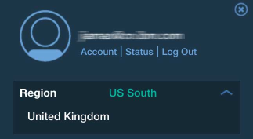

{:new_window: target="_blank"}

# Introduzione a {{site.data.keyword.objectstorageshort}} {: #getting-started-with-object-storage} 

{{site.data.keyword.objectstoragefull}} ti fornisce l'accesso a un account Swift {{site.data.keyword.objectstorageshort}} con provisioning completo per gestire i tuoi dati. Swift fornisce una piattaforma di archiviazione accessibile alle API e pienamente distribuita. Puoi utilizzarlo direttamente nelle tue applicazioni oppure per i backup, rendendolo ideale per un'archiviazione con un buon rapporto costo/efficacia e con scaling incrementale.

IBM {{site.data.keyword.objectstorageshort}} for {{site.data.keyword.Bluemix_notm}} utilizza OpenStack Identity (Keystone) per l'autenticazione ed è possibile accedervi direttamente utilizzando le chiamate API OpenStack Object Storage (Swift) v1. È possibile eseguire il bind di IBM {{site.data.keyword.objectstorageshort}} a un'applicazione {{site.data.keyword.Bluemix_notm}} oppure è possibile accedere a esso dall'esterno di un'applicazione {{site.data.keyword.Bluemix_notm}}. 

Ulteriori informazioni e documentazione sull'utilizzo di OpenStack Swift e Keystone sono disponibili sul [sito della documentazione di OpenStack](http://docs.openstack.org){: new_window}.

Il diagramma dell'architettura {{site.data.keyword.objectstorageshort}} è il seguente:

[](http://www.ng.bluemix.net/docs/api/content/services/ObjectStorage/images/object_storage_solution_archectiture.png){: new_window}

*Figura 1. Diagramma dell'architettura {{site.data.keyword.objectstorageshort}}*

**Nota:** la crittografia lato provider non è fornita. È responsabilità dell'applicazione client crittografare i dati prima del loro caricamento.

**Nota:** il piano di servizio {{site.data.keyword.objectstorageshort}} Beta verrà rimosso dal catalogo dopo la disponibilità generale
del servizio {{site.data.keyword.Bluemix_notm}} {{site.data.keyword.objectstorageshort}}. Dopo un periodo di tolleranza, le istanze del servizio che utilizzano il piano Beta verranno rimosse. [Aggiorna il tuo piano di prezzatura](#changeplan) per continuare a utilizzare il servizio {{site.data.keyword.objectstorageshort}}. 


## Creazione di un'istanza {{site.data.keyword.objectstorageshort}} in {{site.data.keyword.Bluemix_notm}} {: #creating-object-storage-instance} 

### Come creare un'istanza del servizio {{site.data.keyword.objectstorageshort}}
1.	Vai alla scheda {{site.data.keyword.Bluemix_notm}} **Catalogo** e immetti **{{site.data.keyword.objectstorageshort}}** nella casella di ricerca oppure vai a **Servizi** e seleziona **Archiviazione**. Fai clic sul servizio **{{site.data.keyword.objectstorageshort}}**. 
2.	Seleziona il tuo spazio, la tua applicazione, il tuo nome servizio e il tuo piano e fai quindi clic su **Crea**. 
**Nota:** se inizialmente scegli l'opzione **Lascia senza binding** per il campo **Applicazione**, puoi ancora eseguire il bind dell'istanza del servizio alla tua applicazione {{site.data.keyword.Bluemix_notm}} dopo che hai completato la configurazione. Consulta le seguenti istruzioni.

## Utilizzo di {{site.data.keyword.objectstorageshort}} da un'applicazione {{site.data.keyword.Bluemix_notm}} {: #using-object-storage-from-bluemix-app} 

### Come eseguire il bind del tuo servizio {{site.data.keyword.objectstorageshort}} a un'applicazione dopo la creazione {: #bind-object-storage-to-application} 
1.	Nel dashboard {{site.data.keyword.Bluemix_notm}}, seleziona l'applicazione di cui si desideri eseguire il bind.
2.	Nella panoramica dell'applicazione, fai clic su **Esegui il bind di un servizio o di una API**.
3.	Seleziona la tua istanza {{site.data.keyword.objectstorageshort}} dall'elenco di servizi e fai clic su **Aggiungi**.
4.	Fai clic su **Riprepara** quando ti viene richiesto. La tua applicazione deve essere ripreparata per utilizzare il nuovo servizio.

### Contesto associato mediante bind

Se vuoi utilizzare {{site.data.keyword.objectstorageshort}} in un contesto associato, le credenziali cloud vengono fornite indirettamente tramite il processo di esecuzione del bind di applicazioni. Dopo che hai eseguito correttamente il bind di un'istanza del servizio alla tua applicazione, una configurazione simile alla seguente viene aggiunta alla tua variabile di
ambiente `VCAP_SERVICES`.

    {
    "Object-Storage": [
    {
      "name": "Object-Storage - YP",
      "label": "Object-Storage",
      "plan": "Free",
      "credentials": {
         "auth_url": "https://identity.open.softlayer.com",
         "project": "object_storage_d049255b",
         "projectId": "0f47b41b06d047f9aae3b33f1db061ed",
         "region": "dallas",
         "userId": "ad78b2a3f843466988afd077731c61fc",
         "username": "user_202db1f8a7aa3f3ac51ec68f10dbe7dc29070bc7",
         "password": "K/jyIi2jR=1?D.TP",
         "domainId": "2df6373c549e49f8973fb6d22ab18c1a",
         "domainName": "639347"
        }
       }
      ]
    }

## Utilizzo dell'interfaccia utente {{site.data.keyword.objectstorageshort}} {: #using-object-storage-ui}

### Elementi dell'interfaccia utente e navigazione
Quando viene effettuato il provisioning del tuo {{site.data.keyword.objectstorageshort}}, puoi visualizzare le informazioni della tua istanza nel dashboard dell'istanza del servizio {{site.data.keyword.objectstorageshort}} per {{site.data.keyword.Bluemix_notm}}. Dal dashboard, seleziona la tua istanza {{site.data.keyword.objectstorageshort}} per visualizzare il pannello con informazioni più dettagliate.  
#### Dati di utilizzo
Nella parte superiore del pannello, vedrai le informazioni sull'utilizzo dell'archiviazione per la tua istanza. Viene visualizzato anche il numero corrente di contenitori di archiviazione (**Storage Container**) e il numero totale di oggetti (**Objects**) in tutti i tuoi contenitori. Elenca l'utilizzo della memoria in megabyte. Il valore di archiviazione consumata (**Storage Consumed**) fa riferimento alla quantità corrente di spazio utilizzata. 
#### Azioni
Per recuperare i dati di utilizzo più recenti, fai clic sul pulsante di aggiornamento (**Refresh**).   
####Browser degli oggetti 
La sezione inferiore del pannello contiene il browser degli oggetti. Utilizza il browser degli oggetti per gestire gli oggetti e i contenitori di archiviazione oggetti. Tra le varie azioni che puoi eseguire, puoi creare contenitori, caricare file, eliminare contenitori ed eliminare file.

## Utilizzo della CLI Swift per accedere a {{site.data.keyword.objectstorageshort}} {: #using-swift-cli}

Puoi accedere al servizio {{site.data.keyword.objectstorageshort}} su Internet e da applicazioni e macchine virtuali in IBM {{site.data.keyword.Bluemix_notm}}. Ecco alcuni casi di utilizzo comuni per il servizio {{site.data.keyword.objectstorageshort}}:

* Backup dei dati di volume dalle tue istanze
* Utilizzo di un'ubicazione intermedia in fase di trasferimento di grandi quantità di dati
* Trasferimento di dati tra ambienti che non sono connessi direttamente
* Funzione di repository centrale

Il servizio {{site.data.keyword.objectstorageshort}} è basato su OpenStack Swift ed è possibile accedervi utilizzando qualsiasi applicazione client compatibile. Questa sezione descrive come utilizzare il client Python Swift, che è la CLI (command-line interface) per l'API {{site.data.keyword.objectstorageshort}} e le sue estensioni, per gestire contenitori e file.

### Installazione del client Swift

Installa il seguente software prerequisito, se non è già installato. Per ulteriori informazioni, vedi la [documentazione di OpenStack](http://docs.openstack.org/user-guide/common/cli_install_openstack_command_line_clients.html#install-the-prerequisite-software){: new_window}. 
* Python 2.7 o successive
* Package setuptools
* Package pip

Installa il client Python Swift utilizzando Python pip:

	sudo pip install python-swiftclient

### Impostazione del client

Il client Swift prende le seguenti informazioni di autenticazione dalle seguenti variabili di ambiente:
* ```OS_AUTH_URL``` è l'URL dell'endpoint
* ```OS_USER_ID``` è il nome utente
* ```OS_PASSWORD``` è la password

Imposta le informazioni di autenticazione nel seguente modo. 

	export OS_USER_ID=24a20b8e4e724f5fa9e7bfdc79ca7e85
	export OS_PASSWORD=aaa55AAAaaaaa]?,
	export OS_PROJECT_ID=383ec90b22ff4ba4a78636f4e989d5b1
	export OS_AUTH_URL=https://identity.open.softlayer.com/v3
	export OS_REGION_NAME=dallas
	export OS_IDENTITY_API_VERSION=3
	export OS_AUTH_VERSION=3

Puoi trovare i valori di credenziale per il tuo servizio {{site.data.keyword.objectstorageshort}} dalla pagina **Credenziali del servizio**
nell'interfaccia utente {{site.data.keyword.objectstorageshort}}. 

**Nota:** assicurati di aggiungere un ```/v3``` a ```auth_url`` dalle credenziali nell'interfaccia utente {{site.data.keyword.objectstorageshort}} quando configuri le variabili di ambiente ```OS_AUTH_URL`` per il client Swift.


*Figura 2. Credenziali di servizio {{site.data.keyword.objectstorageshort}}*

### Gestione dei contenitori

Elencazione dei contenitori:

	swift list
	
Creazione di un contenitore:

	swift post <nome_contenitore>
	
Elencazione del contenuto di un contenitore:

	swift list <nome_contenitore>

### Gestione degli oggetti

#### Aggiunta di una file a un contenitore

	swift upload <nome_contenitore> <nome_file>

#### Aggiunta di file più grandi di 5 GB a un contenitore

Se stai caricando un file più grande di 5 GB, devi suddividerlo in parti più piccole. Puoi indicare al client Swift di gestire tale caricamento fornendo il parametro ```-segment-size```:

	swift upload <nome_contenitore> <nome_file> --segment-size <dimensione_in_byte>
	
Ogni segmento viene caricato in parallelo in un contenitore separato denominato ```<nome_contenitore>_segments```. Dopo che tutti i segmenti sono stati caricati, Swift crea un file manifest in modo che i segmenti possano essere scaricati in un singolo file dal contenitore originale ```<nome_contenitore>`` con il
nome file originale ```<nome_file>```.

Ad esempio, il seguente comando carica un file denominato ```large_file``` da un contenitore denominato ```test_container`` con la dimensione segmento ```1073741824``.

	swift upload test_container -S 1073741824 large_file

Puoi eseguire il seguente comando per scaricare il file:

	swift download test_container large_file

#### Download di un file

	swift download <nome_contenitore> <nome_file>
	
#### Aggiunta di una directory a un contenitore

Swift non ha una vera struttura di directory ma utilizza la denominazione per rappresentare un layout di directory. Per aggiungere una directory a un contenitore, esegui questo comando:

	swift upload <nome_contenitore> <nome_directory>
	
Questo comando caricherà la struttura di directory completa come un percorso relativo. Ad esempio, se specifichi ```/mnt/volume1```, la struttura
di directory mnt/volume1 verrà collegata a tutti i nomi file per indicare la struttura di directory.

	
#### Download di una directory

Per scaricare una struttura di directory, utilizza il parametro ```-prefix``` per indicare la directory o la struttura di directory che vuoi scaricare.

	swift download <nome_contenitore> --prefix <directory>
	
#### Eliminazione di un file

	swift delete <nome_contenitore> <nome_file>

### Creazione di un URL temporaneo

Un URL temporaneo è un URL lungo e difficile da indovinare che può essere utilizzato per uno specifico periodo per scaricare oggetti senza che sia richiesta ulteriore autenticazione. Genera un URL temporaneo con la seguente procedura:

1. Identifica il tuo account di autenticazione.
2. Imposta una chiave segreta.
3. Crea l'URL temporaneo.

#### Identificazione del tuo account di identificazione

Il comando Swift ```stat``` stampa le informazioni sul tuo account:

	swift stat

Individua il campo Account e annota la stringa completa dietro *Account*: compreso ```AUTH_```.

#### Impostazione di una chiave segreta

Questa chiave può essere qualsiasi cosa tu selezioni ma è buona prassi selezionare una stringa lunga, casuale e difficile da indovinare.

	swift post -m "Temp-URL-Key:<chiave>"

#### Creazione dell'URL temporaneo

Il comando Swift ```tempurl``` prende questi argomenti posizionali:

* [metodo] GET per consentire il download, PUT per consentire l'upload
* [secondi] Tempo in secondi per cui l'URL temporaneo sarà disponibile
* [percorso] Il percorso completo dell'oggetto espresso come /v1/<account_autenticazione>/<nome_contenitore>/<nome_oggetto>
* [chiave] La chiave da te impostata al passo 2

```
swift tempurl GET <secondi> <percorso> <chiave>
```

Questo comando restituirà un URL che puoi accodare al tuo nome cluster per ottenere un URL completo. Utilizza l'URL completo per scaricare l'oggetto con qualsiasi client HTTP compatibile come curl, wget o Firefox.

## Utilizzo dell'API REST Swift per accedere a {{site.data.keyword.objectstorageshort}} {: #using-swift-restapi}

Puoi utilizzare l'API REST Swift con un'interfaccia client di riga di comando, come cURL, oppure richiamare l'API dalla tua applicazione.  

### URL {{site.data.keyword.objectstorageshort}} {: #access-points}

Per interagire con l'API {{site.data.keyword.objectstorageshort}}, crea l'URL {{site.data.keyword.objectstorageshort}} nel seguente modo:

	https://<punto di accesso>/<versione API>/AUTH_<ID progetto>/<spazio dei nomi contenitore>/<object namespace>

Ad esempio:


*Figura 3. URL {{site.data.keyword.objectstorageshort}}*

L'URL consiste di cinque parti. La ```<versione API>``` è v1. Puoi trovare ```<ID progetto>``, ```<spazio dei nomi contenitore>`` e ```<object namespace>`` del tuo {{site.data.keyword.objectstorageshort}} dall'interfaccia utente {{site.data.keyword.objectstorageshort}}.  Per il ```<punto di accesso>``, consulta la seguente tabella: 


| **Regione**  |     **Punto di accesso interno**                             |     **Punto di accesso pubblico**                   |
|-------------|-----------------------------------------------------------|-----------------------------------------------|
| Dallas      | https://dal.objectstorage.service.open.networklayer.com/  | https://dal.objectstorage.open.softlayer.com/ | 
| Londra      | https://lon.objectstorage.service.open.networklayer.com/  | https://lon.objectstorage.open.softlayer.com/ |


*Tabella 1. Punto di accesso {{site.data.keyword.objectstorageshort}}*

Utilizza il punto di accesso interno quando accedi al servizio {{site.data.keyword.objectstorageshort}} dall'interno di {{site.data.keyword.Bluemix_notm}} oppure il punto di accesso pubblico quando accedi al servizio {{site.data.keyword.objectstorageshort}} dall'esterno di {{site.data.keyword.Bluemix_notm}}.

### API {{site.data.keyword.objectstorageshort}}

Consulta la [guida di riferimento completa per l'API Swift OpenStack](http://developer.openstack.org/api-ref-objectstorage-v1.html){: new_window} per un elenco completo delle opzioni dell'API REST {{site.data.keyword.objectstorageshort}} e dei relativi esempi.

## Utilizzo di {{site.data.keyword.objectstorageshort}} su più regioni {: #multi-regions}  

Il servizio IBM {{site.data.keyword.objectstorageshort}} per {{site.data.keyword.Bluemix_notm}} supporta le regioni di archiviazione di Dallas e Londra. Queste regioni di archiviazione sono indipendenti dalla regione {{site.data.keyword.Bluemix_notm}}, come Stati Uniti Sud e Regno Unito, in cui viene creata l'istanza
del servizio {{site.data.keyword.objectstorageshort}}.  Ad esempio, se crei un'istanza {{site.data.keyword.objectstorageshort}} nella regione {{site.data.keyword.Bluemix_notm}} Stati Uniti Sud,
puoi leggere e scrivere dati nella regione di archiviazione di Dallas o in quella di Londra.  

Per la regione {{site.data.keyword.Bluemix_notm}} Stati Uniti Sud, la regione di archiviazione di Dallas è quella predefinita. Per la regione {{site.data.keyword.Bluemix_notm}} del Regno Unito, la regione di archiviazione di Londra è quella predefinita.  L'interfaccia utente {{site.data.keyword.objectstorageshort}} viene sempre avviata alla regione di archiviazione predefinita della regione {{site.data.keyword.Bluemix_notm}}. Per spostarti da una regione all'altra, fai clic sull'elenco a discesa delle regioni di {{site.data.keyword.objectstorageshort}} e scegline un'altra.



*Figura 4. Modifica della regione di {{site.data.keyword.objectstorageshort}}*

**Nota:** il servizio {{site.data.keyword.objectstorageshort}} NON supporta la replica tra regioni di archiviazione.

### Accesso a più regioni

Per utilizzare il servizio {{site.data.keyword.objectstorageshort}}, devi [eseguire l'autenticazione presso OpenStack Keystone](#keystone-authentication). Dopo che hai eseguito correttamente l'autenticazione, un ```X-Subject-Token``` e gli endpoint {{site.data.keyword.objectstorageshort}} saranno disponibili nella risposta.

Ad esempio, per creare un contenitore denominato ```my_container``` nella regione di archiviazione di Dallas, specifica un punto di accesso Dallas nel comando curl nel seguente modo:

	# curl -i https://dal.objectstorage.open.softlayer.com/v1/AUTH_3c9c89a2edbb458da74a9e81e215da9e/my_container -X PUT -H "Content-Length: 0" -H "X-Auth-Token: gAAAAABWlw5mwttbb_6G3LnTiGusyoOSEHXMG7oTnDYWN1vBZB6XAxUEhz4ehGkdw6Qm_I9ZFFXr8fwcc2KaEbpWbQoglhAvrYTXbrkn8MvErLdnbcT0XK2t5N7lEZyyKQlsgmQWcrch8VOO_OiSKKToORYR7luI-2TrR_JIVZm-8AAS6hLhk9"

	HTTP/1.1 201 Created
	Content-Length: 0
	Content-Type: text/html; charset=UTF-8
	X-Trans-Id: tx4a640ca81c7240ea8f812-00569712fc
	Date: Thu, 14 Jan 2016 03:16:13 GMT


Per creare un contenitore denominato ```my_container``` nella regione di archiviazione di Londra, specifica un punto di accesso Londra nel comando curl nel seguente modo:

	# curl -i https://lon.objectstorage.open.softlayer.com/v1/AUTH_3c9c89a2edbb458da74a9e81e215da9e/my_container -X PUT -H "Content-Length: 0" -H "X-Auth-Token: gAAAAABWlw5mwttbb_6G3LnTiGusyoOSEHXMG7oTnDYWN1vBZB6XAxUEhz4ehGkdw6Qm_I9ZFFXr8fwcc2KaEbpWbQoglhAvrYTXbrkn8MvErLdnbcT0XK2t5N7lEZyyKQlsgmQWcrch8VOO_OiSKKToORYR7luI-2TrR_JIVZm-8AAS6hLhk9"

	HTTP/1.1 201 Created
	Content-Length: 0
	Content-Type: text/html; charset=UTF-8
	X-Trans-Id: tx4a640ca81c7240ea8f812-00569712fc
	Date: Thu, 14 Jan 2016 03:16:13 GMT

**Nota:** l'```X-Subject-Token``` da te acquisito da Keystone funziona tra le regioni di archiviazione. 

Per ulteriori informazioni sui punti di accesso per regioni differenti, consulta la tabella dei [punti di accesso di Object Storage](#access-points).


## Capire autenticazione e credenziali {: #understanding-authentication-credentials}

### Generazione di credenziali {{site.data.keyword.objectstorageshort}} senza l'esecuzione del bind di un'applicazione

Per generare le credenziali cloud {{site.data.keyword.objectstorageshort}} per l'utilizzo esternamente a un'applicazione {{site.data.keyword.Bluemix_notm}}, devi generare una chiave di servizio per la tua istanza {{site.data.keyword.objectstorageshort}}. Puoi generare una nuova chiave selezionando **Credenziali del servizio** dalla barra laterale dell'interfaccia utente oppure utilizzando la CLI Cloud Foundry (versione 6.11.3 o successive). Dopo che hai generato e richiamato una chiave di servizio per la tua istanza {{site.data.keyword.objectstorageshort}}, puoi utilizzare
le informazioni di integrazione cloud per richiedere un token Keystone utilizzando un SDK OpenStack oppure la API OpenStack Identity e iniziare a utilizzare l'account Swift per gestire gli oggetti.
   
Per creare la chiave utilizzando la CLI Cloud Foundry, accedi ed esegui il seguente comando:
 
    cf create-service-key <nome_istanza_archiviazione_oggetti> <nome_univoco_per_questa_chiave>

Per richiamare le credenziali del servizio dalla CLI Cloud Foundry, esegui questo comando:

	cf service-key <nome_istanza_archiviazione_oggetti> <nome_univoco_per_questa_chiave>


### Progetti cloud e utenti
Il provisioning di una nuova istanza {{site.data.keyword.objectstorageshort}} crea un progetto Keystone isolato in IBM Public Cloud. Quando esegui il bind di una nuova applicazione all'istanza {{site.data.keyword.objectstorageshort}}, viene creato un nuovo utente Keystone con l'accesso al progetto. Quando effettui il deprovisioning dell'istanza, il progetto e l'utente vengono eliminati.

### OpenStack Identity (Keystone) v3 {: #keystone-authentication}
La struttura delle credenziali contiene una serie completa di attributi per consentirti di scegliere il metodo di richiesta di token OpenStack o l'SDK OpenStack che meglio si adatta alla tua applicazione. 
 
La richiesta di token v3 consigliata è una richiesta POST a https://identity.open.softlayer.com/v3/auth/tokens come mostrato nel seguente comando curl:

	curl -i \
	  -H "Content-Type: application/json" \
	  -d '
	{
		"auth": {
			"identity": {
				"methods": [
					"password"
				],
				"password": {
					"user": {
						"id": "ad78b2a3f843466988afd077731c61fc",
						"password": "K/jyIi2jR=1?D.TP"
					}
				}
			},
			"scope": {
				"project": {
					"id": "0f47b41b06d047f9aae3b33f1db061ed"
				}
			}
		}
	}' \
	  https://identity.open.softlayer.com/v3/auth/tokens ; echo

Utilizza il valore del campo ```X-Subject-Token``` dall'intestazione della risposta come campo ```X-Auth-Token`` quando effettui
richieste al servizio {{site.data.keyword.objectstorageshort}}.

Ecco una risposta di esempio:

	HTTP/1.1 201 Created
	X-Subject-Token: gAAAAABWlw5mwttbb_6G3LnTiGusyoOSEHXMG7oTnDYWN1vBZB6XAxUEhz4ehGkdw6Qm_I9ZFFXr8fwcc2KaEbpWbQoglhAvrYTXbrkn8MvErLdnbcT0XK2t5N7lEZyyKQlsgmQWcrch8VOO_OiSKKToORYR7luI-2TrR_JIVZm-8AAS6hLhk9
	Vary: X-Auth-Token
	Content-Type: application/json
	Content-Length: 960
	Date: Tue, 10 Jun 2014 20:40:14 GMT
	
	{"token":
	{"audit_ids": ["ECwrVNWbSCqmEgPnu0YCRw"], "methods": ["password"],
	 "roles": [{"id": "c703057be878458588961ce9a0ce686b", "name": "admin"}],
	 "expires_at": "2014-06-10T21:40:14.360795Z",
	 "project": {"domain": {"id": "default", "name": "Default"}, "id": "3d4c2c82bd5948f0bcab0cf3a7c9b48c", "name": "demo"},
	 "catalog": [
	 {
		"endpoints": [
			{
			"adminURL": "https://lon.objectstorage.service.open.networklayer.com/v1/AUTH_35a68d1d115b4a0f8c7975d4f96f256b",
			"id": "20cbfa6ff22b4a67a1484d30235bfc80",
			"internalURL": "https://lon.objectstorage.service.open.networklayer.com/v1/AUTH_35a68d1d115b4a0f8c7975d4f96f256b",
			"publicURL": "https://lon.objectstorage.open.softlayer.com/v1/AUTH_35a68d1d115b4a0f8c7975d4f96f256b",
			"region": "london"
			},
			{
			"adminURL": "https://dal.objectstorage.service.open.networklayer.com/v1/AUTH_35a68d1d115b4a0f8c7975d4f96f256b",
			"id": "4207049680fa4effbecd044c7448a8cb",
			"internalURL": "https://dal.objectstorage.service.open.networklayer.com/v1/AUTH_35a68d1d115b4a0f8c7975d4f96f256b",
			"publicURL": "https://dal.objectstorage.open.softlayer.com/v1/AUTH_35a68d1d115b4a0f8c7975d4f96f256b",
			"region": "dallas"
			}
			],
		"endpoints_links": [],
		"name": "swift",
		"type": "object-store"
		},
	 ],
	 "extras": {},
	 "user": {"domain": {"id": "default", "name": "Default"}, "id": "3ec3164f750146be97f21559ee4d9c51", "name": "admin"},  "issued_at": "2014-06-10T20:40:14.360822Z"}}


L'URL {{site.data.keyword.objectstorageshort}} si trova nel catalogo servizi Il catalogo servizi è contenuto nel corpo della risposta della richiesta di token. La risposta è un catalogo completo dei servizi OpenStack disponibili. Seleziona l'endpoint dal catalogo servizi con tipo ```object-store```, la regione
che corrisponde al campo della regione nelle credenziali e l'interfaccia interna (`internalURL`) quando accedi al servizio {{site.data.keyword.objectstorageshort}} dall'interno {{site.data.keyword.Bluemix_notm}} oppure l'interfaccia pubblica (`publicURL`) quando accedi al servizio {{site.data.keyword.objectstorageshort}} dall'esterno di {{site.data.keyword.Bluemix_notm}}.


## Annullamento del bind o effettuazione del deprovisioning di {{site.data.keyword.objectstorageshort}} {: #deprovisioning-object-storage}

### Come effettuare il deprovisioning del tuo servizio {{site.data.keyword.objectstorageshort}}
1.	Seleziona il tuo servizio dal dashboard {{site.data.keyword.Bluemix_notm}}.  
2.	Fai clic sull'icona di ingranaggio nell'angolo superiore destro e seleziona **Elimina servizio**.
	
**Avvertenza:** se effettui il deprovisioning di un'istanza del servizio IBM {{site.data.keyword.objectstorageshort}} per {{site.data.keyword.Bluemix_notm}}, il progetto cloud e l'account Swift vengono eliminati. Tutti i contenitori e gli oggetti nell'istanza di cui viene effettuato il deprovisioning vengono eliminati da Swift e non è possibile ripristinarli.

### Annullamento del bind di un'applicazione o eliminazione di una chiave di servizio

Se annulli il bind di un'applicazione dall'istanza {{site.data.keyword.objectstorageshort}} oppure elimini la chiave di servizio, le credenziali vengono eliminate. L'account {{site.data.keyword.objectstorageshort}} viene eliminato solo dopo che è stato effettuato il deprovisioning dell'istanza {{site.data.keyword.objectstorageshort}}. Puoi generare delle nuove credenziali cloud [eseguendo nuovamente il bind di, oppure creando, una nuova chiave di servizio](#bind-object-storage-to-application).

## Domande frequenti {: #FAQ} 

### Come variano i prezzi a seconda del piano da me scelto?
Il prezzo varia a seconda del piano scelto. Per ulteriori informazioni sui prezzi, consulta il [listino prezzi di IBM Bluemix](https://console.ng.bluemix.net/pricing/){: new_window} oppure utilizza il [Calcolatore](https://console.ng.bluemix.net/?direct=classic/#/pricing/cloudOEPaneId=pricing&paneId=pricingSheet){: new_window} per delle stime più dettagliate.

### Come modifico il mio piano da Beta a Standard? {: #changeplan}  
Il piano di servizio {{site.data.keyword.objectstorageshort}} Beta verrà rimosso dal catalogo dopo la disponibilità generale
del servizio {{site.data.keyword.Bluemix_notm}} {{site.data.keyword.objectstorageshort}}. Le istanze del servizio clienti NON vengono migrate dal piano Beta a quello Standard automaticamente. Dovrai aggiornare il tuo piano attenendoti alla seguente procedura:

1.	Fai clic su **Piano** nella barra di navigazione a sinistra nell'interfaccia utente {{site.data.keyword.objectstorageshort}}.
2.	Seleziona **Standard** come nuovo piano e fai quindi clic su **Salva**.


*Figura 5. Modifica del piano di prezzi {{site.data.keyword.objectstorageshort}}*

Le tue istanze dei servizi e i tuoi dati cliente vengono spostati al nuovo piano.

Puoi anche modificare il piano di pagamento utilizzando l'interfaccia riga di comando. Per ulteriori informazioni, vedi il documento relativo a [come modificare il tuo piano](../../pricing/index.html#changing)  

**Nota:** le istanze del servizio del piano Beta non possono essere spostate al piano Gratuito. Qualsiasi istanza del servizio non migrata verrà disabilitata e, dopo 60 giorni, eliminata. 

### Quali account e piani di pagamento posso usare per {{site.data.keyword.objectstorageshort}}?
Il servizio {{site.data.keyword.objectstorageshort}} offre più opzioni di piano. A partire dalla nostra release di disponibilità generale, sono attualmente offerti due piani, Standard e Gratuito. Il piano Standard è disponibile solo con gli account a pagamento {{site.data.keyword.Bluemix_notm}}, Pagamento a consumo o Sottoscrizione, e agli utenti interni IBM.

Gli account di prova che sono ancora attivi possono utilizzare il piano Gratuito che consente l'esistenza di una sola istanza in un'organizzazione {{site.data.keyword.Bluemix_notm}}. Dopo la scadenza della versione di prova di {{site.data.keyword.Bluemix_notm}}, l'istanza del servizio {{site.data.keyword.objectstorageshort}} associata viene
disabilitata, il che significa che non è possibile accedere all'account di archiviazione dalla riga di comando o dall'interfaccia utente {{site.data.keyword.Bluemix_notm}}. Dopo un periodo di tolleranza di 30 giorni, l'account {{site.data.keyword.Bluemix_notm}} viene eliminato e tutti i dati vengono eliminati. Per evitare perdite di dati, ti consigliamo di eseguire un upgrade a un account a pagamento {{site.data.keyword.Bluemix_notm}} quanto prima. Per eseguire un upgrade del tuo account, fai clic sul menu di gestione degli utenti nell'angolo superiore destro e seleziona **Account**, che fornisce istruzioni sul processo di upgrade.

È possibile eseguire l'upgrade delle istanze create nel piano Gratuito al piano Standard con la procedura descritta in [Come modifico il mio piano da Beta a Standard?](#changeplan). Per eseguire l'upgrade al piano Standard, l'organizzazione associata deve essere un account a pagamento {{site.data.keyword.Bluemix_notm}}. Non è possibile eseguire l'upgrade degli account di prova con istanze {{site.data.keyword.objectstorageshort}} al piano Standard e non è possibile eseguire il downgrade delle istanze nel piano Standard ad altri piani.

### In che modo mi verrà addebitato e fatturato l'utilizzo di {{site.data.keyword.objectstorageshort}}?

L'addebito del servizio {{site.data.keyword.objectstorageshort}} comprende solo ciò che si utilizza.  Non sono previste tariffe minime, costi di installazione od obblighi di spesa per iniziare a utilizzare il servizio. Non sono previsti addebiti per le richieste API o il traffico di rete dei dati in entrata.

L'utilizzo di {{site.data.keyword.objectstorageshort}} viene fatturato sulla base dell'utilizzo medio giornaliero dell'archiviazione nel corso del ciclo di fatturazione. Sono inclusi tutti i dati oggetti dei contenitori che hai creato nel tuo account organizzazione {{site.data.keyword.Bluemix_notm}}. 

La tariffa di Trasferimento dati in uscita viene applicata ogni volta che vengono letti dati da uno qualsiasi dei tuoi contenitori di dati nella rete pubblica. La tariffa viene fatturata sulla base del trasferimento medio pubblico di dati in uscita nel corso del ciclo di fatturazione.

I componenti delle metriche per i prezzi {{site.data.keyword.objectstorageshort}} sono i seguenti:
* Utilizzo dell'archiviazione: $ 0,04 per GB al mese
* Trasferimento pubblico dati in uscita: $ 0,09 per GB al mese 

Al termine del ciclo di fatturazione, {{site.data.keyword.Bluemix_notm}} creerà automaticamente la fattura per il periodo di utilizzo per il periodo di fatturazione corrente. Puoi visualizzare i tuoi addebiti per il periodo di fatturazione corrente attraverso il reporting {{site.data.keyword.Bluemix_notm}}.

Il piano di servizio standard rilasciato per Londra e Dallas ha gli stessi prezzi.

### In che modo viene eseguita la replica dei dati in {{site.data.keyword.objectstorageshort}}?
Il servizio {{site.data.keyword.objectstorageshort}} gestisce tre copie dei tuoi dati che vengono replicate tra più nodi di archiviazione. Per ulteriori informazioni, vedi il documento [Replica OpenStack Swift](http://docs.openstack.org/developer/swift/overview_replication.html){: new_window}.

># Link correlati {:class="linklist"}
>## Guida di riferimento API {:id="api"}
>* [OpenStack Object Storage (Swift) API v1](http://developer.openstack.org/api-ref-objectstorage-v1.html){: new_window}
>* [OpenStack Identity (Keystone) API v3.0](http://developer.openstack.org/api-ref-identity-v3.html){: new_window}
>
># Link correlati {:class="linklist"}
>## SDK {:id="sdk"}
>* [OpenStack Software Development Kits (SDK)](https://wiki.openstack.org/wiki/SDKs){: new_window}
>
># Link correlati {:class="linklist"}
>## Esercitazioni ed esempi {:id="samples"}
>* [Connessione a IBM Object Storage per Bluemix con Java](https://developer.ibm.com/recipes/tutorials/connecting-to-ibm-object-storage-for-bluemix-with-java/){: new_window}
>* [Utilizzo di Python per accedere a Bluemix Object Storage](https://developer.ibm.com/recipes/tutorials/use-python-to-access-your-bluemix-object-storage/){: new_window}
>* [Community di Bluemix Object Storage](https://www.ibm.com/developerworks/community/groups/service/html/communityoverview?communityUuid=1b48459f-4091-43cb-bca4-37863606d989){: new_window}
>
># Link correlati {:class="linklist"}
>## Runtime compatibili {:id="buildpacks"}
>* [Liberty for Java](https://www.ng.bluemix.net/docs/starters/liberty/index.html){: new_window}
>* [SDK for Node.js](https://www.ng.bluemix.net/docs/starters/nodejs/index.html){: new_window}
>* [Go](https://www.ng.bluemix.net/docs/starters/go/index.html){: new_window}
>* [PHP](https://www.ng.bluemix.net/docs/starters/php/index.html){: new_window}
>* [Python](https://www.ng.bluemix.net/docs/starters/python/index.html){: new_window}
>* [Ruby](https://www.ng.bluemix.net/docs/starters/rails/index.html){: new_window}
>* [Pacchetti di build della community](https://www.ng.bluemix.net/docs/starters/byob.html){: new_window}
>
># Link correlati {:class="linklist"}
>## Link correlati {:id="general"}
>* [Listino prezzi di IBM Bluemix](https://www.ng.bluemix.net/#/pricing){: new_window}
>* [Prerequisiti di IBM Bluemix](https://developer.ibm.com/bluemix/support/#prereqs){: new_window}
>
>{:elementKind="article" id="rellinks"}
