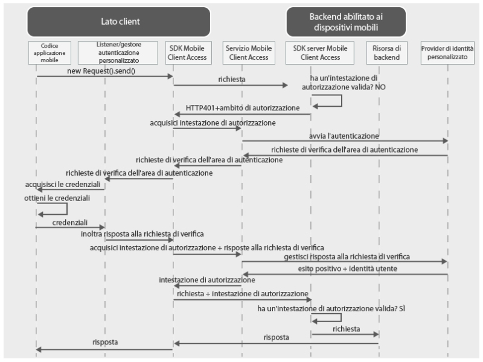

---

copyright:
  years: 2015, 2016

---

# Utilizzo di un provider di identità personalizzato per autenticare gli utenti
{: #custom-id}
Puoi creare un provider di identità personalizzato e implementare la tua logica per la raccolta e la convalida di credenziali. Un provider di identità personalizzato è un'applicazione web che espone un'interfaccia RESTful. Puoi ospitare il provider di identità personalizzato in loco oppure su {{site.data.keyword.Bluemix}}. Il solo requisito è che il provider di identità personalizzato deve essere accessibile da internet pubblica in modo che possa comunicare con il servizio {{site.data.keyword.amashort}}.

## Panoramica di {{site.data.keyword.amashort}}
{: #custom-id-ovr}
 Il seguente diagramma illustra come {{site.data.keyword.amashort}} si integra con un provider di identità personalizzato.



1. Utilizza l'SDK {{site.data.keyword.amashort}} per effettuare una richiesta alle tue risorse di backend che sono protette con l'SDK server {{site.data.keyword.amashort}}.
* l'SDK server {{site.data.keyword.amashort}} rileva una richiesta non autorizzata e restituisce HTTP 401 e un ambito di autorizzazione.
* l'SDK client {{site.data.keyword.amashort}} rileva automaticamente l'HTTP 401 di cui sopra e avvia il processo di autenticazione.
* L'SDK client {{site.data.keyword.amashort}} contatta il servizio {{site.data.keyword.amashort}} e chiede di emettere un'intestazione di autorizzazione.
* Il servizio {{site.data.keyword.amashort}} comunica con il provider di identità personalizzato per avviare il processo di autenticazione.
* Il provider di identità personalizzato restituisce una richiesta di verifica dell'autenticazione al servizio {{site.data.keyword.amashort}}.
* Il servizio {{site.data.keyword.amashort}} restituisce la richiesta di verifica dell'autenticazione all'SDK client {{site.data.keyword.amashort}}.
* L'SDK client {{site.data.keyword.amashort}} delega l'autenticazione a una classe personalizzata da te creata. È tuo compito raccogliere le credenziali e fornirle nuovamente all'SDK client {{site.data.keyword.amashort}}.
* Dopo che lo sviluppatore ha fornito le credenziali all'SDK {{site.data.keyword.amashort}}, esse verranno inviate al servizio {{site.data.keyword.amashort}} come una risposta a una richiesta di verifica dell'autenticazione.
* Il servizio {{site.data.keyword.amashort}} convalida la risposta alla richiesta di verifica dell'autenticazione presso il provider di identità personalizzato.
* Se la convalida ha esito positivo, il servizio {{site.data.keyword.amashort}} genera un'intestazione di autorizzazione e la restituisce all'SDK client {{site.data.keyword.amashort}}. L'intestazione di autorizzazione contiene due token: un token di accesso che contiene le informazioni sulle autorizzazioni di accesso e il token ID che contiene le informazioni su utente, dispositivo e applicazione correnti.
* Da questo punto in avanti, tutte le richieste effettuate con l'SDK client {{site.data.keyword.amashort}} hanno un'intestazione di autorizzazione di nuova acquisizione.
* L'SDK client {{site.data.keyword.amashort}} reinvia automaticamente la richiesta originale che ha attivato il flusso di autorizzazione.
* L'SDK server {{site.data.keyword.amashort}} estrae l'intestazione di autorizzazione dalla richiesta, la convalida presso il servizio {{site.data.keyword.amashort}} e concede l'accesso a una risorsa di backend.

## Descrizione dei provider di identità personalizzati
{: #custom-id-about}

Con un provider di identità personalizzato, puoi fornire delle richieste di verifica dell'autenticazione personalizzate da inviare al client. Con il provider di identità personalizzato, puoi personalizzare completamente il flusso di autenticazione.

Quando crei un provider di identità personalizzato, puoi:

1. Personalizzare una richiesta di verifica dell'autenticazione da inviare dal servizio {{site.data.keyword.amashort}} all'applicazione client mobile. Una richiesta di verifica dell'autenticazione è un oggetto JSON che contiene dati personalizzati. Il client mobile può utilizzare questi dati personalizzati per personalizzare i flussi di autenticazione.

Esempio di una richiesta di verifica dell'autenticazione personalizzata:

	```JavaScript
	{
		status: "challenge",
		challenge: {
			message:"Immetti nome utente e password",
			retriesLeft: 2,
			minUsernameLenth: 8
		}
	}
	```

1. Implementa l'eventuale flusso di raccolta delle credenziali personalizzato sul client mobile, compresa l'autenticazione in più passi e in più moduli. Analogamente alla richiesta di verifica dell'autenticazione personalizzata, devi progettare la struttura di una risposta alla richiesta di verifica dell'autenticazione personalizzata.

Esempio di una risposta a una richiesta di verifica dell'autenticazione personalizzata inviata dal client mobile:

	```JavaScript
	{
		username:"bob.smith",
		password:"abcd1234",
		pincode:"1234"
	}
	```
1. Implementa la logica personalizzata di convalida della risposta alla richiesta di verifica dell'autenticazione fornita.

1. Definisci un oggetto di identità utente personalizzato che contiene le eventuali proprietà personalizzate richieste. Un esempio di un oggetto di identità utente personalizzato ottenuto dal client mobile dopo l'autenticazione eseguita con esito positivo:

	```JavaScript
	{
		username:"bob.smith",
		displayName:"Bob Smith",
		attributes:{
			age: 30,
			accountNumber: 12345,
			lastLogin: "Sept 1st, 2015"
		}
	}
	```

### Implementazione di esempio del provider di identità personalizzato
{: #custom-sample}
Puoi utilizzare una qualsiasi delle seguenti implementazioni di esempio Node.js di un provider di identità personalizzato come un riferimento quando sviluppi il tuo provider di identità personalizzato. Scarica il codice dell'applicazione integrale dai repository GitHub.

 * [Esempio semplice](https://github.com/ibm-bluemix-mobile-services/bms-mca-custom-identity-provider-sample)
 * [Esempio avanzato](https://github.com/ibm-bluemix-mobile-services/bms-mca-custom-identity-provider-with-user-management)
 
## Tipiche comunicazioni tra il server {{site.data.keyword.amashort}} e un provider di identità personalizzato
{: #custom-id-comm}
1. Il servizio {{site.data.keyword.amashort}} invia una richiesta `startAuthorization` al provider di identità personalizzato.
1. Il provider di identità personalizzato risponde con una richiesta di verifica dell'autenticazione personalizzata da inviare al client.
1. Il servizio {{site.data.keyword.amashort}} invia la richiesta di verifica dell'autenticazione personalizzata ricevuta dal provider di identità personalizzato al client mobile e, infine, riceve una risposta alla richiesta di verifica dell'autenticazione dal client mobile.
1. Il servizio {{site.data.keyword.amashort}} invia una richiesta `handleChallengeAnswer` con la risposta alla richiesta di verifica dell'autenticazione al provider di identità personalizzato.
1. Il provider di identità personalizzato verifica la risposta alla richiesta di verifica dell'autenticazione e replica con una risposta di esito positivo che contiene le informazioni sull'identità
dell'utente.
1. Facoltativamente, il provider di identità personalizzato potrebbe fornire ulteriori richieste di verifica dopo aver ricevuto una risposta alla richiesta di verifica dal client. L'invio
di più richieste di verifica consente un processo di autenticazione articolato in più fasi.

## Confronto tra la condizione con stato e quella senza stato
{: #custom-id-state}
Per impostazione predefinita, il provider di identità personalizzato è considerato un'applicazione senza stato. In alcuni casi, il provider di identità personalizzato potrebbe dover memorizzare lo stato correlato al processo di autenticazione. Un caso d'uso di esempio è un'autenticazione in più passi, dove il provider di identità personalizzato deve memorizzare il risultato del primo passo di autenticazione prima di procedere al passo successivo. Per supportare la funzionalità con stato, un provider di identità personalizzato deve generare uno stateID e fornirlo nella risposta al servizio {{site.data.keyword.amashort}}. Il servizio {{site.data.keyword.amashort}} deve passare lo stateID nelle richieste successive che appartengono al processo di autenticazione client.

## Area di autenticazione personalizzata
{: #custom-id-custom}

Un provider di identità personalizzato fornisce un'area di autenticazione personalizzata. Per gestire le richieste di verifica dell'autenticazione in entrata, crea e registra un'istanza diAuthenticationDelegate / AuthenticationListener nella tua applicazione client mobile. Definisci il nome dell'area di autenticazione personalizzata dove configuri un provider di identità personalizzato nel dashboard {{site.data.keyword.amashort}}. Può essere utilizzata per identificare che la richiesta proviene da una specifica istanza del servizio {{site.data.keyword.amashort}}.

## Fasi successive
{: #next-steps}
* [Creazione di un provider di identità personalizzato](custom-auth-identity-provider.html)
* [Configurazione di {{site.data.keyword.amashort}} per l'autenticazione personalizzata](custom-auth-config-mca.html)
* [Configurazione dell'autenticazione personalizzata per Android](custom-auth-android.html)
* [Configurazione dell'autenticazione personalizzata per iOS](custom-auth-ios.html)
* [Configurazione dell'autenticazione personalizzata per Cordova](custom-auth-cordova.html)
