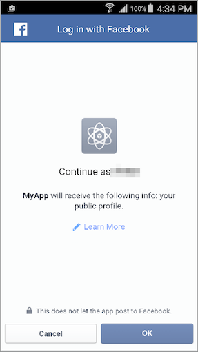

---

copyright:
  years: 2015, 2016

---

# Abilitazione dell'autenticazione Facebook nelle applicazioni Android
{: #facebook-auth-android}
Per utilizzare Facebook come provider di identità nelle tue applicazioni Android, aggiungi e configura la piattaforma Android per la tua applicazione Facebook.

## Prima di cominciare
{: #facebook-auth-android-before}
 * Devi disporre di una risorsa protetta da {{site.data.keyword.amashort}} e di un progetto Android strumentato con l'SDK client {{site.data.keyword.amashort}}.  Per ulteriori informazioni, vedi [Introduzione a {{site.data.keyword.amashort}}](https://console.{DomainName}/docs/services/mobileaccess/getting-started.html) e [Configurazione
dell'SDK Android](https://console.{DomainName}/docs/services/mobileaccess/getting-started-android.html).
 * Proteggi manualmente la tua applicazione di backend con l'SDK server {{site.data.keyword.amashort}}. Per ulteriori informazioni, vedi [Protezione delle risorse](https://console.{DomainName}/docs/services/mobileaccess/protecting-resources.html).
 * Crea un ID applicazione Facebook. Per ulteriori informazioni, vedi [Ottenimento di un ID applicazione Facebook dal portale sviluppatori Facebook](https://console.{DomainName}/docs/services/mobileaccess/facebook-auth-overview.html#facebook-appID).


## Configurazione di un'applicazione Facebook per la piattaforma Android
{: #facebook-auth-android-config}
Per utilizzare Facebook come provider di identità nelle tue applicazioni Android, devi aggiungere e configurare la piattaforma Android per la tua applicazione Facebook.

1. Apri la tua applicazione Facebook nel portale sviluppatori Facebook.

1. Fai clic su **Settings &gt; Add Platform &gt; Android**.

1. Specifica il nome pacchetto della tua applicazione Android nel prompt Google Play Package Name. Per trovare il nome pacchetto della tua applicazione Android,
apri i file `AndroidManifest.xml` Android Studio e cerca `<manifest ..... package="{il-tuo-nome-pacchetto}">`.

1. Specifica il nome classe della tua attività principale nel prompt **Class Name**. Per trovare il nome classe dell'attività principale della tua applicazione Android, apri il file `AndroidManifest.xml` e cerca la dichiarazione di attività con il filtro di intento simile al seguente frammento di codice:

	```XML
	<activity
		android:name=".MainActivity"
		android:label="@string/app_name">
		<intent-filter>
			<action android:name="android.intent.action.MAIN"/>
			<category android:name="android.intent.category.LAUNCHER"/>
		</intent-filter>
	</activity>
	```

1. Per fare in modo che Facebook garantisca l'autenticità della tua applicazione, devi specificare un hash del tuo certificato sviluppatore SHA1.

	**Ulteriori informazioni sulla sicurezza Android:** il sistema operativo Android richiede che tutte le applicazioni installate su un dispositivo Android siano firmate con un certificato sviluppatore. L'applicazione Android può essere messa a punto in due modalità: debug e rilascio. <br/>
  Utilizza certificati differenti per le modalità di debug e rilascio.  I certificati utilizzati per firmare le applicazioni Android in modalità di debug sono forniti con l'SDK Android, che viene di norma installato automaticamente da Android Studio. Quando vuoi rilasciare la tua applicazione al negozio Google Play, devi firmare la tua applicazione con un altro certificato che di norma generi tu stesso. <br/>Puoi immettere due serie di hash chiave con Facebook: un hash chiave per le applicazioni messe a punto in modalità di debug con un certificato di debug e un altro hash chiave per le applicazioni messe a punto in modalità di rilascio con un certificato di rilascio. Per ulteriori informazioni,
vedi il documento relativo alla [firma delle tue applicazioni Android](http://developer.android.com/tools/publishing/app-signing.html).

1. Il keystore che contiene il certificato che stai usando per l'ambiente di sviluppo è memorizzato nel file `~/.android/debug.keystore`. La password keystore predefinita è: `android`. Utilizza questo certificato per mettere a punto applicazioni in modalità di debug.

1. Recupera l'hash chiave del tuo certificato di modalità di debug:

	```XML
	keytool -exportcert -alias androiddebugkey -keystore ~/.android/debug.keystore | openssl sha1 -binary | openssl base64
	```

	**Suggerimento**: puoi utilizzare la stessa sintassi per recuperare l'hash chiave del tuo certificato di modalità di rilascio. Sostituisci percorso keystore e alias nel comando.

1. Copia e incolla l'hash chiave che hai ottenuto con il comando **keytool** a un prompt Development/Release Key Hashes nel portale sviluppatori Facebook.

	**Suggerimento**: se intendi utilizzare questa funzione, considera l'abilitazione di SSO (single sign on).

1. Fai clic su **Save Settings**.

## Configurazione di {{site.data.keyword.amashort}} per l'autenticazione Facebook
{: #facebook-auth-android-mca}
Una volta che hai l'ID applicazione Facebook e hai configurato la tua applicazione Facebook perché serva client Android, puoi abilitare l'autenticazione Facebook nel
dashboard {{site.data.keyword.amashort}}.

1. Apri la tua applicazione nel dashboard {{site.data.keyword.Bluemix_notm}}.

1. Fai clic su **Opzioni mobili** e annota la tua **Rotta** (`applicationRoute`) e il tuo **GUID applicazione** (`applicationGUID`). Questi valori ti servono quando inizializzi l'SDK.

1. Fai clic sul tile {{site.data.keyword.amashort}}. Il dashboard {{site.data.keyword.amashort}} viene caricato.

1. Fai clic sul tile **Facebook**.

1. Specifica l'ID applicazione Facebook e fai clic su **Save**.

## Configurazione dell'SDK client {{site.data.keyword.amashort}} per Android
{: #facebook-auth-android-sdk}
Per configurare l'SDK client per Android, utilizza il gestore dipendenze Gradle in Android Studio.

1.  Apri il file `build.gradle` del tuo modulo applicazione.
Il tuo progetto Android può avere due file `build.gradle`:  per il progetto e per il modulo applicazione. Utilizza il file di modulo applicazione.

1. Trova la sezione delle dipendenze del file `build.gradle` e aggiungi una nuova dipendenza di compilazione per l'SDK client:

	```Gradle
	dependencies {
		compile group: 'com.ibm.mobilefirstplatform.clientsdk.android',    
        name:'facebookauthentication',
        version: '2.+',
        ext: 'aar',
        transitive: true
    	// other dependencies  
	}
```

	Puoi rimuovere la dipendenza sul modulo `core` del gruppo `com.ibm.mobilefirstplatform.clientsdk.android`, se
è presente nel tuo file. Il modulo `facebookauthentication` scarica il modulo `core` automaticamente.

  Dopo che hai salvato i tuoi aggiornamenti, il modulo `facebookauthentication` scarica e installa l'SDK Facebook nel tuo progetto Android.


1. Sincronizza il tuo progetto con Gradle. Fai clic su **Tools > Android > Sync project with Gradle Files**.

1. Apri il file `res/values/strings.xml` e aggiungi una stringa `facebook_app_id` che contiene il tuo ID applicazione Facebook:

	```XML
	<resources>
		<string name="app_name">HelloWorld</string>
		<string name="action_settings">Settings</string>
		<string name="facebook_app_id">522733366802111</string>
	</resources>
```

1. Nel file `AndroidManifest.xml` del tuo progetto Android:
   1. Aggiungi l'autorizzazione di accesso a internet sotto l'elemento `<manifest>`:

	```XML
	<uses-permission android:name="android.permission.INTERNET" />
```
  2. Aggiungi i metadati richiesti per l'SDK Facebook all'elemento `<application>`:

	```XML
	<application .......>

		<meta-data
			android:name="com.facebook.sdk.ApplicationId"
			android:value="@string/facebook_app_id"/>

		<activity ...../>
		<activity ...../>
	</application>
```

   1. Aggiungi un elemento di attività Facebook (FacebookActivity) sotto le tue attività esistenti:

	```XML
	<application .....>
		<activity ...../>
		<activity ...../>

		<activity 	android:name="com.facebook.FacebookActivity"
					android:configChanges=
						"keyboard|keyboardHidden|screenLayout|screenSize|orientation"
					android:theme="@android:style/Theme.Translucent.NoTitleBar"
					android:label="@string/app_name" />

	</application>
```

1. Inizializza l'SDK client e registra il gestore autenticazione Facebook. Inizializza l'SDK client {{site.data.keyword.amashort}} passando i parametri di contesto, GUID applicazione (`applicationGUID`) e rotta (`applicationRoute`).<br/>
 Un punto comune, seppure non obbligatorio, dove inserire il codice di inizializzazione è nel metodo `onCreate` dell'attività principale nella tua applicazione Android.<br/>
 Sostituisci *applicationRoute* e *applicationGUID* con i valori per **Rotta** e **GUID applicazione** dal
menu **Opzioni mobili** sulla pagina principale della tua applicazione nel dashboard Bluemix.

	```Java
	BMSClient.getInstance().initialize(getApplicationContext(),
					"applicationRoute",
					"applicationGUID");

	FacebookAuthenticationManager.getInstance().register(this);
```


1. Aggiungi il seguente codice alla tua attività:

	```Java
	@Override
	protected void onActivityResult(int requestCode, int resultCode, Intent data) {
		super.onActivityResult(requestCode, resultCode, data);
		FacebookAuthenticationManager.getInstance()
			.onActivityResultCalled(requestCode, resultCode, data);
	}
```

## Verifica dell'autenticazione
Dopo che l'SDK client è stato inizializzato e il gestore autenticazione Facebook è stato registrato, puoi iniziare a effettuare richieste al tuo backend mobile.

### Prima di cominciare
{: #facebook-auth-android-testing-before}
Devi utilizzare il contenitore tipo {{site.data.keyword.mobilefirstbp}} e disporre già di una risorsa protetta da {{site.data.keyword.amashort}} all'endpoint `/protected`. Se devi configurare un endpoint `/protected`, consulta [Protezione delle risorse](https://console.{DomainName}/docs/services/mobileaccess/protecting-resources.html).

1. Prova a inviare una richiesta all'endpoint protected del backend mobile appena creato nel tuo browser. Apri il seguente URL: `{applicationRoute}/protected`. Ad esempio: `http://my-mobile-backend.mybluemix.net/protected`
<br/>L'endpoint `/protected` di un backend mobile creato con il contenitore tipo MobileFirst Services Starter è protetto con {{site.data.keyword.amashort}}. Nel tuo browser viene restituito un messaggio `Unauthorized`. Questo messaggio viene restituito perché a questo endpoint possono accedere solo le applicazioni mobili strumentate con l'SDK client{{site.data.keyword.amashort}}.

1. Utilizza la tua applicazione Android per effettuare una richiesta allo stesso endpoint. Aggiungi il seguente codice dopo che hai inizializzato `BMSClient` e registrato `FacebookAuthenticationManager`.

	```Java
	Request request = new Request("/protected", Request.GET);
	request.send(this, new ResponseListener() {
		@Override
		public void onSuccess (Response response) {
			Log.d("Myapp", "onSuccess :: " + response.getResponseText());
			Log.d("MyApp", AuthorizationManager.getInstance().getUserIdentity().toString());
		}
		@Override
		public void onFailure (Response response, Throwable t, JSONObject extendedInfo) {
			if (null != t) {
				Log.d("Myapp", "onFailure :: " + t.getMessage());
			} else if (null != extendedInfo) {
				Log.d("Myapp", "onFailure :: " + extendedInfo.toString());
			} else {
				Log.d("Myapp", "onFailure :: " + response.getResponseText());
			}
		}
	});
```

1. Esegui la tua applicazione. Viene visualizzata una schermata di accesso Facebook.

	

	Questa schermata può avere un aspetto lievemente differente se sul tuo dispositivo non è installata l'applicazione Facebook o se non sei attualmente collegato a Facebook.

1. Fai clic su **OK** per autorizzare {{site.data.keyword.amashort}} a usare la tua identità utente Facebook per scopi di autenticazione.

1. 	Quando la tua richiesta ha esito positivo, nel programma di utilità LogCat è presente il seguente output:

	

1. Puoi anche aggiungere la funzionalità di disconnessione aggiungendo il seguente codice:

 ```
FacebookAuthenticationManager.getInstance().logout(getApplicationContext(), listener);
 ```

 Se richiami questo codice dopo che un utente ha eseguito l'accesso con Facebook, l'utente viene disconnesso da Facebook. Quando un utente prova ad eseguire nuovamente l'accesso, gli vengono richieste le sue credenziali Facebook.

 Il valore per `listener` passato alla funzione di disconnessione può essere null.
