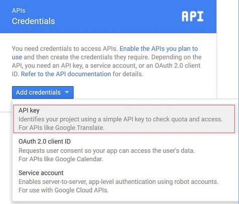
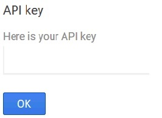

---

copyright:
 years: 2015, 2016

---

{:new_window: target="_blank"}
# Configurazione delle credenziali per GCM (Google Cloud Messaging)
{: #create-push-enable-gcm}

Ottieni le tue credenziali GCM (Google Cloud Messaging) e configura
        quindi il Push Notification Service sul dashboard Push.

##Come ottenere il tuo ID mittente e la chiave API

La chiave API è archiviata in modo protetto e utilizzata dal servizio di notifica di push per stabilire una connessione al server GCM e l'ID mittente (numero progetto) viene utilizzato dall'SDK Android sul lato client. Per ulteriori informazioni sull'ID mittente, vedi [Google Cloud Messaging](https://developers.google.com/cloud-messaging/gcm#arch).

1. Ottieni un account di sviluppo Google all'indirizzo [Google Dev Console](https://console.developers.google.com/start){: new_window}. Per ulteriori informazioni su GCM (Google Cloud Messaging), vedi [Creating a Google API Project](https://developers.google.com/console/help/new/){: new_window}.

2. Nella Google Developers Console, crea un nuovo progetto. Ad esempio, "hello
                        world".

	

3. In **Project name**, immetti il nome del tuo progetto e
                        fai quindi clic sul pulsante **Create**.
4. Fai clic su **Home** per visualizzare il numero
                        del progetto. Registra il tuo numero di progetto.

	

	**Nota**: quando crei il tuo progetto, viene creato un numero progetto (ID mittente). Utilizza questo numero per configurare il servizio di
                            notifica di push sulla schermata del dashboard Push.

5. Fai clic su **APIs & Auth** e nella sezione **Mobile APIs**, fai clic su **Cloud Messaging for Android**.

	

6. Fai clic su ** APIs** e fai quindi clic sul pulsante ** Enable API
                        **per creare la tua chiave API per il tuo progetto.

	

7. Vai alla schermata **APIs & Auths -> Credentials**. Fai clic su **Add Credentials** e fai quindi clic su **API
                            Key**.

	

8. Fai clic sull'opzione **Server Key** per generare una chiave
                        API GCM che utilizzerai nel dashboard Push di Bluemix.
9. Nel campo **Name**, immetti il nome della chiave API del server.

	

10. Fai clic sul pulsante **Create**. 
Viene visualizzata
                        la chiave API.

	

11. Copia la tua chiave API GCM e fai quindi clic sul pulsante **OK**. Ti servirà il numero progetto (ID mittente) e la chiave API per configurare le tue credenziali sulla schermata Configuration del dashboard Bluemix Push Notification. 
12. Fasi successive. Configurazione del servizio di notifica di push per Android.

##Configurazione del Push Notification Service per Android

**Prima di iniziare**

Ottieni una chiave API GCM e un ID mittente (numero progetto). 

1. Apri l'applicazione di backend nel dashboard Bluemix e fai quindi clic sul servizio IBM Push Notifications per aprire il dashboard Push Notification Service.
 
	

	Viene visualizzato il dashboard Push.
	
	

2. Fai clic sul pulsante **Setup Push** per configurare le credenziali GCM.
1. Nella scheda **Configuration**, vai alla sezione **Google Cloud Messaging** e configura l'ID mittente (numero progetto GCM) e la chiave API.

4. Fai clic sul pulsante **Save**. 
5. Fasi successive. [Abilitazione delle notifiche per Android](c_enable_push.html).
