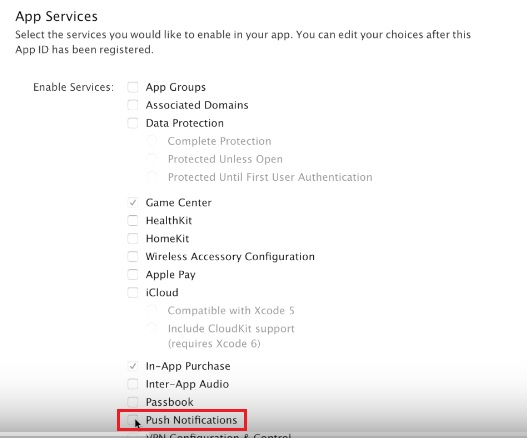

---

copyright:
 years: 2015, 2016

---

{:new_window: target="_blank"}
# Configurazione delle credenziali per APNs (Apple push notifications)

{: #create-push-credentials-apns}

Il servizio APNS (Apple Push Notification Service) consente allo sviluppatore dell'applicazione
        di inviare notifiche remote dall'istanza del servizio di Push su Bluemix (il provider) alle
        applicazioni e ai dispositivi iOS. I messaggi sono inviati a un'applicazione di destinazione sul dispositivo. Ottieni e
        configura le tue credenziali APNS. I certificati APNS sono gestiti in modo sicuro dal servizio di notifica di
        push e utilizzati per stabilire una connessione al server APNS come un provider.

1. Ottieni un account [Apple Developers](https://developer.apple.com/).
2. [Registra un ID applicazione](#create-push-credentials-apns-register)
3. [Crea un certificato SSL di APNS di sviluppo e distribuzione](#create-push-credentials-apns-ssl)
4. [Crea un profilo di provisioning di sviluppo](#create-push-credentials-dev-profile)
5. [Crea un profilo di provisioning di
                        distribuzione di archivio](#create-push-credentials-apns-distribute_profile)
6. [Configura APNS sul dashboard Push](#create-push-credentials-apns-dashboard)

##Registrazione di un ID applicazione
{: #create-push-credentials-apns-register}

L'ID applicazione (l'identificativo del bundle) è un identificativo univoco che identifica una specifica
             applicazione. Ogni applicazione richiede un ID applicazione. I servizi come Push Notifications Service sono configurati sull'ID applicazione.

1. Vai al portale [Apple Developer](https://developer.apple.com), fai clic su **Member Center** e seleziona **Certificates, Identifiers & Profiles**.
2. Vai alla sezione **Registering App IDs** nella [Apple Developer Library](https://developer.apple.com/library/mac/documentation/IDEs/Conceptual/AppDistributionGuide/MaintainingProfiles/MaintainingProfiles.html#//apple_ref/doc/uid/TP40012582-CH30-SW991) e attieniti alle istruzioni per registrare l'ID applicazione.

	**Nota**: quando registri un ID applicazione, seleziona le seguenti opzioni:
	* Push Notifications

	

	* Explicit ID Suffix

	
3. Fasi successive. Crea un certificato SSL di APNS di sviluppo e distribuzione.

##Crea un certificato SSL di APNS di sviluppo e distribuzione
{: #create-push-credentials-apns-ssl}

Prima di poter ottenere un certificato APNS, devi generare una CSR (certificate
            signing request) e inoltrarla ad Apple, l'autorità di certificazione (CA). La CSR
            contiene informazioni che identificano la tua società e la tua chiave pubblica e
            privata che usi per firmare le tue notifiche di push Apple. Genera quindi il certificato SSL
            nel portale per sviluppatori iOS. Il certificato, insieme alla sua chiave pubblica e a quella privata,
             viene archiviato in Keychain Access.

**Prima di iniziare**

[Registra un ID applicazione](#create-push-credentials-apns-register)

Gli APNS possono essere utilizzati in due modalità: sandbox e produzione.

* La modalità sandbox viene utilizzata durante le fasi di sviluppo e test.
* La modalità produzione viene utilizzata quando si distribuiscono le applicazioni tramite l'App
                            Store (o altri meccanismi di distribuzione aziendali).

Devi ottenere dei certificati separati per gli ambienti di sviluppo e
                    distribuzione. I certificati sono associati a un ID applicazione per l'applicazione
                    destinataria delle notifiche remote. per la produzione, è possibile creare fino a
                    due certificati. Bluemix utilizza i certificati per stabilire una connessione SSL
                    con APNS.

Crea un certificato SSL di sviluppo e distribuzione.

1. Vai a [Apple Developer](https://developer.apple.com), fai clic su **Member Center** e seleziona **Certificates, Identifiers & Profiles**.
2. Nell'area **Identifiers**, fai clic su **App
                            IDs**.
3. Dall'elenco di ID applicazione, seleziona l'ID applicazione appena creato e seleziona quindi
                            **Settings**.
4. Nell'area **Push Notifications**, crea un certificato SSL di sviluppo e quindi
                        un certificato SSL di produzione.
 
	

	Viene visualizzata la schermata About Creating a Certificate Signing Request.

	

5. Sul tuo Mac, avvia l'applicazione **Keychain Access** per creare
                        una CSR (Certificate Signing Request).
6. Seleziona **Keychain Access > Certificate Assistant > Request a Certificate From a Certificate Authority…** 
7. In **Certificate Information**, immetti il tuo indirizzo email che è associato al
                        tuo account di sviluppatore di applicazioni e un nome comune. Fornisci un
                        nome significativo che ti aiuta a identificare se si tratta di un certificato
                        per lo sviluppo (sandbox) o la distribuzione (produzione); ad esempio **certificato_apns_sandbox** o
                            **certificato_apns_produzione**.

8. Seleziona **Saved to disk ** per scaricare il file
                            **.certSigningRequest** sul tuo desktop e fai quindi clic su **Continue**.
9. In **Save As**, denomina il file **.certSigningRequest**, ad esempio,
                            **sandbox.certSigningRequest**, e fai quindi clic su **Save**.
10. Fai clic su **Done**. Ora hai una CSR.
11. Da **About Creating a Certificate a Siging Request (CSR)**, fai clic su **Continue**. 12. 
12. Dalla schermata **Generate**, fai clic su **Choose
                            File ... **e seleziona il file CSR che avevi salvato sul tuo
                        desktop. Fai quindi clic su **Generate**. 

	

13. Quando il tuo certificato è pronto, fai clic su **Done**.
14. Sulla schermata **Push Notifications**, fai clic su **Download** per scaricare il tuo certificato e fai quindi clic su **Done**. 
15. Sul tuo Mac, vai a **Keychain Access > My Certificates**, e individua il certificato appena installato. Fai doppio clic sul certificato per installarlo in Keychain Access.
16. Seleziona il certificato (certificate) e la chiave privata (private key) e seleziona quindi **Export** per convertire il certificato nel formato Personal Information Exchange (formato .p12).

	

17. Nel campo **Save As**, dai al certificato un nome significativo in modo da poterlo identificare successivamente, ad esempio **apns_sandbox.certificato_p12** o **apns_produzione.p12** e fai quindi clic su **Save**.

   	

18. Nel campo **Enter a password**, immetti una password per proteggere gli elementi esportati e fai quindi clic su **OK**. Utilizzi questa password per configurare successivamente le tue impostazioni APNS sul dashboard
                            Push.

	
19. **Key Access.app** ti chiede di esportare la tua chiave dalla schermata **Keychain**. Immetti la tua password amministrativa per il tuo Mac per consentire al tuo sistema di esportare questi elementi e seleziona quindi l'opzione **Always Allow**. Sul tuo desktop viene
                        generato un certificato .p12.

##Creazione di profilo di provisioning di sviluppo
{: #create-push-credentials-dev-profile}

Il profilo di provisioning utilizza l'ID applicazione per determinare quali sono
            i dispositivi su cui può essere installata ed eseguita la tua applicazione e quali sono
            i servizi a cui la tua applicazione può accedere. Per ogni ID applicazione, crei
            due profili di provisioning: uno per lo sviluppo e l'altro per la distribuzione. Xcode utilizza il profilo di provisioning di sviluppo per determinare quali sono
            gli sviluppatori a cui è consentito creare l'applicazione e quali sono i dispositivi
            di cui è consentita l'esecuzione di test sull'applicazione.

**Prima di iniziare**

Assicurati di aver registrato un ID applicazione, di averlo abilitato
                    per Push Notification Service e di averlo configurato per utilizzare un certificato SSL di
                    APNS di sviluppo e produzione.

Crea un profilo di provisioning di sviluppo.

1. Vai al portale [Apple Developer](https://developer.apple.com), fai clic su **Member Center** e seleziona **Certificates, Identifiers & Profiles**.
2. Vai al sito [Mac Developer Library ](https://developer.apple.com/library/mac/documentation/IDEs/Conceptual/AppDistributionGuide/MaintainingProfiles/MaintainingProfiles.html#//apple_ref/doc/uid/TP40012582-CH30-SW62site), scorri alla sezione **Creating Development Provisioning Profiles** e attieniti alle istruzioni per creare un profilo di sviluppo.

	**Nota**: quando configuri un profilo di provisioning di sviluppo, seleziona le seguenti opzioni:
	* **iOS App Development**
	* **For iOS and watchOS apps **

##Creazione di un profilo di provisioning di distribuzione di archivio
{: #create-push-credentials-apns-distribute_profile}

Utilizza il profilo di provisioning di archivio per inoltrare la tua applicazione per la distribuzione all'App Store.

1. Vai al portale [Apple Developer](https://developer.apple.com), fai clic su **Member Center** e seleziona **Certificates, Identifiers & Profiles**.
2. Fai doppio clic sul file di provisioning scaricato per installarlo in Xcode.

##Configurazione APNS sul dashboard Notifica di push
{: #create-push-credentials-apns-dashboard}

Per utilizzare il Push Notification Service per inviare notifiche, carica i certificati SSL
            richiesti per APNS (Apple Push Notification Service). Puoi inoltre utilizzare l'API REST per caricare un certificato APNS.

**Prima di iniziare**

Ottieni il tuo certificato SSL di APNS di sviluppo e produzione e la password associata
                    a ciascun tipo di certificato. Per informazioni, vedi Creazione e configurazione di credenziali di push per gli APNS.

I certificati necessari per APNS sono i certificati .p12, che contengono la chiave
                privata, e i certificati SSL richiesti per creare e pubblicare la tua
                applicazione. Devi generare i certificati dal Member Center del sito Web Apple
                    Developer (per il quale è richiesto un account Apple Developer
                valido). Sono richiesti dei certificati separati per l'ambiente di sviluppo (sandbox) e
                    l'ambiente di produzione (distribuzione).

**Nota**: dopo che .**cer**  è presente nel tuo accesso alla catena di chiavi, eseguine l'esportazione sul tuo computer per creare un certificato .p12.

Per ulteriori informazioni sull'utilizzo di APNS, vedi [iOS Developer Library: Local and Push
                    Notification Programming Guide](https://developer.apple.com/library/ios/documentation/NetworkingInternet/Conceptual/RemoteNotificationsPG/Chapters/ProvisioningDevelopment.html#//apple_ref/doc/uid/TP40008194-CH104-SW4).

Configura APNS sul dashboard Push.

1. Apri la tua applicazione di backend nel dashboard Bluemix e fai quindi clic sul servizio **IBM Push Notifications**
                        per aprire il dashboard Push.

	

	Viene visualizzato il dashboard Push.
	
	
1
2. Nella scheda **Configuration**, vai alla sezione **Apple Push Certificate**, seleziona **Sandbox** (sviluppo) o **Production** (distribuzione) e quindi carica il certificato p.12 su Bluemix.

	
3. Nel campo **Password**, immetti la password associata al file di certificato **.p12** e quindi fai clic su **Save**.
Dopo che i certificati sono
                     stati caricati correttamente con una password valida, puoi iniziare a inviare notifiche.

