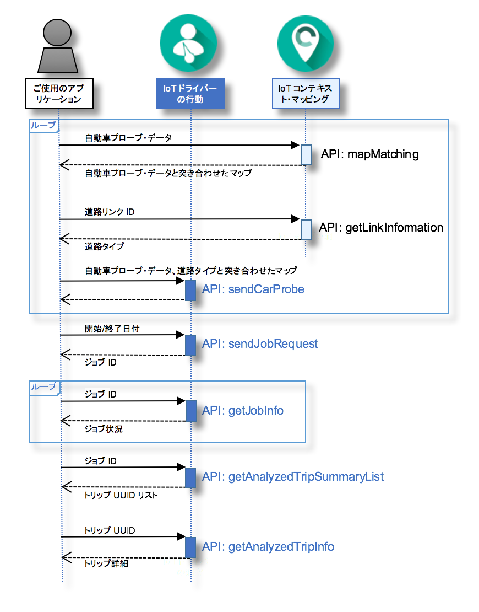

---

copyright:
  years: 2016

---

{:new_window: target="_blank"}
{:shortdesc: .shortdesc}
{:screen: .screen}
{:codeblock: .codeblock}
{:pre: .pre}

# {{site.data.keyword.iotdriverinsights_short}} の使用を開始する
{: #gettingstartedtemplate}
*最終更新: 2016 年 5 月 13 日*

{{site.data.keyword.iotdriverinsights_full}} を使用すると、{{site.data.keyword.iotdriverinsights_short}} API によってドライバーの行動を分析し、自動車プローブ・データとコンテキスト・データを収集して分析できます。
{:shortdesc}

アンバインド・サービス・インスタンスを作成して展開した後、以下の手順に従ってご使用のアプリケーションを {{site.data.keyword.iotdriverinsights_short}} API と統合します。 

1. (オプション) 自動車プローブ・データを {{site.data.keyword.iotdriverinsights_short}} API に送信する前に、{{site.data.keyword.iotmapinsights_short}} API を使用して自動車プローブ・データにさらにデータを追加できます。
     - `mapMatching` API を使用して、自動車プローブ・データと突き合わせたマップを取得します。
        - [要求] 自動車プローブ・データ
        - [応答] 自動車プローブ・データと突き合わせたマップ
     - `getLinkInformation` API を使用して道路タイプ・データを取得します。
        - [要求] 道路リンク ID
        - [応答] 道路タイプ
2. `sendCarProbe` API を使用して、格納して分析する自動車プローブ・データを送信します。
   - [要求] 自動車プローブ・データと道路タイプと突き合わせたマップ
3. `sendJobRequest` API を使用して、自動車プローブ・データを分析するジョブ要求を送信します。
   - [要求] 開始/終了日付
   - [応答] ジョブ ID
4. `getJobInfo` API を使用して、ジョブ状況を確認します。
   - [要求] ジョブ ID
   - [応答] ジョブ状況
5. `getAnalyzedTripSummaryList` API を使用して、分析済みのトリップ要約リストを取得します。
   - [要求] ジョブ ID
   - [応答] 分析済みトリップ要約のリスト
6. `getAnalyzedTripInfo` API を使用して、分析済みの詳細なトリップ情報を取得します。
   - [要求] トリップ uuid
   - [応答] 分析済みトリップの詳細 

次のシーケンス図に、これらのステップのシーケンスを示します。

分析可能な動作とコンテキストの詳細については、「[{{site.data.keyword.iotdriverinsights_short}} について](iotdriverinsights_overview.html)」トピックを参照してください。
サンプルの自動車プローブ・データが含まれるサンプル・アプリケーションを試すには、[{{site.data.keyword.iotmapinsights_short}} / {{site.data.keyword.iotdriverinsights_short}} チュートリアル パート 1](https://github.com/IBM-Bluemix/car-data-management){:new_window} を使用してください。

# 関連リンク
{: #rellinks}
## チュートリアルとサンプル
{: #samples}

* [{{site.data.keyword.iotmapinsights_short}} / {{site.data.keyword.iotdriverinsights_short}} チュートリアル パート 1](https://github.com/IBM-Bluemix/car-data-management){:new_window}
* [{{site.data.keyword.iotmapinsights_short}} / {{site.data.keyword.iotdriverinsights_short}} チュートリアル パート 2](https://github.com/IBM-Bluemix/map-driver-insights){:new_window}

## API リファレンス
{: #api}

* [API ドキュメント](http://ibm.biz/IoTDriverBehavior_APIdoc){:new_window}

## 関連リンク
{: #general}

* [{{site.data.keyword.iotmapinsights_short}} の使用を開始する](../IotMapInsights/index.html){:new_window}
* [{{site.data.keyword.iot_full}} の使用を開始する](https://www.ng.bluemix.net/docs/services/IoT/index.html){:new_window}
* [IBM developerWorks の dW Answers](https://developer.ibm.com/answers/topics/iot-driver-behavior){:new_window}
* [スタック・オーバーフロー](http://stackoverflow.com/questions/tagged/iot-driver-behavior){:new_window}
* [Bluemix サービスの新機能](http://www.ng.bluemix.net/docs/whatsnew/index.html#services_category){:new_window}

