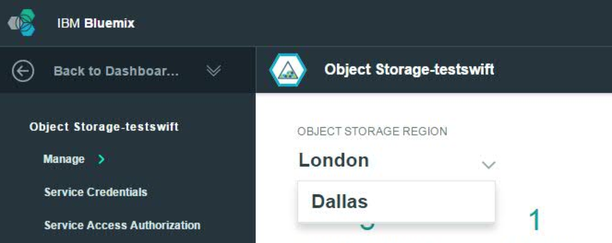

{:new_window: target="_blank"}

# {{site.data.keyword.objectstorageshort}} 入門
{: #getting-started-with-object-storage} 

{{site.data.keyword.objectstoragefull}} を利用すると、完全にプロビジョンされた Swift {{site.data.keyword.objectstorageshort}} アカウントにアクセスしてデータを管理することができます。Swift は、完全分散型の、API によるアクセスが可能なストレージ・プラットフォームを提供します。アプリケーションで直接使用することも、バックアップに使用することも可能で、コスト効率の高いスケールアウト・ストレージに理想的です。

IBM {{site.data.keyword.objectstorageshort}} for {{site.data.keyword.Bluemix_notm}} は、認証に OpenStack Identity (Keystone) を使用し、OpenStack Object Storage (Swift) API v1 呼び出しによって直接アクセスできます。IBM {{site.data.keyword.objectstorageshort}} は {{site.data.keyword.Bluemix_notm}} アプリケーションにバインドすることも、{{site.data.keyword.Bluemix_notm}} アプリケーションの外部からアクセスすることもできます。 

OpenStack Swift および Keystone についての詳細情報および資料については、[OpenStack 資料サイト](http://docs.openstack.org){: new_window}を参照してください。

以下に {{site.data.keyword.objectstorageshort}} のアーキテクチャー図を示します。

[](http://www.ng.bluemix.net/docs/api/content/services/ObjectStorage/images/object_storage_solution_archectiture.png){: new_window}

*図 1. {{site.data.keyword.objectstorageshort}} アーキテクチャー図*

**注:** プロバイダー・サイドの暗号化は提供されていません。アップロードの前にデータを暗号化するのは、クライアント・アプリケーションの責任です。

**注:** {{site.data.keyword.objectstorageshort}} サービス (ベータ版) プランは、{{site.data.keyword.Bluemix_notm}} {{site.data.keyword.objectstorageshort}} サービスの一般出荷可能日以降はカタログから削除されます。猶予期間が終わったら、ベータ版プランを使用するサービス・インスタンスは削除されます。{{site.data.keyword.objectstorageshort}} サービスを使用し続けるには、[料金プランの更新](#changeplan)を行ってください。 


## {{site.data.keyword.Bluemix_notm}} での {{site.data.keyword.objectstorageshort}} インスタンスの作成 {: #creating-object-storage-instance} 

### {{site.data.keyword.objectstorageshort}} サービス・インスタンスの作成方法
1.	{{site.data.keyword.Bluemix_notm}} の**「カタログ」**タブに移動し、検索ボックスに **{{site.data.keyword.objectstorageshort}}** と入力するか、または、**「サービス」**に移動して**「ストレージ」**を選択します。**{{site.data.keyword.objectstorageshort}}** サービスをクリックします。 
2.	スペース、アプリ、サービス名、およびプランを選択し、**「作成」**をクリックします。
**注:** 最初に**「アプリ」**フィールドで**「アンバインドのまま」**オプションを選択した場合、構成完了後もサービス・インスタンスを {{site.data.keyword.Bluemix_notm}} アプリケーションにバインドすることができます。以下の手順を参照してください。

## {{site.data.keyword.Bluemix_notm}} アプリからの {{site.data.keyword.objectstorageshort}} の使用 {: #using-object-storage-from-bluemix-app} 

### {{site.data.keyword.objectstorageshort}} サービスを作成後にアプリケーションにバインドする方法 {: #bind-object-storage-to-application} 
1.	{{site.data.keyword.Bluemix_notm}} ダッシュボードで、バインドするアプリを選択します。
2.	アプリ概要で**「サービスまたは API のバインド」**をクリックします。
3.	サービスのリストから {{site.data.keyword.objectstorageshort}} インスタンスを選択し、**「追加」**をクリックします。
4.	プロンプトが表示されたら、**「再ステージ」**をクリックします。新しいサービスを使用するには、アプリの再ステージが必要です。

### バインド済みコンテキスト

{{site.data.keyword.objectstorageshort}} をバインド済みコンテキストで使用したい場合、アプリケーションのバインド・プロセスを通じてクラウド資格情報が間接的に提供されます。サービス・インスタンスがアプリケーションに正常にバインドされると、次の例のような構成が `VCAP_SERVICES` 環境変数に追加されます。


    {
    "Object-Storage": [
    {
      "name": "Object-Storage - YP",
      "label": "Object-Storage",
      "plan": "Free",
      "credentials": {
         "auth_url": "https://identity.open.softlayer.com",
         "project": "object_storage_d049255b",
         "projectId": "0f47b41b06d047f9aae3b33f1db061ed",
         "region": "dallas",
         "userId": "ad78b2a3f843466988afd077731c61fc",
         "username": "user_202db1f8a7aa3f3ac51ec68f10dbe7dc29070bc7",
         "password": "K/jyIi2jR=1?D.TP",
         "domainId": "2df6373c549e49f8973fb6d22ab18c1a",
         "domainName": "639347"
        }
       }
      ]
    }

## {{site.data.keyword.objectstorageshort}} ユーザー・インターフェースの使用 {: #using-object-storage-ui}

### UI エレメントとナビゲーション
{{site.data.keyword.objectstorageshort}} がプロビジョンされると、{{site.data.keyword.objectstorageshort}} for {{site.data.keyword.Bluemix_notm}} サービス・インスタンス・ダッシュボードにインスタンス情報が表示されます。ダッシュボードから {{site.data.keyword.objectstorageshort}} インスタンスを選択すると、詳細情報を含むパネルが表示されます。  
#### 使用量データ
パネルの上部に、インスタンスのストレージ使用量の情報が表示されます。**ストレージ・コンテナー**の現在数と、全コンテナー内の**オブジェクト**の総数も示されます。メモリー使用量がメガバイト単位でリストされます。**ストレージ消費**は、使用されているスペースの現在量を示します。 
#### アクション
最新の使用量データを取得するには、**「最新表示」**ボタンをクリックします。   
####オブジェクト・ブラウザー 
パネルの最下部のセクションには、オブジェクト・ブラウザーが含まれます。オブジェクト・ブラウザーを使用して、オブジェクト・ストレージのコンテナーおよびオブジェクトを管理します。コンテナーの作成、ファイルのアップロード、コンテナーの削除、ファイルの削除をはじめとするアクションを行えます。

## Swift CLI を使用した {{site.data.keyword.objectstorageshort}} へのアクセス {: #using-swift-cli}

{{site.data.keyword.objectstorageshort}} サービスには、インターネットを介してアクセスすることも、IBM {{site.data.keyword.Bluemix_notm}} 内でアプリケーションおよび仮想マシンからアクセスすることもできます。{{site.data.keyword.objectstorageshort}} サービスの一般的なユース・ケースは次のとおりです。

* インスタンスからボリューム・データをバックアップする
* 大容量のデータを転送する際の仲介場所として使用する
* 直接接続されていない環境間でデータを転送する
* 中央リポジトリーとして機能する

{{site.data.keyword.objectstorageshort}} サービスは OpenStack Swift に基づいており、互換性のある任意のクライアント・アプリケーションを使用してアクセスできます。このセクションでは、{{site.data.keyword.objectstorageshort}} API およびその拡張機能のコマンド・ライン・インターフェース (CLI) である Python Swift クライアントを使用してコンテナーおよびファイルを操作する方法について説明します。

### Swift クライアントのインストール

まだインストールされていない場合は、以下の前提ソフトウェアをインストールしてください。詳しくは、[OpenStack 資料](http://docs.openstack.org/user-guide/common/cli_install_openstack_command_line_clients.html#install-the-prerequisite-software){: new_window}を参照してください。 
* Python 2.7 以降
* setuptools パッケージ
* pip パッケージ

Python pip を使用して Python Swift クライアントをインストールします。

	sudo pip install python-swiftclient

### クライアントのセットアップ

Swift クライアントは、以下の環境変数から認証情報を取得します。
* ```OS_AUTH_URL``` はエンドポイント URL です
* ```OS_USER_ID``` はユーザー名です
* ```OS_PASSWORD``` はパスワードです

認証情報を次のように設定してください。 

	export OS_USER_ID=24a20b8e4e724f5fa9e7bfdc79ca7e85
	export OS_PASSWORD=aaa55AAAaaaaa]?,
	export OS_PROJECT_ID=383ec90b22ff4ba4a78636f4e989d5b1
	export OS_AUTH_URL=https://identity.open.softlayer.com/v3
	export OS_REGION_NAME=dallas
	export OS_IDENTITY_API_VERSION=3
	export OS_AUTH_VERSION=3

{{site.data.keyword.objectstorageshort}} サービス用の資格情報値は {{site.data.keyword.objectstorageshort}} ユーザー・インターフェースの**「サービス資格情報」**ページで見つけることができます。 

**注:** Swift クライアント用に環境変数 ```OS_AUTH_URL``` を構成するときには、{{site.data.keyword.objectstorageshort}} ユーザー・インターフェースの資格情報からの ```auth_url`` に ```/v3`` を追加するよう注意してください。


*図 2. {{site.data.keyword.objectstorageshort}} サービス資格情報*

### コンテナーの操作

コンテナーをリスト表示する

	swift list
	
コンテナーを作成する

	swift post <container_name>
	
コンテナーの内容をリスト表示する

	swift list <container_name>

### オブジェクトの操作

#### コンテナーへのファイルの追加

	swift upload <container_name> <file_name>

#### コンテナーへの 5 GB より大きいファイルの追加

5 GB より大きいファイルをアップロードする場合は、小さいチャンクに分割する必要があります。そのようなアップロードを処理するよう Swift クライアントに指示するには、```-segment-size``` パラメーターを指定します。

	swift upload <container_name> <file_name> --segment-size <size_in_bytes>
	
各セグメントが、```<container_name>_segments``` と名付けられた別々のコンテナーに並行してアップロードされます。すべてのセグメントのアップロードが終わった後、Swift は、それらのセグメントを元のファイル名 ```<file_name>`` を使用して単一ファイルで元のコンテナー ```<container_name>`` からダウンロードできるように、マニフェスト・ファイルを作成します。

例えば、次のコマンドは、 ```test_container``` という名前のコンテナーから、```large_file`` という名前のファイルをセグメント・サイズ ```1073741824`` でアップロードします。

	swift upload test_container -S 1073741824 large_file

次のコマンドを実行して、このファイルをダウンロードできます。

	swift download test_container large_file

#### ファイルのダウンロード

	swift download <container_name> <file_name>
	
#### コンテナーへのディレクトリーの追加

Swift には本当のディレクトリー構造はありませんが、ディレクトリー・レイアウトを表す命名法が使用されています。コンテナーにディレクトリーを追加するには、次のコマンドを実行します。

	swift upload <container_name> <directory_name>
	
このコマンドによって、ディレクトリー構造全体が相対パスとしてアップロードされます。例えば、```/mnt/volume1``` と指定すると、ディレクトリー構造 mnt/volume1 がすべてのファイル名に付加されてこのディレクトリー構造が示されます。

	
#### ディレクトリーのダウンロード

ディレクトリー構造をダウンロードするには、```-prefix``` パラメーターを使用して、ダウンロードしたいディレクトリーまたはディレクトリー構造を指定します。

	swift download <container_name> --prefix <directory>
	
#### ファイルの削除

	swift delete <container_name> <file_name>

### 一時 URL の作成

一時 URL は、追加の認証を必要とせずにオブジェクトをダウンロードするために指定期間だけ使用できる、推測が難しい長い URL です。以下の手順で一時 URL を生成します。

1. 認証アカウントを識別します。
2. 秘密鍵を設定します。
3. 一時 URL を作成します。

#### 認証アカウントの識別

Swift ```stat``` コマンドは、アカウントに関する情報を出力します。

	swift stat

「アカウント」フィールドを見つけて、*Account* の後にあるストリング全体を ```AUTH_``` も含めてメモします。

#### 秘密鍵の設定

この鍵は任意のものを選択できますが、ベスト・プラクティスは、ランダムで長く、推測しにくいストリングを選択することです。

	swift post -m "Temp-URL-Key:<key>"

#### 一時 URL の作成

Swift ```tempurl``` コマンドは、以下の定位置引数を使用します。

* [method] ダウンロードを許可する場合は GET、アップロードを許可する場合は PUT 
* [seconds] 一時 URL が使用可能になる秒数
* [path] /v1/<auth_account>/<container_name>/<object_name> で表される、オブジェクトの絶対パス
* [key] ステップ 2 で設定した鍵

```
swift tempurl GET <seconds> <path> <key>
```

このコマンドによって URL が返され、それをクラスター名の後ろに付けると完全な URL を取得できます。その完全な URL を使用して、任意の互換 HTTP クライアント (curl、wget、Firefox など) でオブジェクトをダウンロードできます。

## Swift REST API を使用した {{site.data.keyword.objectstorageshort}} へのアクセス {: #using-swift-restapi}

コマンド・ライン・クライアント・インターフェース (例えば cURL) で Swift REST API を使用するか、アプリケーションから API を呼び出すことができます。  

### {{site.data.keyword.objectstorageshort}} URL {: #access-points}

{{site.data.keyword.objectstorageshort}} API と対話するためには、{{site.data.keyword.objectstorageshort}} URL を次のように組み立てます。

	https://<access point>/<API version>/AUTH_<project ID>/<container namespace>/<object namespace>

例えば、以下のようになります。


*図 3. {{site.data.keyword.objectstorageshort}} URL*

URL は 5 つの部分からなります。```<API version>``` は v1 です。```<project ID>``、```<container namespace>``、および {{site.data.keyword.objectstorageshort}} の ```<object namespace>`` は、{{site.data.keyword.objectstorageshort}} のユーザー・インターフェースからわかります。```<access point>`` については、以下の表を参照してください。 


| ** 地域 **  |     **内部アクセス・ポイント**                             |     **パブリック・アクセス・ポイント**                   |
|-------------|-----------------------------------------------------------|-----------------------------------------------|
| ダラス      | https://dal.objectstorage.service.open.networklayer.com/  | https://dal.objectstorage.open.softlayer.com/ | 
| ロンドン      | https://lon.objectstorage.service.open.networklayer.com/  | https://lon.objectstorage.open.softlayer.com/ |


*表 1. {{site.data.keyword.objectstorageshort}} アクセス・ポイント*

{{site.data.keyword.Bluemix_notm}} 内部から {{site.data.keyword.objectstorageshort}} サービスにアクセスするときには内部アクセス・ポイントを使用し、{{site.data.keyword.Bluemix_notm}} の外部から {{site.data.keyword.objectstorageshort}} サービスにアクセスするときにはパブリック・アクセス・ポイントを使用します。

### {{site.data.keyword.objectstorageshort}} API

{{site.data.keyword.objectstorageshort}} REST API オプションの完全なリストおよび例については、[OpenStack Swift API の完全なリファレンス](http://developer.openstack.org/api-ref-objectstorage-v1.html){: new_window}を参照してください。

## 複数地域にまたがる {{site.data.keyword.objectstorageshort}} の使用 {: #multi-regions}  

IBM {{site.data.keyword.objectstorageshort}} for {{site.data.keyword.Bluemix_notm}} サービスは、ストレージ地域「ダラス」と「ロンドン」をサポートしています。これらのストレージ地域は、{{site.data.keyword.objectstorageshort}} サービス・インスタンスが作成される {{site.data.keyword.Bluemix_notm}} 地域 (「米国南部」や「英国」) とは関係ありません。例えば、{{site.data.keyword.Bluemix_notm}} 地域「米国南部」で {{site.data.keyword.objectstorageshort}} インスタンスを作成する場合、ストレージ地域「ダラス」または「ロンドン」のいずれかでデータを読み書きできます。  

{{site.data.keyword.Bluemix_notm}} 地域が「米国南部」の場合、「ダラス」ストレージ地域がデフォルトです。{{site.data.keyword.Bluemix_notm}} 地域が「英国」の場合、「ロンドン」ストレージ地域がデフォルトです。{{site.data.keyword.objectstorageshort}} ユーザー・インターフェースの起動時には、常に {{site.data.keyword.Bluemix_notm}} 地域のデフォルトのストレージ地域になります。地域を切り替えるには、{{site.data.keyword.objectstorageshort}} 地域のドロップダウン・リストをクリックして、別の地域を選択します。



*図 4. {{site.data.keyword.objectstorageshort}} 地域の変更*

**注:** {{site.data.keyword.objectstorageshort}} サービスは、異なるストレージ地域間での複製をサポートしません。

### 複数地域のアクセス

{{site.data.keyword.objectstorageshort}} サービスを使用するには、[OpenStack Keystone への認証](#keystone-authentication)を行う必要があります。正常に認証されたら、それ以降は ```X-Subject-Token``` および {{site.data.keyword.objectstorageshort}} エンドポイントが応答内で使用可能になります。

例えば、```my_container``` という名前のコンテナーをストレージ地域「ダラス」に作成するには、以下のようにダラスのアクセス・ポイントを curl コマンドに指定します。

	# curl -i https://dal.objectstorage.open.softlayer.com/v1/AUTH_3c9c89a2edbb458da74a9e81e215da9e/my_container -X PUT -H "Content-Length: 0" -H "X-Auth-Token: gAAAAABWlw5mwttbb_6G3LnTiGusyoOSEHXMG7oTnDYWN1vBZB6XAxUEhz4ehGkdw6Qm_I9ZFFXr8fwcc2KaEbpWbQoglhAvrYTXbrkn8MvErLdnbcT0XK2t5N7lEZyyKQlsgmQWcrch8VOO_OiSKKToORYR7luI-2TrR_JIVZm-8AAS6hLhk9"

	HTTP/1.1 201 Created
	Content-Length: 0
	Content-Type: text/html; charset=UTF-8
	X-Trans-Id: tx4a640ca81c7240ea8f812-00569712fc
	Date: Thu, 14 Jan 2016 03:16:13 GMT


```my_container``` という名前のコンテナーをストレージ地域「ロンドン」に作成するには、以下のようにロンドンのアクセス・ポイントを curl コマンドに指定します。

	# curl -i https://lon.objectstorage.open.softlayer.com/v1/AUTH_3c9c89a2edbb458da74a9e81e215da9e/my_container -X PUT -H "Content-Length: 0" -H "X-Auth-Token: gAAAAABWlw5mwttbb_6G3LnTiGusyoOSEHXMG7oTnDYWN1vBZB6XAxUEhz4ehGkdw6Qm_I9ZFFXr8fwcc2KaEbpWbQoglhAvrYTXbrkn8MvErLdnbcT0XK2t5N7lEZyyKQlsgmQWcrch8VOO_OiSKKToORYR7luI-2TrR_JIVZm-8AAS6hLhk9"

	HTTP/1.1 201 Created
	Content-Length: 0
	Content-Type: text/html; charset=UTF-8
	X-Trans-Id: tx4a640ca81c7240ea8f812-00569712fc
	Date: Thu, 14 Jan 2016 03:16:13 GMT

**注:** Keystone から取得した ```X-Subject-Token``` は、ストレージ地域をまたがって機能します。 

各地域のアクセス・ポイントについて詳しくは、表「[Object Storage アクセス・ポイント](#access-points)」を参照してください。


## 認証および資格情報の理解 {: #understanding-authentication-credentials}

### アプリケーションのバインドなしの {{site.data.keyword.objectstorageshort}} 資格情報の生成

{{site.data.keyword.Bluemix_notm}} アプリケーションの外部で使用するための {{site.data.keyword.objectstorageshort}} クラウド資格情報を生成するには、{{site.data.keyword.objectstorageshort}} インスタンスのサービス・キーを生成する必要があります。新規キーは、ユーザー・インターフェースのサイドバーから**「サービス資格情報」**を選択することによって、または、Cloud Foundry CLI (バージョン 6.11.3 以降) を使用することによって生成できます。{{site.data.keyword.objectstorageshort}} インスタンスのサービス・キーを生成して取得した後は、クラウド統合情報を使用して OpenStack SDK または OpenStack Identity API で Keystone トークンを要求することができ、また、Swift アカウントを使用したオブジェクトの管理を開始することができます。
   
Cloud Foundry CLI を使用してキーを作成するには、ログインして次のコマンドを実行します。
 
    cf create-service-key <object_storage_instance_name> <unique_name_for_this_key>

Cloud Foundry CLI からサービス資格情報を取得するには、次のコマンドを実行します。

	cf service-key <object_storage_instance_name> <unique_name_for_this_key>


### クラウドのプロジェクトおよびユーザー
新しい {{site.data.keyword.objectstorageshort}} インスタンスをプロビジョンすると、IBM Public Cloud 内に独立した Keystone プロジェクトが作成されます。その {{site.data.keyword.objectstorageshort}} インスタンスに新しいアプリケーションをバインドすると、このプロジェクトへのアクセス権限を持つ新規 Keystone ユーザーが作成されます。インスタンスをプロビジョン解除すると、プロジェクトとユーザーは削除されます。

### OpenStack Identity (Keystone) v3 {: #keystone-authentication}
資格情報構造には、アプリケーションに最適の OpenStack トークン要求メソッドまたは OpenStack SDK の選択を可能にする、属性の完全なセットが含まれています。 
 
推奨される v3 トークン要求は、以下の curl コマンドで示されているような https://identity.open.softlayer.com/v3/auth/tokens への POST 要求です。

	curl -i \
	  -H "Content-Type: application/json" \
	  -d '
	{
		"auth": {
			"identity": {
				"methods": [
					"password"
				],
				"password": {
					"user": {
						"id": "ad78b2a3f843466988afd077731c61fc",
						"password": "K/jyIi2jR=1?D.TP"
					}
				}
			},
			"scope": {
				"project": {
					"id": "0f47b41b06d047f9aae3b33f1db061ed"
				}
			}
		}
	}' \
	  https://identity.open.softlayer.com/v3/auth/tokens ; echo

応答ヘッダーの ```X-Subject-Token``` フィールドの値を、{{site.data.keyword.objectstorageshort}} サービスへの要求を行うときに ```X-Auth-Token`` フィールドとして使用します。

応答例は以下のとおりです。

	HTTP/1.1 201 Created
	X-Subject-Token: gAAAAABWlw5mwttbb_6G3LnTiGusyoOSEHXMG7oTnDYWN1vBZB6XAxUEhz4ehGkdw6Qm_I9ZFFXr8fwcc2KaEbpWbQoglhAvrYTXbrkn8MvErLdnbcT0XK2t5N7lEZyyKQlsgmQWcrch8VOO_OiSKKToORYR7luI-2TrR_JIVZm-8AAS6hLhk9
	Vary: X-Auth-Token
	Content-Type: application/json
	Content-Length: 960
	Date: Tue, 10 Jun 2014 20:40:14 GMT
	
	{"token": 
	{"audit_ids": ["ECwrVNWbSCqmEgPnu0YCRw"], "methods": ["password"],
	 "roles": [{"id": "c703057be878458588961ce9a0ce686b", "name": "admin"}],
	 "expires_at": "2014-06-10T21:40:14.360795Z", 
	 "project": {"domain": {"id": "default", "name": "Default"}, "id": "3d4c2c82bd5948f0bcab0cf3a7c9b48c", "name": "demo"}, 
	 "catalog": [
	 {
		"endpoints": [
			{
			"adminURL": "https://lon.objectstorage.service.open.networklayer.com/v1/AUTH_35a68d1d115b4a0f8c7975d4f96f256b",
			"id": "20cbfa6ff22b4a67a1484d30235bfc80",
			"internalURL": "https://lon.objectstorage.service.open.networklayer.com/v1/AUTH_35a68d1d115b4a0f8c7975d4f96f256b",
			"publicURL": "https://lon.objectstorage.open.softlayer.com/v1/AUTH_35a68d1d115b4a0f8c7975d4f96f256b",
			"region": "london"
			},
			{
			"adminURL": "https://dal.objectstorage.service.open.networklayer.com/v1/AUTH_35a68d1d115b4a0f8c7975d4f96f256b",
			"id": "4207049680fa4effbecd044c7448a8cb",
			"internalURL": "https://dal.objectstorage.service.open.networklayer.com/v1/AUTH_35a68d1d115b4a0f8c7975d4f96f256b",
			"publicURL": "https://dal.objectstorage.open.softlayer.com/v1/AUTH_35a68d1d115b4a0f8c7975d4f96f256b",
			"region": "dallas"
			}
			],
		"endpoints_links": [],
		"name": "swift",
		"type": "object-store"
		},
	 ], 
	 "extras": {},
	 "user": {"domain": {"id": "default", "name": "Default"}, "id": "3ec3164f750146be97f21559ee4d9c51", "name": "admin"},  "issued_at": "2014-06-10T20:40:14.360822Z"}}


{{site.data.keyword.objectstorageshort}} URL はサービス・カタログ内にあります。サービス・カタログは、トークン要求の応答本体に含まれています。応答は、使用可能な OpenStack サービスの完全なカタログです。サービス・カタログから、タイプ ```object-store```、資格情報内の地域フィールドに一致する地域、および、{{site.data.keyword.Bluemix_notm}} 内部から {{site.data.keyword.objectstorageshort}} サービスにアクセスする場合は内部インターフェース (`internalURL`)、{{site.data.keyword.Bluemix_notm}} 外部から {{site.data.keyword.objectstorageshort}} サービスにアクセスする場合はパブリック・インターフェース (`publicURL`) からなるエンドポイントを選択します。


## {{site.data.keyword.objectstorageshort}} のアンバインドおよびプロビジョン解除 {: #deprovisioning-object-storage}

### {{site.data.keyword.objectstorageshort}} サービスのプロビジョン解除方法
1.	{{site.data.keyword.Bluemix_notm}} ダッシュボードからサービスを選択します。  
2.	右上隅の歯車アイコンをクリックして**「サービスの削除」**を選択します。
	
**注意:** IBM {{site.data.keyword.objectstorageshort}} for {{site.data.keyword.Bluemix_notm}} サービス・インスタンスをプロビジョン解除すると、クラウド・プロジェクトと Swift アカウントが削除されます。プロビジョン解除されたインスタンス内のすべてのコンテナーおよびオブジェクトが Swift から削除され、リストアすることはできません。

### アプリケーションのアンバインドまたはサービス・キーの削除

{{site.data.keyword.objectstorageshort}} インスタンスからアプリケーションをアンバインドするか、サービス・キーを削除すると、資格情報が削除されます。{{site.data.keyword.objectstorageshort}} アカウントは、{{site.data.keyword.objectstorageshort}} インスタンスがプロビジョン解除されるまで削除されません。[新規サービス・キーの再バインドまたは作成](#bind-object-storage-to-application)によって、新しいクラウド資格情報を生成できます。

## よくある質問 {: #FAQ} 

### 選択したプランによって料金はどのように異なりますか?
料金は、選択したプランに応じて異なります。価格設定について詳しくは、[IBM Bluemix 料金シート](https://console.ng.bluemix.net/pricing/){: new_window}を参照するか、詳細な見積もりには[カリキュレーター](https://console.ng.bluemix.net/?direct=classic/#/pricing/cloudOEPaneId=pricing&paneId=pricingSheet){: new_window}をご利用ください。

### ベータ版から標準へプランを変更するにはどうすればいいですか? {: #changeplan}  
{{site.data.keyword.objectstorageshort}} サービス (ベータ版) プランは、{{site.data.keyword.Bluemix_notm}} {{site.data.keyword.objectstorageshort}} サービスの一般出荷可能日以降はカタログから削除されます。お客様のサービス・インスタンスがベータ版から標準プランに自動的に移行されることはありません。以下の手順を実行して、プランを更新する必要があります。

1.	{{site.data.keyword.objectstorageshort}} ユーザー・インターフェースの左側のナビゲーション・バーから**「プラン」**をクリックします。
2.	新規プランとして**「標準」**を選択し、**「保存」**をクリックします。


*図 5. {{site.data.keyword.objectstorageshort}} 料金プランの変更*

サービス・インスタンスおよび顧客データは新しいプランに移されます。

コマンド・ライン・インターフェースを使用して支払いプランを変更することもできます。詳しくは、[プランの変更方法](../../pricing/index.html#changing)を参照してください。  

**注:** ベータ版プランのサービス・インスタンスを無料プランに移すことはできません。マイグレーションされなかったサービス・インスタンスはすべて使用不可にされ、60 日後に削除されます。 

### {{site.data.keyword.objectstorageshort}} に使用できるアカウントと支払いプランは何ですか?
{{site.data.keyword.objectstorageshort}} サービスには、プランに関する選択肢が複数あります。一般出荷可能日のリリース時点で提供されるのは、「標準」と「無料」の 2 つのプランです。「標準」プランは、{{site.data.keyword.Bluemix_notm}} 有料アカウント (「従量制課金」または「サブスクリプション」のいずれか) および IBM 社内ユーザーにのみ使用可能です。

引き続きアクティブな「試用」アカウントは「無料」プランを使用できます。このプランでは、1 つの {{site.data.keyword.Bluemix_notm}} 組織に 1 つのみのインスタンスの存在が許可されます。{{site.data.keyword.Bluemix_notm}} 試用の有効期限が切れた後は、関連付けられた {{site.data.keyword.objectstorageshort}} サービス・インスタンスは使用不可になります。つまり、{{site.data.keyword.Bluemix_notm}} ユーザー・インターフェースでもコマンド・ラインでもストレージ・アカウントにアクセスできなくなります。30 日の猶予期間の後、{{site.data.keyword.Bluemix_notm}} アカウントは消去され、すべてのデータが削除されます。データが失われるのを回避するため、できるだけ早く {{site.data.keyword.Bluemix_notm}} 有料アカウントにアップグレードすることをお勧めします。アカウントをアップグレードするには、右上隅のユーザー管理メニューをクリックして**「アカウント」**を選択します。そうすると、アップグレード・プロセスについての指示が表示されます。

『[ベータ版から標準へプランを変更するにはどうすればいいですか?](#changeplan)』に説明されている手順に従って、「無料」プランで作成されたインスタンスを「標準」プランにアップグレードできます。「標準」プランにアップグレードするには、関連付けられた組織が {{site.data.keyword.Bluemix_notm}} 有料アカウントである必要があります。{{site.data.keyword.objectstorageshort}} インスタンスを持つ無料アカウントを「標準」プランにアップグレードすることはできず、「標準」プランのインスタンスを他のプランにダウングレードすることはできません。

### {{site.data.keyword.objectstorageshort}} を使用すると課金と請求はどのように行われますか?

{{site.data.keyword.objectstorageshort}} サービスで課金対象になるのは、お客様が使用しているもののみです。最低料金もないしセットアップ料金もかかりません。このサービスをそのまま継続使用しなければならないというコミットメントもありません。API 要求にもインバウンド・データのネットワーク・トラフィックにも料金はかかりません。

{{site.data.keyword.objectstorageshort}} でお客様が使用した分については、請求サイクルを通した 1 日あたりの平均ストレージ使用量に基づいて請求を行います。これには、お客様が自分の {{site.data.keyword.Bluemix_notm}} 組織アカウントの下で作成した、コンテナー内のオブジェクト・データがすべて含まれます。 

ご使用のオブジェクト・コンテナーの中に、パブリック・ネットワークを介してデータが読み出されているものがあれば、常にアウトバウンド・データ転送料金がかかります。この料金については、請求サイクルを通した 1 日あたりの平均パブリック・アウトバウンド・データ転送量に基づいて請求を行います。

{{site.data.keyword.objectstorageshort}} 料金の課金要素は以下のとおりです。
* ストレージ使用  - $0.04 (1 カ月 1GB あたり)
* パブリック・アウトバウンド・データ転送  - $0.09 (1 カ月 1GB あたり) 

請求サイクルの終わりに、当該請求期間の使用量に対して、{{site.data.keyword.Bluemix_notm}} から自動的に請求を行います。お客様は、{{site.data.keyword.Bluemix_notm}} のレポート作成機能を使用して、当該請求期間にかかった料金を詳しく調べることができます。

ロンドンおよびダラス向けに発表した標準サービス・プランは同一料金になっています。

### {{site.data.keyword.objectstorageshort}} では、データのレプリケーションはどのように行われているのですか?
{{site.data.keyword.objectstorageshort}} サービスでは、複数のストレージ・ノードに渡って複製したお客様のデータのレプリカを 3 つ保持しています。詳しくは、[OpenStack Swift Replication](http://docs.openstack.org/developer/swift/overview_replication.html){: new_window} の資料を参照してください。

># 関連リンク{:class="linklist"}
>## API リファレンス{:id="api"}
>* [OpenStack Object Storage (Swift) API v1](http://developer.openstack.org/api-ref-objectstorage-v1.html){: new_window}
>* [OpenStack Identity (Keystone) API v3.0](http://developer.openstack.org/api-ref-identity-v3.html){: new_window}
>
># 関連リンク{:class="linklist"}
>## SDK {:id="sdk"}
>* [OpenStack Software Development Kit (SDK)](https://wiki.openstack.org/wiki/SDKs){: new_window}
>
># 関連リンク{:class="linklist"}
>## チュートリアルおよびサンプル{:id="samples"}
>* [Java での IBM Object Storage for Bluemix への接続](https://developer.ibm.com/recipes/tutorials/connecting-to-ibm-object-storage-for-bluemix-with-java/){: new_window}
>* [Python を使用した Bluemix Object Storage へのアクセス](https://developer.ibm.com/recipes/tutorials/use-python-to-access-your-bluemix-object-storage/){: new_window}
>* [Bluemix Object Storage コミュニティー](https://www.ibm.com/developerworks/community/groups/service/html/communityoverview?communityUuid=1b48459f-4091-43cb-bca4-37863606d989){: new_window}
>
># 関連リンク{:class="linklist"}
>## 互換性のあるランタイム{:id="buildpacks"}
>* [Liberty for Java](https://www.ng.bluemix.net/docs/starters/liberty/index.html){: new_window}
>* [SDK for Node.js](https://www.ng.bluemix.net/docs/starters/nodejs/index.html){: new_window}
>* [Go](https://www.ng.bluemix.net/docs/starters/go/index.html){: new_window}
>* [PHP](https://www.ng.bluemix.net/docs/starters/php/index.html){: new_window}
>* [Python](https://www.ng.bluemix.net/docs/starters/python/index.html){: new_window}
>* [Ruby](https://www.ng.bluemix.net/docs/starters/rails/index.html){: new_window}
>* [コミュニティー・ビルドパック](https://www.ng.bluemix.net/docs/starters/byob.html){: new_window}
>
># 関連リンク{:class="linklist"}
>## 関連リンク{:id="general"}
>* [IBM Bluemix 料金シート](https://www.ng.bluemix.net/#/pricing){: new_window}
>* [IBM Bluemix の前提条件](https://developer.ibm.com/bluemix/support/#prereqs){: new_window}
>
>{:elementKind="article" id="rellinks"}
