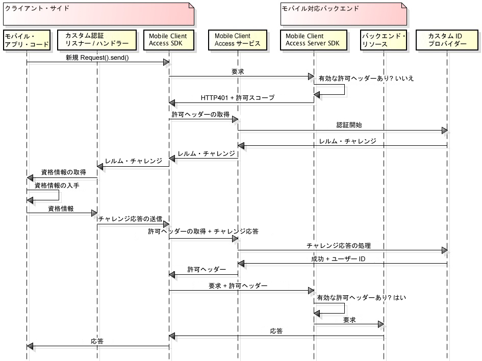

---

copyright:
  years: 2015, 2016

---

# カスタム ID プロバイダーを使用したユーザー認証
{: #custom-id}
カスタム ID プロバイダーを作成し、資格情報の収集と検証のためのユーザー独自のロジックを実装することができます。カスタム ID プロバイダーは、RESTful インターフェースを公開する Web アプリケーションです。オンプレミスまたは {{site.data.keyword.Bluemix}} 上でカスタム ID プロバイダーをホストできます。唯一の要件は、カスタム ID プロバイダーは {{site.data.keyword.amashort}} サービスと対話できるように公開インターネットからアクセス可能でなければならないということです。

## {{site.data.keyword.amashort}} の概要
{: #custom-id-ovr}
以下の図は、{{site.data.keyword.amashort}} がどのようにカスタム ID プロバイダーと統合されるのかを示しています。



1. {{site.data.keyword.amashort}} SDK を使用して、{{site.data.keyword.amashort}} Server SDK によって保護されているバックエンド・リソースへの要求を実行します。
* {{site.data.keyword.amashort}} Server SDK は、無許可の要求を検出し、HTTP 401 と許可スコープを返します。
* {{site.data.keyword.amashort}} Client SDK は、上記の HTTP 401 を自動的に検出し、認証プロセスを開始します。
* {{site.data.keyword.amashort}} Client SDK は、{{site.data.keyword.amashort}} サービスに連絡して許可ヘッダーを発行するよう依頼します。
* {{site.data.keyword.amashort}} サービスは、認証プロセスを開始するためにカスタム ID プロバイダーと通信します。
* カスタム ID プロバイダーは、{{site.data.keyword.amashort}} サービスに認証チャレンジを返します。
* {{site.data.keyword.amashort}} サービスは、その認証チャレンジを {{site.data.keyword.amashort}} Client SDK に返します。
* {{site.data.keyword.amashort}} Client SDK は、ユーザーが作成したカスタム・クラスに認証を委任します。資格情報を収集して {{site.data.keyword.amashort}} Client SDK に提供するのはユーザーの責任です。
* 開発者が資格情報を {{site.data.keyword.amashort}} SDK に提供した後、その資格情報は認証チャレンジ応答として {{site.data.keyword.amashort}} サービスに送信されます。
* {{site.data.keyword.amashort}} サービスは、カスタム ID プロバイダーを使用して認証チャレンジ応答を検証します。
* 検証が成功した場合、{{site.data.keyword.amashort}} サービスは認証ヘッダーを生成し、それを {{site.data.keyword.amashort}} Client SDK に戻します。許可ヘッダーには 2 つのトークンが含まれます。1 つは、アクセス許可情報を含んでいるアクセス・トークンであり、もう 1 つは、現行のユーザー、デバイス、およびアプリケーションについての情報を含んでいる ID トークンです。
* この時点以降、{{site.data.keyword.amashort}} Client SDK で行われたすべての要求は、新しく入手した許可ヘッダーを含むようになります。
* {{site.data.keyword.amashort}} Client SDK は、認証フローをトリガーしたオリジナルの要求を自動的に再送します。
* {{site.data.keyword.amashort}} Server SDK は、要求から許可ヘッダーを抽出し、{{site.data.keyword.amashort}} サービスを使用してそれを検証し、バックエンド・リソースへのアクセスを認可します。

## カスタム ID プロバイダーについての理解
{: #custom-id-about}

カスタム ID プロバイダーを使用して、クライアントに送信されるカスタム認証チャレンジを提供できます。カスタム ID プロバイダーによって、認証フローを完全にカスタマイズできます。

カスタム ID プロバイダーを作成する際、以下を行うことができます。

1. {{site.data.keyword.amashort}} サービスによってモバイル・クライアント・アプリケーションに送信される認証チャレンジをカスタマイズします。認証チャレンジは、任意のカスタム・データを含む JSON オブジェクトです。モバイル・クライアントは、このカスタム・データを使用して認証フローをカスタマイズできます。

カスタム認証チャレンジの例を以下に示します。

	```JavaScript
	{
		status: "challenge",
		challenge: {
			message:"Enter username and password",
			retriesLeft: 2,
			minUsernameLenth: 8
		}
	}
	```

1. マルチステップ認証およびマルチフォーム認証も含めて任意のカスタム資格情報収集フローをモバイル・クライアントに実装します。カスタム認証チャレンジと同様に、カスタム認証チャレンジ応答の構造も設計する必要があります。

モバイル・クライアントによって送信されるカスタム認証チャレンジ応答の例を以下に示します。

	```JavaScript
	{
		username:"bob.smith",
		password:"abcd1234",
		pincode:"1234"
	}
	```
1. 提供された認証チャレンジ応答を検証するカスタム・ロジックを実装します。

1. 必要なカスタム・プロパティーを含むカスタム・ユーザー ID オブジェクトを定義します。認証が成功した後にモバイル・クライアントが取得するカスタム・ユーザー ID オブジェクトの例を以下に示します。

	```JavaScript
	{
		username:"bob.smith",
		displayName:"Bob Smith",
		attributes:{
			age: 30,
			accountNumber: 12345,
			lastLogin: "Sept 1st, 2015"
		}
	}
	```

### カスタム ID プロバイダーのサンプル実装
{: #custom-sample}
カスタム ID プロバイダーを開発する際に参考として使用できる、カスタム ID プロバイダーの Node.js 実装のサンプルを以下に示します。GitHub リポジトリーから、完全なアプリケーション・コードをダウンロードしてください。

 * [簡単なサンプル](https://github.com/ibm-bluemix-mobile-services/bms-mca-custom-identity-provider-sample)
 * [高度なサンプル](https://github.com/ibm-bluemix-mobile-services/bms-mca-custom-identity-provider-with-user-management)
 
## {{site.data.keyword.amashort}} Server とカスタム ID プロバイダーとの間の標準的な通信
{: #custom-id-comm}
1. {{site.data.keyword.amashort}} サービスが `startAuthorization` 要求をカスタム ID プロバイダーに送信します。
1. カスタム ID プロバイダーは、クライアントに送信されるカスタム認証チャレンジとともに応答を返します。
1. {{site.data.keyword.amashort}} サービスは、カスタム ID プロバイダーから受け取ったカスタム認証チャレンジをモバイル・クライアントに送信し、最終的にモバイル・クライアントから認証チャレンジ応答を受け取ります。
1. {{site.data.keyword.amashort}} サービスは、その認証チャレンジ応答とともに `handleChallengeAnswer` 要求をカスタム ID プロバイダーに送信します。
1. カスタム ID プロバイダーは、その認証チャレンジ応答を検証し、ユーザー ID 情報を含む成功応答で応答します。
1. オプションで、カスタム ID プロバイダーは、クライアントからチャレンジ応答を受け取った後に、さらにチャレンジを提供することがあります。複数のチャレンジを送信することは、マルチステップ認証プロセスを可能にします。

## ステートフル vs. ステートレス
{: #custom-id-state}
デフォルトでは、カスタム ID プロバイダーはステートレス・アプリケーションであると見なされます。場合によっては、カスタム ID プロバイダーは認証プロセスに関連した状態を保管する必要があります。ユース・ケース例として、カスタム ID プロバイダーが最初の認証ステップの結果を保管した後でないと次のステップに進むことができない、マルチステップ認証があります。ステートフル機能をサポートするには、カスタム ID プロバイダーが stateID を生成して {{site.data.keyword.amashort}} サービスへの応答に提供する必要があります。{{site.data.keyword.amashort}} サービスは、クライアント認証プロセスに属している後続の要求でその stateID を渡す必要があります。

## カスタム・レルム
{: #custom-id-custom}

カスタム ID プロバイダーは、1 つのカスタム認証レルムをサポートします。着信認証チャレンジを処理するために、モバイル・クライアント・アプリケーションで AuthenticationDelegate / AuthenticationListener のインスタンスを作成して登録します。{{site.data.keyword.amashort}} ダッシュボードでカスタム ID プロバイダーを構成するときに、カスタム認証レルム名を定義します。それを使用して、要求が特定の {{site.data.keyword.amashort}} サービス・インスタンスから着信していることを識別できます。

## 次のステップ
{: #next-steps}
* [カスタム ID プロバイダーの作成](custom-auth-identity-provider.html)
* [カスタム認証用の {{site.data.keyword.amashort}} の構成 ](custom-auth-config-mca.html)
* [Android 用のカスタム認証の構成 ](custom-auth-android.html)
* [iOS 用のカスタム認証の構成 ](custom-auth-ios.html)
* [Cordova 用のカスタム認証の構成 ](custom-auth-cordova.html)
