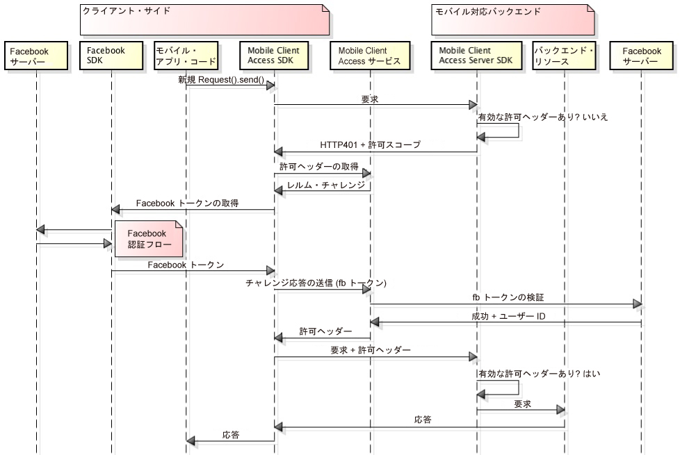

---

copyright:
  years: 2015, 2016

---

# Facebook 資格情報を使用したユーザーの認証
{: #facebook-auth-overview}
Facebook を ID プロバイダーとして使用してリソースを保護するように、{{site.data.keyword.amashort}} サービスを構成できます。モバイル・アプリケーション・ユーザーは、自身の Facebook 資格情報を認証に使用できます。

**重要**: Facebook SDK を別途インストールする必要はありません。Facebook SDK は、{{site.data.keyword.amashort}} Client SDK を構成する際に依存関係マネージャーによって自動的にインストールされます。

## {{site.data.keyword.amashort}} の要求フロー
{: #mca-facebook-sequence}

{{site.data.keyword.amashort}} が認証のためにどのように Facebook と統合するのかを理解するには、下の簡易図を参照してください。

1. {{site.data.keyword.amashort}} SDK を使用して、{{site.data.keyword.amashort}} Server SDK によって保護されているバックエンド・リソースへの要求を実行します。
* {{site.data.keyword.amashort}} Server SDK が無許可の要求を検出し、HTTP 401 コードと許可スコープを返します。
* {{site.data.keyword.amashort}} Client SDK は自動的に HTTP 401 コードを検出し、認証プロセスを開始します。
* {{site.data.keyword.amashort}} Client SDK は {{site.data.keyword.amashort}} サービスに連絡し、認証ヘッダーを送信するよう要求します。
* {{site.data.keyword.amashort}} サービスは、まず認証チャレンジを提供することで、Facebook で認証を行うようクライアントに要求します。
* {{site.data.keyword.amashort}} Client SDK は Facebook SDK を使用して認証プロセスを開始します。認証が成功した後、Facebook SDK は Facebook アクセス・トークンを返します。
* Facebook アクセス・トークンは認証チャレンジ応答とみなされます。このトークンは、{{site.data.keyword.amashort}} サービスに送信されます。
* 当該サービスが Facebook サーバーを使用してこの認証チャレンジ応答を検証します。
* 検証が成功した場合、{{site.data.keyword.amashort}} サービスは認証ヘッダーを生成し、それを {{site.data.keyword.amashort}} Client SDK に戻します。認証ヘッダーには 2 つのトークンが含まれます。アクセス許可情報を含むアクセス・トークンと、現行のユーザー、デバイス、およびアプリケーションについての情報を含む ID トークンです。
* この時点から、{{site.data.keyword.amashort}} Client SDK を介して実行されるすべての要求には、新しく取得した許可ヘッダーが含まれます。
* {{site.data.keyword.amashort}} Client SDK は、認証フローをトリガーしたオリジナルの要求を自動的に再送します。
* {{site.data.keyword.amashort}} Server SDK は要求から認証ヘッダーを抽出し、{{site.data.keyword.amashort}} サービスを使用してそれを検証してから、バックエンド・リソースに対するアクセスを認可します。

## Facebook Application ID を Facebook Developer Portal から取得する
{: #facebook-appID}

Facebook を ID プロバイダーとして使用し始めるには、Facebook Developer Portal でアプリケーションを作成する必要があります。このプロセスにおいて、ユーザーは Facebook Application ID を取得します。この ID は、どのアプリケーションが接続しようとしているのかを Facebook に知らせるための固有 ID です。

1. [Facebook Developer Portal](https://developers.facebook.com) を開きます。

1. トップ・メニューで**「マイ・アプリ」**をクリックして**「新規アプリの作成 (Create a new app)」**を選択します。
iOS アプリケーションと Android アプリケーションの選択肢が提示されたら、いずれかを選んで、次の画面で**「スキップしてアプリ ID を作成 (Skip and Create App ID)」**をクリックします。

1. 任意のアプリケーション表示名を設定し、カテゴリーを選択します。**「アプリ ID の作成 (Create App ID)」**をクリックして先に進みます。

1. 表示される**「アプリ ID (App ID)」**をコピーします。この値が Facebook Application ID です。モバイル・アプリで Facebook 認証を構成する際にこの値が必要になります。

## 次のステップ
{: #next-steps}

* [Android アプリで Facebook 認証を使用可能にする](facebook-auth-android.html)
* [iOS アプリで Facebook 認証を使用可能にする (Swift SDK)](facebook-auth-ios-swift-sdk.html)
* [iOS アプリで Facebook 認証を使用可能にする (Objective-C SDK)](facebook-auth-ios.html)
* [Cordova アプリで Facebook 認証を使用可能にする](facebook-auth-cordova.html)
