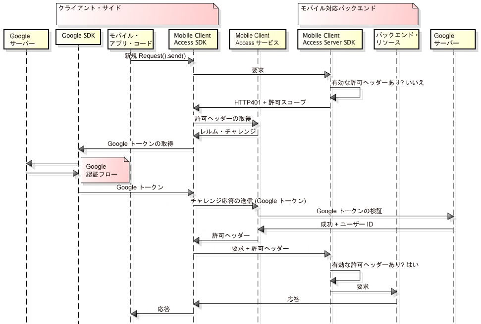

---

copyright:
  years: 2015, 2016
  
---

# Google を使用したユーザーの認証
{: #google-auth}
Google を ID プロバイダーとして使用してリソースを保護するように {{site.data.keyword.amashort}} サービスを構成することができます。それにより、モバイル・アプリケーション・ユーザーは、Google の資格情報を認証に使用できるようになります。

**重要:** Google SDK を別個にインストールする必要はありません。Google SDK は、{{site.data.keyword.amashort}} Client SDK を構成した時に依存関係マネージャーによって自動的にインストールされます。

## {{site.data.keyword.amashort}} のフロー
{: #google-auth-overview}

{{site.data.keyword.amashort}} が認証のための Google との統合をどのように行うかを理解するには、以下の簡素化された図を参照してください。

1. {{site.data.keyword.amashort}} SDK を使用して、{{site.data.keyword.amashort}} Server SDK によって保護されているバックエンド・リソースへの要求を実行します。
* {{site.data.keyword.amashort}} Server SDK は無許可の要求を検出し、HTTP 401 コードと許可範囲を返します。
* {{site.data.keyword.amashort}} Client SDK は自動的に HTTP 401 コードを検出し、認証プロセスを開始します。
* {{site.data.keyword.amashort}} Client SDK は {{site.data.keyword.amashort}} サービスに連絡し、認証ヘッダーを送信するよう要求します。
* {{site.data.keyword.amashort}} サービスは、認証チャレンジを提供して、最初に Google での認証を行うようクライアントに要求します。
* {{site.data.keyword.amashort}} Client SDK は、Google SDK を使用して認証プロセスを開始します。認証が正常に行われると、Google SDK は Google アクセス・トークンを返します。
* Google アクセス・トークンは、認証チャレンジ応答と見なされます。このトークンは、{{site.data.keyword.amashort}} サービスに送信されます。
* サービスは、Google サーバーを使用してその認証チャレンジ応答を検証します。
* 検証が成功した場合、{{site.data.keyword.amashort}} サービスは認証ヘッダーを生成し、それを {{site.data.keyword.amashort}} Client SDK に戻します。許可ヘッダーには、アクセス許可情報を含むアクセス・トークンと、現行のユーザー、デバイス、およびアプリケーションに関する情報を含む ID トークンの、2 つのトークンが含まれています。
* この時点から、{{site.data.keyword.amashort}} Client SDK を介して実行されるすべての要求には、新しく取得した許可ヘッダーが含まれます。
* {{site.data.keyword.amashort}} Client SDK は、認証フローをトリガーしたオリジナルの要求を自動的に再送します。
* {{site.data.keyword.amashort}} Server SDK は、要求から許可ヘッダーを抽出し、それを {{site.data.keyword.amashort}} サービスで検証し、バックエンド・リソースへのアクセス権限を付与します。

## 次のステップ
{: #google-auth-nextsteps}

* [Android アプリでの Google 認証の使用可能化](google-auth-android.html)
* [iOS アプリでの Google 認証の使用可能化](google-auth-ios.html)
* [Cordova アプリでの Google 認証の使用可能化](google-auth-cordova.html)
