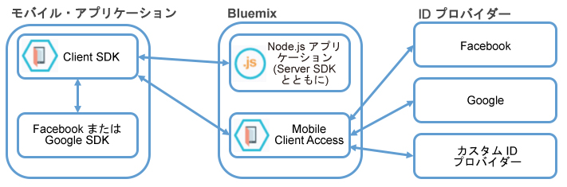

---

copyright:
  years: 2015, 2016

---

# {{site.data.keyword.amashort}} の概要
{: #mca-overview}

{{site.data.keyword.amafull}} サービスは、{{site.data.keyword.Bluemix_notm}} 上でホストされているクラウド・リソースにアクセスするモバイル・アプリケーションの認証サービスおよびモニタリング・サービスを提供します。

{{site.data.keyword.amashort}} サービスを使用すると、{{site.data.keyword.Bluemix_notm}} 上でホストされている Node.js アプリケーションおよび Liberty for Java&trade; アプリケーションをさまざまな認証タイプによって保護できます。モバイル・アプリケーションに {{site.data.keyword.amashort}} SDK を装備することにより、{{site.data.keyword.amashort}} サービスによって提供されている認証機能を使用することができます。モニタリング・ログおよびクライアント・サイド・ログのデータは自動的に収集され、オンデマンドで {{site.data.keyword.amashort}} サービスに送信されます。{{site.data.keyword.amashort}} ダッシュボードを使用して、さまざまな認証タイプを構成し、クライアント・サイド SDK によって収集されるデータを表示します。

**注**: {{site.data.keyword.amashort}} サービスの以前の名称は Advanced Mobile Access でした。

## {{site.data.keyword.amashort}} のコンポーネント
{: #components}

* **{{site.data.keyword.amashort}} ダッシュボード**: さまざまな認証タイプを構成し、モバイル・アプリケーションのパフォーマンス、分析、使用量統計、およびデバイス・ログをモニターします。
* **{{site.data.keyword.amashort}} Client SDK**: {{site.data.keyword.amashort}} の機能を使用するようにモバイル・アプリケーションを装備します。サポートされるプラットフォームは、iOS 8+、Android 4+、および Cordova です。
* **{{site.data.keyword.amashort}} Server SDK**: {{site.data.keyword.Bluemix_notm}} 上でホストされているリソースを保護します。現在サポートされているランタイムは、Node.js と Liberty for Java&trade; です。

## 認証タイプ
{: #authtypes}
モバイル・アプリでは以下の認証タイプを使用できます。
* **Facebook**: Facebook を ID プロバイダーとして使用します。ユーザーは、Facebook の資格情報を使用してモバイル・アプリにログインします。
* **Google**: Google を ID プロバイダーとして使用します。ユーザーは、Google+ の資格情報を使用してモバイル・アプリにログインします。
* **カスタム**: 独自の ID プロバイダーを作成します。ユーザーが、どのような種類の情報を収集し、検証するかを完全に制御します。

## {{site.data.keyword.amashort}} アーキテクチャーの概要
{: #architecture}

* {{site.data.keyword.amashort}} Server SDK を使用してクラウド・リソース (Node.js アプリケーション) を保護します。
* {{site.data.keyword.amashort}} Client SDK によって提供される `Request` クラスを使用して、保護されたクラウド・リソースと通信します。
* {{site.data.keyword.amashort}} Server SDK は、無許可の要求を検出し、HTTP 401 許可チャレンジを返します。
* {{site.data.keyword.amashort}} Client SDK は、HTTP 401 許可チャレンジを検出し、{{site.data.keyword.amashort}} サービスでの認証プロセスを自動的に開始します。
* Facebook、Google、またはカスタムの認証を使用して認証が行われます。
* 認証が正常に行われると、{{site.data.keyword.amashort}} は許可トークンを返します。
* {{site.data.keyword.amashort}} Client SDK はその許可トークンを元の要求に自動的に追加し、要求をクラウド・リソースに再送します。
* {{site.data.keyword.amashort}} Server SDK は、要求から accessToken を抽出し、{{site.data.keyword.amashort}} サービスを使用してそれを検証します。
* アクセスが付与されます。モバイル・アプリケーションに応答が返されます。

## {{site.data.keyword.amashort}} の要求フロー
{: #flow}
以下の図は、SDK からモバイル・バックエンドおよび ID プロバイダーへの要求のフロー方法について説明したものです。

1. {{site.data.keyword.amashort}} SDK を使用して、{{site.data.keyword.amashort}} Server SDK によって保護されているバックエンド・リソースへの要求を実行します。
* {{site.data.keyword.amashort}} Server SDK は無許可の要求を検出し、HTTP 401 と許可範囲を返します。
* {{site.data.keyword.amashort}} Client SDK は自動的に HTTP 401 を検出し、認証プロセスを開始します。
* {{site.data.keyword.amashort}} Client SDK は {{site.data.keyword.amashort}} サービスに連絡し、認証ヘッダーを送信するよう要求します。
* {{site.data.keyword.amashort}} サービスは、現在構成されている認証タイプに従って認証チャレンジを提供して、最初に認証するようクライアント・アプリに要求します。
* {{site.data.keyword.amashort}} Client SDK は次のいずれかを実行します。
   *  **Facebook 認証または Google 認証:** (Facebook 認証または Google 認証の) 認証チャレンジを自動的に処理します。
   * **カスタム認証**: 開発者によって提供されたロジックに基づいて資格情報を取得します。
* Facebook 認証または Google 認証が構成されている場合、{{site.data.keyword.amashort}} Client SDK は、関連付けられた SDK を使用して Facebook または Google のアクセス・トークンを取得します。これらのトークンは、認証チャレンジ応答として機能します。
* カスタム認証が構成されている場合は、開発者が認証チャレンジ応答を取得し、それを {{site.data.keyword.amashort}} Client SDK に提供する必要があります。
* 認証チャレンジ応答が取得されると、{{site.data.keyword.amashort}} サービスに送信されます。
* サービスは、各 ID プロバイダー (Facebook/Google/カスタム) で認証チャレンジ応答を検証します。
* 検証が正常に行われると、{{site.data.keyword.amashort}} サービスは許可ヘッダーを生成し、そのヘッダーを {{site.data.keyword.amashort}} Client SDK に返します。この許可ヘッダーには、アクセス許可情報を含むアクセス・トークンと、現行のユーザー、デバイス、またはアプリケーションに関する情報を含む ID トークンの、2 つのトークンが含まれています。
* この時点から、{{site.data.keyword.amashort}} Client SDK を使用して実行されるすべての要求には、新しく取得した許可ヘッダーが含まれます。
* {{site.data.keyword.amashort}} Client SDK は、認証フローをトリガーしたオリジナルの要求を自動的に再送します。
* {{site.data.keyword.amashort}} Server SDK は、要求から許可ヘッダーを抽出し、そのヘッダーを {{site.data.keyword.amashort}} サービスで検証し、バックエンド・リソースへのアクセス権限を付与します。
