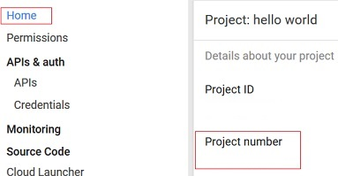

---

copyright:
 years: 2015, 2016

---

{:new_window: target="_blank"}
# Google Cloud Messaging (GCM) の資格情報の構成
{: #create-push-enable-gcm}
最終更新日: 2016 年 8 月 16 日
{: .last-updated}

Google Cloud Messaging (GCM) 資格情報を取得してから、Push ダッシュボード上で{{site.data.keyword.mobilepushshort}}サービスをセットアップします。

##送信側 ID と API キーの取得

API キーは、{{site.data.keyword.mobilepushshort}}サービスが安全に保管し、GCM サーバーに接続するために使用します。送信側 ID (プロジェクト番号) は、クライアント側の Android SDK が使用します。送信側 ID について詳しくは、[Google Cloud Message](https://developers.google.com/cloud-messaging/gcm#arch) を参照してください。

1. Google 開発アカウントを [Google Dev Console](https://console.developers.google.com/start){: new_window} で取得します。Google Cloud Messaging (GCM) について詳しくは、[「Creating a Google API Project (Google API プロジェクトの作成)」](https://developers.google.com/console/help/new/){: new_window} を参照してください。

2. Google Developers Console で、新規プロジェクトを作成します。例えば、「hello world」とします。


3. **「プロジェクト名」**に、プロジェクトの名前を入力し、**「作成」**ボタンをクリックします。
4. **「ホーム」**をクリックして、プロジェクト番号を表示します。
プロジェクト番号を記録してください。



	**注**: プロジェクトを作成すると、プロジェクト番号 (送信側 ID) が作成されます。この番号を使用して、Push ダッシュボードの画面上で Push Notification Service をセットアップします。

5. **「API と認証」**をクリックし、**「Mobile API」**セクションで**「Cloud Messaging for Android」**をクリックします。


6. **「API」**をクリックし、次に**「API を有効にする」**ボタンをクリックして、ご使用のプロジェクトに対する API キーを作成します。


7. **「API と認証」->「資格情報」**画面に移動します。**「認証情報を追加」**をクリックしてから、**「API キー」**をクリックします。


8. **「サーバーキー」**オプションを選び、Bluemix Push ダッシュボードで使用することになる GCM API キーを生成します。
9. **「名前」**フィールドで、サーバー API キーの名前を入力します。


10. **「作成」**ボタンをクリックします。API キーが表示されます。


11. GCM API キーをコピーし、**「OK」**ボタンをクリックします。
Bluemix の Push Notification ダッシュボードの「構成」画面で資格情報を構成するには、プロジェクト番号 (送信側 ID) と API キーが必要になります。 


##Android 用の{{site.data.keyword.mobilepushshort}}サービスのセットアップ

###始めに
{: before-you-begin}

GCM の API キーと送信側 ID (プロジェクト番号) を取得します。 

1. Bluemix ダッシュボードでバックエンド・アプリケーションを開いてから、IBM {{site.data.keyword.mobilepushshort}}サービスをクリックしてダッシュボードを開きます。
 


「Push」ダッシュボードが表示されます。
	

Android 用にアンバインド・{{site.data.keyword.mobilepushshort}}サービスをセットアップするには、アンバインド・{{site.data.keyword.mobilepushshort}}サービスのアイコンを選択して{{site.data.keyword.mobilepushshort}}サービスのダッシュボードを開きます。
 
	

2. **「プッシュのセットアップ (Setup Push)」**ボタンをクリックし、GCM 資格情報を構成します。
1. **「構成」**タブで、**「Google Cloud Messaging」**セクションに移動し、送信側 ID (GCM プロジェクト番号) と API キーを構成します。

4. **「保存」**ボタンをクリックします。 
5. 次のステップ。[Android 用の通知の使用可能化](c_enable_push.html)を行います。


##Android 用のアンバインド・{{site.data.keyword.mobilepushshort}}サービスの作成

###始めに
{: before-you-begin}

{{site.data.keyword.mobilepushshort}}サービス・インスタンスを作成します。バックエンド・アプリケーションにバインドせずに、{{site.data.keyword.mobilepushshort}}サービス・インスタンスを使用することができます。

1. {{site.data.keyword.mobilepushshort}}サービス・インスタンスを Bluemix アプリケーションにバインドします。バインドすると、サービスに関連するすべての詳細が、JSON 形式で VCAP_SERVICES 環境変数に保管されていることを確認できます。 


 
2. **「バインド」**をクリックして、バインドする{{site.data.keyword.mobilepushshort}}サービス・インスタンスを選択します。アプリケーションが{{site.data.keyword.mobilepushshort}}サービスにバインドされると、サービスに関する情報が JSON 形式でアプリの VCAP_SERVICES 環境変数に保管されます。例えば、次のようにします。 

```
{
   "imfpush_Dev": [
   {
     "name": "neekrish_20JulUnbound",
         "label": "imfpush_Dev",
         "plan": "Basic",
         "credentials": null
      }
   ]
}
```
