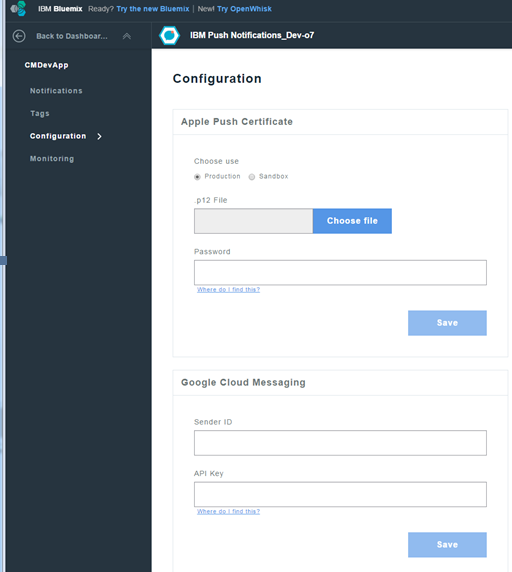

---

copyright:
 years: 2015, 2016

---

{:new_window: target="_blank"}
# Apple Push Notification (APN) の資格情報の構成

{: #create-push-credentials-apns}

Apple Push Notification service (APNs) を使用して、アプリケーション開発者は、Bluemix (プロバイダー) 上のプッシュ・サービス・インスタンスから iOS のデバイスおよびアプリケーションにリモート通知を送信することができます。
メッセージは、デバイス上のターゲット・アプリケーションに送信されます。APNs の資格情報を取得して構成してください。
APNs の証明書は、Push Notification Service によりセキュアに管理され、プロバイダーとしての APNs サーバーへの接続に使用されます。

1. [Apple 開発者](https://developer.apple.com/)アカウントを取得します。
2. [アプリ ID の登録](#create-push-credentials-apns-register)を行います。

3. [開発および配布 APNs SSL 証明書の作成を行います。](#create-push-credentials-apns-ssl)
4. [開発プロビジョニング・プロファイルの作成](#create-push-credentials-dev-profile)を行います。

5. [ストア配布プロビジョニング・プロファイルの作成](#create-push-credentials-apns-distribute_profile)を行います。

6. [Push ダッシュボードで APNs をセットアップ](#create-push-credentials-apns-dashboard)します。

##アプリ ID の登録
{: #create-push-credentials-apns-register}

アプリ ID (バンドル ID) は、特定のアプリケーションを識別する固有の ID です。
各アプリケーションにアプリ ID が必要です。Push Notifications Service のようなサービスが、特定のアプリ ID に対して構成されます。

1. [「Apple Developer (Apple 開発者)」](https://developer.apple.com)ポータルに移動し、**「Member Center (メンバー・センター)」**をクリックして、**「Certificates, Identifiers & Profiles (証明書、ID、およびプロファイル)」**を選択します。
2. [「Apple Developer Library (Apple 開発者ライブラリー)」](https://developer.apple.com/library/mac/documentation/IDEs/Conceptual/AppDistributionGuide/MaintainingProfiles/MaintainingProfiles.html#//apple_ref/doc/uid/TP40012582-CH30-SW991)の**「Registering App IDs (アプリ ID の登録)」**セクションに移動し、説明に従ってアプリ ID を登録します。

	**注**: アプリ ID を登録する際に、以下のオプションを選択します。
	* プッシュ通知

	

	* 「Explicit ID Suffix (明示的 ID サフィックス)」 

	
3. 次のステップ。開発および配布 APNs SSL 証明書の作成を行います。

##開発および配布 APNs SSL 証明書の作成を行います。
{: #create-push-credentials-apns-ssl}

APNs 証明書を取得するには、まず、証明書署名要求 (CSR) を生成して、それを Apple の認証局 (CA) にサブミットしておく必要があります。
CSR には、ユーザーの会社を識別する情報および Apple プッシュ通知に署名するために使用する公開鍵と秘密鍵が含まれます。
次に、iOS 開発者ポータル (iOS Developer Portal) で SSL 証明書を生成します。
証明書は、公開鍵および秘密鍵と共に「キーチェーンアクセス」に保管されます。

**始めに**

[アプリ ID の登録](#create-push-credentials-apns-register)を行います。

APNs は、サンドボックス・モードと実動モードの 2 つのモードで使用できます。

* サンドボックス・モードは、開発中およびテスト中に使用されます。
* 実動モードは、アプリ・ストア (または他のエンタープライズ配布メカニズム) を介してアプリケーションを配布する際に使用されます。

開発環境と配布環境では別々の証明書を取得する必要があります。
証明書は、リモート通知の受信者であるアプリのアプリ ID に関連付けられます。
実動の場合、2 つまで証明書を作成できます。
Bluemix は、その証明書を使用して APNs との SSL 接続を確立します。

開発および配布 SSL 証明書の作成を行います。

1. [「Apple Developer (Apple 開発者)」](https://developer.apple.com)に移動し、**「Member Center (メンバー・センター)」**をクリックして、**「Certificates, Identifiers & Profiles (証明書、ID、およびプロファイル)」**を選択します。
2. **「Identifiers (ID)」**エリアで、**「App IDs (アプリ ID)」**をクリックします。
3. アプリ ID のリストから、新規に作成したアプリ ID を選択し、次に、**「Settings (設定)」**を選択します。
4. **「Push Notifications (プッシュ通知)」**エリアで、開発 SSL 証明書を作成し、次に実動 SSL 証明書を作成します。

 
	

	「About Creating a Certificate a Signing Request (証明書署名要求の作成について)」画面が表示されます。

	

5. Mac で、**「キーチェーンアクセス」**アプリケーションを開始して、証明書署名要求 (CSR) を作成します。

6. **「キーチェーンアクセス」>「証明書アシスタント」>「認証局に証明書を要求…」**を選択します。 
7. **「証明書情報」**で、アプリ開発者アカウントに関連付けられている E メール・アドレスと通称を入力します。
開発 (サンドボックス) または配布 (実動) のいずれの証明書であるかを識別しやすい意味のある名前を指定してください。例えば、**「sandbox_apns_certificate」**あるいは
                            **「production_apns_certificate」**などです。
8. **「ディスクに保存」**を選択し、**「.certSigningRequest」**ファイルをデスクトップにダウンロードしてから、
**「続ける」**をクリックします。
9. **「別名で保存」**で、**「.certSigningRequest」**ファイルに、例えば **sandbox.certSigningRequest** などの名前を付け、次に**「保存」**をクリックします。
10. **「完了」**をクリックします。これで CSR を使用できるようになりました。
11. **「About Creating a Certificate a Siging Request (CSR)(証明書署名要求の作成について)」**で、**「Continue (続ける)」**ボタンをクリックします。 
12. **「Generate (生成)」**画面で、**「Choose File... (ファイルの選択...)」**をクリックして、デスクトップに保存した CSR ファイルを選択します。
次に、**「Generate (生成)」**をクリックします。
	

13. 証明書ができたら、**「Done (完了)」**をクリックします。
14. **「Push Notifications (プッシュ通知)」**画面で、**「Download (ダウンロード)」**をクリックして証明書をダウンロードし、次に**「Done (完了)」**をクリックします。
15. Mac で、**「キーチェーンアクセス」 > 「自分の証明書」**に進み、新規にインストールした証明書を見つけます。証明書をダブルクリックして、それを「キーチェーンアクセス」にインストールします。
16. 「証明書」と「秘密鍵」を選択してから、**「書き出し」**を選択して、個人情報交換形式 (.p12 形式) に証明書を変換します。 

	

17. **「別名で保存」**フィールドで、後で識別できるように証明書に意味のある名前 (例えば、**「sandbox_apns.p12_certifcate」**や**「production_apns.p12」** など) を付け、**「保存」**をクリックします。

   	

18. **「パスワードの入力」**フィールドに、エクスポートする項目を保護するためのパスワードを入力し、**「OK」**をクリックします。このパスワードは、後で Push ダッシュボードで APNs 設定を構成するために使用します。

	
19. **「Key Access.app」**により、**「Keychain」**画面から鍵のエクスポートを求めるプロンプトが出されます。Mac の管理パスワードを入力して、システムによるそれらの項目のエクスポートを許可し、**「常に許可」**オプションを選択します。.p12 証明書がデスクトップ上に生成されます。

##開発プロビジョニング・プロファイルの作成
{: #create-push-credentials-dev-profile}

プロビジョニング・プロファイルは、アプリ ID を使用して機能し、アプリをインストールして実行できるデバイス、およびアプリからアクセスできるサービスを判別します。
各アプリ ID ごとに、2 つのプロビジョニング・プロファイル、すなわち、開発用に 1 つ、配布用にもう 1 つを作成します。
Xcode は、開発プロビジョニング・プロファイルを使用して、アプリケーションのビルドを許可されている開発者と、アプリケーションのテストが許可されているデバイスを判別します。

**始めに**

アプリ ID を登録済みであること、それを Push Notification Service 用に使用可能化していること、および開発および実動の APNs SSL 証明書を使用するように構成済みであることを確認します。

開発プロビジョニング・プロファイルを作成します。

1. [「Apple Developer (Apple 開発者)」](https://developer.apple.com)ポータルに移動し、**「Member Center (メンバー・センター)」**をクリックして、**「Certificates, Identifiers & Profiles (証明書、ID、およびプロファイル)」**を選択します。
2. [「Mac Developer Library (Mac 開発者ライブラリー)」](https://developer.apple.com/library/mac/documentation/IDEs/Conceptual/AppDistributionGuide/MaintainingProfiles/MaintainingProfiles.html#//apple_ref/doc/uid/TP40012582-CH30-SW62site)に移動し、**「Creating Development Provisioning Profiles (開発プロビジョニング・プロファイルの作成)」**セクションにスクロールして、開発プロファイルを作成するための説明に従います。

	**注**: 開発プロビジョン・プロファイルを構成する際に、以下のオプションを選択します。
	* **「iOS App Development (iOS アプリ開発)」**
	* **「For iOS and watchOS apps (iOS アプリおよび watchOS アプリ用)」 **

##ストア配布プロビジョニング・プロファイルの作成
{: #create-push-credentials-apns-distribute_profile}

ストア・プロビジョニング・プロファイルを使用して、ご使用のアプリを配布用にアプリ・ストアにサブミットします。

1. [「Apple Developer (Apple 開発者)」](https://developer.apple.com)ポータルに移動し、**「Member Center (メンバー・センター)」**をクリックして、**「Certificates, Identifiers & Profiles (証明書、ID、およびプロファイル)」**を選択します。
2. ダウンロードしたプロビジョニング・プロファイルをダブルクリックして、Xcode にインストールします。
                    

##Push Notification ダッシュボードでの APNs のセットアップ
{: #create-push-credentials-apns-dashboard}

Push Notification Service を使用して通知を送信するには、Apple Push Notification service (APNs) で必要とされる SSL 証明書をアップロードします。
APNs 証明書のアップロードには、REST API を使用することもできます。

**始めに**

開発および実動の APNS SSL 証明書と、各タイプの証明書に関連付けられたパスワードを取得します。
詳しくは、APNs のプッシュ資格情報の作成および構成を参照してください。

APNs に必要な証明書は、.p12 証明書です。この証明書にはアプリケーションの構築と公開に必要な、秘密鍵と SSL 証明書が含まれています。これらの証明書は、Apple Developer Web サイト (このサイトには有効な Apple Developer アカウントが必要です) の「メンバー・センター」から生成する必要があります。開発環境 (サンドボックス) と実動 (配布) 環境には、別々の証明書が必要です。

**注**: .**cer** がキー・チェーン・アクセスに配置された後に、それをコンピューターにエクスポートして .p12 証明書を作成します。

APNs の使用法について詳しくは、[iOS Developer Library: Local and Push Notification Programming Guide](https://developer.apple.com/library/ios/documentation/NetworkingInternet/Conceptual/RemoteNotificationsPG/Chapters/ProvisioningDevelopment.html#//apple_ref/doc/uid/TP40008194-CH104-SW4) を参照してください。

Push ダッシュボードで APNs をセットアップします。

1. Bluemix ダッシュボードでバックエンド・アプリケーションを開いてから、**「IBM Push Notifications」**サービスをクリックして Push ダッシュボードを開きます。

	

	「Push」ダッシュボードが表示されます。
	
	
1
2. **「構成」**タブで、**「Apple のプッシュ証明書 (Apple Push Certificate)」**セクションに移動し、**「サンドボックス」** (開発) または **「実動」** (配布) を選択して、p.12 証明書を Bluemix にアップロードします。

	
3. **「パスワード」**フィールドに、**.p12** 証明書ファイルに関連付けられているパスワードを入力し、次に**「保存」**をクリックします。有効なパスワードを使用して証明書のアップロードに成功したら、通知の送信を開始できます。

