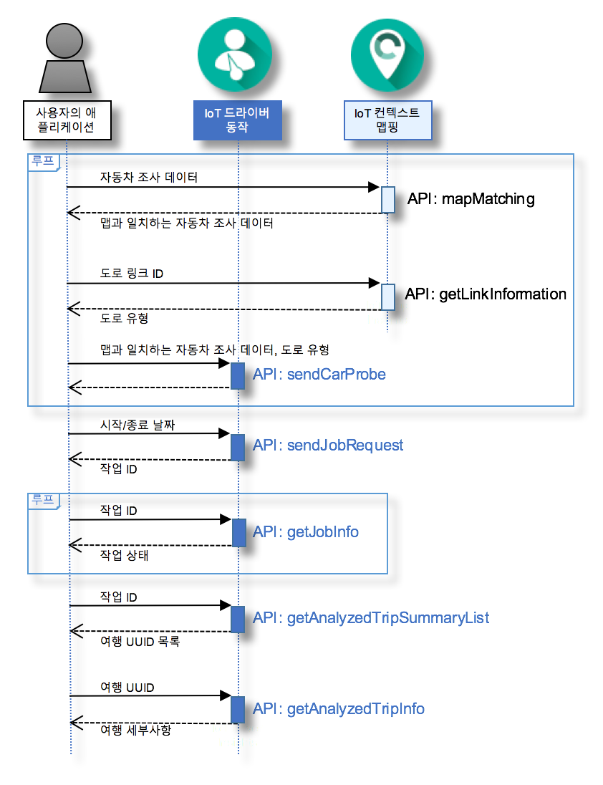

---

copyright:
  years: 2016

---

{:new_window: target="_blank"}
{:shortdesc: .shortdesc}
{:screen: .screen}
{:codeblock: .codeblock}
{:pre: .pre}

# {{site.data.keyword.iotdriverinsights_short}} 시작하기
{: #gettingstartedtemplate}
*마지막 업데이트 날짜: 2016년 5월 13일*

{{site.data.keyword.iotdriverinsights_full}}가 있는 경우, {{site.data.keyword.iotdriverinsights_short}} API를 사용하여 드라이버의 동작에 대해 분석을 실행하여 자동차 조사 데이터 및 컨텍스트 데이터를 수집하고 분석할 수 있습니다.
{:shortdesc}

바인딩되지 않은 서비스 인스턴스를 작성하고 배치한 후에 다음 단계에 따라 사용자의 애플리케이션과 {{site.data.keyword.iotdriverinsights_short}} API를 통합하십시오. 

1. (선택사항) 자동차 조사 데이터를
{{site.data.keyword.iotdriverinsights_short}} API에 전송하기 전에 {{site.data.keyword.iotmapinsights_short}} API를 사용하여 자동차 조사 데이터에 추가 데이터를 추가할 수 있습니다.
     - `mapMatching` API를 사용하여 맵과 일치하는 자동차 조사 데이터를 가져오십시오.
        - [요청] 자동차 조사 데이터
        - [응답] 맵과 일치하는 자동차 조사 데이터
     - `getLinkInformation` API를 사용하여 도로 유형 데이터를 가져오십시오.
        - [요청] 도로 링크 ID
        - [응답] 도로 유형
2. `sendCarProbe` API를 사용하여 저장하고 분석될 수 있도록 자동차 조사 데이터를 전송하십시오.
   - [요청] 맵과 일치하는 자동차 조사 데이터 및 도로 유형
3. `sendJobRequest` API를 사용하여 자동차 조사 데이터를 분석하도록 작업 요청을 전송하십시오.
   - [요청] 시작/종료 날짜
   - [응답] 작업 ID
4. `getJobInfo` API를 사용하여 작업 상태를 확인하십시오.
   - [요청] 작업 ID
   - [응답] 작업 상태
5. `getAnalyzedTripSummaryList` API를 사용하여 분석된 여행 요약 목록을 가져오십시오.
   - [요청] 작업 ID
   - [응답] 분석된 여행 요약의 목록
6. `getAnalyzedTripInfo` API를 사용하여 자세한 분석된 여행 정보를 가져오십시오.
   - [요청] 여행 UUID
   - [응답] 분석된 여행의 세부사항 

다음 시퀀스 다이어그램은 단계의 순서를 표시합니다.

분석된 동작 및 컨텍스트에 대한 세부사항은 [{{site.data.keyword.iotdriverinsights_short}}](iotdriverinsights_overview.html) 정보 주제를 참조하십시오.
샘플 자동차 조사 데이터가 있는 샘플 애플리케이션을 시도하려면 [{{site.data.keyword.iotmapinsights_short}} / {{site.data.keyword.iotdriverinsights_short}} 학습서 파트1](https://github.com/IBM-Bluemix/car-data-management){:new_window}을 사용하십시오.

# 관련 링크
{: #rellinks}
## 학습서 및 샘플
{: #samples}

* [{{site.data.keyword.iotmapinsights_short}} / {{site.data.keyword.iotdriverinsights_short}} 학습서 파트1](https://github.com/IBM-Bluemix/car-data-management){:new_window}
* [{{site.data.keyword.iotmapinsights_short}} / {{site.data.keyword.iotdriverinsights_short}} 학습서 파트2](https://github.com/IBM-Bluemix/map-driver-insights){:new_window}

## API 참조
{: #api}

* [API 문서](http://ibm.biz/IoTDriverBehavior_APIdoc){:new_window}

## 관련 링크
{: #general}

* [{{site.data.keyword.iotmapinsights_short}}](../IotMapInsights/index.html){:new_window} 시작하기
* [{{site.data.keyword.iot_full}}](https://www.ng.bluemix.net/docs/services/IoT/index.html){:new_window} 시작하기
* [IBM developerWorks에 대한 dW 응답](https://developer.ibm.com/answers/topics/iot-driver-behavior){:new_window}
* [스택 오버플로우](http://stackoverflow.com/questions/tagged/iot-driver-behavior){:new_window}
* [Bluemix 서비스의 새로운 기능](http://www.ng.bluemix.net/docs/whatsnew/index.html#services_category){:new_window}

