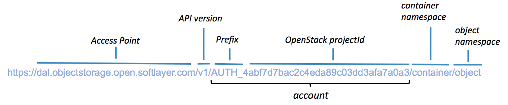

{:new_window: target="_blank"}

# {{site.data.keyword.objectstorageshort}}(베타) 시작하기{: #getting-started-with-object-storage} 

{{site.data.keyword.objectstoragefull}}에서는 데이터를 관리하는 데 필요한 전체 프로비저닝된 Swift {{site.data.keyword.objectstorageshort}} 계정에 대한 액세스를 제공합니다. Swift는 전체 분배된 API 액세스 가능 스토리지 플랫폼을 제공합니다. 이를 직접 애플리케이션에서 사용하거나 백업을 위해 사용하여 비용 효율이 높은 스케일 확장 스토리지를 위해 이상적인 것으로 만들 수 있습니다. 

IBM {{site.data.keyword.objectstorageshort}} for {{site.data.keyword.Bluemix_notm}}에서는 인증에 OpenStack Identity(Keystone)를 사용하며 OpenStack Object Storage(Swift) API v1 호출을 사용하여 직접 액세스할 수 있습니다. IBM {{site.data.keyword.objectstorageshort}}를 {{site.data.keyword.Bluemix_notm}} 애플리케이션에 바인딩하거나 {{site.data.keyword.Bluemix_notm}} 애플리케이션 외부에서 Object Storage에 액세스할 수 있습니다.  

OpenStack Swift와 Keystone 사용에 대한 자세한 정보와 문서는 [OpenStack 문서 사이트](http://docs.openstack.org){: new_window}에서 제공됩니다. 

{{site.data.keyword.objectstorageshort}} 아키텍처 다이어그램은 다음과 같습니다.

[](http://www.stage1.ng.bluemix.net/docs/api/content/services/ObjectStorage/images/object_storage_solution_archectiture.png){: new_window}

*그림 1. {{site.data.keyword.objectstorageshort}} 아키텍처 다이어그램*

**참고:** 제공자 측 암호화는 제공되지 않습니다. 업로드 전에 클라이언트 애플리케이션에서 데이터를 암호화해야 합니다. 

**참고:** {{site.data.keyword.objectstorageshort}} 서비스 베타 플랜은 {{site.data.keyword.Bluemix_notm}} {{site.data.keyword.objectstorageshort}} 서비스의 GA(General Availability) 이후 카탈로그에서 제거됩니다. 유예 기간 이후 베타 플랜을 사용하는 서비스 인스턴스가 제거됩니다. {{site.data.keyword.objectstorageshort}} 서비스를 계속 사용하려면 [가격 책정 플랜 업데이트](#changeplan)를 수행하십시오.  


## {{site.data.keyword.Bluemix_notm}}에서 {{site.data.keyword.objectstorageshort}} 인스턴스 작성 {: #creating-object-storage-instance} 

### {{site.data.keyword.objectstorageshort}} 서비스 인스턴스 작성 방법
1.	{{site.data.keyword.Bluemix_notm}} **카탈로그** 탭으로 이동하여 검색 상자에 **{{site.data.keyword.objectstorageshort}}**를 입력하거나 **서비스**로 이동하여 **스토리지**를 선택하십시오. **{{site.data.keyword.objectstorageshort}}** 서비스를 클릭하십시오.  
2.	영역, 앱, 서비스 이름, 플랜을 선택한 후 **작성**을 클릭하십시오.
**참고:** 초기에 **앱** 필드의 **바인딩되지 않은 상태로 두기** 옵션을 선택하는 경우에는 구성을 완료한 후에도 여전히 서비스 인스턴스를 {{site.data.keyword.Bluemix_notm}} 애플리케이션에 바인딩할 수 있습니다. 다음 지시사항을 수행하십시오. 

## {{site.data.keyword.Bluemix_notm}} 앱에서 {{site.data.keyword.objectstorageshort}} 사용 {: #using-object-storage-from-bluemix-app} 

### 작성 후 {{site.data.keyword.objectstorageshort}} 서비스를 애플리케이션에 바인딩하는 방법 {: #bind-object-storage-to-application} 
1.	{{site.data.keyword.Bluemix_notm}} 대시보드에서 바인딩할 앱을 선택하십시오. 
2.	앱 개요에서 **서비스 또는 API 바인드**를 클릭하십시오. 
3.	서비스 목록에서 {{site.data.keyword.objectstorageshort}} 인스턴스를 선택한 후 **추가**를 클릭하십시오. 
4.	프롬프트되면 **다시 스테이징**을 클릭하십시오. 새 서비스를 사용하려면 앱을 다시 스테이징해야 합니다.

### 바인딩된 컨텍스트

바인딩된 컨텍스트에서 {{site.data.keyword.objectstorageshort}}를 사용하려는 경우 애플리케이션 바인딩 프로세스를 통해 간접적으로 클라우드 신임 정보가 제공됩니다. 서비스 인스턴스를 애플리케이션에 바인딩한 후에는 다음 예제와 비슷한 구성이 `VCAP_SERVICES` 환경 변수에 추가됩니다. 

    {
    "Object-Storage": [
    {
      "name": "Object-Storage - YP",
      "label": "Object-Storage",
      "plan": "Free",
      "credentials": {
         "auth_url": "https://identity.open.softlayer.com",
         "project": "object_storage_d049255b",
         "projectId": "0f47b41b06d047f9aae3b33f1db061ed",
         "region": "dallas",
         "userId": "ad78b2a3f843466988afd077731c61fc",
         "username": "user_202db1f8a7aa3f3ac51ec68f10dbe7dc29070bc7",
         "password": "K/jyIi2jR=1?D.TP",
         "domainId": "2df6373c549e49f8973fb6d22ab18c1a",
         "domainName": "639347"
        }
       }
      ]
    }

## {{site.data.keyword.objectstorageshort}} 사용자 인터페이스 사용 {: #using-object-storage-ui}

### UI 요소 및 탐색
{{site.data.keyword.objectstorageshort}}가 프로비저닝되면 {{site.data.keyword.objectstorageshort}} for {{site.data.keyword.Bluemix_notm}} 서비스 인스턴스 대시보드에서 인스턴스 정보를 볼 수 있습니다. 대시보드에서 {{site.data.keyword.objectstorageshort}} 인스턴스를 선택하여 자세한 정보가 포함된 패널을 표시하십시오.   
#### 사용량 데이터
패널의 맨 위에 인스턴스에 대한 스토리지 사용량 정보가 표시됩니다. 여기에는 현재 **스토리지 컨테이너** 수와 모든 컨테이너에 있는 **오브젝트** 수의 총계도 표시됩니다. 메모리 사용량(메가바이트)이 나열되어 있습니다. **이용된 스토리지**는 현재 사용되는 공간의 크기를 가리킵니다.  
#### 조치
최신 사용 데이터를 검색하려면 **새로 고치기** 단추를 클릭하십시오.    
####오브젝트 브라우저 
패널의 맨 아래 섹션에는 오브젝트 브라우저가 포함되어 있습니다. 오브젝트 브라우저를 사용하여 오브젝트 스토리지 컨테이너 및 오브젝트를 관리하십시오. 사용자는 기타 조치 중에서 컨테이너를 작성하고, 파일을 업로드하고, 컨테이너 및 파일을 삭제할 수 있습니다.

## Swift CLI를 사용하여 {{site.data.keyword.objectstorageshort}}에 액세스 {: #using-swift-cli}

인터넷을 통해, IBM {{site.data.keyword.Bluemix_notm}}의 애플리케이션과 가상 머신에서 {{site.data.keyword.objectstorageshort}} 서비스에 액세스할 수 있습니다. {{site.data.keyword.objectstorageshort}} 서비스의 일반적인 유스 케이스는 다음과 같습니다. 

* 인스턴스에서 볼륨 데이터 백업
* 대량의 데이터를 전송하는 경우 중개 위치로 사용
* 직접 연결되지 않은 환경 간 데이터 전송
* 중앙 저장소 역할 수행

{{site.data.keyword.objectstorageshort}} 서비스는 OpenStack Swift를 기반으로 하며 호환 가능한 클라이언트 애플리케이션을 사용하여 서비스에 액세스할 수 있습니다. 이 절에서는 Python Swift 클라이언트({{site.data.keyword.objectstorageshort}} API와 해당 확장기능의 명령행 인터페이스(CLI))를 사용하여 컨테이너와 파일 관련 작업을 수행하는 방법을 설명합니다. 

### Swift 클라이언트 설치

다음 필수 소프트웨어가 아직 설치되지 않은 경우 이를 설치하십시오. 자세한 정보는 [OpenStack 문서](http://docs.openstack.org/user-guide/common/cli_install_openstack_command_line_clients.html#install-the-prerequisite-software){: new_window}를 참조하십시오.  
* Python 2.7 이상
* 설치 도구 패키지
* pip 패키지

다음과 같이 Python pip를 사용하여 Python Swift 클라이언트를 설치하십시오. 

	sudo pip install python-swiftclient

### 클라이언트 설정

Swift 클라이언트는 다음 환경 변수에서 인증 정보를 가져옵니다. 
* ```OS_AUTH_URL```은 엔드포인트 URL
* ```OS_USER_ID```는 사용자 이름
* ```OS_PASSWORD```는 비밀번호

다음과 같이 인증 정보를 설정하십시오.  

	export OS_USER_ID=24a20b8e4e724f5fa9e7bfdc79ca7e85
	export OS_PASSWORD=aaa55AAAaaaaa]?,
	export OS_PROJECT_ID=383ec90b22ff4ba4a78636f4e989d5b1
	export OS_AUTH_URL=https://identity.open.softlayer.com/v3
	export OS_REGION_NAME=dallas
	export OS_IDENTITY_API_VERSION=3
	export OS_AUTH_VERSION=3

{{site.data.keyword.objectstorageshort}} 사용자 인터페이스의 **서비스 신임 정보** 페이지에 {{site.data.keyword.objectstorageshort}} 서비스의 신임 정보 값이 있습니다.  

**참고:** Swift 클라이언트에 맞게 환경 변수 ```OS_AUTH_URL```을 구성할 때 {{site.data.keyword.objectstorageshort}} 사용자 인터페이스에서 신임 정보의 ```auth_url``에 ```/v3``를 추가하십시오. 


*그림 2. {{site.data.keyword.objectstorageshort}} 서비스 신임 정보*

### 컨테이너에 대한 작업

컨테이너 나열:

	swift list
	
컨테이너 작성:

	swift post <container_name>
	
컨테이너의 컨텐츠 나열:

	swift list <container_name>

### 오브젝트에 대한 작업

#### 컨테이너에 파일 추가

	swift upload <container_name> <file_name>

#### 컨테이너에 5GB를 초과하는 파일 추가

5GB보다 큰 파일을 업로드할 경우 파일을 작은 청크로 분할해야 합니다. ```-segment-size``` 매개변수를 제공하여 Swift 클라이언트에 해당 업로드를 처리하도록 지시할 수 있습니다.

	swift upload <container_name> <file_name> --segment-size <size_in_bytes>
	
각 세그먼트는 개별 컨테이너 ```<container_name>_segments```에 병렬로 업로드됩니다. 모든 세그먼트가 업로드되면 원래 파일 이름 ```<file_name>``을 사용하여 원래 컨테이너 ```<container_name>``에서 하나의 파일에 세그먼트를 다운로드할 수 있도록 Swift가 Manifest 파일을 작성합니다.

예를 들어, 다음 명령은 세그먼트 크기 ```1073741824```로 ```test_container`` 컨테이너에서 ```large_file`` 파일을 업로드합니다.

	swift upload test_container -S 1073741824 large_file

다음 명령을 실행하여 파일을 다운로드할 수 있습니다.

	swift download test_container large_file

#### 파일 다운로드

	swift download <container_name> <file_name>
	
#### 컨테이너에 디렉토리 추가

Swift에는 실제 디렉토리 구조가 없지만 이름을 지정하여 디렉토리 레이아웃을 표시합니다. 컨테이너에 디렉토리를 추가하려면 다음 명령을 실행하십시오.

	swift upload <container_name> <directory_name>
	
이 명령은 전체 디렉토리 구조를 상대 경로로 업로드합니다. 예를 들어, ```/mnt/volume1```을 지정하는 경우 디렉토리 구조 mnt/volume1이 모든 파일 이름에 첨부되어 디렉토리 구조를 표시합니다.

	
#### 디렉토리 다운로드

디렉토리 구조를 다운로드하려면 ```-prefix``` 매개변수를 사용하여 다운로드하려는 디렉토리 또는 디렉토리 구조를 표시하십시오.

	swift download <container_name> --prefix <directory>
	
#### 파일 삭제

	swift delete <container_name> <file_name>

### 임시 URL 작성

임시 URL은 추가 인증할 필요 없이 오브젝트를 다운로드하기 위해 지정된 기간 동안 사용할 수 있는 추측하기 어려운 긴 URL입니다. 다음 단계를 수행하여 임시 URL을 생성하십시오.

1. 인증 계정을 식별하십시오.
2. 비밀 키를 설정하십시오.
3. 임시 URL을 작성하십시오.

#### 인증 계정 식별

Swift ```stat``` 명령은 사용자 계정에 대한 정보를 인쇄합니다.

	swift stat

계정 필드를 찾아 ```AUTH_```를 포함한 *계정*: 뒤의 전체 문자열을 기록해두십시오.

#### 비밀 키 설정

사용자가 선택하는 무엇이든 이 키가 될 수 있지만 우수 사례는 추측하기 어려운 긴 임의의 문자열을 선택하는 것입니다.

	swift post -m "Temp-URL-Key:<key>"

#### 임시 URL 작성

Swift ```tempurl``` 명령은 다음 위치 인수를 사용합니다.

* [method] GET을 사용하여 다운로드하고 PUT을 사용하여 업로드함
* [seconds] 임시 URL을 사용할 수 있는 시간(초)
* [path] /v1/<auth_account>/<container_name>/<object_name>으로 표현되는 오브젝트의 전체 경로
* [key] 2단계에서 설정한 키

```
swift tempurl GET <seconds> <path> <key>
```

이 명령은 전체 URL을 가져오기 위해 클러스터 이름에 추가할 수 있는 URL을 리턴합니다. curl, wget 또는 Firefox와 같은 호환 가능한 HTTP 클라이언트를 사용하여 오브젝트를 다운로드하려면 전체 URL을 사용하십시오.

## Swift REST API를 사용하여 {{site.data.keyword.objectstorageshort}}에 액세스 {: #using-swift-restapi}

명령행 클라이언트 인터페이스(예: cURL)에서 Swift REST API를 사용하거나 애플리케이션에서 API를 호출할 수 있습니다.  

### {{site.data.keyword.objectstorageshort}} URL {: #access-points}

{{site.data.keyword.objectstorageshort}} API와 상호작용하려면 다음과 같이 {{site.data.keyword.objectstorageshort}} URL을 생성하십시오.

	https://<access point>/<API version>/AUTH_<project ID>/<container namespace>/<object namespace>

예: 



*그림 3. {{site.data.keyword.objectstorageshort}} URL*

URL은 다섯 개의 파트로 구성됩니다. ```<API version>```은 v1입니다. {{site.data.keyword.objectstorageshort}}의 ```<project ID>``, ```<container namespace>`` 및 ```<object namespace>``를 {{site.data.keyword.objectstorageshort}} 사용자 인터페이스에서 찾을 수 있습니다. ```<access point>``의 경우 다음 표를 참조하십시오. 


| **지역**  |     **내부 액세스 지점**                             |     **공용 액세스 지점**                   |
|-------------|-----------------------------------------------------------|-----------------------------------------------|
| 달라스      | https://dal.objectstorage.service.open.networklayer.com/  | https://dal.objectstorage.open.softlayer.com/ | 
| 런던        | https://lon.objectstorage.service.open.networklayer.com/  | https://lon.objectstorage.open.softlayer.com/ |


*표 1. {{site.data.keyword.objectstorageshort}} 액세스 지점*

{{site.data.keyword.Bluemix_notm}} 내부에서 {{site.data.keyword.objectstorageshort}} 서비스에 액세스하는 경우 내부 액세스 지점을 사용하고 {{site.data.keyword.Bluemix_notm}} 외부에서 {{site.data.keyword.objectstorageshort}} 서비스에 액세스하는 경우 공용 액세스 지점을 사용하십시오.

### {{site.data.keyword.objectstorageshort}} API

{{site.data.keyword.objectstorageshort}} REST API 옵션과 예제의 전체 목록은 [OpenStack Swift API 전체 참조](http://developer.openstack.org/api-ref-objectstorage-v1.html){: new_window}를 참조하십시오.

## 여러 지역에서 {{site.data.keyword.objectstorageshort}} 사용{: #multi-regions}  

IBM {{site.data.keyword.objectstorageshort}} for {{site.data.keyword.Bluemix_notm}} 서비스에서는 달라스와 런던 스토리지 지역을 지원합니다. 해당 스토리지 지역은 {{site.data.keyword.objectstorageshort}} 서비스 인스턴스가 작성되는 {{site.data.keyword.Bluemix_notm}} 지역(예: 미국 남부와 영국)에 독립적입니다. 예를 들어, {{site.data.keyword.objectstorageshort}} 인스턴스를 미국 남부 {{site.data.keyword.Bluemix_notm}} 지역에서 작성하는 경우 달라스 또는 런던 스토리지 지역에서 데이터를 읽고 쓸 수 있습니다.  

미국 남부 {{site.data.keyword.Bluemix_notm}} 지역의 경우 달라스 스토리지 지역이 기본입니다. 영국 {{site.data.keyword.Bluemix_notm}} 지역의 경우에는 런던 스토리지 지역이 기본입니다. {{site.data.keyword.objectstorageshort}} 사용자 인터페이스는 항상 {{site.data.keyword.Bluemix_notm}} 지역의 기본 스토리지 지역으로 시작합니다. 지역을 전환하려면 {{site.data.keyword.objectstorageshort}} 지역 드롭 다운 목록을 클릭한 후 다른 지역을 선택하십시오.


*그림 4. {{site.data.keyword.objectstorageshort}} 지역 변경*

**참고:** {{site.data.keyword.objectstorageshort}} 서비스는 스토리지 지역 간 복제를 지원하지 않습니다.

### 다중 지역 액세스

{{site.data.keyword.objectstorageshort}} 서비스를 사용하려면 [OpenStack Keystone에 인증](#keystone-authentication)해야 합니다. 인증이 완료되면 응답으로 ```X-Subject-Token``` 엔드포인트와 {{site.data.keyword.objectstorageshort}} 엔드포인트를 사용할 수 있습니다.

예를 들어, 달라스 스토리지 지역에서 ```my_container``` 컨테이너를 작성하려면 다음과 같이 curl 명령에 달라스 액세스 지점을 지정하십시오.

	# curl -i https://dal.objectstorage.open.softlayer.com/v1/AUTH_3c9c89a2edbb458da74a9e81e215da9e/my_container -X PUT -H "Content-Length: 0" -H "X-Auth-Token: gAAAAABWlw5mwttbb_6G3LnTiGusyoOSEHXMG7oTnDYWN1vBZB6XAxUEhz4ehGkdw6Qm_I9ZFFXr8fwcc2KaEbpWbQoglhAvrYTXbrkn8MvErLdnbcT0XK2t5N7lEZyyKQlsgmQWcrch8VOO_OiSKKToORYR7luI-2TrR_JIVZm-8AAS6hLhk9"

	HTTP/1.1 201 Created
	Content-Length: 0
	Content-Type: text/html; charset=UTF-8
	X-Trans-Id: tx4a640ca81c7240ea8f812-00569712fc
	Date: Thu, 14 Jan 2016 03:16:13 GMT


런던 스토리지 지역에서 ```my_container``` 컨테이너를 작성하려면 다음과 같이 curl 명령에 런던 액세스 지점을 지정하십시오.

	# curl -i https://lon.objectstorage.open.softlayer.com/v1/AUTH_3c9c89a2edbb458da74a9e81e215da9e/my_container -X PUT -H "Content-Length: 0" -H "X-Auth-Token: gAAAAABWlw5mwttbb_6G3LnTiGusyoOSEHXMG7oTnDYWN1vBZB6XAxUEhz4ehGkdw6Qm_I9ZFFXr8fwcc2KaEbpWbQoglhAvrYTXbrkn8MvErLdnbcT0XK2t5N7lEZyyKQlsgmQWcrch8VOO_OiSKKToORYR7luI-2TrR_JIVZm-8AAS6hLhk9"

	HTTP/1.1 201 Created
	Content-Length: 0
	Content-Type: text/html; charset=UTF-8
	X-Trans-Id: tx4a640ca81c7240ea8f812-00569712fc
	Date: Thu, 14 Jan 2016 03:16:13 GMT

**참고:** Keystone에서 획득한 ```X-Subject-Token```은 스토리지 지역 간에 작동합니다. 

다른 지역의 액세스 지점에 대한 자세한 정보는 [Object Storage 액세스 지점](#access-points) 표를 참조하십시오.


## 인증 및 신임 정보 이해 {: #understanding-authentication-credentials}

### 애플리케이션을 바인딩하지 않고 {{site.data.keyword.objectstorageshort}} 신임 정보 생성

{{site.data.keyword.Bluemix_notm}} 애플리케이션 외부에서 사용할 {{site.data.keyword.objectstorageshort}} 클라우드 신임 정보를 생성하려면 {{site.data.keyword.objectstorageshort}} 인스턴스의 서비스 키를 생성해야 합니다. 사용자 인터페이스의 사이드바에서 **서비스 신임 정보**를 선택하거나 Cloud Foundry CLI(버전 6.11.3 이상)를 사용하여 새 키를 생성할 수 있습니다. {{site.data.keyword.objectstorageshort}} 인스턴스의 서비스 키를 생성하고 검색한 후에는 클라우드 통합 정보를 통해 OpenStack SDK 또는 OpenStack Identity API를 사용하여 Keystone 토큰을 요청하고 Swift 계정을 사용하여 오브젝트를 관리할 수 있습니다.
   
Cloud Foundry CLI를 사용하여 키를 작성하려면 로그인한 후 다음 명령을 실행하십시오. 
 
    cf create-service-key <object_storage_instance_name> <unique_name_for_this_key>

Cloud Foundry CLI에서 서비스 신임 정보를 검색하려면 다음 명령을 실행하십시오.

	cf service-key <object_storage_instance_name> <unique_name_for_this_key>


### 클라우드 프로젝트 및 사용자
새 {{site.data.keyword.objectstorageshort}} 인스턴스를 프로비저닝하면 IBM 퍼블릭 클라우드에 격리된 Keystone 프로젝트가 작성됩니다. 새 애플리케이션을 {{site.data.keyword.objectstorageshort}} 인스턴스에 바인딩하면 프로젝트에 대한 액세스 권한이 있는 새 Keystone 사용자가 작성됩니다. 인스턴스를 디프로비저닝하면 프로젝트 및 사용자가 삭제됩니다. 

### OpenStack Identity(Keystone) v3 {: #keystone-authentication}
신임 정보 구조는 사용자 애플리케이션에 최적으로 맞는 OpenStack 토큰 요청 메소드 또는 OpenStack SDK를 선택할 수 있는 전체 속성 세트를 포함합니다. 
 
권장되는 v3 토큰 요청은 다음 curl 명령에 표시된 것처럼 https://identity.open.softlayer.com/v3/auth/tokens에 대한 POST 요청입니다.

	curl -i \
	  -H "Content-Type: application/json" \
	  -d '
	{
		"auth": {
			"identity": {
				"methods": [
					"password"
				],
				"password": {
					"user": {
						"id": "ad78b2a3f843466988afd077731c61fc",
						"password": "K/jyIi2jR=1?D.TP"
					}
				}
			},
			"scope": {
				"project": {
					"id": "0f47b41b06d047f9aae3b33f1db061ed"
				}
			}
		}
	}' \
	  https://identity.open.softlayer.com/v3/auth/tokens ; echo

{{site.data.keyword.objectstorageshort}} 서비스에 요청하는 경우 응답 헤더의 ```X-Subject-Token``` 필드 값을 ```X-Auth-Token`` 필드로 사용하십시오.

응답 예는 다음과 같습니다.

	HTTP/1.1 201 Created
	X-Subject-Token: gAAAAABWlw5mwttbb_6G3LnTiGusyoOSEHXMG7oTnDYWN1vBZB6XAxUEhz4ehGkdw6Qm_I9ZFFXr8fwcc2KaEbpWbQoglhAvrYTXbrkn8MvErLdnbcT0XK2t5N7lEZyyKQlsgmQWcrch8VOO_OiSKKToORYR7luI-2TrR_JIVZm-8AAS6hLhk9
	Vary: X-Auth-Token
	Content-Type: application/json
	Content-Length: 960
	Date: Tue, 10 Jun 2014 20:40:14 GMT
	
	{"token": 
	{"audit_ids": ["ECwrVNWbSCqmEgPnu0YCRw"], "methods": ["password"],
	 "roles": [{"id": "c703057be878458588961ce9a0ce686b", "name": "admin"}],
	 "expires_at": "2014-06-10T21:40:14.360795Z", 
	 "project": {"domain": {"id": "default", "name": "Default"}, "id": "3d4c2c82bd5948f0bcab0cf3a7c9b48c", "name": "demo"}, 
	 "catalog": [
	 {
		"endpoints": [
			{
			"adminURL": "https://lon.objectstorage.service.open.networklayer.com/v1/AUTH_35a68d1d115b4a0f8c7975d4f96f256b",
			"id": "20cbfa6ff22b4a67a1484d30235bfc80",
			"internalURL": "https://lon.objectstorage.service.open.networklayer.com/v1/AUTH_35a68d1d115b4a0f8c7975d4f96f256b",
			"publicURL": "https://lon.objectstorage.open.softlayer.com/v1/AUTH_35a68d1d115b4a0f8c7975d4f96f256b",
			"region": "london"
			},
			{
			"adminURL": "https://dal.objectstorage.service.open.networklayer.com/v1/AUTH_35a68d1d115b4a0f8c7975d4f96f256b",
			"id": "4207049680fa4effbecd044c7448a8cb",
			"internalURL": "https://dal.objectstorage.service.open.networklayer.com/v1/AUTH_35a68d1d115b4a0f8c7975d4f96f256b",
			"publicURL": "https://dal.objectstorage.open.softlayer.com/v1/AUTH_35a68d1d115b4a0f8c7975d4f96f256b",
			"region": "dallas"
			}
			],
		"endpoints_links": [],
		"name": "swift",
		"type": "object-store"
		},
	 ], 
	 "extras": {},
	 "user": {"domain": {"id": "default", "name": "Default"}, "id": "3ec3164f750146be97f21559ee4d9c51", "name": "admin"},  "issued_at": "2014-06-10T20:40:14.360822Z"}}


{{site.data.keyword.objectstorageshort}} URL은 서비스 카탈로그에 있습니다. 서비스 카탈로그는 토큰 요청의 응답 본문에 포함되어 있습니다. 응답은 사용 가능한 OpenStack 서비스의 전체 카탈로그입니다. {{site.data.keyword.Bluemix_notm}} 내부에서 {{site.data.keyword.objectstorageshort}} 서비스에 액세스하는 경우 유형이 ```object-store```인 서비스 카탈로그의 엔드포인트, 신임 정보의 지역 필드와 일치하는 지역, 내부 인터페이스(`internalURL`)를 선택하고 {{site.data.keyword.Bluemix_notm}} 외부에서 {{site.data.keyword.objectstorageshort}} 서비스에 액세스하는 경우 공용 인터페이스(`publicURL`)를 선택하십시오.


## {{site.data.keyword.objectstorageshort}} 바인드 해제 및 디프로비저닝{: #deprovisioning-object-storage}

### {{site.data.keyword.objectstorageshort}} 서비스 디프로비저닝 방법
1.	{{site.data.keyword.Bluemix_notm}} 대시보드에서 서비스를 선택하십시오.   
2.	오른쪽 상단에 있는 기어 아이콘을 클릭한 후 **서비스 삭제**를 선택하십시오. 
	
**경고:** IBM {{site.data.keyword.objectstorageshort}} for {{site.data.keyword.Bluemix_notm}} 서비스 인스턴스를 디프로비저닝하면 클라우드 프로젝트와 Swift 계정이 삭제됩니다. 디프로비저닝된 인스턴스의 모든 컨테이너와 오브젝트가 Swift에서 삭제되며 이를 복원할 수 없습니다.

### 애플리케이션 바인드 해제 또는 서비스 키 삭제

{{site.data.keyword.objectstorageshort}} 인스턴스에서 애플리케이션을 바인드 해제하거나 서비스 키를 삭제하면 신임 정보가 삭제됩니다. {{site.data.keyword.objectstorageshort}} 계정은 {{site.data.keyword.objectstorageshort}} 인스턴스가 디프로비저닝될 때까지 삭제되지 않습니다. [새 서비스 키를 리바인드하거나 작성하여](#bind-object-storage-to-application) 새 클라우드 신임 정보를 생성할 수 있습니다.

## FAQ {: #FAQ} 

### 내가 선택하는 플랜에 따라 가격이 어떻게 달라집니까?
가격 책정은 선택된 플랜에 따라 결정합니다. 자세한 가격 책정 정보를 보려면 [IBM Bluemix 가격 책정 시트](https://console.ng.bluemix.net/pricing/){: new_window}를 참조하거나 [계산기](https://console.ng.bluemix.net/?direct=classic/#/pricing/cloudOEPaneId=pricing&paneId=pricingSheet){: new_window}를 사용하여 자세한 추정 금액을 확인하십시오. 

### 내 플랜을 베타에서 표준으로 변경하는 방법은 무엇입니까? {: #changeplan}  
{{site.data.keyword.objectstorageshort}} 서비스 베타 플랜은 {{site.data.keyword.Bluemix_notm}} {{site.data.keyword.objectstorageshort}} 서비스의 GA(General Availability) 이후 카탈로그에서 제거됩니다. 고객 서비스 인스턴스는 베타 플랜에서 표준 플랜으로 자동으로 마이그레이션되지 않습니다. 다음 단계에 따라 플랜을 업데이트해야 합니다. 

1.	{{site.data.keyword.objectstorageshort}} 사용자 인터페이스의 왼쪽 탐색줄에서 **플랜**을 클릭하십시오.
2.	**표준**을 새 플랜으로 선택한 후 **저장**을 클릭하십시오.


*그림 5. {{site.data.keyword.objectstorageshort}} 가격 책정 플랜 변경*

서비스 인스턴스와 고객 데이터가 새 플랜으로 이동합니다.

명령행 인터페이스를 사용하여 유료 플랜도 변경할 수 있습니다. 자세한 정보는 [플랜 변경 방법](../../pricing/index.html#changing)의 내용을 참조하십시오.  

**참고:** 베타 플랜 서비스 인스턴스를 무료 사용제로 이동할 수 없습니다. 마이그레이션되지 않는 서비스 인스턴스는 사용 안함으로 설정되고 60일 후 삭제됩니다. 

### {{site.data.keyword.objectstorageshort}}에 사용할 수 있는 계정과 유료 플랜은 무엇입니까?
{{site.data.keyword.objectstorageshort}} 서비스에는 여러 플랜 옵션이 제공됩니다. IBM의 GA(General Availability) 릴리스의 경우 현재 두 개의 플랜(표준과 무료)이 제공됩니다. {{site.data.keyword.Bluemix_notm}} 유료 계정(종량과금제 또는 구독)과 IBM 내부 사용자만 표준 플랜을 사용할 수 있습니다.

여전히 활성인 평가판 계정에서는 무료 사용제를 사용할 수 있으며 이 사용제는 {{site.data.keyword.Bluemix_notm}} 조직에 하나의 인스턴스만 있도록 허용합니다. {{site.data.keyword.Bluemix_notm}} 평가판 만료 후에는 연관된 {{site.data.keyword.objectstorageshort}} 서비스 인스턴스를 사용할 수 없습니다. 이는 {{site.data.keyword.Bluemix_notm}} 사용자 인터페이스 또는 명령행에서 스토리지 계정에 액세스할 수 없음을 의미합니다. 30일의 유예 기간 이후 {{site.data.keyword.Bluemix_notm}} 계정은 영구 제거되고 모든 데이터는 삭제됩니다. 데이터가 손실되지 않게 하려면 가능한한 빨리 {{site.data.keyword.Bluemix_notm}} 유료 계정으로 업그레이드하는 것이 좋습니다. 계정을 업그레이드하기 위해 오른쪽 위에 있는 사용자 관리 메뉴를 클릭하고 **계정**을 선택하면 업그레이드 프로세스에 대한 지시사항이 제공됩니다.

[내 사용제를 베타에서 표준으로 변경하는 방법은 무엇입니까?](#changeplan)에 설명되어 있는 단계에 따라 무료 사용제에서 작성한 인스턴스를 표준 플랜으로 업그레이드할 수 있습니다. 표준 플랜으로 업그레이드하려면 연관된 조직이 {{site.data.keyword.Bluemix_notm}} 유료 계정이어야 합니다. {{site.data.keyword.objectstorageshort}} 인스턴스가 있는 평가판 계정을 표준 플랜으로 업그레이드할 수 없으며 표준 플랜의 인스턴스를 기타 플랜으로 다운그레이드할 수 없습니다.

### {{site.data.keyword.objectstorageshort}} 사용 대금 산정 및 청구 방법

{{site.data.keyword.objectstorageshort}} 서비스는 사용량에 대해서만 대금을 청구합니다. 서비스 사용을 시작하는 최소 요금, 설정 요금 또는 약정이 없습니다. API 요청 또는 인바운드 데이터 네트워크 트래픽에 대한 요금은 청구되지 않습니다.

{{site.data.keyword.objectstorageshort}} 사용량은 비용 청구 주기 동안 평균 매일 스토리지 사용량을 기반으로 요금을 청구합니다. 여기에는 {{site.data.keyword.Bluemix_notm}} 조직 계정으로 작성한 컨테이너의 모든 오브젝트 데이터가 포함됩니다. 

공용 네트워크를 통해 오브젝트 컨테이너에서 데이터를 읽을 때마다 아웃바운드 데이터 전송 요금이 적용됩니다. 비용 청구 주기 동안 평균 매일 공용 아웃바운드 데이터를 기반으로 요금을 청구합니다.

{{site.data.keyword.objectstorageshort}} 가격 책정의 메트릭 컴포넌트는 다음과 같습니다.
* 스토리지 사용량  - 월별 GB당 $0.04
* 공용 아웃바운드 데이터 전송  - 월별 GB당 $0.09 

대금 청구 주기 종료 시, {{site.data.keyword.Bluemix_notm}}에서 현재 대금 청구 주기 동안 사용한 양에 대한 비용을 자동으로 청구합니다. {{site.data.keyword.Bluemix_notm}} 보고를 통해 현재 비용 청구 주기에 대해 청구된 대금을 볼 수 있습니다.

런던과 달라스용으로 릴리스된 표준 서비스 플랜의 가격 책정은 동일합니다.

### {{site.data.keyword.objectstorageshort}}에서 데이터 복제 수행 방법
{{site.data.keyword.objectstorageshort}} 서비스에서는 여러 스토리지 노드에 복제되는 데이터의 사본 3개를 유지보수합니다. 자세한 정보는 [OpenStack Swift Replication](http://docs.openstack.org/developer/swift/overview_replication.html){: new_window} 문서를 참조하십시오. 

># 관련 링크 {:class="linklist"}
>## API 참조 {:id="api"}
>* [OpenStack Object Storage(Swift) API v1](http://developer.openstack.org/api-ref-objectstorage-v1.html){: new_window}
>* [OpenStack Identity(Keystone) API v3.0](http://developer.openstack.org/api-ref-identity-v3.html){: new_window}
>
># 관련 링크 {:class="linklist"}
>## SDK {:id="sdk"}
>* [OpenStack SDK(Software Development Kits)](https://wiki.openstack.org/wiki/SDKs){: new_window}
>
># 관련 링크 {:class="linklist"}
>## 학습서 및 샘플{:id="samples"}
>* [Java를 사용하여 IBM Object Storage for Bluemix에 연결](https://developer.ibm.com/recipes/tutorials/connecting-to-ibm-object-storage-for-bluemix-with-java/){: new_window}
>* [Python을 사용하여 Bluemix Object Storage에 액세스](https://developer.ibm.com/recipes/tutorials/use-python-to-access-your-bluemix-object-storage/){: new_window}
>* [Bluemix Object Storage Community](https://www.ibm.com/developerworks/community/groups/service/html/communityoverview?communityUuid=1b48459f-4091-43cb-bca4-37863606d989){: new_window}
>
># 관련 링크 {:class="linklist"}
>## 호환 가능 런타임 {:id="buildpacks"}
>* [Liberty for Java](https://www.ng.bluemix.net/docs/starters/liberty/index.html){: new_window}
>* [Node.js용 SDK](https://www.ng.bluemix.net/docs/starters/nodejs/index.html){: new_window}
>* [이동](https://www.ng.bluemix.net/docs/starters/go/index.html){: new_window}
>* [PHP](https://www.ng.bluemix.net/docs/starters/php/index.html){: new_window}
>* [Python](https://www.ng.bluemix.net/docs/starters/python/index.html){: new_window}
>* [Ruby](https://www.ng.bluemix.net/docs/starters/rails/index.html){: new_window}
>* [커뮤니티 빌드팩](https://www.ng.bluemix.net/docs/starters/byob.html){: new_window}
>
># 관련 링크 {:class="linklist"}
>## 관련 링크 {:id="general"}
>* [IBM Bluemix 가격 책정 시트](https://www.ng.bluemix.net/#/pricing){: new_window}
>* [IBM Bluemix Prerequisites](https://developer.ibm.com/bluemix/support/#prereqs){: new_window}
>
>{:elementKind="article" id="rellinks"}
