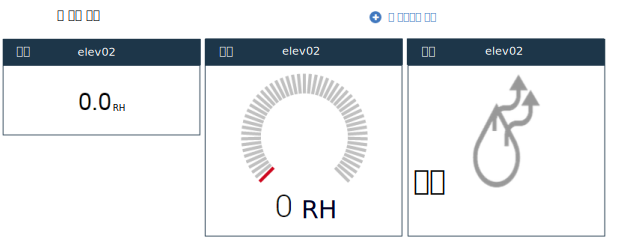

---

copyright:
  years: 2015,2016

---

{:shortdesc: .shortdesc}

# 대시보드 및 템플리트 관리 {: #managing-dashboards}

IoT 디바이스의 실시간 데이터가 사용자 정의 가능한 대시보드에 표시됩니다. 하나 이상의 디바이스에 대한 실시간 메트릭, 그래프, 기타 정보를 표시하는 대시보드를 수동으로 작성할 수 있습니다. 대시보드는 또한 다른 대시보드에 대한 링크와 디바이스의 필터링된 목록을 포함할 수 있습니다.
{: shortdesc}

수동으로 작성된 대시보드 외에, {{site.data.keyword.iotrtinsights_short}}는 **대시보드 > 개요**에서 사전 정의된 디바이스 경보 대시보드를 제공하며 사용자가 작성한 메시지 스키마를 기초로 디바이스 대시보드를 동적으로 작성합니다. 

## 대시보드 {: #dashboards}

관리자는 관심이 있는 디바이스 데이터를 표시하기 위해 새 대시보드를 작성하고 기존 대시보드를 수정할 수 있습니다.  
대시보드를 작성하려면 다음을 수행하십시오.
1.	**대시보드 > 대시보드 찾아보기**로 이동하십시오. 
2.	**새 대시보드 추가**를 클릭하십시오.
3.	대시보드에 이름을 지정하고 아이콘 및 배경과 같은 속성을 선택하십시오.또한 이 {{site.data.keyword.iotrtinsights_short}} 운영자가 이 대시보드를 편집할 수 있게 할지를 선택하십시오. 
4.	을 클릭하십시오. 
5.	비어 있는 대시보드를 열려면 새 대시보드 타일을 클릭하십시오. 
6.	대시보드에 위젯을 추가하려면 다음을 수행하십시오.   
 1.	**새 컴포넌트 추가**를 클릭하여 초기 대시보드 위젯을 추가하십시오. 
 2.	추가할 컴포넌트를 선택하고 추가 컴포넌트 속성을 선택한 다음 필요하면 표시 특성을 선택하십시오.
 예를 들어 디바이스에 대한 특정 데이터 포인트의 숫자 값을 표시하려면 `디바이스`를 선택하고 추가할 디바이스를 선택하십시오. 대시보드 편집기의 시각화 아래에서 표시할 데이터 포인트를 선택하십시오. 그런 다음 대시보드 그리드에 새롭게 추가한 위젯을 놓으십시오. 
 3.	을 클릭하여 대시보드에 위젯을 추가하십시오. 
7.	대시보드가 새로 추가된 위젯으로 업데이트되고 선택한 데이터 포인트로 정의된 실시간 데이터가 표시됩니다.

>**팁:** 디바이스 전체를 나열하는 대시보드를 작성하려면 다음을 수행하십시오.  
1. **대시보드 > 대시보드 찾아보기**로 이동하여 **새 대시보드 추가**를 클릭하십시오. 
2. 대시보드에 설명식 이름(예: `모든 디바이스`)을 제공하고 을 클릭하십시오.
3. 대시보드 패널에서 대시보드를 클릭하고 **새 컴포넌트 추가**를 클릭하십시오.
4. **컨테이너** 컴포넌트를 선택하고 **필터링된 디바이스**를 선택하여 사용자의 모든 디바이스의 목록을 작성하십시오. 
5. 을 클릭하십시오.   

>사용자의 디바이스가 새 대시보드에 나열됩니다. 디바이스 아이콘을 클릭하여 디바이스 대시보드를 열고 디바이스에 대한 실시간 데이터를 보십시오.

### 대시보드 위젯 {: #dashboard-widgets}
대시보드는 하나 이상의 디바이스에서 실시간 데이터를 표시하는 위젯으로 구성됩니다.위젯의 동작은 유형, 표시되는 데이터 포인트, 스키마에서 데이터 포인트가 구성된 방식에 따라 달라집니다.   
예를 들어 '원시' 데이터 포인트에 대해 디바이스 위젯을 추가한 경우 위젯은 문자열로만 원시 데이터를 표시합니다.

하지만 최소 및 최대 값으로 데이터 포인트를 구성하는 경우, 위젯을 게이지로 표시할 수 있는 옵션을 갖게 됩니다. 

표시되는 센서 데이터의 유형을 더 잘 나타내기 위해 특수 유형의 시각화 위젯을 사용하도록 데이터 포인트에 대한 센서 유형을 지정할 수도 있습니다. 예를 들어 센서 유형 `전등 켜기/끄기`를 선택하여 `일반 전등 표시기(켜기/끄기)` 시각화 위젯을 사용으로 설정할 수 있습니다. 

동일한 대시보드에 동일한 데이터 포인트에 대한 여러 개의 위젯을 포함시켜 원시 숫자 값 및 습도를 나란히 표시하는 옵션도 있습니다.   
*동일한 데이터 포인트에 대한 3개의 시각화 옵션*

위젯 | 유형 및 시각화
------------- | -------------
디바이스 | 데이터 - 디바이스에 대한 데이터 포인트의 실시간 값입니다. 데이터 포인트가 최소 및 최대 값을 포함하도록 구성된 경우 게이지로 데이터 포인트를 표시하는 시각화 옵션이 포함됩니다. 또한, 데이터 포인트가 센서 유형으로 구성되면 추가 시각화 옵션도 사용 가능합니다.
차트 | 그래프 - 하나 이상의 디바이스에 대한 데이터 포인트의 실시간 값을 그립니다.
대시보드 | 대시보드 또는 템플리트에 연결합니다.
텍스트 | 텍스트 상자 - 형식화된 텍스트입니다.
컨테이너 | 컨테이너 위젯의 유형:<ul><li>모든 대시보드 – 모든 대시보드의 링크된 목록입니다. </li><li>필터링된 디바이스 - 모든 디바이스 또는 이름 또는 위치로 필터링된 디바이스의 목록입니다.</li><li>경보로 필터링된 디바이스 - 경보가 있는 모든 디바이스 또는 이름이나 위치로 필터링된 디바이스의 목록입니다.</li><li>디바이스에 대한 경보 – 경보로 필터링된 디바이스 컨테이너에서 선택된 디바이스에 대한 경보의 목록입니다. </li></ul>
특수 | 특수 위젯의 유형:<ul><li>맵 – 선택한 디바이스를 찾는 맵입니다.</li><li>추가 디바이스 정보 - 선택한 디바이스에 대한 추가 정보입니다.</li></ul>

다음 표는 선택한 데이터 포인트가 메시지 스키마에서 센서 유형 속성으로 구성된 경우, 디바이스 위젯에서 사용 가능한 시각화 옵션을 요약합니다.

데이터 포인트 센서 유형 | 시각화 옵션 | 세부사항 | 지원되는 데이터 유형
------------- | ------------- | -------------
선택 없음 | 일반 값 | - | String/Integer/Float
전등 켜기/끄기 | 일반 전등 표시기(켜기/끄기) | 0=끄기 | Integer
스위치 켜기/끄기 | 일반 스위치 표시기(켜기/끄기) | 0=끄기 | Integer
온도 센서 | 일반 온도 게이지 | 해당사항 없음 | Integer/Float
온도 제어 | 일반 온도 게이지 | 해당사항 없음 | Integer/Float
압력 센서 | 일반 압력 게이지 | 해당사항 없음 | Integer/Float
배터리 레벨 | 기본 배터리 위젯(낮음/높음) | 0=양호 | Integer
밝기 | 밝기 표시기(어두움/밝음) | 0=어두움 | Integer
창 열기/닫기 | 기본 창 상태(열림/닫힘) | 0=닫힘 | Integer
문 열기/닫기 | 기본 문 상태(열림/닫힘) | 0=닫힘 | Integer
습도 센서 | 습도 상태(건조/습함) | 0=건조 | Integer
소비전력 | 일반 전력 게이지 | 해당사항 없음 | Integer/Float
에너지 미터 | 일반 값 | 해당사항 없음 | Integer/Float
백분율 | 일반 백분율(0-100) | 해당사항 없음 | Integer/Float
전압 | 일반 전압 게이지 | 해당사항 없음 | Integer/Float
전류 | 일반 전류 게이지 | 해당사항 없음 | Integer/Float
경도 | 특수 > 맵 위젯(위도 위젯도 필요함)의 디바이스 위치 | **중요:** 경도 값에 사용되는 데이터 포인트는 메시지 스키마에서 경도 센서 유형에 지정되어야 합니다. | Float
위도 | 특수 > 맵 위젯(경도 위젯도 필요함)의 디바이스 위치 | **중요:** 위도 값에 사용되는 데이터 포인트는 메시지 스키마에서 위도 센서 유형에 지정되어야 합니다. | Float  

## 기본 대시보드 레이아웃
{{site.data.keyword.iotrtinsights_short}}는 사전 정의된 대시보드인 경보 대시보드와 디바이스 대시보드를 제공합니다.

다음 표에서는 사전 정의된 대시보드의 위젯과 레이아웃을 설명합니다.
### 경보 대시보드(대시보드 > 개요)
이 대시보드는 제품에 포함되어 있으며 경보가 열린 디바이스 목록을 제공합니다. 경보에 대한 세부사항을 볼 디바이스를 선택할 수 있으며 디바이스 아이콘을 클릭하여 디바이스 대시보드를 열고 디바이스에 대한 실시간 데이터를 표시할 수 있습니다.

<table>
<thead>
<tr>
<th colspan="3">경보 대시보드</th>
</tr>
</thead>
<tbody>
<tr>
<td style="width:30%">컨테이너: 경보가 있는 디바이스</td>
<td style="width:30%">컨테이너: 디바이스에 대한 경보</td>
<td style="width:30%">특수: 추가 디바이스 정보</td>
</tr>
<tr>
<td style="width:30%"></td>
<td style="width:30%"></td>
<td style="width:30%">특수: 맵</td>
</tr>
</tbody>
</table>

*경보 대시보드 레이아웃*

### 디바이스 대시보드
디바이스 목록의 디바이스 아이콘을 클릭하면 디바이스에 대한 디바이스 대시보드가 열립니다. 데이터 포인트가 메시지 스키마에 추가되면 이는 또한 디바이스 템플리트의 위젯으로도 추가되며 동적으로 디바이스 대시보드를 작성합니다. 관리자는 수동으로 위젯을 추가하거나 제거할 수 있습니다.

<table>
<thead>
<tr>
<th colspan="3">디바이스 대시보드</th>
</tr>
</thead>
<tbody>
<tr>
<td style="width:30%">디바이스: 데이터 포인트 1</td>
<td style="width:30%">디바이스: 데이터 포인트 2</td>
<td style="width:30%">디바이스: 데이터 포인트 3</td>
</tr>
<tr>
<td style="width:30%">디바이스: 데이터 포인트 N</td>
<td style="width:30%"></td>
<td style="width:30%"></td>
</tr>
</tbody>
</table>

*사전 정의된 디바이스 대시보드 레이아웃*

### 대시보드 예제: 모든 디바이스 목록
다음 대시보드는 모든 디바이스 목록을 포함하고, 목록에서 디바이스를 선택할 때 디바이스 정보를 제공합니다.

<table>
<thead>
<tr>
<th colspan="3">모든 디바이스 목록 대시보드</th>
</tr>
</thead>
<tbody>
<tr>
<td style="width:30%">컨테이너: 필터링된 디바이스(필터링 매개변수 세트 없음)</td>
<td style="width:30%">특수: 추가 디바이스 정보</td>
<td style="width:30%"></td>
</tr>
</tbody>
</table>

*모든 디바이스 목록 대시보드 레이아웃*

## 템플리트 {: #templates}
템플리트는 특정 디바이스 유형에 대한 사전 정의된 대시보드 레이아웃을 제어합니다. 관리자는 사용자 요구사항에 맞게 이러한 사전 정의된 템플리트를 수정할 수 있습니다. 예를 들어, 사전 정의된 템플리트는 일반 데이터 포인트만 포함합니다. 필요에 따라 그래프 및 기타 컴포넌트를 추가할 수 있습니다.

예를 들어, 사용자가 사전 정의된 디바이스 대시보드에 액세스하여 기본 디바이스 데이터를 본 후, 완전한 세트의 실시간 그래프를 포함하는 수동으로 작성된 템플리트 링크로 이동할 수 있습니다. 대시보드를 작성하는 방법과 매우 유사하게 템플리트를 작성합니다.   

사전 정의된 템플리트를 수정하려면 다음을 수행하십시오.
1.	**대시보드 > 템플리트 관리**로 이동하십시오.
2.	템플리트 관리 패널에서 템플리트 타일을 찾고 ** > 레이아웃 변경**을 클릭하여 편집을 위해 템플리트를 여십시오.   
3.	위젯을 템플리트에 추가하십시오.
 1.	**새 템플리트 컴포넌트 추가**를 클릭하여 초기 템플리트 위젯을 추가하십시오.
 2.	추가할 컴포넌트를 선택하고 추가 컴포넌트 속성을 선택한 다음 필요하면 표시 특성을 선택하십시오.  
 3.	을 클릭하여 템플리트에 위젯을 추가하십시오. 
4.	기존 위젯을 편집하십시오. 
 1.	템플리트 위젯 위에 마우스를 올려놓고 을 클릭하십시오.
 2.	컴포넌트와 속성을 수정하고 필요에 따라 위젯의 위치를 변경하십시오. 
 3.	을 클릭하여 위젯을 업데이트하십시오.   

변경사항으로 템플리트가 업데이트됩니다. 

<!-- Administrators can also manually add templates for specific device types. These templates can then be linked to from the predefined templates.  -->

<!-- To create a template:
1.	Go to **Dashboards > Manage templates**.
2.	Click **Add new template**.
3.	Give the template a name, select a device type and attributes such as icon and background.
4.	Click .
5.	The empty template opens.
6.	Add widgets to the template.  
For a list of widgets, see below.
 1.	Click **Add new component** to add an initial template widget.
 2.	Select a component to add, then select further component attributes and, if needed, select display properties.
 For example, ... Then position the newly added widget in the dashboard grid.
 3.	Click  to add the widget to the template.
7.	The template updates with the newly added widgets.

### Template widgets
Widget | Type and visualization
------------- | -------------
Device | Data - Real-time value of data points for the device. For a description of the available widget options, see [Dashboard widgets](#dashboard-widgets "Dashboard widgets") above.
Chart | Graph - Plot real-time values of data points for one or more devices.
Dashboard | Link to a dashboard or a template.
Text | Text box - Formatted text
Container | Types of containers:<ul><li>All dashboards – A linked list of all dashboards</li><li>Filtered devices – A list of all devices, or filtered by name or location</li><li>Filtered devices with alerts – A list of all devices with alerts, or filtered by name or location</li><li>Alerts for device – A list of alerts for a device that is selected in a Filtered devices with alerts container</li></ul>
Special | Types of special:<ul><li>Map – A map that locates the selected device</li><li>Additional device information – More information about the selected device</li></ul>

### Template example: Selected set of graphs
One way of using device templates is to expand on the predefined device template by creating specialized templates for a device type, and then linking these from the predefined template by using a Dashboard widget.

<table>
<thead>
<tr>
<th colspan="3">Descriptive graphs template</th>
</tr>
</thead>
<tbody>
<tr>
<td style="width:30%">Device: ID</td>
<td style="width:30%">Graph: One data point</td>
<td style="width:30%">Graph: Another data point</td>
</tr>
<tr>
<td style="width:30%">Special: Additional device information</td>
<td style="width:30%">Text: Short description of how to  interpret the device data in the graphs.</td>
<td></td>
</tr>
</tbody>
</table>

*Descriptive graphs template*

Link to this template from a predefined device template:

<table>
<thead>
<tr>
<th colspan="3">Predefined device dashboard layout with link to template</th>
</tr>
</thead>
<tbody>
<tr>
<td style="width:30%">Device: Datapoint 1</td>
<td style="width:30%">Device: Datapoint 2</td>
<td style="width:30%">Device: Datapoint 3</td>
</tr>
<tr>
<td style="width:30%">Device: Datapoint N</td>
<td style="width:30%"><b>Dashboard: Descriptive graphs template</b></td>
<td style="width:30%"></td>
</tr>
</tbody>
</table>

*Predefined device dashboard layout with link to template* -->

## 사전 정의된 대시보드 및 템플리트 재설정 {: #resetting-dashboards}
사전 정의된 템플리트를 수정하면 템플리트가 더 이상 동적으로 메시지 스키마 업데이트에서 업데이트되지 않으며 원래 위젯이나 위젯을 복원하려면 대시보드 또는 템플리트를 재설정해야 합니다.
사전 정의된 대시보드와 템플리트를 재설정하려면 다음을 수행하십시오.
1.	**대시보드 > 템플리트 관리** 또는 **대시보드 > 대시보드 찾아보기**로 이동하십시오. 
2.	사전 정의된 템플리트 또는 대시보드 타일을 찾고 ** > 레이아웃 재설정**을 클릭하여 템플리트를 삭제하고 다시 작성하십시오.   

템플리트 또는 대시보드가 기본 위젯 설정으로 다시 작성됩니다. 
