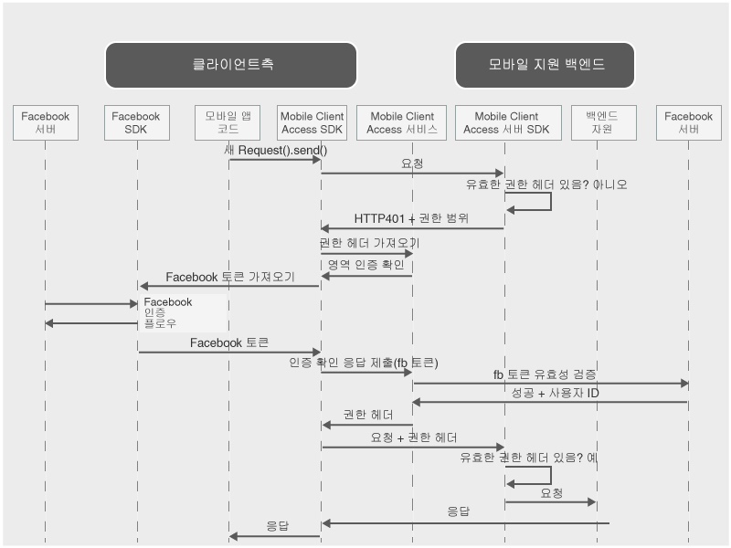

---

copyright:
  years: 2015, 2016

---

# Facebook 신임 정보로 사용자 인증
{: #facebook-auth-overview}
ID 제공자로 Facebook을 사용하여 자원을 보호하도록 {{site.data.keyword.amashort}} 서비스를 구성할 수 있습니다. 모바일 애플리케이션 사용자는 인증을 위해 Facebook 신임 정보를 사용할 수 있습니다. 

**중요**: Facebook SDK를 개별적으로 설치할 필요가 없습니다. {{site.data.keyword.amashort}} 클라이언트 SDK를 구성할 때 종속 항목 관리자가 Facebook SDK를 자동으로 설치합니다. 

## {{site.data.keyword.amashort}} 요청 플로우
{: #mca-facebook-sequence}

인증을 위해 {{site.data.keyword.amashort}}가 Facebook을 사용하여 통합하는 방법을 이해하려면 간소화된 다음 다이어그램을 참조하십시오. 

1. {{site.data.keyword.amashort}} SDK를 사용하여 {{site.data.keyword.amashort}} 서버 SDK로 보호되는 백엔드 자원에 대한 요청을 작성하십시오. 
* {{site.data.keyword.amashort}} 서버 SDK가 권한이 없는 요청을 발견하고 HTTP 401 코드 및 권한 범위를 리턴합니다. 
* 자동으로 {{site.data.keyword.amashort}} 클라이언트 SDK가 HTTP 401 코드를 발견하고 인증 프로세스를 시작합니다. 
* {{site.data.keyword.amashort}} 클라이언트 SDK가 {{site.data.keyword.amashort}} 서비스에 연결하여 권한 헤더를 발행하도록 요청합니다. 
* {{site.data.keyword.amashort}} 서비스는 인증 확인 방식을 제공함으로써 Facebook을 사용하여 먼저 인증하도록 클라이언트에 요청합니다. 
* {{site.data.keyword.amashort}} 클라이언트 SDK가 Facebook SDK를 사용하여 인증 프로세스를 시작합니다. 인증에 성공하면 Facebook SDK는 Facebook 액세스 토큰을 리턴합니다. 
* Facebook 액세스 토큰은 인증 확인 응답으로 간주됩니다. 토큰이 {{site.data.keyword.amashort}} 서비스로 전송됩니다. 
* 서비스는 Facebook 서버를 사용하여 인증 확인 응답의 유효성을 검증합니다. 
* 유효성이 검증되면 {{site.data.keyword.amashort}} 서비스는 권한 헤더를 생성하고 {{site.data.keyword.amashort}} 클라이언트 SDK로 헤더를 리턴합니다. 권한 헤더에는 액세스 권한 정보를 포함하는 액세스 토큰과 현재 사용자, 디바이스 및 애플리케이션에 대한 정보를 포함하는 ID 토큰이 포함되어 있습니다. 
* 이 시점부터 {{site.data.keyword.amashort}} 클라이언트 SDK를 통해 작성된 모든 요청에는 새로 확보된 권한 헤더가 포함됩니다. 
* 자동으로 {{site.data.keyword.amashort}} 클라이언트 SDK가 권한 플로우를 트리거한 원래 요청을 재전송합니다. 
* {{site.data.keyword.amashort}} 서버 SDK는 요청에서 권한 헤더를 추출하고, {{site.data.keyword.amashort}} 서비스를 사용하여 헤더의 유효성을 검증하고, 백엔드 자원에 액세스 권한을 부여합니다. 

## Facebook 개발자 포털에서 Facebook 애플리케이션 ID 얻기
{: #facebook-appID}

ID 제공자로 Facebook 사용을 시작하려면 Facebook 개발자 포털에서 애플리케이션을 작성해야 합니다. 이 프로세스 중에 Facebook 애플리케이션 ID를 얻게 되며, 이 ID는 연결하려고 시도하는 애플리케이션을 Facebook에서 인지할 수 있게 하는 고유 ID입니다. 

1. [Facebook 개발자 포털](https://developers.facebook.com)을 여십시오. 

1. 맨 위 메뉴에서 **내 앱**을 클릭하고 **새 앱 작성**을 선택하십시오.
iOS 또는 Android 애플리케이션을 선택하도록 요청되는 경우 둘 중 하나를 선택하고 다음 화면에서 **건너뛰기 및 앱 ID 작성**을 클릭하십시오. 

1. 선택사항의 애플리케이션 표시 이름을 설정하고 카테고리를 선택하십시오. 계속하려면 **앱 ID 작성**을 클릭하십시오. 

1. 표시되는 **앱 ID**를 복사하십시오. 이 값이 Facebook 애플리케이션 ID입니다. 모바일 앱을 사용하여 Facebook 인증을 구성하는 데 이 값이 필요합니다. 

## 다음 단계
{: #next-steps}

* [Android 앱에서 Facebook 인증 사용](facebook-auth-android.html)
* [iOS 앱(Swift SDK)에서 Facebook 인증 사용](facebook-auth-ios-swift-sdk.html)
* [iOS 앱(Objective-C SDK)에서 Facebook 인증 사용](facebook-auth-ios.html)
* [Cordova 앱에서 Facebook 인증 사용](facebook-auth-cordova.html)
