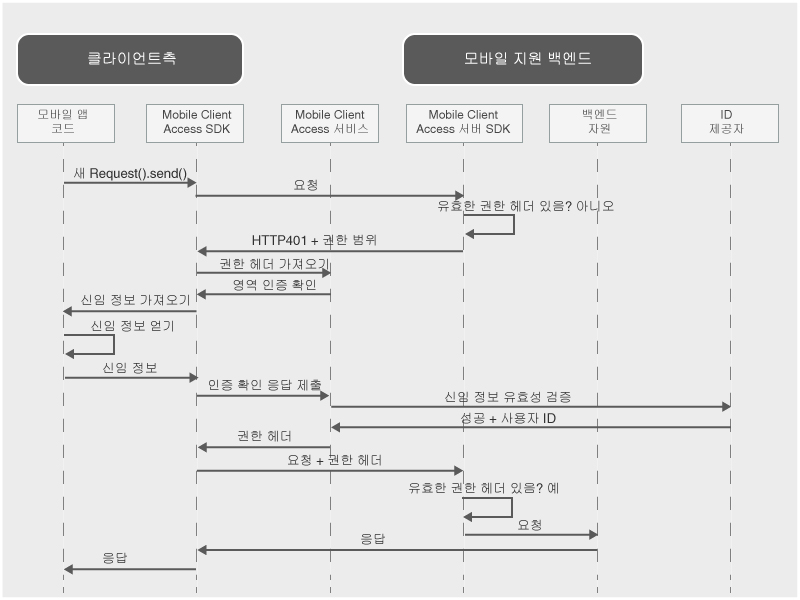

---

copyright:
  years: 2015, 2016

---

# {{site.data.keyword.amashort}} 정보
{: #mca-overview}

{{site.data.keyword.amafull}} 서비스는 {{site.data.keyword.Bluemix_notm}}에서 호스팅되는 클라우드 자원을 액세스하는 모바일 애플리케이션에 대해 인증 및 모니터링 서비스를 제공합니다. 

{{site.data.keyword.amashort}} 서비스를 사용하여 다양한 인증 유형으로 {{site.data.keyword.Bluemix_notm}}에서 호스트되는 Node.js 및 Liberty for Java&trade; 애플리케이션을 보호할 수 있습니다. {{site.data.keyword.amashort}} SDK로 모바일 애플리케이션을 계측함으로써 {{site.data.keyword.amashort}} 서비스에서 제공하는 인증 기능을 사용할 수 있습니다. 모니터링 및 클라이언트 측 로그 데이터가 자동으로 수집되고 요청 시 {{site.data.keyword.amashort}} 서비스로 전송됩니다. {{site.data.keyword.amashort}} 대시보드를 사용하여 다양한 인증 유형을 구성하고 클라이언트 측 SDK가 수집하는 데이터를 확인할 수 있습니다. 

**참고**: {{site.data.keyword.amashort}} 서비스를 이전에는 고급 모바일 액세스라고 했습니다. 

## {{site.data.keyword.amashort}} 컴포넌트
{: #components}

* **{{site.data.keyword.amashort}} 대시보드**: 다양한 인증 유형을 구성하고 모바일 애플리케이션 성능, 분석, 사용 통계 및 디바이스 로그를 모니터링합니다. 
* **{{site.data.keyword.amashort}} 클라이언트 SDK**: {{site.data.keyword.amashort}} 기능을 사용하기 위해 모바일 애플리케이션을 계측합니다. 지원되는 플랫폼은 iOS 8+, Android 4+, Cordova입니다. 
* **{{site.data.keyword.amashort}} 서버 SDK**: {{site.data.keyword.Bluemix_notm}}에서 호스팅되는 자원을 보호합니다. 현재 지원되는 런타임은 Node.js 및 Liberty for Java&trade;입니다.

## 인증 유형
{: #authtypes}
사용자 모바일 앱에서 다음과 같은 인증 유형을 사용할 수 있습니다. 
* **Facebook**: ID 제공자로 Facebook을 사용합니다. 사용자는 Facebook 신임 정보를 사용하여 모바일 앱에 로그인합니다. 
* **Google**: ID 제공자로 Google을 사용합니다. 사용자는 Google+ 신임 정보를 사용하여 모바일 앱에 로그인합니다. 
* **사용자 정의**: 자체 ID 제공자를 작성합니다. 어떤 유형의 정보를 수집하고 유효성을 검사하는지에 대해 완벽히 제어합니다. 

## {{site.data.keyword.amashort}} 아키텍처 개요
{: #architecture}

* {{site.data.keyword.amashort}} 서버 SDK로 클라우드 자원(Node.js 애플리케이션)을 보호합니다. 
* {{site.data.keyword.amashort}} 클라이언트 SDK에서 제공하는 `Request` 클래스를 사용하여 보호된 클라우드 자원과 통신합니다. 
* {{site.data.keyword.amashort}} 서버 SDK는 권한이 없는 요청을 발견하고 HTTP 401 인증 확인 방식을 리턴합니다. 
* {{site.data.keyword.amashort}} 클라이언트 SDK가 HTTP 401 인증 확인 방식을 발견하고 자동으로 {{site.data.keyword.amashort}} 서비스를 사용하여 인증 프로세스를 시작합니다. 
* 인증하는 데 Facebook, Google 또는 사용자 정의 인증을 사용합니다. 
* 인증되면 {{site.data.keyword.amashort}}가 인증 토큰을 리턴합니다. 
* {{site.data.keyword.amashort}} 클라이언트 SDK는 인증 토큰을 자동으로 원래 요청에 추가하고 해당 요청을 클라우드 자원으로 다시 전송합니다. 
* {{site.data.keyword.amashort}} 서버 SDK는 요청에서 액세스 토큰을 추출하고 {{site.data.keyword.amashort}} 서비스를 사용하여 유효성을 검사합니다. 
* 액세스가 부여됩니다. 모바일 애플리케이션에 응답이 리턴됩니다. 

## {{site.data.keyword.amashort}} 요청 플로우
{: #flow}
다음 다이어그램은 SDK에서 모바일 백엔드 및 ID 제공자로 요청이 이동하는 방법에 대해 설명합니다. 

1. {{site.data.keyword.amashort}} SDK를 사용하여 {{site.data.keyword.amashort}} 서버 SDK로 보호되는 백엔드 자원에 대한 요청을 작성하십시오. 
* {{site.data.keyword.amashort}} 서버 SDK가 권한이 없는 요청을 발견하고 권한 범위와 함께 HTTP 401 오류를 리턴합니다. 
* 자동으로 {{site.data.keyword.amashort}} 클라이언트 SDK가 HTTP 401을 발견하고 인증 프로세스를 시작합니다. 
* {{site.data.keyword.amashort}} 클라이언트 SDK가 {{site.data.keyword.amashort}} 서비스에 연결하여 권한 헤더를 발행하도록 요청합니다. 
* {{site.data.keyword.amashort}} 서비스가 현재 구성된 인증 유형에 따라 인증 확인 방식을 제공함으로써 먼저 인증하도록 클라이언트 앱에 요청합니다. 
* {{site.data.keyword.amashort}} 클라이언트 SDK는 다음 중 하나입니다. 
   *  **Facebook 또는 Google 인증:** 인증 확인 방식을 자동으로 처리합니다(Facebook 또는 Google 인증의 경우). 
   * **사용자 정의 인증**: 개발자가 제공하는 로직을 기반으로 신임 정보를 확보합니다. 
* Facebook 또는 Google 인증이 구성되어 있는 경우 {{site.data.keyword.amashort}} 클라이언트 SDK는 Facebook 또는 Google 액세스 토큰을 확보하기 위해 연관된 SDK를 사용합니다. 해당 토큰은 인증 확인 방식 응답으로 제공됩니다. 
* 사용자 정의 인증이 구성되어 있는 경우 개발자는 인증 확인 응답을 확보하고 해당 응답을 {{site.data.keyword.amashort}} 클라이언트 SDK에 제공해야 합니다. 
* 인증 확인 응답이 확보되면 {{site.data.keyword.amashort}} 서비스로 전송됩니다. 
* 서비스가 각각의 ID 제공자(Facebook/Google/사용자 정의)로 인증 확인 응답의 유효성을 검증합니다. 
* 유효성이 검증되면 {{site.data.keyword.amashort}} 서비스가 권한 헤더를 생성하고 헤더를 {{site.data.keyword.amashort}} 클라이언트 SDK로 리턴합니다. 권한 헤더에는 액세스 권한 정보를 포함하는 액세스 토큰 및 현재 사용자, 디바이스 또는 애플리케이션에 대한 정보를 포함하는 ID 토큰이 포함되어 있습니다. 
* 이 시점부터 {{site.data.keyword.amashort}} 클라이언트 SDK로 작성된 모든 요청에는 새로 확보된 권한 헤더가 포함됩니다. 
* 자동으로 {{site.data.keyword.amashort}} 클라이언트 SDK가 권한 플로우를 트리거한 원래 요청을 재전송합니다. 
* {{site.data.keyword.amashort}} 서버 SDK는 요청에서 권한 헤더를 추출하고, {{site.data.keyword.amashort}} 서비스를 사용하여 헤더의 유효성을 검증하고, 백엔드 자원에 액세스 권한을 부여합니다. 
