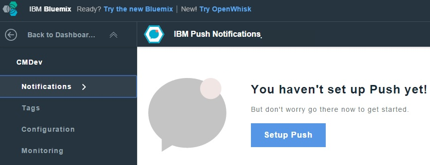

---

copyright:
 years: 2015, 2016

---

{:new_window: target="_blank"}
# GCM(Google cloud messaging)에 대한 신임 정보 구성
{: #create-push-enable-gcm}

사용자의 GCM(Google Cloud Messaging) 신임 정보를 가져온 다음 푸시 대시보드에서 푸시 알림 서비스를 설정합니다. 

##발신인 ID 및 API 키 가져오기

API 키는 안전하게 저장되어 GCM 서버에 연결할 때 푸시 알림 서비스가 사용하며 발신인 ID(프로젝트 번호)는 클라이언트측의 Android SDK에서 사용합니다. 발신인 ID에 대한 자세한 정보는 [Google 클라우드 메시지](https://developers.google.com/cloud-messaging/gcm#arch)를 참조하십시오.

1. [Google 개발 콘솔](https://console.developers.google.com/start){: new_window}에서 Google 개발 계정을 가져오십시오. GCM(Google Cloud Messaging)에 대한 자세한 정보는 [Google API 프로젝트 작성](https://developers.google.com/console/help/new/){: new_window}을 참조하십시오.

2. Google 개발자 콘솔에서 새 프로젝트를 작성하십시오. 예를 들어, "hello world"가 있습니다. 

	

3. **프로젝트 이름**에 프로젝트의 이름을 입력한 다음 **작성** 단추를 클릭하십시오. 
4. 프로젝트 번호를 보려면 **홈**을 클릭하십시오. 프로젝트 번호를 기록해두십시오. 

	

	**참고**: 프로젝트를 작성할 때 프로젝트 번호(발신인 ID)가 작성됩니다. 푸시 대시보드 화면에서 푸시 알림 서비스를 설정할 때 이 번호를 사용하십시오. 

5. **API & 인증**을 클릭하고 **모바일 API** 섹션에서 **Android용 클라우드 메시징**을 클릭하십시오.

	

6. **API**를 클릭한 다음 **API 사용** 단추를 클릭하여 사용자 프로젝트에 대한 API 키를 작성하십시오.

	

7. **API & Auths -> 신임 정보** 화면으로 이동하십시오. **신임 정보 추가**를 클릭한 다음 **API 키**를 클릭하십시오.

	

8. **서버 키** 옵션을 클릭하여 Bluemix 푸시 대시보드에서 사용할 GCM API 키를 생성하십시오. 
9. **이름** 필드에 서버 API 키의 이름을 입력하십시오. 

	

10. **작성** 단추를 클릭하십시오.
API 키가 표시됩니다. 

	

11. GCM API 키를 복사한 다음 **확인** 단추를 클릭하십시오. Bluemix 푸시 알림 대시보드 구성 화면에서 신임 정보를 구성하려면 프로젝트 번호(발신인 ID)와 API 키가 필요합니다.  
12. 다음 단계. Android에 대한 푸시 알림 서비스 설정

##Android에 대한 푸시 알림 서비스 설정

**시작하기 전에**

GCM API 키와 발신인 ID(프로젝트 번호)를 가져오십시오.  

1. Bluemix 대시보드에서 백엔드 애플리케이션을 연 다음 IBM 푸시 알림 서비스를 클릭하여 푸시 알림 서비스 대시보드를 여십시오.
 
	

	푸시 대시보드가 표시됩니다. 
	
	

2. **푸시 설정** 단추를 클릭하여 GCM 신임 정보를 구성하십시오. 
1. **구성** 탭에서 **Google 클라우드 메시징** 섹션으로 이동하여 발신인 ID(GCM 프로젝트 번호)와 API 키를 구성하십시오. 

4. **저장** 단추를 클릭하십시오.  
5. 다음 단계. [Android용 알림 사용](c_enable_push.html).
