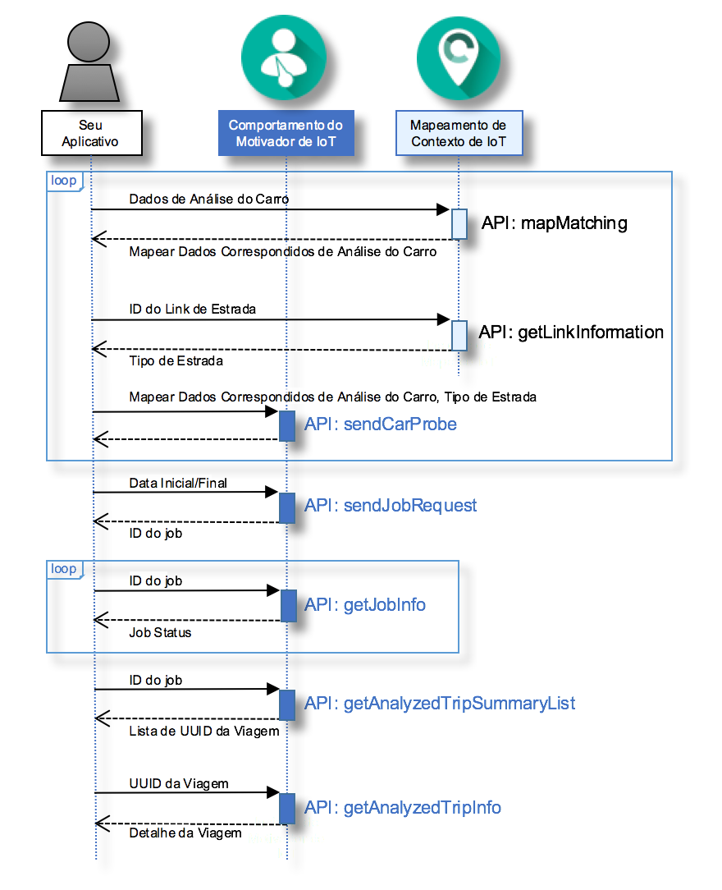

---

copyright:
  years: 2016

---

{:new_window: target="_blank"}
{:shortdesc: .shortdesc}
{:screen: .screen}
{:codeblock: .codeblock}
{:pre: .pre}

# Introdução ao {{site.data.keyword.iotdriverinsights_short}}
{: #gettingstartedtemplate}
*Última atualização: 13 de maio de 2016*

Com o {{site.data.keyword.iotdriverinsights_full}}, é possível executar analítica sobre o comportamento do motorista usando a API do {{site.data.keyword.iotdriverinsights_short}}
para reunir e analisar dados de análise do carro e dados contextuais.
{:shortdesc}

Siga estas etapas para integrar o aplicativo com a API do {{site.data.keyword.iotdriverinsights_short}} depois de criar e implementar
uma instância de serviço desvinculada. 

1. (Opcional) Antes de enviar dados de análise do carro para a API do
{{site.data.keyword.iotdriverinsights_short}}, é possível incluir dados
adicionais em seus dados de análise do carro usando a API do
{{site.data.keyword.iotmapinsights_short}}.
     - Obtenha os dados de análise do carro correspondidos com o mapa usando a API `mapMatching`.
        - [Solicitação] Dados de análise do carro
        - [Resposta] Dados de análise do carros correspondidos com o mapa
     - Obtenha dados do tipo de estrada usando a API `getLinkInformation`.
        - [Solicitação] ID do link de estrada
        - [Resposta] Tipo de estrada
2. Envie dados de análise do carro para armazenamento e para serem analisados usando
a API `sendCarProbe`.
   - [Solicitação] Dados de análise do carro correspondidos com o mapa e tipo de Estrada
3. Envie uma solicitação de tarefa para analisar dados de análise do carro usando a API
`sendJobRequest`.
   - [Solicitação] Data inicial e final
   - [Resposta] ID da tarefa
4. Verifique o status da tarefa usando a API `getJobInfo`.
   - [Solicitação] ID da tarefa
   - [Resposta] Status da tarefa
5. Obtenha a lista resumida de viagens analisadas usando a API `getAnalyzedTripSummaryList`.
   - [Solicitação] ID da tarefa
   - [Resposta] Lista de resumo de viagens analisadas
6. Obtenha informações da viagem analisada em detalhes usando a API `getAnalyzedTripInfo`.
   - [Solicitação] UUID da viagem
   - [Resposta] Detalhes da viagem analisada 

O diagrama de sequência a seguir mostra a sequência de tarefas.

Veja o tópico [Sobre o {{site.data.keyword.iotdriverinsights_short}}](iotdriverinsights_overview.html) para obter detalhes sobre comportamentos e contextos analisáveis.
Use o Tutorial [{{site.data.keyword.iotmapinsights_short}} / {{site.data.keyword.iotdriverinsights_short}} Parte 1](https://github.com/IBM-Bluemix/car-data-management){:new_window} para experimentar um aplicativo de amostra com dados de análise do carro de amostra.

# Links Relacionados
{: #rellinks}
## Tutoriais e Amostras
{: #samples}

* Tutorial [{{site.data.keyword.iotmapinsights_short}} / {{site.data.keyword.iotdriverinsights_short}} Parte 1](https://github.com/IBM-Bluemix/car-data-management){:new_window}
* Tutorial [{{site.data.keyword.iotmapinsights_short}} / {{site.data.keyword.iotdriverinsights_short}} Parte 2](https://github.com/IBM-Bluemix/map-driver-insights){:new_window}

## Referência à API
{: #api}

* [Docs API](http://ibm.biz/IoTDriverBehavior_APIdoc){:new_window}

## Links Relacionados
{: #general}

* [Introdução
ao {{site.data.keyword.iotmapinsights_short}}](../IotMapInsights/index.html){:new_window}
* [Introdução
ao {{site.data.keyword.iot_full}}](https://www.ng.bluemix.net/docs/services/IoT/index.html){:new_window}
* [dW Answers no IBM developerWorks](https://developer.ibm.com/answers/topics/iot-driver-behavior){:new_window}
* [Estouro da capacidade](http://stackoverflow.com/questions/tagged/iot-driver-behavior){:new_window}
* [O que há de novo em Serviços do Bluemix](http://www.ng.bluemix.net/docs/whatsnew/index.html#services_category){:new_window}

