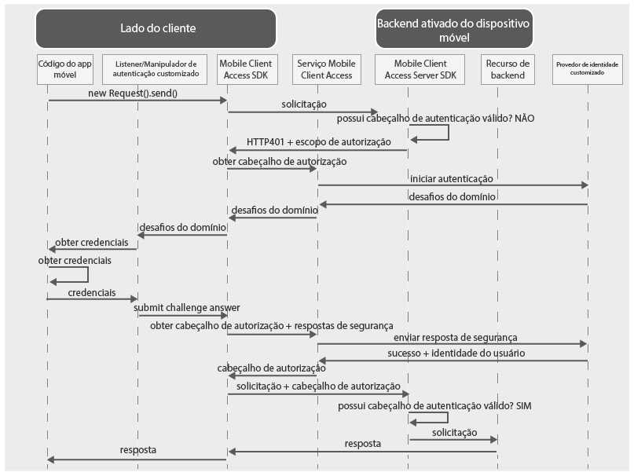

---

copyright:
  years: 2015, 2016

---

# Usando um provedor de identidade customizado para autenticar usuários
{: #custom-id}
É possível criar um provedor de identidade customizado e implementar sua própria lógica para coletar e validar credenciais. Um provedor de identidade customizado é um aplicativo da web que expõe uma interface RESTful. É possível hospedar o provedor de identidade customizado no local ou no {{site.data.keyword.Bluemix}}. O único requisito é que o provedor de identidade customizado deve ser acessível na Internet pública para que possa se comunicar com o serviço {{site.data.keyword.amashort}}.

## Visão geral do {{site.data.keyword.amashort}}
{: #custom-id-ovr}
 O diagrama a seguir demonstra como o {{site.data.keyword.amashort}} se integra a um provedor de identidade customizado.



1. Use o {{site.data.keyword.amashort}} SDK para fazer uma solicitação para seus recursos de backend que são protegidos com o {{site.data.keyword.amashort}} Server SDK.
* O {{site.data.keyword.amashort}} Server SDK detecta uma solicitação não autorizada e retorna HTTP 401 e escopo de autorização.
* O {{site.data.keyword.amashort}} Client SDK detecta automaticamente o HTTP 401 acima e inicia o processo de autenticação.
* O {{site.data.keyword.amashort}} Client SDK entra em contato com o serviço {{site.data.keyword.amashort}} e solicita a emissão de um cabeçalho de autorização.
* O serviço {{site.data.keyword.amashort}} se comunica com o provedor de identidade customizado para iniciar o processo de autenticação.
* O provedor de identidade customizado retorna um desafio de autenticação para o serviço {{site.data.keyword.amashort}}.
* O serviço {{site.data.keyword.amashort}} retorna o desafio de autenticação para o {{site.data.keyword.amashort}} Client SDK.
* O {{site.data.keyword.amashort}} Client SDK delega a autenticação a uma classe customizada que você criou. Você é responsável por coletar credenciais e fornecê-las de volta para o {{site.data.keyword.amashort}} Client SDK.
* Depois que o desenvolvedor fornecer credenciais para o {{site.data.keyword.amashort}} SDK, elas serão enviadas ao serviço {{site.data.keyword.amashort}} como uma resposta do desafio de autenticação.
* O serviço {{site.data.keyword.amashort}} valida a resposta do desafio de autenticação com o provedor de identidade customizado.
* Se a validação for bem-sucedida, o serviço {{site.data.keyword.amashort}} irá gerar um cabeçalho de autorização e o retornará para o {{site.data.keyword.amashort}} Client SDK. O cabeçalho de autorização contém dois tokens: um token de acesso contendo informações de permissões de acesso e um token de ID contendo informações sobre o usuário atual, o dispositivo e o aplicativo.
* Desse ponto em diante, todas as solicitações feitas com o {{site.data.keyword.amashort}} Client SDK terão um cabeçalho de autorização recém-obtido.
* O {{site.data.keyword.amashort}} Client SDK reenvia automaticamente a solicitação original que acionou o fluxo de autorização.
* O {{site.data.keyword.amashort}} Server SDK extrai o cabeçalho de autorização da solicitação, valida-o com o serviço {{site.data.keyword.amashort}} e concede acesso a um recurso de backend.

## Entendendo os provedores de identidade customizados
{: #custom-id-about}

Com um provedor de identidade customizado, é possível fornecer desafios de autenticação customizados para serem enviados para o cliente. Com o provedor de identidade customizado, é possível customizar totalmente o fluxo de autenticação.

Quando você estiver criando um provedor de identidade customizado, será possível:

1. Customize um desafio de autenticação para ser enviado pelo serviço {{site.data.keyword.amashort}} para o aplicativo cliente móvel. Um desafio de autenticação é um objeto JSON que contém dados customizados. O cliente móvel pode usar esses dados customizados para customizar fluxos de autenticação.

Exemplo de um desafio de autenticação customizado:

	```JavaScript
	{
		status: "challenge",
		challenge: {
			message:"Enter username and password",
			retriesLeft: 2,
			minUsernameLenth: 8
		}
	}
	```

1. Implemente qualquer fluxo de coleção de credenciais customizado no cliente móvel, incluindo a autenticação em várias etapas e em vários formulários. Da mesma forma que para o desafio de autenticação customizado, deve-se projetar a estrutura de uma resposta de desafio de autenticação customizada.

Exemplo de uma resposta de desafio de autenticação customizada enviada pelo cliente móvel:

	```JavaScript
	{
		username:"bob.smith",
		password:"abcd1234",
		pincode:"1234"
	}
	```
1. Implemente a lógica customizada de validação da resposta de desafio de autenticação fornecida.

1. Defina um objeto de identidade do usuário customizado que contém as propriedades customizadas necessárias. Um exemplo de objeto de identidade do usuário customizado obtido pelo cliente móvel após uma autenticação bem-sucedida:

	```JavaScript
	{
		username:"bob.smith",
		displayName:"Bob Smith",
		attributes:{
			age: 30,
			accountNumber: 12345,
			lastLogin: "Sept 1st, 2015"
		}
	}
	```

### Implementação de amostra do provedor de identidade customizado
{: #custom-sample}
É possível usar qualquer uma das implementações de amostra Node.js a seguir de um provedor de identidade customizado como referência ao desenvolver seu provedor de identidade customizado. Faça download do código do aplicativo completo dos repositórios GitHub.

 * [Amostra simples](https://github.com/ibm-bluemix-mobile-services/bms-mca-custom-identity-provider-sample)
 * [Amostra avançada](https://github.com/ibm-bluemix-mobile-services/bms-mca-custom-identity-provider-with-user-management)
 
## Comunicação típica entre o {{site.data.keyword.amashort}} Server e um provedor de identidade customizado
{: #custom-id-comm}
1. O serviço {{site.data.keyword.amashort}} envia uma solicitação `startAuthorization` para o provedor de identidade customizado.
1. O provedor de identidade customizado responde com um desafio de autenticação customizado a ser enviado para o cliente.
1. O serviço {{site.data.keyword.amashort}} envia o desafio de autenticação customizado recebido do provedor de identidade customizado para o cliente móvel e, finalmente, recebe uma resposta do desafio de autenticação do cliente móvel.
1. O serviço {{site.data.keyword.amashort}} envia uma solicitação `handleChallengeAnswer` com a resposta do desafio de autenticação para o provedor de identidade customizado.
1. O provedor de identidade customizado verifica a resposta do desafio de autenticação e responde com uma resposta de sucesso, contendo as informações de identidade do usuário.
1. Opcionalmente, o provedor de identidade customizado pode fornecer mais desafios depois de receber uma resposta de segurança do cliente. O envio de vários desafios permite um
processo de autenticação de várias etapas.

## Stateful versus stateless
{: #custom-id-state}
Por padrão, o provedor de identidade customizado é considerado um aplicativo stateless. Em alguns casos, o provedor de identidade customizado pode precisar armazenar o estado relacionado ao processo de autenticação. Um caso de uso de exemplo é a autenticação em várias etapas, em que o provedor de identidade customizado precisa armazenar o resultado da primeira etapa de autenticação antes de continuar para a próxima etapa. Para suportar a funcionalidade stateful, um provedor de identidade customizado deve gerar um stateID e fornecê-lo na resposta para o serviço {{site.data.keyword.amashort}}. O serviço {{site.data.keyword.amashort}} deve passar o stateID em solicitações subsequentes pertencentes ao processo de autenticação do cliente.

## Domínio customizado
{: #custom-id-custom}

Um provedor de identidade customizado suporta um domínio de autenticação customizado. Para lidar com os desafios de autenticação recebidos, crie e registre uma instância de AuthenticationDelegate/AuthenticationListener em seu aplicativo de cliente móvel. Defina o nome do domínio de autenticação customizado ao configurar um provedor de identidade customizado no painel do {{site.data.keyword.amashort}}. Ele pode ser usado para identificar que a solicitação está sendo recebida de uma instância de serviço específica do {{site.data.keyword.amashort}}.

## Próximas Etapas
{: #next-steps}
* [Criando um provedor de identidade customizado](custom-auth-identity-provider.html)
* [Configurando o {{site.data.keyword.amashort}} para autenticação customizada](custom-auth-config-mca.html)
* [Configurando a autenticação customizada para Android](custom-auth-android.html)
* [Configurando a autenticação customizada para iOS](custom-auth-ios.html)
* [Configurando a autenticação customizada para Cordova](custom-auth-cordova.html)
