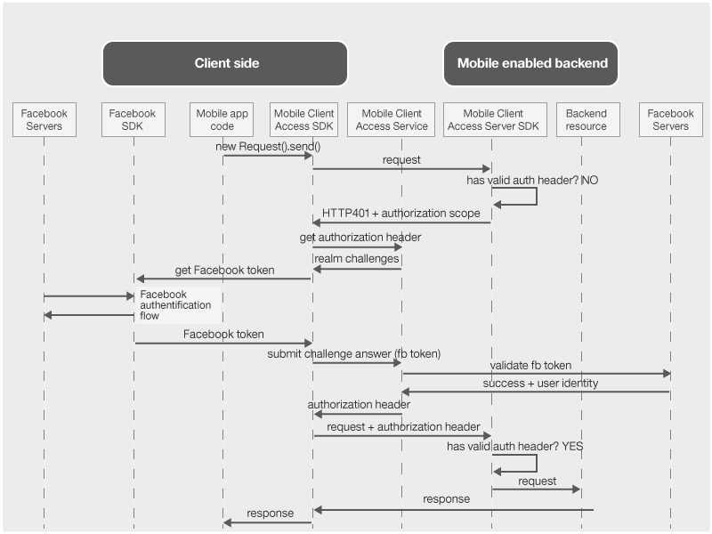

---

copyright:
  years: 2015, 2016

---

# Autenticando usuários com as credenciais do Facebook
{: #facebook-auth-overview}
É possível configurar o serviço {{site.data.keyword.amashort}} para proteger recursos usando o Facebook como o provedor de identidade. Seus usuários do aplicativo móvel podem usar suas credenciais do Facebook para autenticação.

**Importante**: não é necessário instalar separadamente o Facebook SDK. O Facebook SDK é instalado automaticamente por gerenciadores de dependência quando você configura o {{site.data.keyword.amashort}} Client SDK.

## Fluxo de solicitação do {{site.data.keyword.amashort}}
{: #mca-facebook-sequence}

Consulte o diagrama simplificado a seguir para entender como o {{site.data.keyword.amashort}} integra-se ao Facebook para autenticação.

1. Use o {{site.data.keyword.amashort}} SDK para fazer uma solicitação para seus recursos de backend que são protegidos com o {{site.data.keyword.amashort}} Server SDK.
* O {{site.data.keyword.amashort}} Server SDK detecta uma solicitação não autorizada e retorna o código HTTP 401 e o escopo de autorização.
* O {{site.data.keyword.amashort}} Client SDK detecta automaticamente o código HTTP 401 e inicia o processo de autenticação.
* O {{site.data.keyword.amashort}} Client SDK entra em contato com o serviço {{site.data.keyword.amashort}} e solicita a emissão de um cabeçalho de autorização.
* O serviço {{site.data.keyword.amashort}} solicita ao cliente para se autenticar com o Facebook primeiro fornecendo um desafio de autenticação.
* O {{site.data.keyword.amashort}} Client SDK usa o SDK do Facebook para iniciar o processo de autenticação. Após a autenticação bem-sucedida, o SDK do Facebook retorna um token de acesso do Facebook.
* O token de acesso do Facebook é considerado uma resposta do desafio de autenticação. O token é enviado para o serviço {{site.data.keyword.amashort}}.
* O serviço valida a resposta do desafio de autenticação com servidores do Facebook.
* Se a validação for bem-sucedida, o serviço {{site.data.keyword.amashort}} irá gerar um cabeçalho de autorização e o retornará para o {{site.data.keyword.amashort}} Client SDK. O cabeçalho de autorização contém dois tokens: um token de acesso contendo informações de permissões de acesso e um token de ID contendo informações sobre o usuário atual, o dispositivo e o aplicativo.
* Desse ponto em diante, todas as solicitações feitas por meio do {{site.data.keyword.amashort}} Client SDK terão um cabeçalho de autorização recém-obtido.
* O {{site.data.keyword.amashort}} Client SDK reenvia automaticamente a solicitação original que acionou o fluxo de autorização.
* O {{site.data.keyword.amashort}} Server SDK extrai o cabeçalho de autorização da solicitação, valida-o com o serviço {{site.data.keyword.amashort}} e concede acesso a um recurso de backend.

## Obtendo um ID do aplicativo Facebook do Portal do desenvolvedor do Facebook
{: #facebook-appID}

Para começar a usar o Facebook como um provedor de identidade, deve-se criar um aplicativo no Portal do desenvolvedor do Facebook. Durante esse processo, você recebe um ID do aplicativo Facebook, que é um identificador exclusivo para que o Facebook saiba qual aplicativo está tentando se conectar.

1. Abra o [Portal do desenvolvedor do Facebook](https://developers.facebook.com).

1. Clique em **Meus apps** no menu superior e selecione **Criar um novo app**.
Se tiver sido apresentada a opção de selecionar um aplicativo iOS ou Android, escolha um e clique em **Ignorar e criar ID do app** na próxima tela.

1. Configure o nome de exibição do aplicativo de sua escolha e selecione uma categoria. Clique em **Criar ID do app** para continuar.

1. Copie o **ID do app** exibido. Esse valor é seu ID do aplicativo Facebook.  Esse valor será necessário para configurar a autenticação do Facebook com seu app móvel.

## Próximas Etapas
{: #next-steps}

* [Ativando a autenticação do Facebook em apps Android](facebook-auth-android.html)
* [Ativando a autenticação do Facebook em apps iOS (Swift SDK)](facebook-auth-ios-swift-sdk.html)
* [Ativando a autenticação do Facebook em apps iOS (Objective-C SDK)](facebook-auth-ios.html)
* [Ativando a autenticação do Facebook em apps Cordova](facebook-auth-cordova.html)
