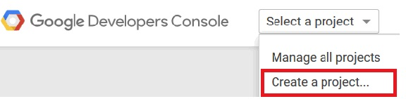

---

copyright:
 years: 2015, 2016

---

{:new_window: target="_blank"}
# Configurando credenciais para o Google Cloud Messaging (GCM)
{: #create-push-enable-gcm}

Obtenha suas credenciais Google Cloud Messaging (GCM) e
depois configure o Push
        Notification Service no painel Push.

##Obtendo seu ID de emissor e chave de API

A chave de API é armazenada com segurança e usada pelo Serviço de notificação push
para se conectar ao servidor GCM e o ID do emissor (número de projeto) é usado pelo
Android SDK no lado do cliente. Para obter mais informações sobre o ID do emissor, consulte em [Mensagem do Google Cloud](https://developers.google.com/cloud-messaging/gcm#arch).

1. Obtenha uma conta do Google Development em [Console do Google Dev](https://console.developers.google.com/start){: new_window}. Para obter mais informações sobre o Google Cloud Messaging
(GCM), consulte [Criando
um projeto de API do Google](https://developers.google.com/console/help/new/){: new_window}.

2. No Google Developers Console, crie um novo projeto. Por
exemplo, "hello
                        world".

	

3. Em **Nome do projeto**, insira o nome de
seu projeto e clique no botão **Criar**.
4. Clique em **Início** para visualizar o número
do projeto. Documente seu número de projeto.

	

	**Nota**: Ao criar seu projeto, um número de projeto (ID
do emissor) é criado. Use esse número para configurar o Push
Notification Service na tela do painel Push.

5. Clique em **APIs & Auth** e na seção **APIs
móveis**, clique em **Cloud Messaging for Android**.

	

6. Clique em **APIs** e depois no botão
**Ativar API** para criar a chave de API para
seu projeto.

	

7. Vá para a tela **APIs & Autorizações ->
Credenciais**. Clique em **Incluir credenciais** e depois em **Chave de API**.

	

8. Clique na opção **Chave do servidor**
para gerar a chave de API GCM que você usará no painel Push do Bluemix.
9. No campo **Nome**, informe o nome da chave de API do servidor.

	

10. Clique no botão **Criar**. 
A chave de API
é exibida.

	

11. Copie a chave de API GCM e depois clique no botão **OK**. Você
precisará do número de projeto (ID do emissor) e da chave de API para configurar
suas credenciais na tela Configuração do painel Notificação push do Bluemix. 
12. Próximas etapas. Configurando o Serviço de notificação push para Android.

##Configurando o Push Notification Service for Android

**Antes de começar**

Obtenha uma chave de API GCM e ID de emissor
(número de projeto). 

1. Abra seu aplicativo backend no painel do Bluemix e clique no serviço IBM Push
Notifications para abrir o painel Serviço de notificação push.
 
	

	O painel Push é exibido.
	
	

2. Clique no botão **Configurar push** para
configurar as credenciais de GCM.
1. Na guia **Configuração**, acesse a seção **Google
Cloud Messaging** e configure o ID do emissor (número do projeto GCM) e a chave
de API.

4. Clique no botão **Salvar**. 
5. Próximas etapas. [Ativando notificações para Android](c_enable_push.html).
