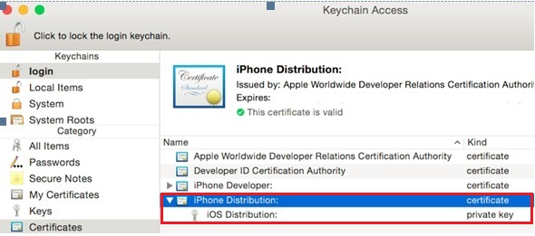

---

copyright:
 years: 2015, 2016

---

{:new_window: target="_blank"}
# Configurando credenciais para notificações push da Apple (APNs)

{: #create-push-credentials-apns}

Apple Push Notification service (APNs) permite que o
desenvolvedor de aplicativos envie notificações remotas da instância
Serviço push no Bluemix (o provedor) para dispositivos e
aplicativos iOS. Mensagens são enviadas para um aplicativo de
destino no dispositivo. Obtenha e configure suas credenciais APNs. Certificados
de APNs são gerenciados com segurança pelo Push
        Notification Service e usados para se conectar ao servidor
APNs como um provedor.

1. Obtenha uma conta do [Apple Developers](https://developer.apple.com/).
2. [Registre
um ID de app](#create-push-credentials-apns-register)
3. [Crie um certificado SSL de APNs de desenvolvimento e distribuição](#create-push-credentials-apns-ssl)
4. [Crie um
perfil de fornecimento de desenvolvimento](#create-push-credentials-dev-profile)
5. [Crie um perfil de
fornecimento de distribuição de armazenamento](#create-push-credentials-apns-distribute_profile)
6. [Configure APNs no
painel Push](#create-push-credentials-apns-dashboard)

##Registrando um ID de app
{: #create-push-credentials-apns-register}

O ID de app (o identificador de pacote configurável) é um
identificador exclusivo que identifica um aplicativo específico. Cada
aplicativo requer um ID de app. Serviços como notificações push são configurados para o
ID do app.

1. Acesse o portal [Apple
Developer](https://developer.apple.com), clique em Centro de membros e selecione
**Certificados, identificadores & perfis**.
2. Acesse a seção **Registrando IDs de app** na
[Apple
Developer Library](https://developer.apple.com/library/mac/documentation/IDEs/Conceptual/AppDistributionGuide/MaintainingProfiles/MaintainingProfiles.html#//apple_ref/doc/uid/TP40012582-CH30-SW991) e siga as instruções para registrar o ID do app.

	**Nota**: Ao registrar um ID de app, selecione as opções a seguir:
	* Notificações push

	

	* Sufixo de ID explícito

	
3. Próximas etapas. Crie um certificado SSL de APNs de desenvolvimento e
distribuição.

##Crie um certificado SSL de APNs de desenvolvimento e distribuição
{: #create-push-credentials-apns-ssl}

Antes de poder obter um certificado APNs, é necessário
gerar primeiro uma solicitação de assinatira de certificado (CSR)
e enviá-la para Apple, a autoridade de certificação
(CA). A CSR
            contém informações que identificam sua empresa e seu
público e a chave privada que você usa para assinar suas
notificações push da Apple. Depois, gere o certificado SSL no
            portal de Desenvolvedor de iOS. O certificado, junto com
seu público e chave privada, é armazenado no Keychain Access.

**Antes de começar**

[Registre
um ID de app](#create-push-credentials-apns-register)

APNs podem ser usadas de dois modos:
ambiente de simulação e produção.

* O modo de ambiente de simulação é usado durante
desenvolvimento e teste.
* O modo de produção é usado ao distribuir aplicativos
usando Armazenamento de app (ou outros mecanismos de distribuição
corporativos).

É necessário obter certificados separados para
seus ambientes de desenvolvimento e distribuição. Os certificados são
associados a um ID de app para o app que é o destinatário das
notificações remotas. Para produção, é possível criar até dois
certificados. O Bluemix usa os certificados para estabelecer uma
conexão SSL com APNs.

Crie um certificado SSL de desenvolvimento e distribuição.

1. Acesse [Apple
Developer](https://developer.apple.com), clique em Centro de membros e selecione
**Certificados, identificadores & perfis**.
2. Na área **Identificadores**, clique em
**IDs de app**.
3. Na lista de IDs de app, selecione seu ID de app recentemente
criado e selecione **Configurações**.
4. Na área **Serviço Push
Notifications**, crie um
certificado SSL de desenvolvimento e depois um certificado SSL de
produção.
 
	

	A tela Sobre como criar uma solicitação de assinatura de certificado é exibida.

	

5. Em seu Mac, inicie o aplicativo **Keychain
Access** para criar uma solicitação de assinatura
de certificado (CSR).
6. Selecione **Keychain Access > Assistente de certificado > Solicitar
um certificado de uma autoridade de certificação…**

7. Em **Informações de certificado**, insira
seu endereço de e-mail que está associado à conta do Desenvolvedor
de app e um nome comum. Forneça um nome significativo que o
ajude a identificar se ele é um certificado para desenvolvimento,
(ambiente de simulação)
ou distribuição (produção); por exemplo,**
sandbox_apns_certificate** ou
                            **production_apns_certificate**.

8. Selecione **Salvo no disco** para fazer o
download do arquivo **.certSigningRequest**
para sua área de trabalho, depois clique em
**Continuar**.
9. Em **Salvar como**, nomeie o arquivo

**.certSigningRequest**; por exemplo

**sandbox.certSigningRequest**, depois clique em
                            **Salvar**.
10. Clique em **Pronto**. Agora você tem uma
CSR.
11. Em **Sobre como criar uma solicitação de assinatura de certificado
(CSR)**, clique em **Continuar**. 12. 
12. Na tela **Gerar**, clique em
**Escolher arquivo ... **e selecione o arquivo CSR
salvo em sua área de trabalho. Em seguida, clique em **Gerar**.

	

13. Quando seu certificado estiver pronto, clique em
**Concluído**.
14. Na tela **Notificações push**, clique em
**Fazer download** para fazer download do seu certificado e depois
clique em **Concluído**. 
15. No Mac, acesse **Keychain Access > Meus certificados** e
localize seu certificado recém-instalado. Dê um clique duplo no certificado
para instalá-lo no Keychain Access.
16. Selecione certificado e chave privada e depois selecione
**Exportar** para converter o certificado no formato de troca de
informações pessoais (formato .p12).

	

17. No campo **Salvar como**, dê um nome
significativo ao certificado para que você possa identificá-lo mais
tarde, por exemplo **sandbox_apns.p12_certifcate**
ou **production_apns.p12** e, em seguida, clique
em **Salvar**.

   	

18. No campo **Inserir uma senha**, insira
uma senha para proteger os itens exportados e clique em **OK**. Você usa essa senha para configurar posteriormente as
definições de APNs no painel Push.

	
19. O **Key Access.app** solicita que
você exporte sua chave da tela **Keychain**. Insira
sua senha administrativa para o seu Mac para permitir que seu sistema
exporte esses itens e selecione a opção **Sempre
permitir**. Um certificado .p12
é gerado em sua área de trabalho.

##Criando um perfil de fornecimento de desenvolvimento
{: #create-push-credentials-dev-profile}

O perfil de fornecimento funciona com o ID de app para
determinar quais dispositivos podem instalar e executar seu app e
quais serviços seu app pode acessar. Para cada ID de app, você cria
dois perfis de fornecimento: um para desenvolvimento e outro para
distribuição. Xcode usa o perfil de fornecimento de desenvolvimento
para determinar quais desenvolvedores podem criar o aplicativo e
quais dispositivos podem ser testados no aplicativo.

**Antes de começar**

Certifique-se de registrar um ID
de app, de ativá-lo para Push Notification Service e de configurá-lo
para
usar um certificado APNs SSL de desenvolvimento e produção.

Crie um perfil de
fornecimento de desenvolvimento.

1. Acesse o portal [Apple
Developer](https://developer.apple.com), clique em Centro de membros e selecione
**Certificados, identificadores & perfis**.
2. Acesse a [Mac
Developer Library ](https://developer.apple.com/library/mac/documentation/IDEs/Conceptual/AppDistributionGuide/MaintainingProfiles/MaintainingProfiles.html#//apple_ref/doc/uid/TP40012582-CH30-SW62site), role para a seção Criando perfis de fornecimento de
desenvolvimento** e siga as instruções para criar um perfil de desenvolvimento.

	**Nota**: Ao configurar um perfil de provisão de
desenvolvimento, selecione as opções a seguir:
	* **iOS App Development**
	* **Para apps iOS e watchOS **

##Criando um perfil de fornecimento de distribuição de
armazenamento
{: #create-push-credentials-apns-distribute_profile}

Use o perfil de fornecimento de armazenamento para
enviar seu app para distribuição para a App Store.

1. Acesse o portal [Apple
Developer](https://developer.apple.com), clique em Centro de membros e selecione
**Certificados, identificadores & perfis**.
2. Dê um clique duplo no perfil de fornecimento
transferido por download para instalá-lo em Xcode.

##Configurando APNs no painel Notificação push
{: #create-push-credentials-apns-dashboard}

Para usar o Push Notification Service para
enviar notificações, faça upload dos certificados SSL
necessários para o Apple Push Notification service (APNs). A API REST também pode ser
usada para fazer upload de um certificado APNs.

**Antes de começar**

Obtenha seu certificado APNS SSL
de desenvolvimento e produção e a senha associada a cada tipo de
certificado. Para obter informações, consulte Criando e configurando credenciais push
para APNS.

Os certificados necessários para o APNs são certificados .p12, que contêm a
chave privada e os certificados SSL necessários para construir e publicar o
aplicativo. Deve-se gerar os certificados a partir do Member Center do
website do Apple Developer (para o qual é necessária uma conta válida do Apple Developer). São necessários certificados separados para o
ambiente de desenvolvimento (ambiente de
simulação) e para o ambiente de produção (distribuição).

**Nota**: Depois que .**cer ** estiver em seu
acesso da cadeia de chaves, exporte-o para seu computador para criar um certificado .p12.

Para obter mais informações sobre como usar o APNs, consulte o [iOS Developer Library: Local and Push
Notification Programming Guide](https://developer.apple.com/library/ios/documentation/NetworkingInternet/Conceptual/RemoteNotificationsPG/Chapters/ProvisioningDevelopment.html#//apple_ref/doc/uid/TP40008194-CH104-SW4).

Configure APNs no painel Push

1. Abra o aplicativo backend no painel do Bluemix e, em seguida,
clique no serviço **IBM Push Notifications** para abrir o painel
Push.

	

	O painel Push é exibido.
	
	
1
2. Na guia **Configuração**, acesse a seção
**Certificado push da Apple**, selecione
**Ambiente de simulação** (desenvolvimento) ou
**Produção**
(distribuição) e depois faça upload do certificado p.12 para o Bluemix.

	
3. No campo **Senha**, insira a senha que está
associada ao arquivo de certificado **.p12**; em seguida, clique em
**Salvar**.
Após o
upload bem-sucedido dos certificados com uma senha válida, é possível iniciar
o envio de notificações.

