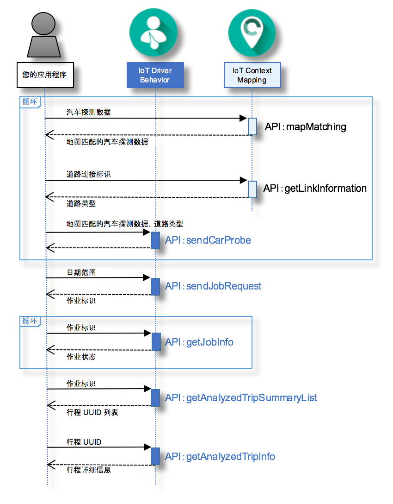

---

copyright:
  years: 2016

---

{:new_window: target="_blank"}
{:shortdesc: .shortdesc}
{:screen: .screen}
{:codeblock: .codeblock}
{:pre: .pre}

# {{site.data.keyword.iotdriverinsights_short}} 入门
{: #gettingstartedtemplate}
*上次更新时间：2016 年 5 月 13 日*

使用 {{site.data.keyword.iotdriverinsights_full}}，您可以通过使用 {{site.data.keyword.iotdriverinsights_short}} API 对驾驶员的行为进行分析，以收集并分析汽车探测数据和前后关联的数据。
{:shortdesc}

遵循以下步骤，在创建和部署未绑定的服务实例之后，将应用程序与 {{site.data.keyword.iotdriverinsights_short}} API 集成。 

1. （可选）在将汽车探测数据发送到 {{site.data.keyword.iotdriverinsights_short}} API 之前，您可以通过使用 {{site.data.keyword.iotmapinsights_short}} API 将其他数据添加到汽车探测数据。
     - 使用 `mapMatching` API 获取地图匹配的汽车探测数据。
        - [请求] 汽车探测数据
        - [响应] 地图匹配的汽车探测数据
     - 使用 `getLinkInformation` API 获取道路类型数据。
        - [请求] 道路连接标识
        - [响应] 道路类型
2. 使用 `sendCarProbe` API 发送要存储并要被分析的汽车探测数据。
   - [请求] 地图匹配的汽车探测数据和道路类型
3. 使用 `sendJobRequest` API 发送用于分析汽车探测数据的作业请求。
   - [请求] 日期范围
   - [响应] 作业标识
4. 使用 `getJobInfo` API 检查作业状态。
   - [请求] 作业标识
   - [响应] 作业状态
5. 使用 `getAnalyzedTripSummaryList` API 获取分析的行程摘要列表。
   - [请求] 作业标识
   - [响应] 分析的行程摘要列表
6. 使用 `getAnalyzedTripInfo` API 获取分析的行程详细信息。
   - [请求] 行程 UUID
   - [响应] 分析的行程详细信息 

以下时序图显示步骤的顺序。

请参阅[关于 {{site.data.keyword.iotdriverinsights_short}}](iotdriverinsights_overview.html) 主题，以获取有关可分析的行为和上下文的详细信息。
使用 [{{site.data.keyword.iotmapinsights_short}} / {{site.data.keyword.iotdriverinsights_short}} 教程第 1 部分](https://github.com/IBM-Bluemix/car-data-management){:new_window}，以利用样本汽车探测数据试用样本应用程序。

# 相关链接
{: #rellinks}
## 教程和样本
{: #samples}

* [{{site.data.keyword.iotmapinsights_short}} / {{site.data.keyword.iotdriverinsights_short}} 教程第 1 部分](https://github.com/IBM-Bluemix/car-data-management){:new_window}
* [{{site.data.keyword.iotmapinsights_short}} / {{site.data.keyword.iotdriverinsights_short}} 教程第 2 部分](https://github.com/IBM-Bluemix/map-driver-insights){:new_window}

## API 参考
{: #api}

* [API 文档](http://ibm.biz/IoTDriverBehavior_APIdoc){:new_window}

## 相关链接
{: #general}

* [{{site.data.keyword.iotmapinsights_short}} 入门](../IotMapInsights/index.html){:new_window}
* [{{site.data.keyword.iot_full}} 入门](https://www.ng.bluemix.net/docs/services/IoT/index.html){:new_window}
* [IBM developerWorks 上的 dW Answers](https://developer.ibm.com/answers/topics/iot-driver-behavior){:new_window}
* [Stack Overflow](http://stackoverflow.com/questions/tagged/iot-driver-behavior){:new_window}
* [Bluemix 服务中的新增功能](http://www.ng.bluemix.net/docs/whatsnew/index.html#services_category){:new_window}

