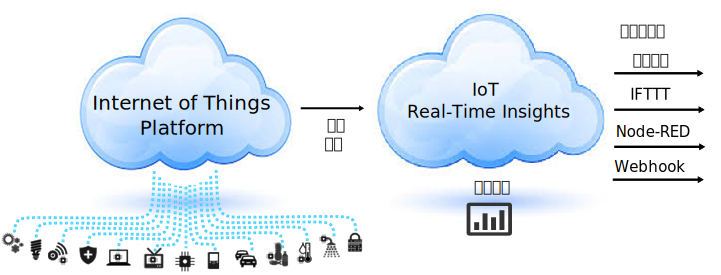

---

copyright:
  years: 2015,2016

---

{:new_window: target="_blank"}
{:shortdesc: .shortdesc}

# 关于 {{site.data.keyword.iotrtinsights_short}}
{: #iotrtinsights_overview}
*上次更新时间：2016 年 2 月 11 日*

{{site.data.keyword.iotrtinsights_short}} 提供了实时分析引擎和分析编写功能，支持对 IoT 设备数据进行监控并赋予语境，能加快了解当前情况，改进决策并更好地响应出现的问题。
{:shortdesc}

## {{site.data.keyword.iotrtinsights_full}}
{: #iotrtinsights_concept}
{{site.data.keyword.iotrtinsights_short}} 使用基于规则的简单组合模型以及可扩展框架来帮助您利用 Internet of Things 数据，将这些数据与主资产数据相组合，分析上下文中的情境，以及自动响应以改进运营并提高可用性和服务级别。

{{site.data.keyword.iotrtinsights_short}} 连接到 {{site.data.keyword.bluemix}} Internet of Things ({{site.data.keyword.iot_short}}) 服务，以获取实时设备数据订阅源。入局数据通过虚拟数据模型进行解释，此模型可使用来自资产管理系统（例如，IBM Maximo&reg; Asset Management）的主资产数据进行扩充。

此外，用户定义的规则会应用于实时流式采集数据，以确定需要关注的情况。通过操作引擎，您可定义对检测到的情况的自动响应，例如发送电子邮件、触发 IFTTT 配方、执行 Node-RED 工作流程或使用 Webhook 来连接到各种 Web Service。  

最后，实时数据还会显示在 IoT 设备位置、数据、度量值和警报一览视图的可配置仪表板中。

