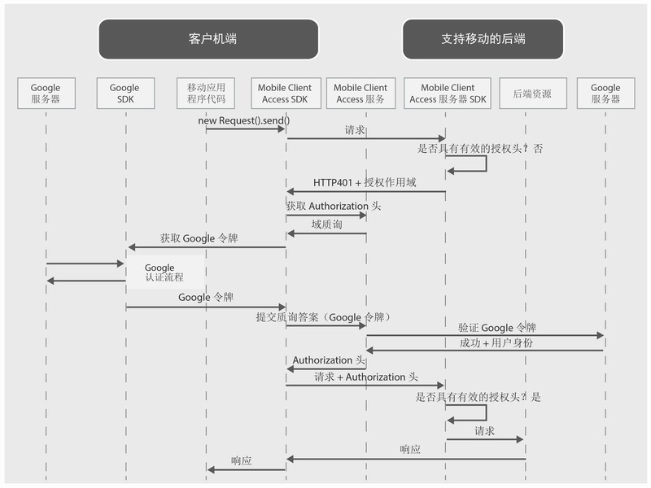

---

copyright:
  years: 2015, 2016
  
---

# 使用 Google 认证用户
{: #google-auth}
您可以将 {{site.data.keyword.amashort}} 服务配置为将 Google 用作身份提供者来保护资源。然后，您的移动应用程序用户可以使用自己的 Google 凭证进行认证。

**重要信息**：您无需单独安装 Google SDK。配置 {{site.data.keyword.amashort}} 客户端 SDK 时，依赖关系管理器会自动安装 Google SDK。

## {{site.data.keyword.amashort}} 流程
{: #google-auth-overview}

请参阅以下简化图，以了解 {{site.data.keyword.amashort}} 如何与 Google 集成进行认证。

1. 使用 {{site.data.keyword.amashort}} SDK 对受 {{site.data.keyword.amashort}} 服务器 SDK 保护的后端资源发起请求。
* {{site.data.keyword.amashort}} 服务器 SDK 检测到未授权的请求，然后返回 HTTP 401 代码和授权作用域。
* {{site.data.keyword.amashort}} 客户端 SDK 自动检测到上述 HTTP 401 代码，然后启动认证过程。
* {{site.data.keyword.amashort}} 客户端 SDK 访问 {{site.data.keyword.amashort}} 服务，并要求发出 Authorization 头。
* {{site.data.keyword.amashort}} 服务通过提供认证质询，要求客户端先向 Google 进行认证。
* {{site.data.keyword.amashort}} 客户端 SDK 使用 Google SDK 来启动认证过程。成功认证后，Google SDK 将返回 Google 访问令牌。
* Google 访问令牌被视为认证质询回复。该令牌会发送到 {{site.data.keyword.amashort}} 服务。
* 该服务将向 Google 服务器验证认证质询回复。
* 如果验证成功，{{site.data.keyword.amashort}} 服务会生成 Authorization 头，并将其返回给 {{site.data.keyword.amashort}} 客户端 SDK。Authorization 头包含两个令牌：一个是访问令牌，用于包含访问许可权信息；一个是标识令牌，用于包含有关当前用户、设备和应用程序的信息。
* 从此刻开始，通过 {{site.data.keyword.amashort}} 客户端 SDK 发起的所有请求都具有新获取的 Authorization 头。
* {{site.data.keyword.amashort}} 客户端 SDK 自动重新发送触发了授权流程的原始请求。
* {{site.data.keyword.amashort}} 服务器 SDK 从请求中抽取 Authorization 头，通过 {{site.data.keyword.amashort}} 服务对其进行验证，然后授予对后端资源的访问权。

## 后续步骤
{: #google-auth-nextsteps}

* [在 Android 应用程序中启用 Google 认证](google-auth-android.html)
* [在 iOS 应用程序中启用 Google 认证](google-auth-ios.html)
* [在 Cordova 应用程序中启用 Google 认证](google-auth-cordova.html)
