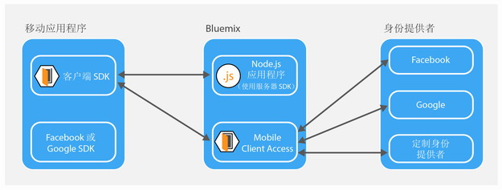

---

copyright:
  years: 2015, 2016

---

# 关于 {{site.data.keyword.amashort}}
{: #mca-overview}

{{site.data.keyword.amafull}} 服务为访问 {{site.data.keyword.Bluemix_notm}} 上所托管云资源的移动应用程序提供认证和监视服务。

您可以使用 {{site.data.keyword.amashort}} 服务，通过各种认证类型来保护在 {{site.data.keyword.Bluemix_notm}} 上托管的 Node.js 和 Liberty for Java&trade; 应用程序。通过在移动应用程序中安装 {{site.data.keyword.amashort}} SDK，您可以使用 {{site.data.keyword.amashort}} 服务提供的认证功能。监视和客户端日志数据将自动收集，并根据需要发送到 {{site.data.keyword.amashort}} 服务。使用 {{site.data.keyword.amashort}}“仪表板”可配置各种认证类型，并查看由客户端 SDK 收集的数据。

**注**：{{site.data.keyword.amashort}} 服务先前称为 Advanced Mobile Access。

## {{site.data.keyword.amashort}} 组件
{: #components}

* **{{site.data.keyword.amashort}}“仪表板”**：配置各种认证类型，并监视移动应用程序性能、分析、使用情况统计信息和设备日志。
* **{{site.data.keyword.amashort}} 客户端 SDK**：在移动应用程序中安装该组件，以使用 {{site.data.keyword.amashort}} 功能。支持的平台为：iOS 8+、Android 4+ 和 Cordova。
* **{{site.data.keyword.amashort}} 服务器 SDK**：保护在 {{site.data.keyword.Bluemix_notm}} 上托管的资源。目前支持的运行时为 Node.js 和 Liberty for Java&trade;。

## 认证类型
{: #authtypes}
可以在移动应用程序中使用以下类型的认证：
* **Facebook**：将 Facebook 用作身份提供者。用户使用自己的 Facebook 凭证登录到移动应用程序。
* **Google**：将 Google 用作身份提供者。用户使用自己的 Google+ 凭证登录到移动应用程序。
* **定制**：创建您自己的身份提供者。您可全面控制收集和验证的信息类型。

## {{site.data.keyword.amashort}} 体系结构概述
{: #architecture}

* 使用 {{site.data.keyword.amashort}} 服务器 SDK 保护云资源（Node.js 应用程序）。
* 使用 {{site.data.keyword.amashort}} 客户端 SDK 提供的 `Request` 类与受保护的云资源进行通信。
* {{site.data.keyword.amashort}} 服务器 SDK 检测到未授权的请求，然后返回 HTTP 401 授权质询。
* {{site.data.keyword.amashort}} 客户端 SDK 检测到 HTTP 401 授权质询，然后使用 {{site.data.keyword.amashort}} 服务自动启动认证过程。
* 使用 Facebook、Google 或定制认证进行认证。
* 成功认证后，{{site.data.keyword.amashort}} 会返回授权令牌。
* {{site.data.keyword.amashort}} 客户端 SDK 将该授权令牌自动添加到原始请求，并将该请求重新发送到云资源。
* {{site.data.keyword.amashort}} 服务器 SDK 从请求中抽取 accessToken，并使用 {{site.data.keyword.amashort}} 服务进行验证。
* 授予了访问权。响应会返回给移动应用程序。

## {{site.data.keyword.amashort}} 请求流程
{: #flow}
下图描述了请求是如何从 SDK 流向移动后端和身份提供者的。

1. 使用 {{site.data.keyword.amashort}} SDK 对受 {{site.data.keyword.amashort}} 服务器 SDK 保护的后端资源发起请求。
* {{site.data.keyword.amashort}} 服务器 SDK 检测到未授权的请求，然后返回 HTTP 401 和授权作用域。
* {{site.data.keyword.amashort}} 客户端 SDK 自动检测到上述 HTTP 401，然后启动认证过程。
* {{site.data.keyword.amashort}} 客户端 SDK 访问 {{site.data.keyword.amashort}} 服务，并要求发出 Authorization 头。
* {{site.data.keyword.amashort}} 服务要求客户端应用程序根据当前配置的认证类型，通过提供认证质询首先进行认证。
* {{site.data.keyword.amashort}} 客户端 SDK 执行以下任一操作：
   *  **Facebook 或 Google 认证**：自动处理认证质询（对于 Facebook 或 Google 认证）
   * **定制认证**：基于开发者提供的逻辑获取凭证。
* 如果配置了 Facebook 或 Google 认证，那么 {{site.data.keyword.amashort}} 客户端 SDK 会使用关联的 SDK 来获取 Facebook 或 Google 访问令牌。这些令牌将用作认证质询响应。
* 如果配置了定制认证，那么开发者必须获取认证质询回复，并将其提供给 {{site.data.keyword.amashort}} 客户端 SDK。
* 获取认证质询回复后，会将其发送给 {{site.data.keyword.amashort}} 服务。
* 该服务会通过相应的身份提供者（Facebook/Google/定制）来验证认证质询回复。
* 如果验证成功，{{site.data.keyword.amashort}} 服务会生成 Authorization 头，并将该头返回给 {{site.data.keyword.amashort}} 客户端 SDK。Authorization 头包含两个令牌：一个是访问令牌，用于包含访问许可权信息；一个是标识令牌，用于包含有关当前用户、设备或应用程序的信息。
* 从此刻开始，通过 {{site.data.keyword.amashort}} 客户端 SDK 发起的所有请求都具有新获取的 Authorization 头。
* {{site.data.keyword.amashort}} 客户端 SDK 自动重新发送触发了授权流程的原始请求。
* {{site.data.keyword.amashort}} 服务器 SDK 从请求中抽取 Authorization 头，通过 {{site.data.keyword.amashort}} 服务对该头进行验证，然后授予对后端资源的访问权。
