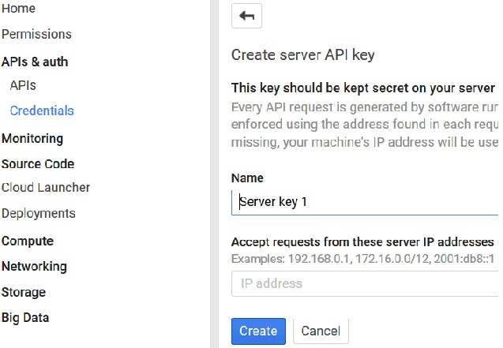

---

copyright:
 years: 2015, 2016

---

{:new_window: target="_blank"}
# 为 Google 云消息传递 (GCM) 配置凭证
{: #create-push-enable-gcm}

获取 Google 云消息传递 (GCM) 凭证，然后在“推送”仪表板上设置 Push Notification Service。

##获取发送方标识和 API 密钥

API 密钥以安全方式存储，并由 Push Notification Service 用于连接到 GCM 服务器，而发送方标识（项目编号）由客户机端的 Android SDK 使用。有关发送方标识的更多信息，请参阅 [Google Cloud Messaging](https://developers.google.com/cloud-messaging/gcm#arch)。

1. 从 [Google Dev Console](https://console.developers.google.com/start){: new_window} 获取一个 Google Development 帐户。有关 Google 云消息传递 (GCM) 的更多信息，请参阅 [Creating a Google API Project](https://developers.google.com/console/help/new/){: new_window}。

2. 在 Google Developers Console 中，创建一个新项目。例如，“hello world”。

	

3. 在 **Project** 名称中，输入项目的名称，然后单击 **Create** 按钮。
4. 单击 **Home**，以查看项目编号。记录您的项目编号。

	

	**注**：在您创建项目时，会创建项目编号（发送方标识）。在“推送”仪表板屏幕上设置 Push Notification Service 时会用到此编号。

5. 单击 **APIs & Auth**，然后单击 **Mobile APIs** 部分中的 **Cloud Messaging for Android**。

	

6. 单击 **APIs**，然后单击 **Enable API** 按钮，以为您的项目创建 API 密钥。

	

7. 转至 **APIs & Auths -> Credentials** 屏幕。单击 **Add Credentials**，然后单击 **API Key**。

	

8. 单击 **Server Key** 选项，以生成一个 GCM API 密钥，您在 Bluemix 的“推送”仪表板上会用到该密钥。
9. 在 **Name** 字段中，输入服务器 API 密钥的名称。

	

10. 单击 **Create** 按钮。这将显示 API 密钥。

	

11. 复制您的 GCM API 密钥，然后单击 **OK** 按钮。在 Bluemix 的“推送通知”仪表板配置屏幕上配置凭证时，您将需要项目编号（发送方标识）和 API 密钥。 
12. 后续步骤：为 Android 设置 Push Notification Service。

##为 Android 设置 Push Notification Service

**开始之前**

获取 GCM API 密钥和发送方标识（项目编号）。 

1. 在 Bluemix“仪表板”中打开后端应用程序，然后单击 IBM Push Notifications 服务，以打开 Push Notification Service 仪表板。
 
	

	这将显示“推送”仪表板。
	
	

2. 单击**设置 Push** 按钮，以配置 GCM 凭证。
1. 在**配置**选项卡上，转至 **Google 云消息传递**部分，然后配置发送方标识（GCM 项目编号）和 API 密钥。

4. 单击**保存**按钮。 
5. 后续步骤：[为 Android 启用通知](c_enable_push.html)。
