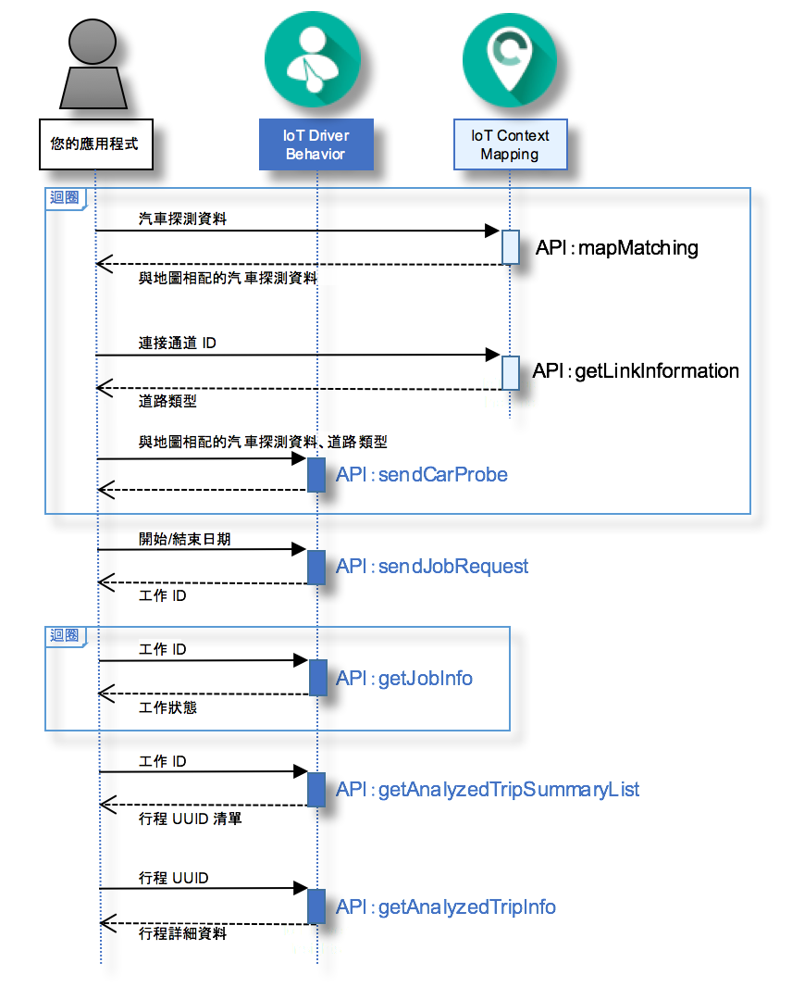

---

copyright:
  years: 2016

---

{:new_window: target="_blank"}
{:shortdesc: .shortdesc}
{:screen: .screen}
{:codeblock: .codeblock}
{:pre: .pre}

# 開始使用 {{site.data.keyword.iotdriverinsights_short}}
{: #gettingstartedtemplate}
*前次更新：2016 年 5 月 13 日*

有了 {{site.data.keyword.iotdriverinsights_full}}，您可以使用 {{site.data.keyword.iotdriverinsights_short}} API 來收集及分析汽車探測資料及環境定義資料，以便對駕駛人行為執行分析。
{:shortdesc}

在建立及部署未連結的服務實例之後，請遵循下列步驟，以整合您的應用程式與 {{site.data.keyword.iotdriverinsights_short}} API。 

1. （選用）將汽車探測資料傳送到 {{site.data.keyword.iotdriverinsights_short}} API 之前，您可以使用 {{site.data.keyword.iotmapinsights_short}} API，將其他資料新增至汽車探測資料。
     - 使用 `mapMatching` API 來取得與地圖相配的汽車探測資料。
        - [要求] 汽車探測資料
        - [回應] 與地圖相配的汽車探測資料
     - 使用 `getLinkInformation` API 來取得道路類型資料。
        - [要求] 連接通道 ID
        - [回應] 道路類型
2. 使用 `sendCarProbe` API 來傳送要儲存及分析的汽車探測資料。
   - [要求] 與地圖相配的汽車探測資料及道路類型
3. 使用 `sendJobRequest` API 來傳送用來分析汽車探測資料的工作要求。
   - [要求] 開始和結束日期
   - [回應] 工作 ID
4. 使用 `getJobInfo` API 來檢查工作狀態。
   - [要求] 工作 ID
   - [回應] 工作狀態
5. 使用 `getAnalyzedTripSummaryList` API 來取得已分析的行程摘要清單。
   - [要求] 工作 ID
   - [回應] 已分析的行程摘要清單
6. 使用 `getAnalyzedTripInfo` API 來取得詳細的已分析行程資訊。
   - [要求] 行程 UUID
   - [回應] 已分析行程的詳細資料 

下列序列圖顯示步驟的順序。

如需可分析行為及環境定義的詳細資料，請參閱[關於 {{site.data.keyword.iotdriverinsights_short}}](iotdriverinsights_overview.html) 主題。
請使用 [{{site.data.keyword.iotmapinsights_short}} / {{site.data.keyword.iotdriverinsights_short}} 指導教學第 1 部分](https://github.com/IBM-Bluemix/car-data-management){:new_window}來嘗試含有範例汽車探測資料的範例應用程式。

# 相關鏈結
{: #rellinks}
## 指導教學和範例
{: #samples}

* [{{site.data.keyword.iotmapinsights_short}} / {{site.data.keyword.iotdriverinsights_short}} 指導教學第 1 部分](https://github.com/IBM-Bluemix/car-data-management){:new_window}
* [{{site.data.keyword.iotmapinsights_short}} / {{site.data.keyword.iotdriverinsights_short}} 指導教學第 2 部分](https://github.com/IBM-Bluemix/map-driver-insights){:new_window}

## API 參考資料
{: #api}

* [API 文件](http://ibm.biz/IoTDriverBehavior_APIdoc){:new_window}

## 相關鏈結
{: #general}

* [開始使用 {{site.data.keyword.iotmapinsights_short}}](../IotMapInsights/index.html){:new_window}
* [開始使用 {{site.data.keyword.iot_full}}](https://www.ng.bluemix.net/docs/services/IoT/index.html){:new_window}
* [IBM developerWorks 上的 dW Answers](https://developer.ibm.com/answers/topics/iot-driver-behavior){:new_window}
* [Stack Overflow](http://stackoverflow.com/questions/tagged/iot-driver-behavior){:new_window}
* [Bluemix 服務的新增功能](http://www.ng.bluemix.net/docs/whatsnew/index.html#services_category){:new_window}

