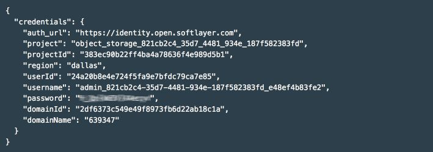

{:new_window: target="_blank"}

# 開始使用 {{site.data.keyword.objectstorageshort}}（測試版） {: #getting-started-with-object-storage} 

{{site.data.keyword.objectstoragefull}} 可讓您存取完全佈建的 Swift {{site.data.keyword.objectstorageshort}} 帳戶，以管理您的資料。Swift 提供完全分散式、API 可存取的儲存體平台。您可以直接在應用程式使用它或將它用於備份，讓它成為符合成本效益的橫向擴充儲存體。

IBM {{site.data.keyword.objectstorageshort}} for {{site.data.keyword.Bluemix_notm}} 將 OpenStack Identity (Keystone) 用於鑑別，而且可以使用 OpenStack Object Storage (Swift) API 第 1 版呼叫直接進行存取。IBM {{site.data.keyword.objectstorageshort}} 可以連結至 {{site.data.keyword.Bluemix_notm}} 應用程式，或可從 {{site.data.keyword.Bluemix_notm}} 應用程式外部進行存取。 

您可從下列位置取得使用 OpenStack Swift 和 Keystone 的相關資訊及文件：[OpenStack documentation site](http://docs.openstack.org){: new_window}。

{{site.data.keyword.objectstorageshort}} 架構圖如下：

[](http://www.stage1.ng.bluemix.net/docs/api/content/services/ObjectStorage/images/object_storage_solution_archectiture.png){: new_window}

*圖 1. {{site.data.keyword.objectstorageshort}} 架構圖*

**附註：**並不提供「提供者端加密」。用戶端應用程式需負責上傳之前的資料加密。

**附註：在 **{{site.data.keyword.Bluemix_notm}} {{site.data.keyword.objectstorageshort}} 服務發行之後，將從型錄中移除 {{site.data.keyword.objectstorageshort}} 服務「測試版」方案。寬限期過後，將移除使用「測試版」方案的服務實例。若要繼續使用 {{site.data.keyword.objectstorageshort}} 服務，請[更新您的定價方案](#changeplan)。 


## 在 {{site.data.keyword.Bluemix_notm}} 中建立 {{site.data.keyword.objectstorageshort}} 實例 {: #creating-object-storage-instance} 

### 如何建立 {{site.data.keyword.objectstorageshort}} 服務實例
1.	移至{{site.data.keyword.Bluemix_notm}} **型錄**標籤並在搜尋框中輸入 **{{site.data.keyword.objectstorageshort}}**，或者移至**服務**並選取**儲存體**。按一下 **{{site.data.keyword.objectstorageshort}}** 服務。 
2.	選取空間、應用程式、服務名稱和方案，然後按一下**建立**。
**附註：**如果您一開始在**應用程式**欄位中選擇**維持不連結**選項，在完成配置之後仍然可將服務實例連結至 {{site.data.keyword.Bluemix_notm}} 應用程式。請參閱下列指示。

## 從 {{site.data.keyword.Bluemix_notm}} 應用程式使用 {{site.data.keyword.objectstorageshort}} {: #using-object-storage-from-bluemix-app} 

### 如何在建立之後將 {{site.data.keyword.objectstorageshort}} 服務連結至應用程式 {: #bind-object-storage-to-application} 
1.	在 {{site.data.keyword.Bluemix_notm}} 儀表板中，選取您要連結的應用程式。
2.	在應用程式概觀中，按一下**連結服務或 API**。
3.	從服務清單中選取您的 {{site.data.keyword.objectstorageshort}} 實例，然後按一下**新增**。
4.	系統提示時，按一下**重新編譯打包**。您的應用程式必須重新編譯打包，才能使用新的服務。

### 連結環境定義

如果您要在連結環境定義中使用 {{site.data.keyword.objectstorageshort}}，雲端認證會間接透過應用程式連結程序來提供。在您順利將服務實例連結至應用程式之後，會在 `VCAP_SERVICES` 環境變數中新增一個類似於下列範例的配置。

    {
    "Object-Storage": [
    {
      "name": "Object-Storage - YP",
      "label": "Object-Storage",
      "plan": "Free",
      "credentials": {
         "auth_url": "https://identity.open.softlayer.com",
         "project": "object_storage_d049255b",
         "projectId": "0f47b41b06d047f9aae3b33f1db061ed",
         "region": "dallas",
         "userId": "ad78b2a3f843466988afd077731c61fc",
         "username": "user_202db1f8a7aa3f3ac51ec68f10dbe7dc29070bc7",
         "password": "K/jyIi2jR=1?D.TP",
         "domainId": "2df6373c549e49f8973fb6d22ab18c1a",
         "domainName": "639347"
        }
       }
      ]
    }

## 使用 {{site.data.keyword.objectstorageshort}} 使用者介面 {: #using-object-storage-ui}

### 使用者介面元素及導覽
若您的 {{site.data.keyword.objectstorageshort}} 已佈建，可以在 {{site.data.keyword.objectstorageshort}} for {{site.data.keyword.Bluemix_notm}} 服務實例儀表板中看到您的實例資訊。從儀表板中，選取 {{site.data.keyword.objectstorageshort}} 實例，以檢視含有其他詳細資訊的畫面。  
#### 使用情形資料
在畫面頂端，您會看到實例的儲存體使用情形資訊。它也會顯示**儲存體儲存器**的現行數目，以及所有儲存器中的**物件**總數。它會以 MB 為單位列出記憶體用量。**耗用的儲存體**是指已使用的現行空間數量。 
#### 動作
若要擷取最新的使用情形資料，請按一下**重新整理**按鈕。   
####物件瀏覽器 
畫面底端區段包含物件瀏覽器。使用物件瀏覽器來管理物件儲存體儲存器及物件。您可以建立儲存器、上傳檔案、刪除儲存器、刪除檔案，以及執行其他動作。

## 使用 Swift CLI 來存取 {{site.data.keyword.objectstorageshort}} {: #using-swift-cli}

您可以透過網際網路及 IBM {{site.data.keyword.Bluemix_notm}} 內的應用程式和虛擬機器來存取 {{site.data.keyword.objectstorageshort}} 服務。{{site.data.keyword.objectstorageshort}} 服務的常見使用案例如下：

* 從您的實例備份磁區資料
* 用來作為傳送大量資料時的媒介位置
* 在未直接連接的環境之間傳送資料
* 充當中央儲存庫

{{site.data.keyword.objectstorageshort}} 服務是以 OpenStack Swift 為基礎，並且可以使用任何相容的用戶端應用程式加以存取。本節說明如何使用 Python Swift 用戶端（其為 {{site.data.keyword.objectstorageshort}} API 及其延伸的指令行介面 (CLI)）來處理儲存器及檔案。

### 安裝 Swift 用戶端

安裝下列必備軟體（如果尚未安裝的話）。如需相關資訊，請參閱 [OpenStack 文件](http://docs.openstack.org/user-guide/common/cli_install_openstack_command_line_clients.html#install-the-prerequisite-software){: new_window}。 
* Python 2.7 或更新版本
* setuptools 套件
* pip 套件

使用 Python pip 來安裝 Python Swif 用戶端：

	sudo pip install python-swiftclient

### 設定用戶端

Swift 用戶端從下列環境變數取得鑑別資訊：
* ```OS_AUTH_URL``` 是端點 URL
* ```OS_USER_ID``` 是使用者名稱
* ```OS_PASSWORD``` 是密碼

如下所示設定鑑別資訊。 

	export OS_USER_ID=24a20b8e4e724f5fa9e7bfdc79ca7e85
	export OS_PASSWORD=aaa55AAAaaaaa]?,
	export OS_PROJECT_ID=383ec90b22ff4ba4a78636f4e989d5b1
	export OS_AUTH_URL=https://identity.open.softlayer.com/v3
	export OS_REGION_NAME=dallas
	export OS_IDENTITY_API_VERSION=3
	export OS_AUTH_VERSION=3

您可以從 {{site.data.keyword.objectstorageshort}} 使用者介面的**服務認證**頁面中找到 {{site.data.keyword.objectstorageshort}} 服務的認證值。 

**附註：**請確定當您為 Swift 用戶端配置環境變數 ```OS_AUTH_URL``` 時，已從 {{site.data.keyword.objectstorageshort}} 使用者介面的認證中，將 ```/v3`` 新增至 ```auth_url``。




*圖 2. {{site.data.keyword.objectstorageshort}} 服務認證*

### 處理儲存器

列出儲存器：

	swift list
	
建立儲存器：

	swift post <container_name>
	
列出儲存器的內容：

	swift list <container_name>

### 處理物件

#### 將檔案新增至儲存器

	swift upload <container_name> <file_name>

#### 將大於 5 GB 的檔案新增至儲存器

如果您要上傳的檔案大於 5 GB，則必須將其分割為較小的片段。藉由提供 ```-segment-size``` 參數，即可指示 Swift 用戶端來處理這類上傳作業：

	swift upload <container_name> <file_name> --segment-size <size_in_bytes>
	
每一個區段都會平行上傳到名為 ```<container_name>_segments``` 的個別儲存器。上傳所有區段之後，Swift 會建立資訊清單檔，讓這些區段可以從原始檔名為 ```<file_name>`` 的原始儲存器 ```<container_name>`` 中下載為單一檔案。

例如，下列指令會從名為 ```test_container``` 的儲存器中上傳名為 ```large_file`` 的檔案，區段大小為 ```1073741824``。

	swift upload test_container -S 1073741824 large_file

您可以執行下列指令來下載檔案：

	swift download test_container large_file

#### 下載檔案

	swift download <container_name> <file_name>
	
#### 將目錄新增至儲存器

Swift 沒有真正的目錄結構，但會使用命名來代表目錄階層。若要將目錄新增至儲存器，請執行下列指令：

	swift upload <container_name> <directory_name>
	
這個指令將上傳完整目錄結構作為相對路徑。例如，如果指定 ```/mnt/volume1```，目錄結構 mnt/volume1 將會附加至所有檔名以指出該目錄結構。

	
#### 下載目錄

若要下載目錄結構，請使用 ```-prefix``` 參數來表示您要下載的目錄或目錄結構。

	swift download <container_name> --prefix <directory>
	
#### 刪除檔案

	swift delete <container_name> <file_name>

### 建立暫時 URL

暫時 URL 是一個很長、難以猜測的 URL，可用來在指定的時段下載物件，而無需進一步鑑別。請使用下列步驟產生暫時 URL：

1. 識別您的鑑別帳戶。
2. 設定秘密金鑰。
3. 建立暫時 URL。

#### 識別您的鑑別帳戶

Swift ```stat``` 指令可列印您帳戶的相關資訊：

	swift stat

找到「帳戶」欄位並記下*帳戶*：之後的完整字串，包括 ```AUTH_```。

#### 設定秘密金鑰

此金鑰可以是您選取的任何項目，但最佳做法是選取一個很長、隨機且難以猜測的字串。

	swift post -m "Temp-URL-Key:<key>"

#### 建立暫時 URL

Swift ```tempurl``` 指令採用下列位置引數：

* [method] GET 可容許下載，PUT 可容許上傳
* [seconds] 暫時 URL 可供使用的時間（以秒為單位）
* [path] 物件的完整路徑（以 /v1/<auth_account>/<container_name>/<object_name> 表示）
* [key] 於步驟 2 中設定的金鑰

```
swift tempurl GET <seconds> <path> <key>
```

這個指令將傳回 URL，您可以將其附加至叢集名稱以取得完整 URL。請使用完整 URL 與任何相容的 HTTP 用戶端（例如 curl、wget 或 Firefox）搭配來下載物件。

## 使用 Swift REST API 來存取 {{site.data.keyword.objectstorageshort}} {: #using-swift-restapi}

您可以搭配使用 Swift REST API 與指令行用戶端介面（例如 cURL），或是從應用程式中呼叫 API。  

### {{site.data.keyword.objectstorageshort}} URL {: #access-points}

若要與 {{site.data.keyword.objectstorageshort}} API 進行互動，請如下所示建構 {{site.data.keyword.objectstorageshort}} URL：

	https://<access point>/<API version>/AUTH_<project ID>/<container namespace>/<object namespace>

例如：


*圖 3. {{site.data.keyword.objectstorageshort}} URL*

URL 包含五個部分。```<API version>``` 為 v1。您可以從 {{site.data.keyword.objectstorageshort}} 使用者介面中找到 {{site.data.keyword.objectstorageshort}} 的 ```<project ID>``、```<container namespace>`` 及 ```<object namespace>``。如需 ```<access point>``，請參閱下表： 


| **地區**    |     **內部存取點**                                        |     **公用存取點**                            |
|-------------|-----------------------------------------------------------|-----------------------------------------------|
| 達拉斯      | https://dal.objectstorage.service.open.networklayer.com/  | https://dal.objectstorage.open.softlayer.com/ | 
| 倫敦        | https://lon.objectstorage.service.open.networklayer.com/  | https://lon.objectstorage.open.softlayer.com/ |


*表 1. {{site.data.keyword.objectstorageshort}} 存取點*

您是從 {{site.data.keyword.Bluemix_notm}} 內部存取 {{site.data.keyword.objectstorageshort}} 服務時，請使用內部存取點；或者您是從 {{site.data.keyword.Bluemix_notm}} 外部存取 {{site.data.keyword.objectstorageshort}} 服務時，請使用公用存取點。

### {{site.data.keyword.objectstorageshort}} API

如需 {{site.data.keyword.objectstorageshort}} REST API 選項及範例的綜合性清單，請參閱 [OpenStack Swift API Complete Reference](http://developer.openstack.org/api-ref-objectstorage-v1.html){: new_window}。

## 跨多個地區使用 {{site.data.keyword.objectstorageshort}}{: #multi-regions}  

IBM {{site.data.keyword.objectstorageshort}} for {{site.data.keyword.Bluemix_notm}} 服務支援達拉斯和倫敦儲存體地區。這些儲存體地區與在其中建立 {{site.data.keyword.objectstorageshort}} 服務實例的 {{site.data.keyword.Bluemix_notm}} 地區（例如美國南部及英國）無關。例如，如果在美國南部的 {{site.data.keyword.Bluemix_notm}} 地區中建立 {{site.data.keyword.objectstorageshort}} 實例，便可以在達拉斯或倫敦儲存體地區中讀取及寫入資料。  

對於美國南部的 {{site.data.keyword.Bluemix_notm}} 地區，達拉斯儲存體地區是預設值。對於英國的 {{site.data.keyword.Bluemix_notm}} 地區，倫敦儲存體地區是預設值。{{site.data.keyword.objectstorageshort}} 使用者介面一律會啟動至 {{site.data.keyword.Bluemix_notm}} 地區的預設儲存體地區。若要切換地區，請按一下「{{site.data.keyword.objectstorageshort}} 地區」下拉清單，然後選擇其他地區。


*圖 4. {{site.data.keyword.objectstorageshort}} 變更地區*

**附註：**{{site.data.keyword.objectstorageshort}} 服務不支援跨儲存體地區抄寫。

### 多個地區存取

若要使用 {{site.data.keyword.objectstorageshort}} 服務，您必須[鑑別 OpenStack Keystone](#keystone-authentication)。順利鑑別之後，將在回應中提供 ```X-Subject-Token``` 及 {{site.data.keyword.objectstorageshort}} 端點。

例如，若要在達拉斯儲存體地區建立名為 ```my_container``` 的儲存器，請在 curl 指令中指定達拉斯存取點，如下所示：

	# curl -i https://dal.objectstorage.open.softlayer.com/v1/AUTH_3c9c89a2edbb458da74a9e81e215da9e/my_container -X PUT -H "Content-Length: 0" -H "X-Auth-Token: gAAAAABWlw5mwttbb_6G3LnTiGusyoOSEHXMG7oTnDYWN1vBZB6XAxUEhz4ehGkdw6Qm_I9ZFFXr8fwcc2KaEbpWbQoglhAvrYTXbrkn8MvErLdnbcT0XK2t5N7lEZyyKQlsgmQWcrch8VOO_OiSKKToORYR7luI-2TrR_JIVZm-8AAS6hLhk9"

	HTTP/1.1 201 Created
	Content-Length: 0
	Content-Type: text/html; charset=UTF-8
	X-Trans-Id: tx4a640ca81c7240ea8f812-00569712fc
	Date: Thu, 14 Jan 2016 03:16:13 GMT


若要在倫敦儲存體地區建立名為 ```my_container``` 的儲存器，請在 curl 指令中指定倫敦存取點，如下所示：

	# curl -i https://lon.objectstorage.open.softlayer.com/v1/AUTH_3c9c89a2edbb458da74a9e81e215da9e/my_container -X PUT -H "Content-Length: 0" -H "X-Auth-Token: gAAAAABWlw5mwttbb_6G3LnTiGusyoOSEHXMG7oTnDYWN1vBZB6XAxUEhz4ehGkdw6Qm_I9ZFFXr8fwcc2KaEbpWbQoglhAvrYTXbrkn8MvErLdnbcT0XK2t5N7lEZyyKQlsgmQWcrch8VOO_OiSKKToORYR7luI-2TrR_JIVZm-8AAS6hLhk9"

	HTTP/1.1 201 Created
	Content-Length: 0
	Content-Type: text/html; charset=UTF-8
	X-Trans-Id: tx4a640ca81c7240ea8f812-00569712fc
	Date: Thu, 14 Jan 2016 03:16:13 GMT

**附註：**從 Keystone 獲得的 ```X-Subject-Token``` 適用於各個儲存體地區。 

如需不同地區存取點的相關資訊，請參閱 [Object Storage 存取點](#access-points)表格。


## 瞭解鑑別及認證 {: #understanding-authentication-credentials}

### 產生 {{site.data.keyword.objectstorageshort}} 認證，而無需連結應用程式

若要產生用於 {{site.data.keyword.Bluemix_notm}} 應用程式外部的 {{site.data.keyword.objectstorageshort}} 雲端認證，您必須產生 {{site.data.keyword.objectstorageshort}} 實例的服務金鑰。您可以從使用者介面的資訊看板選取**服務認證**或使用 Cloud Foundry CLI（6.11.3 版或更新版本）來產生新的金鑰。在產生並擷取 {{site.data.keyword.objectstorageshort}} 實例的服務金鑰之後，您可以使用 Cloud Integration 資訊來要求 Keystone 記號，其作法是使用 OpenStack SDK 或 OpenStack Identity API，並開始使用 Swift 帳戶來管理物件。
   
若要利用 Cloud Foundry CLI 來建立金鑰，請登入並執行下列指令：
 
    cf create-service-key <object_storage_instance_name> <unique_name_for_this_key>

若要從 Cloud Foundry CLI 中擷取服務認證，請執行下列指令：

	cf service-key <object_storage_instance_name> <unique_name_for_this_key>


### 雲端專案及使用者
佈建新的 {{site.data.keyword.objectstorageshort}} 實例會在 IBM Public Cloud 中建立隔離的 Keystone 專案。當您將新的應用程式連結至 {{site.data.keyword.objectstorageshort}} 實例時，會建立具有專案存取權的新 Keystone 使用者。當您取消佈建實例時，會刪除專案及使用者。

### OpenStack Identity (Keystone) 第 3 版 {: #keystone-authentication}
認證結構包含一組完整的屬性，可讓您選擇最符合您應用程式的 OpenStack 記號要求方法或 OpenStack SDK。 
 
建議的第 3 版記號要求是 https://identity.open.softlayer.com/v3/auth/tokens 的 POST 要求，如下列 curl 指令中所示：

	curl -i \
	  -H "Content-Type: application/json" \
	  -d '
	{
		"auth": {
			"identity": {
				"methods": [
					"password"
				],
				"password": {
					"user": {
						"id": "ad78b2a3f843466988afd077731c61fc",
						"password": "K/jyIi2jR=1?D.TP"
					}
				}
			},
			"scope": {
				"project": {
					"id": "0f47b41b06d047f9aae3b33f1db061ed"
				}
			}
		}
	}' \
	  https://identity.open.softlayer.com/v3/auth/tokens ; echo

當您對 {{site.data.keyword.objectstorageshort}} 服務發出要求時，請使用回應標頭中 ```X-Subject-Token``` 欄位的值作為 ```X-Auth-Token`` 欄位。

範例回應如下：

	HTTP/1.1 201 Created
	X-Subject-Token: gAAAAABWlw5mwttbb_6G3LnTiGusyoOSEHXMG7oTnDYWN1vBZB6XAxUEhz4ehGkdw6Qm_I9ZFFXr8fwcc2KaEbpWbQoglhAvrYTXbrkn8MvErLdnbcT0XK2t5N7lEZyyKQlsgmQWcrch8VOO_OiSKKToORYR7luI-2TrR_JIVZm-8AAS6hLhk9
	Vary: X-Auth-Token
	Content-Type: application/json
	Content-Length: 960
	Date: Tue, 10 Jun 2014 20:40:14 GMT
	
	{"token": 
	{"audit_ids": ["ECwrVNWbSCqmEgPnu0YCRw"], "methods": ["password"],
	 "roles": [{"id": "c703057be878458588961ce9a0ce686b", "name": "admin"}],
	 "expires_at": "2014-06-10T21:40:14.360795Z", 
	 "project": {"domain": {"id": "default", "name": "Default"}, "id": "3d4c2c82bd5948f0bcab0cf3a7c9b48c", "name": "demo"}, 
	 "catalog": [
	 {
		"endpoints": [
			{
			"adminURL": "https://lon.objectstorage.service.open.networklayer.com/v1/AUTH_35a68d1d115b4a0f8c7975d4f96f256b",
			"id": "20cbfa6ff22b4a67a1484d30235bfc80",
			"internalURL": "https://lon.objectstorage.service.open.networklayer.com/v1/AUTH_35a68d1d115b4a0f8c7975d4f96f256b",
			"publicURL": "https://lon.objectstorage.open.softlayer.com/v1/AUTH_35a68d1d115b4a0f8c7975d4f96f256b",
			"region": "london"
			},
			{
			"adminURL": "https://dal.objectstorage.service.open.networklayer.com/v1/AUTH_35a68d1d115b4a0f8c7975d4f96f256b",
			"id": "4207049680fa4effbecd044c7448a8cb",
			"internalURL": "https://dal.objectstorage.service.open.networklayer.com/v1/AUTH_35a68d1d115b4a0f8c7975d4f96f256b",
			"publicURL": "https://dal.objectstorage.open.softlayer.com/v1/AUTH_35a68d1d115b4a0f8c7975d4f96f256b",
			"region": "dallas"
			}
			],
		"endpoints_links": [],
		"name": "swift",
		"type": "object-store"
		},
	 ], 
	 "extras": {},
	 "user": {"domain": {"id": "default", "name": "Default"}, "id": "3ec3164f750146be97f21559ee4d9c51", "name": "admin"},  "issued_at": "2014-06-10T20:40:14.360822Z"}}


{{site.data.keyword.objectstorageshort}} URL 位在「服務型錄」中。「服務型錄」包含在記號要求的回應主體中。回應是可用的 OpenStack 服務的完整型錄。請從選取「服務型錄」中類型為 ```object-store``` 的端點、符合認證中地區欄位的地區，以及內部介面 (`internalURL`)（從 {{site.data.keyword.Bluemix_notm}} 內部存取 {{site.data.keyword.objectstorageshort}} 服務時）或公用介面 (`publicURL`)（從 {{site.data.keyword.Bluemix_notm}} 外部存取 {{site.data.keyword.objectstorageshort}} 服務時）。


## 取消連結及取消佈建 {{site.data.keyword.objectstorageshort}} {: #deprovisioning-object-storage}

### 如何取消佈建 {{site.data.keyword.objectstorageshort}} 服務
1.	從 {{site.data.keyword.Bluemix_notm}} 儀表板中選取您的服務。  
2.	按一下右上角的齒輪圖示，然後選取**刪除服務**。
	
**警告：**如果您取消佈建 IBM {{site.data.keyword.objectstorageshort}} for {{site.data.keyword.Bluemix_notm}} 服務實例，則會刪除雲端專案及 Swift 帳戶。已取消佈建實例中的所有儲存器及物件會從 Swift 中刪除，而且無法還原。

### 取消連結應用程式或刪除服務金鑰

如果您從 {{site.data.keyword.objectstorageshort}} 實例取消連結應用程式，或是刪除服務金鑰，則會刪除認證。在取消佈建 {{site.data.keyword.objectstorageshort}} 實例之前，不會刪除 {{site.data.keyword.objectstorageshort}} 帳戶。[重新連結或建立新的服務金鑰](#bind-object-storage-to-application)，即可產生新的雲端認證。

## 常見問題 (FAQ){: #FAQ} 

### 價格如何視選擇的方案而改變？
定價會視選擇的方案而改變。如需其他定價資訊，請參閱 [IBM Bluemix 定價單](https://console.ng.bluemix.net/pricing/){: new_window}，或使用[計算機](https://console.ng.bluemix.net/?direct=classic/#/pricing/cloudOEPaneId=pricing&paneId=pricingSheet){: new_window}以取得其他詳細的預估值。

### 如何將方案從測試版變更為標準？ {: #changeplan}  
在 {{site.data.keyword.Bluemix_notm}} {{site.data.keyword.objectstorageshort}} 服務發行之後，將從型錄中移除 {{site.data.keyword.objectstorageshort}} 服務「測試版」方案。客戶服務實例不會自動從「測試版」移轉至「標準」方案。您必須遵循下列步驟來更新方案：

1.	從 {{site.data.keyword.objectstorageshort}} 使用者介面的左側導覽列中，按一下**方案**。
2.	選取**標準**作為新方案，然後按一下**儲存**。


*圖 5. {{site.data.keyword.objectstorageshort}} 變更定價方案*

您的服務實例及客戶資料會移至新方案。

您也可以使用指令行介面來變更付款方案。如需相關資訊，請參閱[如何變更您的方案](../../pricing/index.html#changing)  

**附註：**「測試版」方案服務實例無法移至「免費」方案。將會停用任何未移轉的服務實例，並在 60 天後予以刪除。 

### 可以用於 {{site.data.keyword.objectstorageshort}} 的帳戶及付款方案為何？
{{site.data.keyword.objectstorageshort}} 服務隨附了多個方案選項。從通用版次開始，目前提供了兩個方案（標準及免費）。「標準」方案僅適用於「{{site.data.keyword.Bluemix_notm}} 付費帳戶」（隨收隨付制或訂閱）以及 IBM 內部使用者。

仍然有效的試用帳戶可以使用「免費」方案， 該方案在「{{site.data.keyword.Bluemix_notm}} 組織」中只容許有一個實例。在 {{site.data.keyword.Bluemix_notm}} 的試用時間到期之後，將會停用相關聯的 {{site.data.keyword.objectstorageshort}} 服務實例，這表示不論透過 {{site.data.keyword.Bluemix_notm}} 使用者介面或指令行都無法存取儲存體帳戶。在 30 天的寬限期過後，將會清除您的 {{site.data.keyword.Bluemix_notm}} 帳戶，並刪除所有資料。為了避免資料流失，建議您儘快升級為「{{site.data.keyword.Bluemix_notm}} 付費帳戶」。若要升級您的帳戶，請按一下右上方的使用者管理功能表，然後選取**帳戶**，這會提供升級程序的相關指示。

「免費」方案中建立的實例可以利用[如何將方案從測試版變更為標準？](#changeplan)中所說明的步驟，升級至「標準」方案。若要更新為「標準」方案，相關聯的組織必須是「{{site.data.keyword.Bluemix_notm}} 付費帳戶」。{{site.data.keyword.objectstorageshort}} 實例的試用帳戶無法升級至「標準」方案，而「標準」方案中的實例無法降級至其他方案。

### {{site.data.keyword.objectstorageshort}} 的使用如何付費及計費？

{{site.data.keyword.objectstorageshort}} 服務只會向您收取所使用項目的費用。沒有最低費用、沒有設定費用，也沒有開始使用服務的承諾。API 要求或入埠資料網路資料流量不需付費。

使用 {{site.data.keyword.objectstorageshort}} 的計費是根據整個計費週期的平均每日儲存體用量。這包括透過 {{site.data.keyword.Bluemix_notm}} 組織帳戶所建立的儲存器中的所有物件資料。 

只要透過公用網路從任何物件儲存器讀取資料，就會收取「出埠資料傳送」費用。它是根據整個計費週期的平均每日公用出埠資料傳送進行計費。

{{site.data.keyword.objectstorageshort}} 的度量值元件定價如下：
* 儲存體用量 - 1 個月 1 GB $0.04
* 公用出埠資料傳送 - 1 個月 1 GB $0.09 

在計費週期結束時，{{site.data.keyword.Bluemix_notm}} 會自動計算現行計費期間的用量的費用。您可以透過 {{site.data.keyword.Bluemix_notm}} 報告來檢視現行計費期間的費用。

倫敦及達拉斯的標準服務方案的定價相同。

### 如何在 {{site.data.keyword.objectstorageshort}} 中執行資料抄寫？
{{site.data.keyword.objectstorageshort}} 服務會針對跨多個儲存節點抄寫的資料維護三份副本。如需相關資訊，請參閱 [OpenStack Swift Replication](http://docs.openstack.org/developer/swift/overview_replication.html){: new_window} 文件。

># 相關鏈結{:class="linklist"}
>## API 參考資料{:id="api"}
>* [OpenStack Object Storage (Swift) API v1](http://developer.openstack.org/api-ref-objectstorage-v1.html){: new_window}
>* [OpenStack Identity (Keystone) API v3.0](http://developer.openstack.org/api-ref-identity-v3.html){: new_window}
>
># 相關鏈結{:class="linklist"}
>## SDK{:id="sdk"}
>* [OpenStack Software Development Kits (SDK)](https://wiki.openstack.org/wiki/SDKs){: new_window}
>
># 相關鏈結{:class="linklist"}
>## 指導教學及範例{:id="samples"}
>* [Connecting to IBM Object Storage for Bluemix with Java](https://developer.ibm.com/recipes/tutorials/connecting-to-ibm-object-storage-for-bluemix-with-java/){: new_window}
>* [Use Python to access your Bluemix Object Storage](https://developer.ibm.com/recipes/tutorials/use-python-to-access-your-bluemix-object-storage/){: new_window}
>* [Bluemix Object Storage 社群](https://www.ibm.com/developerworks/community/groups/service/html/communityoverview?communityUuid=1b48459f-4091-43cb-bca4-37863606d989){: new_window}
>
># 相關鏈結{:class="linklist"}
>## 相容的執行時期 {:id="buildpacks"}
>* [Liberty for Java](https://www.ng.bluemix.net/docs/starters/liberty/index.html){: new_window}
>* [SDK for Node.js](https://www.ng.bluemix.net/docs/starters/nodejs/index.html){: new_window}
>* [Go](https://www.ng.bluemix.net/docs/starters/go/index.html){: new_window}
>* [PHP](https://www.ng.bluemix.net/docs/starters/php/index.html){: new_window}
>* [Python](https://www.ng.bluemix.net/docs/starters/python/index.html){: new_window}
>* [Ruby](https://www.ng.bluemix.net/docs/starters/rails/index.html){: new_window}
>* [社群建置套件](https://www.ng.bluemix.net/docs/starters/byob.html){: new_window}
>
># 相關鏈結 {:class="linklist"}
>## 相關鏈結 {:id="general"}
>* [IBM Bluemix 定價單](https://www.ng.bluemix.net/#/pricing){: new_window}
>* [IBM Bluemix 必要條件](https://developer.ibm.com/bluemix/support/#prereqs){: new_window}
>
>{:elementKind="article" id="rellinks"}
