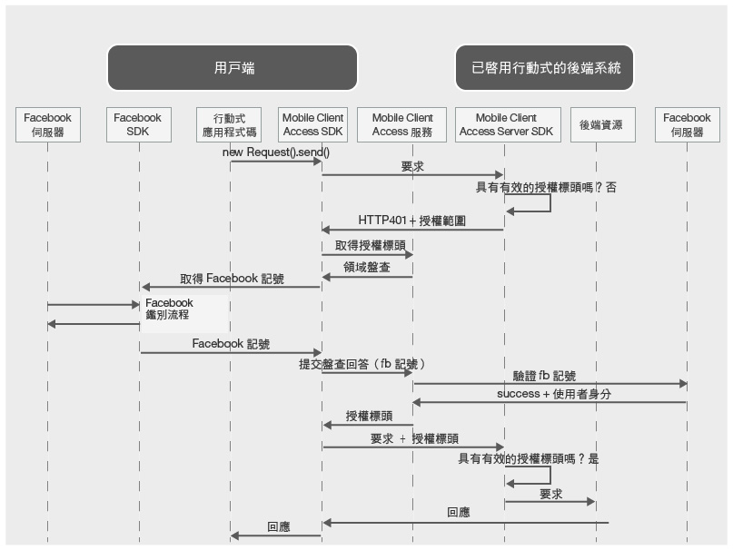

---

copyright:
  years: 2015, 2016

---

# 使用 Facebook 認證鑑別使用者
{: #facebook-auth-overview}
您可以配置 {{site.data.keyword.amashort}} 服務以使用 Facebook 作為身分提供者來保護資源。行動式應用程式使用者可以使用其 Facebook 認證進行鑑別。

**重要事項**：您不需要個別安裝 Facebook SDK。當您配置 {{site.data.keyword.amashort}} Client SDK 時，相依關係管理程式會自動安裝 Facebook SDK。

## {{site.data.keyword.amashort}} 要求流程
{: #mca-facebook-sequence}

請參閱下列簡化圖表，以瞭解 {{site.data.keyword.amashort}} 如何與 Facebook 整合來進行鑑別。

1. 使用 {{site.data.keyword.amashort}} SDK，對使用 {{site.data.keyword.amashort}} Server SDK 所保護的後端資源提出要求。
* {{site.data.keyword.amashort}} Server SDK 會偵測未獲授權的要求，並傳回 HTTP 401 代碼及授權範圍。
* {{site.data.keyword.amashort}} Client SDK 會自動偵測 HTTP 401 代碼，並啟動鑑別處理程序。
* {{site.data.keyword.amashort}} Client SDK 會聯絡 {{site.data.keyword.amashort}} 服務，並要求發出授權標頭。
* {{site.data.keyword.amashort}} 服務會提供鑑別盤查，以要求先向 Facebook 鑑別用戶端。
* {{site.data.keyword.amashort}} Client SDK 會使用 Facebook SDK 來啟動鑑別處理程序。成功鑑別之後，Facebook SDK 會傳回 Facebook 存取記號。
* Facebook 存取記號視為鑑別盤查回答。記號會傳送至 {{site.data.keyword.amashort}} 服務。
* 服務會向 Facebook 伺服器驗證鑑別盤查回答。
* 如果驗證成功，則 {{site.data.keyword.amashort}} 服務會產生授權標頭，並將它傳回給 {{site.data.keyword.amashort}} Client SDK。授權標頭包含兩個記號：包含存取權資訊的存取記號，以及包含現行使用者、裝置及應用程式相關資訊的 ID 記號。
* 從此時起，透過 {{site.data.keyword.amashort}} Client SDK 所提出的所有要求都會有新取得的授權標頭。
* {{site.data.keyword.amashort}} Client SDK 會自動重新傳送已觸發授權流程的原始要求。
* {{site.data.keyword.amashort}} Server SDK 會從要求中擷取授權標頭、向 {{site.data.keyword.amashort}} 服務驗證授權標頭，以及授與對後端資源的存取權。

## 從 Facebook 開發人員入口網站取得 Facebook 應用程式 ID
{: #facebook-appID}

若要開始使用 Facebook 作為身分提供者，您必須在「Facebook 開發人員入口網站」中建立應用程式。在此處理程序期間，您會取得「Facebook 應用程式 ID」（這是唯一 ID，可讓 Facebook 知道哪一個應用程式正在嘗試連接）。

1. 開啟 [Facebook 開發人員入口網站](https://developers.facebook.com)。

1. 按一下頂端功能表中的**我的應用程式**，然後選取**建立新的應用程式**。
如果呈現選取 iOS 或 Android 應用程式的選項，請挑選任一個，然後按下一個畫面上的**跳過並建立應用程式 ID**。

1. 設定您選擇的應用程式顯示名稱，並挑選種類。按一下**建立應用程式 ID** 以繼續。

1. 複製顯示的**應用程式 ID**。此值是「Facebook 應用程式 ID」。您需要這個值來配置行動式應用程式的 Facebook 鑑別。

## 後續步驟
{: #next-steps}

* [在 Android 應用程式中啟用 Facebook 鑑別](facebook-auth-android.html)
* [在 iOS 應用程式中啟用 Facebook 鑑別 (Swift SDK)](facebook-auth-ios-swift-sdk.html)
* [在 iOS 應用程式中啟用 Facebook 鑑別 (Objective-C SDK)](facebook-auth-ios.html)
* [在 Cordova 應用程式中啟用 Facebook 鑑別](facebook-auth-cordova.html)
