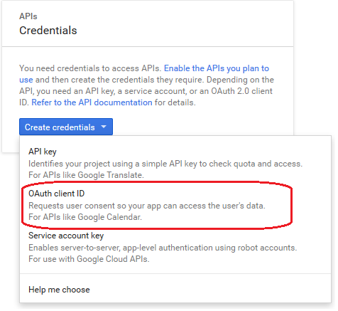

---

copyright:
  years: 2015, 2016

---

# 在 Android 應用程式中啟用 Google 鑑別
{: #google-auth-android}

## 開始之前
{: #before-you-begin}

* 您必須具有 {{site.data.keyword.amashort}} 所保護的資源，以及使用 {{site.data.keyword.amashort}} Client SDK 所檢測的 Android 專案。如需相關資訊，請參閱[開始使用 {{site.data.keyword.amashort}}](https://console.{DomainName}/docs/services/mobileaccess/getting-started.html) 及[設定 Android SDK](https://console.{DomainName}/docs/services/mobileaccess/getting-started-android.html)。  
* 使用 {{site.data.keyword.amashort}} Server SDK，手動保護後端應用程式。如需相關資訊，請參閱[保護資源](https://console.{DomainName}/docs/services/mobileaccess/protecting-resources.html)。

## 配置 Android 平台的 Google 專案
{: #google-auth-android-project}
若要開始使用 Google 作為身分提供者，請在 Google Developer Console 中建立專案。建立專案的一部分是取得 Google 用戶端 ID。Google 用戶端 ID 是 Google 鑑別所使用的您應用程式的唯一 ID。

1. 在 [Google Developer Console](https://console.developers.google.com) 中建立專案。
如果您已有專案，則可以跳過說明專案建立的步驟，並開始新增認證。
   1.    開啟新建專案功能表。 
         
         

   2.    按一下**建立專案**。
   
         


   1. 從**社交 API** 清單中，選擇 **Google+ API**。

     

   1. 從下一個畫面中，按一下**啟用**。

1. 選取**同意畫面**標籤，並提供向使用者顯示的產品名稱。其他值是選用的。按一下**儲存**。

    
    
1. 從**認證**清單中，選擇 OAuth 用戶端 ID。

     
     


1. 選取應用程式類型。按一下 **Android**。提供 Android 用戶端的有意義名稱。

1. 為了讓 Google 驗證應用程式確實性，您必須指定簽署憑證指紋。

	 **進一步瞭解 Android 安全：**Android OS 需要使用「開發人員」憑證來簽署 Android 裝置上安裝的所有應用程式。Android 應用程式可以使用兩種模式建置：除錯及發行。通常建議針對除錯及發行模式使用不同的憑證。用於以除錯模式簽署 Android 應用程式的憑證會與 Android SDK 組合。Android Studio 通常會自動安裝 Android SDK。當您要將應用程式發行到 Google Play 時，必須使用通常自行產生的另一個憑證來簽署應用程式。如需相關資訊，請參閱[簽署 Android 應用程式](http://developer.android.com/tools/publishing/app-signing.html)。

1. 包含開發環境憑證的金鑰儲存庫儲存在 `~/.android/debug.keystore` 檔案中。預設金鑰儲存庫密碼為 `android`。此憑證用來以除錯模式建置應用程式。

     1. 擷取簽署憑證指紋：

	```XML
	keytool -exportcert -alias androiddebugkey -keystore ~/.android/debug.keystore -list -v
	```
	您也可以使用相同的語法來擷取發行模式憑證的金鑰雜湊。請取代指令中的別名及金鑰儲存庫路徑。

1. 在**憑證指紋**下，找到開頭為 `SHA1` 的行。將透過執行 **keytool** 指令所取得的指紋複製到 Google Developer Console。

1. 指定 Android 應用程式的套件名稱。若要尋找 Android 應用程式的套件名稱，請在 Android Studio 中開啟 `AndroidManifest.xml` 檔案，並尋找：`<manifest package="{your-package-name}">`。完成時，請按一下**建立**。

即會出現對話框，顯示您的 Google 用戶端 ID。請記下此值。您需要在 {{site.data.keyword.Bluemix}} 上登錄此值。


## 配置 {{site.data.keyword.amashort}} 進行 Google 鑑別
{: #google-auth-android-config}

現在，您有適用於 Android 的「Google 用戶端 ID」，可以在「{{site.data.keyword.amashort}} 儀表板」中啟用 Google 鑑別。

1. 在 {{site.data.keyword.Bluemix_notm}} 儀表板中開啟應用程式。

1. 按一下**行動式選項**，並記下您的**路徑** (`applicationRoute`) 及 **應用程式 GUID** (`applicationGUID`)。起始設定 SDK 時，您需要這些值。

1. 按一下 {{site.data.keyword.amashort}} 磚。即會載入 {{site.data.keyword.amashort}} 儀表板。

1. 按一下 **Google** 磚。

1. 在**適用於 Android 的應用程式 ID** 中，指定適用於 Android 的「Google 用戶端 ID」，然後按一下**儲存**。

## 配置 {{site.data.keyword.amashort}} Client SDK for Android
{: #google-auth-android-sdk}

1. 回到 Android Studio。

1. 開啟應用程式模組的 `build.gradle` 檔案。

	Android 專案可能會有兩個 `build.gradle` 檔案：一個用於專案，另一個用於應用程式模組。請使用應用程式模組。

  尋找 dependencies 區段，並新增 Client SDK 的編譯相依關係：

	```Gradle
	dependencies {
		compile group: 'com.ibm.mobilefirstplatform.clientsdk.android',    
        name:'googleauthentication',
        version: '2.+',
        ext: 'aar',
        transitive: true
    	// other dependencies  
	}
	```

	您可以移除對 `com.ibm.mobilefirstplatform.clientsdk.android` 群組的 `core` 模組的相依關係（如果已有的話）。`googleauthentication` 模組會為您自動下載它。`googleauthentication` 模組會下載 Google SDK，並在 Android 專案中進行安裝。

1. 按一下**工具 > Android > 將專案與 Gradle 檔案同步化**，以將專案與 Gradle 同步化。

1. 開啟 Android 專案的 `AndroidManifest.xml` 檔案。

1. 在 `<manifest>` 元素下，新增網際網路存取權：

	```XML
	<uses-permission android:name="android.permission.INTERNET" />
	<uses-permission android:name="android.permission.GET_ACCOUNTS" />
	<uses-permission android:name="android.permission.USE_CREDENTIALS" />
	```

1. 若要使用 {{site.data.keyword.amashort}} Client SDK，您必須傳遞 context、applicationGUID 及 applicationRoute 參數來進行起始設定。

	放置起始設定碼的一般（但非強制）位置是在 Android 應用程式中主要活動的 onCreate 方法。

1. 起始設定 Client SDK，並登錄 Google 鑑別管理程式。將 *applicationRoute* 及 *applicationGUID* 取代為來自儀表板中**行動式選項**區段的**路徑**及**應用程式 GUID** 值。

	```Java
	BMSClient.getInstance().initialize(getApplicationContext(),
					"applicationRoute",
					"applicationGUID");

	GoogleAuthenticationManager.getInstance().register(this);
	```

1. 將下列程式碼新增至「活動」：

	```Java
	@Override
	protected void onActivityResult(int requestCode, int resultCode, Intent data) {
		super.onActivityResult(requestCode, resultCode, data);
		GoogleAuthenticationManager.getInstance()
			.onActivityResultCalled(requestCode, resultCode, data);
	}
	```

## 測試鑑別
{: #google-auth-android-test}
起始設定 Client SDK 並登錄「Google 鑑別管理程式」之後，即可開始對行動式後端提出要求。

### 開始之前
{: #google-auth-android-testing-before}
您必須具有使用 MobileFirst Services Starter 樣板所建立的行動式後端，並在 `/protected` 端點已具有 {{site.data.keyword.amashort}} 所保護的資源。如需相關資訊，請參閱[保護資源](https://console.{DomainName}/docs/services/mobileaccess/protecting-resources.html)。

1. 開啟 `{applicationRoute}/protected`（例如：`http://my-mobile-backend.mybluemix.net/protected`），嘗試在桌面瀏覽器中將要求傳送給行動式後端的受保護端點。
 使用「MobileFirst Services 樣板」所建立之行動式後端的 `/protected` 端點是透過 {{site.data.keyword.amashort}} 進行保護。因此，只有使用 {{site.data.keyword.amashort}} Client SDK 所檢測的行動式應用程式才能存取它。因此，您會在桌面瀏覽器中看到 `Unauthorized`。

1. 使用 Android 應用程式以對相同的端點提出要求。起始設定 `BMSClient` 實例並登錄 `GoogleAuthenticationManager` 之後，請新增下列程式碼。

	```Java
	Request request = new Request("/protected", Request.GET);
	request.send(this, new ResponseListener() {
		@Override
		public void onSuccess (Response response) {
			Log.d("Myapp", "onSuccess :: " + response.getResponseText());
			Log.d("MyApp", AuthorizationManager.getInstance().getUserIdentity().toString());
		}
		@Override
		public void onFailure (Response response, Throwable t, JSONObject extendedInfo) {
			if (null != t) {
				Log.d("Myapp", "onFailure :: " + t.getMessage());
			} else if (null != extendedInfo) {
				Log.d("Myapp", "onFailure :: " + extendedInfo.toString());
			} else {
				Log.d("Myapp", "onFailure :: " + response.getResponseText());
			}
		}
	});
```

1. 執行您的應用程式。即會蹦現「Google 登入」畫面。登入之後，應用程式會要求資源的存取權：

	

	根據 Android 裝置以及目前是否登入 Google，您可能會有不同的使用者介面。

  按一下**確定**，即會授權 {{site.data.keyword.amashort}} 使用 Google 使用者身分來進行鑑別。

1. 	要求成功之後，您會在 LogCat 工具中看到下列輸出：

	

1. 您也可以新增下列程式碼，來新增登出功能：

 ```Java
 GoogleAuthenticationManager.getInstance().logout(getApplicationContext(),, listener);
 ```

 如果您在使用者使用 Google 登入之後呼叫此程式碼，則會將使用者登出 Google。使用者嘗試再次登入時，必須選取將用來再次登入的 Google 帳戶。他們嘗試使用先前登入的 Google ID 進行登入時，不會提示使用者再次輸入其認證。若要讓系統再次提示輸入登入認證，使用者必須從 Android 裝置中移除其 Google 帳戶。

 傳遞給 logout 函數的 `listener` 值可以是空值。
