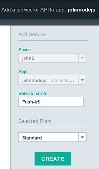

# 建立 Push 服務實例
{: #create-push-instance}

若要開始使用 {{site.data.keyword.IBM}} {{site.data.keyword.mobilepushshort}}，請先建立 {{site.data.keyword.Bluemix}} 應用程式；例如，Node.js 應用程式。然後，建立需要連結至此 Bluemix 應用程式之 Push 服務 ({{site.data.keyword.mobilepushfull}}) 的實例。另一種作法為移至 Bluemix 型錄的「樣板」區段，然後按一下 MobileFirst Services Starter。

**附註**：如果您已配置組織來管理環境，請選取該組織，而您要在該組織中建立針對行動式應用程式的執行時期及服務。

1. 如果您沒有 Bluemix 應用程式，則需要予以建立（例如，Node.js 應用程式）。若要建立 Bluemix 應用程式，請移至 Bluemix 儀表板，然後按一下**建立應用程式**。

	**附註**：如果已有應用程式，請移至步驟 7 來新增服務。

1. 從**選擇應用程式範本**中，按一下 **WEB**。

3. 在**選取起點**區域中，選取 **SDK for Node.js**，然後按一下**繼續**。

4. 從**空間**下拉功能表中，選取您的組織空間。
1. 在**名稱**中，輸入您應用程式的名稱，然後在主機中輸入主機名稱。

1. 從**選取的方案**下拉功能表中選取方案，然後按一下**建立**按鈕。請等待應用程式編譯打包。

1. 按一下**概觀**鏈結。
1. 按一下**新增服務**。即會顯示「型錄」畫面。

1. 選取 **IBM Push Notifications：**，然後從**空間**下拉功能表中，選取您的組織。
1. 在**服務**名稱中，輸入 Push Notification Service 名稱。

1. 在**選取的方案**中選取方案，然後按一下**建立**按鈕。

1. 按一下**是**，以重新編譯打包應用程式。

1. 按一下 **Push Notifications**，以顯示 Push Notifications 儀表板。
