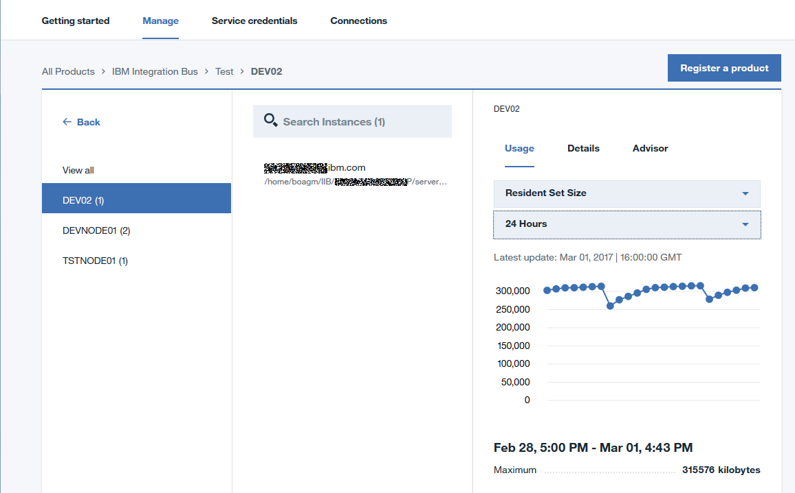

---

copyright:
  years: 2016, 2017
lastupdated: "2017-3-3"

---

<!-- Common attributes used in the template are defined as follows: -->
{:new_window: target="_blank"}
{:shortdesc: .shortdesc}

# Informationen zu IBM {{site.data.keyword.product-insights_short}}
{: #about_product-insights}

Bei {{site.data.keyword.product-insights_full}} handelt es sich um einen IBM Bluemix-Service, der Teil von IBM Connect to Cloud ist. Er stellt eine Verbindung zwischen Ihren lokalen IBM Softwareprodukten und Ihrem {{site.data.keyword.product-insights_short}}-Service her und stellt Einblicke in und Informationen zu Ihrem aktiven Bestand sowie zu Ihren Laufzeitnutzungsmetriken bereit.

{:shortdesc}

Der Service {{site.data.keyword.product-insights_short}} ist ein Einstiegspunkt; in Zukunft werden voraussichtlich weitere Funktionen folgen.

{{site.data.keyword.product-insights_short}} stellt die folgenden Features bereit:

* Registrierung Ihrer lokalen IBM Softwareprodukte bei IBM, insbesondere bei einem Bluemix-Service.
* Datenerfassung für verbundene lokale Produkte und zugeordnete Nutzungsdaten.
* Dashboard für Laufzeitnutzungsdaten für die Bereitstellung echter Einblicke in und Informationen zu Ihrer Produktnutzung und Ihrem Workload.

Führen Sie zur Nutzung der {{site.data.keyword.product-insights_full}}-Funktionen die folgenden Schritte aus:

1. Erstellen Sie mindestens einen Service in Bluemix for {{site.data.keyword.product-insights_short}}.
1. Führen Sie für Ihre lokalen IBM Softwareprodukte ein Upgrade auf die erforderlichen Release-Level durch und fügen Sie für jede Produktinstallation den Aktivierungscode hinzu. 
1. Konfigurieren Sie die Softwareinstallation mit den {{site.data.keyword.bluemix_short}}-Berechtigungsnachweisen für Ihre {{site.data.keyword.product-insights_short}}-Serviceinstanz. Ihre gesamten Daten werden mit diesen Berechtigungsnachweisen sicher gespeichert. Die Daten stehen nur Einzelpersonen mit den richtigen Berechtigungen für den Service zur Verfügung.

## Funktionsweise
{: #product-insights_howitworks}
Der Service {{site.data.keyword.product-insights_full}} wird mit Ihren lokalen IBM Softwareprodukten integriert, um Laufzeitproduktinformationen und Nutzungsmetriken zu erfassen und anzuzeigen. Anfänglich wird ein Subset von IBM Softwareprodukten zur Integration mit diesem Service aktiviert. Sind die lokalen Softwareprodukte registriert und verbunden, senden sie in regelmäßigen Abständen Startup- und Nutzungsinformationen. Die Informationen werden in Relation zu dieser Serviceinstanz über die konfigurierten Berechtigungsnachweise gespeichert. Mithilfe des Serviceinstanzdashboards können Sie die Informationen innerhalb von Bluemix anzeigen.

Die {{site.data.keyword.product-insights_short}}-Lösung beinhaltet mehrere Komponenten; dies ist in der folgenden Grafik zu sehen:

.  

## Organisationen und Bereiche
{: #product-insights_orgs}
Ihr {{site.data.keyword.product-insights_full}}-Service ist einer einzigen Bluemix-Organisation und einem einzigen Bluemix-Bereich zugeordnet und weist eindeutige Berechtigungsnachweise auf. Sie müssen mindestens eine Bluemix-Organisation und einen Bluemix-Bereich einrichten. Wenn Sie die Daten separieren möchten, um beispielsweise den Zugriff auf bestimmte Einzelpersonen zu begrenzen, können Sie mehrere Bereiche in einer Organisation mit einer einzigen Serviceinstanz pro Bereich erstellen. Jede Serviceinstanz weist eindeutige Berechtigungsnachweise auf, die Sie für Ihre IBM Softwareprodukte angeben müssen.

Informationen für die Produkte, die mit einer Reihe von Berechtigungsnachweisen konfiguriert sind, sind nur innerhalb des Service mit diesen Berechtigungsnachweisen sichtbar. Zur Trennung der Daten können mehrere Services erstellt werden, falls dies erforderlich sein sollte; dabei wird jeder Service mit eindeutigen Berechtigungsnachweisen erstellt.

## Service-Dashboard
{: #service_dashboard}
Nach der Erstellung Ihrer Serviceinstanz werden Sie an das Service-Dashboard weitergeleitet. Sie können immer zum Service-Dashboard zurückkehren; klicken Sie hierfür in Ihrem Organisationsdashboard auf das Servicesymbol. Über das Service-Dashboard haben Sie Zugriff auf Folgendes:

* Dokumentation zur Einführung
* Serviceberechtigungsnachweise, die für die Herstellung einer Verbindung zu Ihren lokalen Produkten erforderlich sind
* Einen Bestand unterstützter Produkte sowie sämtlicher Laufzeitinstanzen, die für die {{site.data.keyword.product-insights_short}}-Serviceinstanz registriert sind
* Nutzungsinformationen für verbundene Laufzeitinstanzen
* Produkt- und Umgebungsinformationen für verbundene Laufzeitinstanzen

Wenn auf der Registerkarte 'Verwalten' keine Produkte aufgeführt sind, klicken Sie auf die Option zum Registrieren eines Produkts, um eine Liste der unterstützten Produkte anzuzeigen und um auf bestimmte Details zur Herstellung einer Verbindung zu Produktinstanzen zuzugreifen.

## Ein Produkt registrieren
{: #product-insights_register}
Klicken Sie auf der Registerkarte **Verwalten** auf die Schaltfläche zum Registrieren eines Produkts, um eine Liste der unterstützten Produkte anzuzeigen. Blättern Sie zu Ihrem Produkt oder verwenden Sie das Suchfeld, um die Liste der Produkte zu filtern.

Um Anweisungen zur Registrierung einer Instanz eines Produkts anzuzeigen, müssen Sie es in der Liste auswählen.

Wenn Sie eine Verbindung zwischen einer Produktinstanz und dem Service {{site.data.keyword.product-insights_short}} herstellen, wird dieser auf der Registerkarte **Verwalten** des Dashboards angezeigt. In einem Dashboard können mehrere verbundene Produktinstanzen für unterschiedliche Produkte aufgeführt werden.

## Produktbestand
{: #product-insights_products}
Nach der Aktivierung der Produktinstanzen zum Senden von Daten an {{site.data.keyword.product-insights_short}} können Sie Ihren Bestand anzeigen, indem Sie die Option **Verwalten** im Service-Dashboard auswählen.

 

Bei {{site.data.keyword.product-insights_short}} unterscheidet sich ein Produkt von einer Produktinstanz. Ein Produkt hat einen Produktnamen, z. B. IBM MQ oder IBM WebSphere Application Server Liberty Network Deployment. Eine Produktinstanz ist die Darstellung eines Produkts nach dessen Installation und Aktivierung. Für einige Produkt gibt es mehrere Instanzen, die von ein und derselben Installation des Produkts ausgeführt werden. Beispiel: WebSphere Application Server Liberty Network Deployment kann mehrere Anwendungsserver ausführen, die aus einer einzigen Installation des Produkts erstellt werden.

Im Service-Dashboard werden die Namen der registrierten Produkte im Fenster **Produkte** unter *Alle anzeigen* aufgeführt. Verbundene Instanzen werden im Fenster **Instanzen** aufgeführt. In diesem Fenster sind Instanzen des Produkts enthalten, die im Fenster **Produkte** ausgewählt werden. Im folgenden Beispiel werden alle Produktinstanzen angezeigt, da die Option *Alle anzeigen* im Fenster 'Produkte' ausgewählt ist. In diesem Beispiel werden sechs Produkte angezeigt; einige von ihnen weisen mehrere verbundene Instanzen auf. Sie können die Liste der Instanzen mithilfe des Felds **Instanzen durchsuchen** filtern oder einen Produkteintrag auswählen. Wenn Sie Details zu einer Produktinstanz anzeigen möchten, wählen Sie den entsprechenden Eintrag im Fenster **Instanzen** aus.

Die Liste der Produktinstanzen, die angezeigt werden, wird beim Durchblättern gefiltert. Als Navigationshilfe wird der Suchpfad zu einer ausgewählten Instanz angezeigt.

 

## Informationen zur Produktinstanz
{: #product-insights_productinstances}
Ist eine Produktinstanz ausgewählt, wird das Fenster **Instanzdetails** gefüllt. In dem Fenster werden Nutzungsdaten, Produktdetails sowie Empfehlungen für die Produktinstanz auf der Registerkarte **Advisor** angezeigt.

## Nutzungsinformationen
{: #product-insights_usage}
Die Nutzungsinformationen werden auf der Registerkarte **Nutzung** angezeigt. Mithilfe der beiden Dropdown-Listen können Sie die Metrik für die Anzeige (sofern die Produktinstanz mehr als eine Metrik sendet) sowie den anzuzeigenden Zeitraum auswählen.

Sendet die Produktinstanz mehr als eine Metrik, verwenden Sie die erste Dropdown-Liste, um die Metrik für die Anzeige auszuwählen. Wählen Sie den Zeitraum für die Anzeige in der zweiten Dropdown-Liste aus. Die Optionen für den Zeitraum für die Abschnitte sind folgende: Letzte 24 Stunden, 1 Woche, 1 Monat, 6 Monate, 1 Jahr.

Im ersten Abschnitt sind das durchschnittliche Maximum, der Durchschnitt, das durchschnittliche Minimum sowie die Gesamtsumme der Metrikwerte über den ausgewählten Zeitraum zu sehen. Im zweiten Abschnitt ist ein Diagramm der Werte innerhalb des Zeitraums mit dem X-Achsenzeitraum zu sehen; dieser verändert sich in Abhängigkeit von dem ausgewählten Zeitraum. Beispiel: 'Letzte 24 Stunden' zeigt Diagrammpunkte für jede Stunde an, während '1 Woche' Diagrammpunkte für jeden Tag innerhalb dieser Woche anzeigt. Im letzten Abschnitt werden Maximum, Durchschnitt und Minimum für den ausgewählten Diagrammpunkt angezeigt. Um die Werte für einen weiteren Punkt im Diagramm anzuzeigen, müssen Sie die Zeitleiste an eine neue Position ziehen.

Wenn für diesen Zeitraum keine Daten verfügbar sind, wird eine Nachricht angezeigt. So stellt eine gestoppte Instanz beispielsweise keine Daten bereit; folglich werden für den Zeitraum, in dem sie gestoppt war, keine Daten angezeigt. Für weitere Zeiträume gibt es möglicherweise Nutzungsdaten, die angezeigt werden können. Ändern Sie den Zeitraum in der Dropdown-Liste, um weitere Zeiträume anzuzeigen.

Auf der Registerkarte **Details** werden die Produktinstanzinformationen angezeigt; dazu können die folgenden Positionen gehören:

* Produktname und -version
* Position, an der das Produkt installiert ist, einschließlich des Hostnamens und des Verzeichnisses
* Letzter Zeitpunkt, zu dem die Instanz Startup-Informationen gesendet hat
* Instanz-ID, falls das Produkt mehrere Instanzen innerhalb eines einzigen Verzeichnisses haben kann

 

Die Produktinstanz stellt außerdem die folgenden optionalen Informationen bereit:

* Eine Liste der installierten APARs. 
* Angaben zum Betriebssystem und der Betriebssystemversion, die sich auf der Registerkarte **Umgebung** befinden.

* Komponenten oder installierte Features, die auf der Registerkarte **Komponenten** zu sehen sind. In dem Beispiel wird die Registerkarte **Komponenten** nicht angezeigt, da die Instanz von IBM Product XYZ keine weiteren Komponenteninformationen bereitstellt.

* Die eindeutige ID für die Produktinstanz; diese ist eine Kombination aus Hostname, Verzeichnis und Instanz-ID.

 

## Suche 
{: #product-insights_search}
Das Fenster **Produktinstanz** stellt eine Basissuchfunktion zum Filtern der Produktliste bereit. Geben Sie im Suchfeld die Zeichenfolge für die Suche ein. Die Suche kann nur für Produktinstanzdaten durchgeführt werden (d. h. für die Angaben auf der Registerkarte **Details**).

<!-- If your service doc doesn't have a troubleshooting topic or section, you can add the following to your About: -->
<!-- Add a heading and content for how to get help and support. Use this template for beta and GA services:  -->
## Hilfe für {{site.data.keyword.product-insights_short}} anfordern
{: #gettinghelp}

Ausführliche Informationen zur Erstellung eines Service, zum Abrufen der Aktualisierungen für die aktivierten IBM Softwareprodukte sowie die erforderlichen Installations- und Konfigurationsschritte finden Sie bei der [technischen Community von {{site.data.keyword.product-insights_full}}](https://developer.ibm.com/product-insights/). Bei Problemen bei der oder Fragen zu der Verwendung von {{site.data.keyword.product-insights_short}} können Sie Fragen im Forenabschnitt der Community einsehen oder posten. Diese Fragen werden vom Entwickler- und Kundenprogrammteam bearbeitet.

Zum Einsehen oder Posten von Fragen können Sie auch das Stack Overflow- und das IBM DeveloperWorks dw Answers-Forum nutzen. Für Fragen zum Service sowie zu den Anweisungen zur Einführung nutzen Sie IBM developerWorks dW Answers. Wenn Sie in einem der beiden Foren eine Frage posten, wenden Sie die folgenden Tagging-Regeln an, damit die Bluemix-Entwicklerteams Ihre Frage unmittelbar identifizieren können.

* Für Posts an [Stack Overflow](http://stackoverflow.com/search?q=hybrid-connect+ibm-bluemix){:new_window} klicken, Frage mit "ibm-bluemix" und "productinsights" taggen.
* Für Posts an [IBM developerWorks dW Answers](https://developer.ibm.com/answers/smartspace/productinsights/){:new_window} klicken, Fragen mit "productinsights" oder "hybridconnect" taggen.

Weitere Informationen zur Nutzung der Foren finden Sie im Thema [Hilfe anfordern](https://www.{DomainName}/docs/support/index.html#getting-help).
