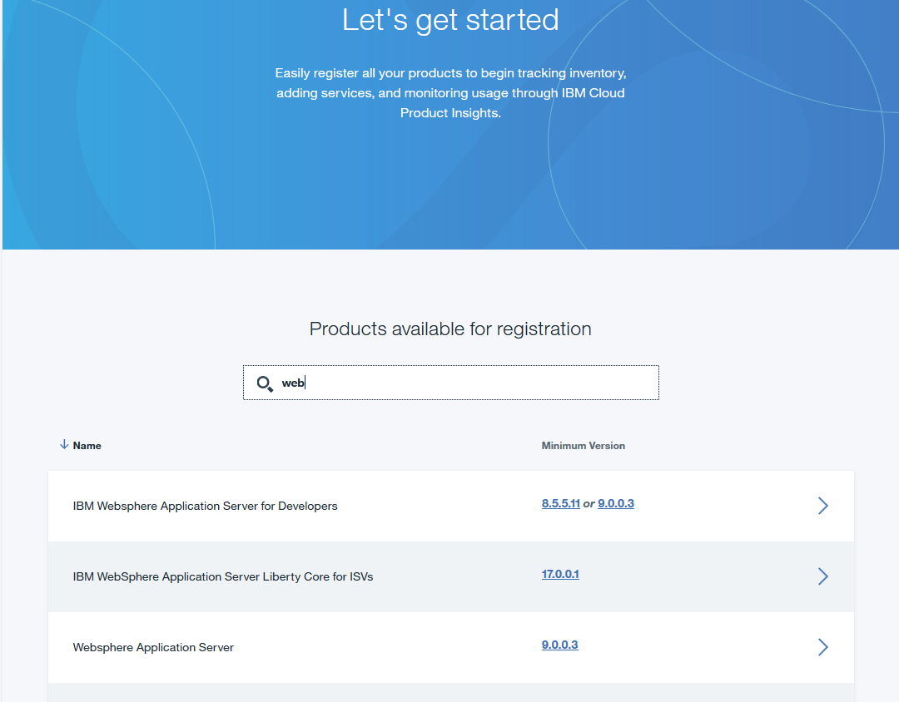

---

copyright:
  years: 2016, 2017
lastupdated: "2017-3-3"

---

<!-- Common attributes used in the template are defined as follows: -->
{:new_window: target="_blank"}
{:shortdesc: .shortdesc}

# Acerca de IBM {{site.data.keyword.product-insights_short}}
{: #about_product-insights}

{{site.data.keyword.product-insights_full}} es un servicio de IBM Bluemix, que forma parte de IBM Connect to Cloud. Conecta productos de software locales de IBM al servicio {{site.data.keyword.product-insights_short}} y proporciona detalles del inventario en ejecución y de las métricas de uso del entorno de tiempo de ejecución. 

{:shortdesc}

El servicio {{site.data.keyword.product-insights_short}} constituye un punto de partida y en el futuro se pueden añadir más funciones. 

{{site.data.keyword.product-insights_short}} ofrece las siguientes funciones: 

* Registro de productos de software locales de IBM con IBM, especialmente con un servicio de Bluemix. 
* Recopilación de datos correspondientes a productos locales conectados y datos de uso asociados. 
* Panel de control de datos de uso de entorno de tiempo de ejecución para proporcionar detalles reales sobre uso y carga de trabajo del producto. 

Para utilizar las funciones de {{site.data.keyword.product-insights_full}}, siga estos pasos: 

1. Cree al menos un servicio dentro de Bluemix para {{site.data.keyword.product-insights_short}}.
1. Actualice los productos de software locales de IBM a los niveles de release necesario y añada el código de habilitación para cada instalación de producto.  
1. Configure la instalación de software con las credenciales de {{site.data.keyword.bluemix_short}} para su instancia del servicio {{site.data.keyword.product-insights_short}}. Todos sus datos se almacenan de forma segura con estas credenciales. Los datos solo están disponibles para los usuarios con el permiso adecuado sobre el servicio. 

## Cómo funciona
{: #product-insights_howitworks}
El servicio {{site.data.keyword.product-insights_full}} se integra con los productos de software locales de IBM para obtener y mostrar información de productos de tiempo de ejecución y métricas de uso. Inicialmente hay un subconjunto de productos de software de IBM habilitados para su integración con este servicio. Cuando están registrados y conectados, los productos de software locales envían periódicamente información sobre arranque y uso. La información se guarda en relación con esta instancia de servicio mediante las credenciales configuradas. Puede utilizar el panel de control de la instancia del servicio para ver la información en Bluemix.

La solución {{site.data.keyword.product-insights_short}} incluye varios componentes, tal como se muestra en el siguiente gráfico: 

.  

## Organizaciones y espacios
{: #product-insights_orgs}
El servicio {{site.data.keyword.product-insights_full}} está asociado a una sola organización y espacio de Bluemix y tiene credenciales exclusivas. Debe configurar al menos una organización y espacio de Bluemix. Si desea separar los datos, por ejemplo para limitar el acceso a usuarios específicos, puede crear varios espacios dentro de una organización con una instancia de servicio en cada espacio. Cada instancia de servicio tiene credenciales exclusivas que debe proporcionar para sus productos de software IBM. 

La información correspondiente a los productos configurados con un conjunto de credenciales solo se puede ver dentro del servicio con dichas credenciales. Si es necesario, se pueden crear varios servicios para separar los datos, cada uno de ellos con credenciales exclusivas. 

## Panel de control de servicio
{: #service_dashboard}
Después de crear una instancia de servicio, se le dirigirá al panel de control del servicio. Siempre puede volver al panel de control del servicio pulsando el icono del servicio en el panel de control de la organización. Desde el panel de control del servicio, puede acceder a los siguientes elementos: 

* La documentación de iniciación
* Las credenciales de servicio que necesita para conectar los productos locales
* Un inventario de productos admitidos y las instancias de tiempo de ejecución registradas en la instancia del servicio {{site.data.keyword.product-insights_short}} 
* Información de uso de las instancias de tiempo de ejecución conectadas
* Información sobre el producto y el entorno para instancias de tiempo de ejecución conectadas

Si en el separador Gestionar no se muestran productos, pulse **Registrar un producto** para ver una lista de productos admitidos y acceder a detalles específicos sobre cómo conectar instancias del producto.

## Registro de un producto
{: #product-insights_register}
En el separador **Gestionar**, pulse **Registrar un producto** para ver una lista de los productos admitidos. Desplácese hasta su producto o utilice el campo de búsqueda para filtrar la lista de productos.

Para ver instrucciones sobre cómo registrar una instancia de un producto, selecciónelo en la lista. 

Cuando conecta una instancia de un producto al servicio {{site.data.keyword.product-insights_short}}, se muestra en el separador **Gestionar** del panel de control. Un panel de control puede mostrar varias instancias de productos conectadas a través de distintos productos. 

## Inventario de productos
{: #product-insights_products}
Después de habilitar las instancias del producto para que envíen datos a {{site.data.keyword.product-insights_short}}, puede ver el inventario seleccionando **Gestionar** en el panel de control del servicio. 

 

Para {{site.data.keyword.product-insights_short}}, un producto no es lo mismo que una instancia de producto. Un producto tiene un nombre de producto, como por ejemplo IBM MQ o IBM WebSphere Application Server Liberty Network Deployment. Una instancia de producto representa un producto después de que esté se haya instalado y se esté ejecutando. Algunos productos tienen varias instancias que se ejecutan desde dentro de la misma instalación del producto. Por ejemplo, WebSphere Application Server Liberty Network Deployment puede ejecutar varios servidores de aplicaciones creados a partir de una sola instalación del producto. 

En el panel de control del servicio, los nombres de los productos registrados se muestran bajo la opción *Ver todo* del panel **Productos**. Las instancias conectadas se muestran en el panel **Instancias**. Este panel contiene instancias de los productos seleccionados en el panel **Productos**. En el siguiente ejemplo, se muestran todas las instancias de productos porque la opción *Ver todo* está seleccionada en el panel Productos. En este ejemplo se muestran seis productos, algunos con varias instancias conectadas. Puede filtrar la lista de instancias utilizando el campo **Buscar instancias** o seleccionando una entrada de producto. Para ver detalles correspondientes a una instancia de producto, seleccione su entrada en el panel **Instancias**. 

La lista de instancias de productos que se muestran se filtra a medida que la examina. Para ayudar en la navegación, se muestra una vía de acceso examinada a una instancia seleccionada. 

 

## Información sobre instancias de productos
{: #product-insights_productinstances}
Cuando se selecciona una instancia de un producto, se llena el panel **Detalles de la instancia**. El panel muestra datos sobre uso, detalles del producto y recomendaciones para la instancia del producto en el separador **Asesor**. 

## Información de uso 
{: #product-insights_usage}
La información de uso se muestra en el separador **Uso**. Utilice las dos listas desplegables para seleccionar la métrica (si la instancia del producto envía más de una métrica) y el periodo de tiempo que desea ver. 

Si la instancia del producto envía más de una métrica, utilice la primera lista desplegable para seleccionar la métrica que se mostrará. Seleccione el periodo de tiempo que desea ver en la segunda lista desplegable. Las opciones para el periodo de tiempo para las secciones son Últimas 24 horas, 1 semana, 1 mes, 6 meses y 1 año. 

La primera sección muestra el promedio máximo, el promedio, el promedio mínimo y el total de los valores de la métrica durante el periodo de tiempo seleccionado. La segunda sección muestra un gráfico de los valores comprendidos dentro del periodo de tiempo con el periodo del eje x, que cambia según el periodo de tiempo seleccionado. Por ejemplo, Últimas 24 horas muestra puntos del gráfico para cada hora, mientras que 1 semana muestra puntos del gráfico para cada día de la semana. La sección final muestra el máximo, el promedio y el mínimo para el punto del gráfico seleccionado. Para ver los valores correspondientes a otro punto del gráfico, arrastre la barra de tiempo a otra posición. 

Aparece un mensaje si no se encuentran datos para ese periodo de tiempo. Por ejemplo, una instancia detenida no proporcionaría datos y no se mostrarían datos para el periodo de tiempo en el que se ha detenido. Otros periodos de tiempo pueden tener datos de uso que mostrar. Cambie el periodo de tiempo en la lista desplegable para ver otros periodos de tiempo. 

El separador **Detalles** muestra información sobre la instancia del producto, que puede incluir los siguientes elementos: 

* El nombre y la versión del producto
* La ubicación en la que está instalado el producto, incluido el nombre de host y el directorio
* La última vez que la instancia envió información al iniciarse
* El identificador de la instancia, si el producto tiene varias instancias dentro de un solo directorio

 

La instancia del producto también proporciona la siguiente información opcional: 

* Una lista de los APAR instalados.  
* El sistema operativo y su versión, que se muestran en el separador **Entorno**.

* Componentes o características instaladas, que se muestran en el separador **Componentes**. En el ejemplo no se muestra el separador **Componentes** porque la instancia de IBM Product XYZ no proporciona ninguna información sobre componentes adicionales.

* El identificador exclusivo de la instancia del producto, que es una combinación de nombre de host, directorio e identificador de la instancia. 

 

## Búsqueda 
{: #product-insights_search}
El panel **Instancia del producto** proporciona una función de búsqueda básica para filtrar la lista de productos. En el campo de búsqueda, escriba la serie de caracteres que desea utilizar para la búsqueda. La búsqueda solo se puede realizar para datos de la instancia del producto (es decir, la información del separador **Detalles**).

<!-- If your service doc doesn't have a troubleshooting topic or section, you can add the following to your About: -->
<!-- Add a heading and content for how to get help and support. Use this template for beta and GA services:  -->
## Obtención de ayuda para {{site.data.keyword.product-insights_short}}
{: #gettinghelp}

Encontrará información detallada sobre cómo crear un servicio y sobre cómo obtener las actualizaciones para los productos de software de IBM habilitados y pasos de instalación y configuración en la [Comunidad técnica de {{site.data.keyword.product-insights_full}}](https://developer.ibm.com/product-insights/). Si tiene problemas o preguntas cuando utilice {{site.data.keyword.product-insights_short}}, consulte o publique sus preguntas en la sección de foros de la comunidad. El equipo de desarrollo y de programas de clientes gestionará estas preguntas. 

También puede utilizar los foros Stack Overflow e IBM DeveloperWorks dw Answers para ver o publicar preguntas. Para preguntas sobre el servicio y para obtener instrucciones de inicio, utilice IBM developerWorks dW Answers. Cuando publique una pregunta en cualquiera de estos dos foros, aplique las siguientes reglas de etiquetado para que los equipos de desarrollo de Bluemix puedan ver fácilmente su pregunta. 

* Pulse para publicar en [Stack Overflow](http://stackoverflow.com/search?q=hybrid-connect+ibm-bluemix){:new_window}, etiquete su pregunta con "ibm-bluemix" y "productinsights".
* Pulse para publicar en [IBM developerWorks dW Answers](https://developer.ibm.com/answers/smartspace/productinsights/){:new_window}, etiquete sus preguntas con "productinsights" o "hybridconnect".

Para obtener más información sobre cómo utilizar los foros, consulte el tema sobre [Obtención de ayuda](https://www.{DomainName}/docs/support/index.html#getting-help). 
