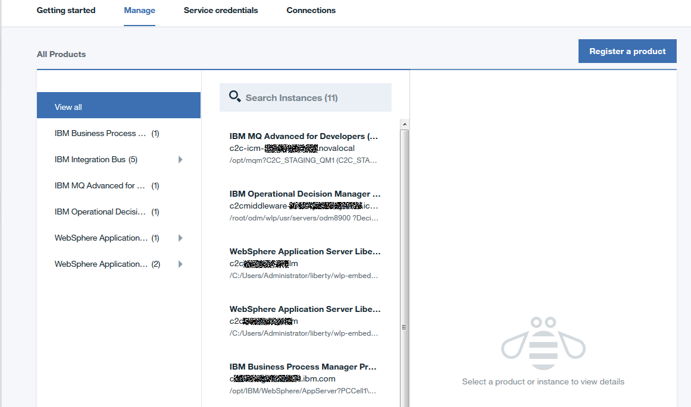
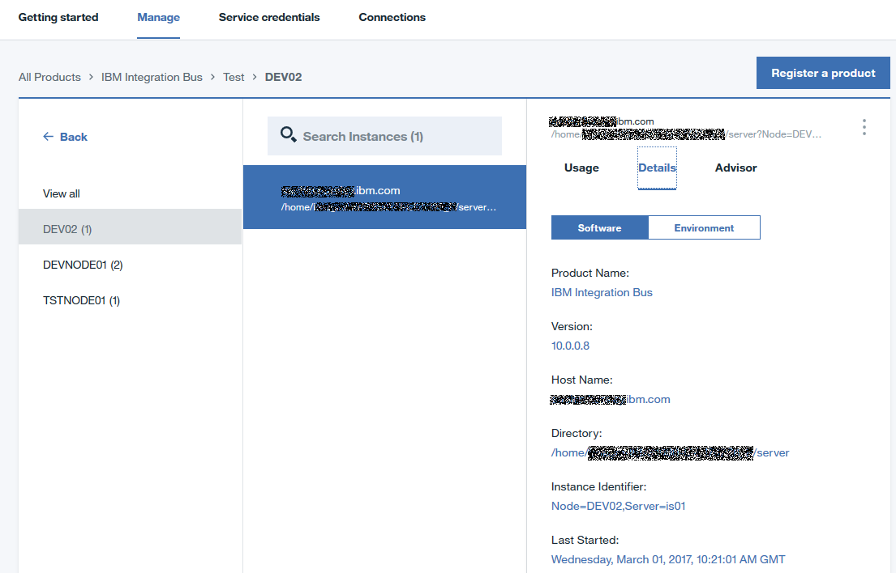

---

copyright:
  years: 2016, 2017
lastupdated: "2017-3-3"

---

<!-- Common attributes used in the template are defined as follows: -->
{:new_window: target="_blank"}
{:shortdesc: .shortdesc}

# A propos d'IBM {{site.data.keyword.product-insights_short}}
{: #about_product-insights}

{{site.data.keyword.product-insights_full}} est un service IBM Bluemix, qui fait partie d'IBM Connect to Cloud. Il permet de connecter vos produits logiciels IBM sur site à votre service {{site.data.keyword.product-insights_short}} et fournit des analyses sur l'inventaire en cours, ainsi que sur les mesures relatives à l'utilisation du contexte d'exécution.

{:shortdesc}

Le service {{site.data.keyword.product-insights_short}} est un point d'entrée, des fonctions supplémentaires peuvent être ajoutées ultérieurement. 

{{site.data.keyword.product-insights_short}} fournit les fonctions suivantes :

* Enregistrement de vos produits logiciels IBM sur site auprès d'IBM, en particulier avec un service Bluemix.
* Collecte de données pour les produits sur site connectés et les données d'utilisation associées. 
* Tableau de bord des données d'utilisation du contexte d'exécution visant à fournir une analyse réelle de l'utilisation et de la charge de travail de vos produits. 

Pour utiliser les fonctionnalités d'{{site.data.keyword.product-insights_full}}, procédez comme suit : 

1. Créez au moins un service dans Bluemix pour {{site.data.keyword.product-insights_short}}.
1. Mettez à niveau vos produits logiciels IBM sur site vers les niveaux d'édition requis et ajoutez le code d'intégration de chaque installation de produit.  
1. Configurez l'installation des logiciels avec les données d'identification {{site.data.keyword.bluemix_short}} de votre instance de service {{site.data.keyword.product-insights_short}}. Toutes les données sont stockées de manière sécurisée avec ces données d'identification. Les données sont disponibles uniquement auprès des individus dotés des droits appropriés sur le service.

## Fonctionnement
{: #product-insights_howitworks}
Le service {{site.data.keyword.product-insights_full}} s'intègre à vos produits logiciels IBM sur site afin de rassembler et afficher des informations sur les produits de votre contexte d'exécution, ainsi que les mesures liées à leur utilisation. Initialement, un sous-ensemble de produits logiciels IBM est activé pour s'intégrer avec ce service. Une fois enregistrés et connectés, les produits logiciels sur site envoient régulièrement des informations liées au démarrage et à leur utilisation. Ces informations sont stockées en lien avec cette instance de service grâce aux données d'identification configurées. Vous pouvez utiliser le tableau de bord de l'instance de service pour visualiser ces informations dans Bluemix.

La solution {{site.data.keyword.product-insights_short}} inclut plusieurs composants, comme indiqué dans la figure suivante : 

.  

## Organisations et espaces
{: #product-insights_orgs}
Votre service {{site.data.keyword.product-insights_full}} est associé à un seul espace et une seule organisation Bluemix, et est dotée de données d'identification uniques. Vous devez configurer au moins un espace et une organisation Bluemix. Si vous souhaitez séparer les données, par exemple pour limiter l'accès d'individus spécifiques, vous pouvez créer plusieurs espaces au sein d'une organisation avec une instance de service dans chaque espace. Chaque instance de service possède des données d'identification uniques que vous devez fournir à vos produits logiciels IBM.

Les informations des produits configurés avec un ensemble de données d'identification sont visibles uniquement dans le service doté de ces données d'identification. Il est possible de créer plusieurs services pour séparer les données si nécessaire, chacun d'entre eux étant doté de données d'identification uniques.

## Tableau de bord du service
{: #service_dashboard}
Après avoir créé votre instance de service, vous êtes dirigé vers le tableau de bord du service. Vous pouvez toujours revenir à ce tableau de bord en cliquant sur l'icône du service dans le tableau de bord de votre organisation. Le tableau de bord du service vous permet d'accéder aux éléments suivants : 

* La documentation d'initiation
* Les données d'identification du service dont vous avez besoin pour vous connecter à vos produits sur site 
* Un inventaire des produits pris en charge et des instances d'exécution enregistrées auprès de l'instance de service {{site.data.keyword.product-insights_short}} 
* Les informations sur l'utilisation des instances d'exécution connectées
* Les informations sur les produits et l'environnement des instances d'exécution connectées

Si aucun produit n'est indiqué dans l'onglet Manage, cliquez sur **Register a product** pour afficher une liste des produits pris en charge, ainsi que les détails spécifiques des accès pour la connexion aux instances de produit.

## Enregistrement d'un produit
{: #product-insights_register}
Dans l'onglet **Manage**, cliquez sur **Register a product** pour afficher une liste des produits pris en charge. Accédez à votre produit ou utilisez la zone de recherche pour filtrer la liste des produits.

Pour afficher les instructions relatives à l'enregistrement de l'instance d'un produit, sélectionnez ce dernier dans la liste. 

Lorsque vous connectez une instance de produit au service {{site.data.keyword.product-insights_short}}, elle apparaît dans l'onglet **Manage** du tableau de bord. Un tableau de bord peut répertorier plusieurs instances de produit connectées pour différents produits.

## Inventaire des produits
{: #product-insights_products}
Une fois que vous avez activé les instances de produit afin qu'elles envoient des données à {{site.data.keyword.product-insights_short}}, vous pouvez visualiser votre inventaire en sélectionnant l'onglet **Manage** dans le tableau de bord du service. 

 

Dans {{site.data.keyword.product-insights_short}}, un produit est différent d'une instance de produit. Un produit est doté d'un nom de produit, comme IBM MQ ou IBM WebSphere Application Server Liberty Network Deployment. Une instance de produit permet de représenter un produit une fois qu'il est installé et exécuté. Certains produits possèdent plusieurs instances qui sont exécutées à partir de la même installation du produit. Par exemple, WebSphere Application Server Liberty Network Deployment peut exécuter plusieurs serveurs d'applications créés à partir d'une seule installation du produit.

Dans le tableau de bord du service, les noms des produits enregistrés s'affichent sous *View all* dans le panneau **Products**. Les instances connectées sont indiquées dans le panneau **Instances**. Ce panneau contient les instances des produits sélectionnés dans le panneau **Products**. Dans l'exemple qui suit, toutes les instances de produits sont affichées car l'option *View all* est sélectionnée dans le panneau Products. Cet exemple montre six produits, dont certains possèdent plusieurs instances connectées. Vous pouvez filtrer la liste des instances à l'aide de la zone **Search Instances** ou en sélectionnant une entrée de produit. Pour afficher les détails d'une instance de produit, sélectionnez l'entrée correspondante dans le panneau **Instances**.

La liste des instances de produit qui s'affichent est filtrée en fonction du chemin d'accès. Dans le but de faciliter la navigation, le chemin d'accès à l'instance sélectionnée est indiqué. 

 

## Informations sur une instance de produit
{: #product-insights_productinstances}
Lorsqu'une instance de produit est sélectionnée, le panneau **Instance details** affiche les informations associées. Il indique les données d'utilisation et les détails du produit, ainsi que les recommandations liées à l'instance de produit dans un onglet **Advisor**.

## Informations d'utilisation
{: #product-insights_usage}
Les informations d'utilisation sont indiquées dans l'onglet **Usage**. Utilisez les deux listes déroulantes pour sélectionner la mesure(si l'instance de produit envoie plusieurs mesures) et la période à afficher. 

Si l'instance de produit envoie plusieurs mesures, utilisez la première liste déroulante pour sélectionner la mesure à afficher. Sélectionnez la période dans la seconde liste déroulante. Vous pouvez choisir parmi les dernières 24 heures, 1 semaine, 1 mois, 6 mois ou 1 an. 

La première section montre le maximum moyen, la moyenne, le minimum moyen et le total des valeurs de mesure sur la période sélectionnée. La seconde section affiche un diagramme des valeurs pendant la période sélectionnée, la période étant indiquée sur l'axe des X, qui change selon votre sélection.  Par exemple, si vous optez pour les dernières 24 heures, un point du diagramme indique chaque heure, alors que si vous choisissez une période d'une semaine, un point du diagramme représente chaque jour de la semaine. La section finale représente le maximum, la moyenne et le minimum du point de diagramme sélectionné. Pour visualiser les valeurs d'un autre point, faites glisser la barre de temps vers une nouvelle position.

Un message s'affiche si aucune donnée n'est disponible pour la période choisie. Par exemple, une instance arrêtée ne fournit aucune donnée, et aucune donnée ne s'affiche pour la période de l'arrêt. D'autres périodes peuvent fournir des données d'utilisation à afficher. Modifiez la période dans la liste déroulante pour visualiser d'autres périodes. 

L'onglet **Details** affiche des informations sur l'instance de produit qui peuvent inclure les éléments suivants : 

* Le nom et la version du produit
* L'emplacement d'installation du produit, avec le nom d'hôte et le répertoire
* L'heure du dernier envoi d'informations de la part de l'instance au démarrage
* L'identificateur de l'instance si le produit peut posséder plusieurs instances dans un seul répertoire

 

L'instance de produit fournit également les informations facultatives suivantes : 

* La liste des APAR installés. 
* Le système d'exploitation et sa version, qui s'affichent dans l'onglet **Environment**.

* Les composants ou les fonctions installées, qui sont indiqués dans l'onglet **Components**. L'exemple ne montre pas l'onglet **Components** car l'instance du produit IBM XYZ ne fournit pas d'informations sur d'éventuels composants supplémentaires. 
* L'identificateur unique de l'instance de produit, avec une combinaison du nom d'hôte, du répertoire et de l'identificateur de l'instance. 

 

## Recherche 
{: #product-insights_search}
Le panneau **Product instance** permet d'effectuer une recherche de base pour filtrer la liste des produits. Dans la zone de recherche, entrez la chaîne que vous voulez employer pour la recherche. La recherche ne peut être effectuée que sur les données de l'instance de produit (c'est-à-dire les informations figurant dans l'onglet **Details**). 

<!-- If your service doc doesn't have a troubleshooting topic or section, you can add the following to your About: -->
<!-- Add a heading and content for how to get help and support. Use this template for beta and GA services:  -->
## Obtenir de l'aide sur {{site.data.keyword.product-insights_short}}
{: #gettinghelp}

Vous trouvez des informations détaillées sur la création d'un service, l'obtention des mises à jour pour les produits logiciels IBM activés et les étapes relatives à l'installation et à la configuration sur le site de la communauté [{{site.data.keyword.product-insights_full}} Technical Community](https://developer.ibm.com/product-insights/). Si vous rencontrez des problèmes ou si vous avez des questions sur l'utilisation de {{site.data.keyword.product-insights_short}}, consultez le forum de la communauté ou envoyez vos questions dans cette section. Les questions sont traitées par l'équipe de développement et des programmes client. 

Vous pouvez également utiliser les forums Stack Overflow et IBM DeveloperWorks dw Answers pour consulter ou poser des questions. Pour toute question sur le service et les instructions de mise en route, consultez IBM developerWorks dW Answers. Lorsque vous envoyez une question sur l'un ou l'autre de ces forums, appliquez les règles d'étiquette suivantes pour permettre aux équipes de développement Bluemix de la voir facilement. 

* Cliquez ici pour envoyer une question sur [Stack Overflow](http://stackoverflow.com/search?q=hybrid-connect+ibm-bluemix){:new_window} et marquez votre question avec les étiquettes "ibm-bluemix" et "productinsights".
* Cliquez ici pour envoyer une question sur [IBM developerWorks dW Answers](https://developer.ibm.com/answers/smartspace/productinsights/){:new_window} et marquez votre question avec l'étiquette "productinsights" ou "hybridconnect".

Pour plus d'informations sur l'utilisation des forums, reportez-vous à la rubrique indiquant [comment obtenir de l'aide](https://www.{DomainName}/docs/support/index.html#getting-help).
