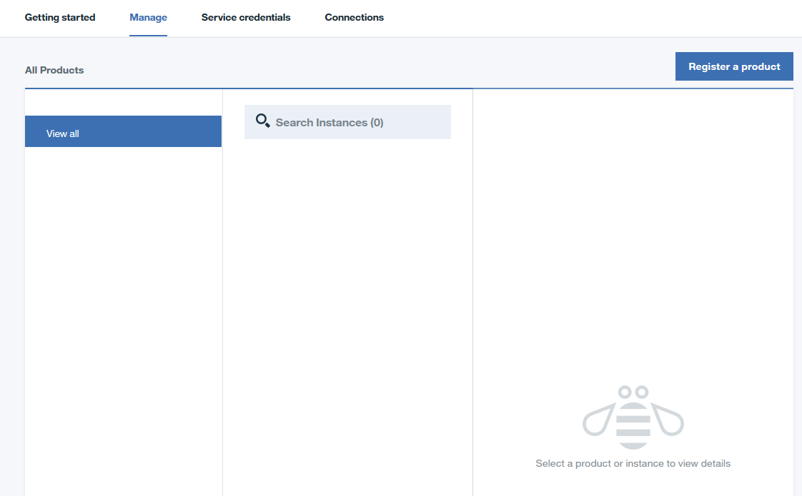

---

copyright:
  years: 2016, 2017
lastupdated: "2017-3-3"

---

<!-- Common attributes used in the template are defined as follows: -->
{:new_window: target="_blank"}
{:shortdesc: .shortdesc}

# IBM {{site.data.keyword.product-insights_short}} 정보
{: #about_product-insights}

{{site.data.keyword.product-insights_full}}는 IBM Bluemix 서비스이며 IBM Connect to Cloud의 일부분입니다. 이는 온프레미스 IBM 소프트웨어 제품을 {{site.data.keyword.product-insights_short}} 서비스에 연결하고 실행 인벤토리와 런타임 사용 메트릭에 대한 인사이트를 제공합니다.

{:shortdesc}

{{site.data.keyword.product-insights_short}} 서비스는 엔트리 포인트이며 향후 기능이 추가될 수 있습니다.

{{site.data.keyword.product-insights_short}}는 다음 기능을 제공합니다.

* 온프레미스 IBM 소프트웨어 제품을 IBM, 특히 Bluemix 서비스에 등록.
* 연결된 온프레미스 제품 및 연관된 사용 데이터에 대한 데이터 콜렉션.
* 제품 사용 및 워크로드에 대한 실제 인사이트를 제공하는 런타임 사용 데이터에 대한 대시보드.

{{site.data.keyword.product-insights_full}} 기능을 사용하려면 다음 단계를 완료하십시오.

1. Bluemix에서 {{site.data.keyword.product-insights_short}}를 위한 하나 이상의 서비스를 작성하십시오.
1. 온프레미스 IBM 소프트웨어 제품을 필수 릴리스 레벨로 업그레이드하고 각 제품 설치에 대한 인에이블먼트 코드를 추가하십시오. 
1. {{site.data.keyword.product-insights_short}} 서비스 인스턴스에 대한 {{site.data.keyword.bluemix_short}} 신임 정보를 사용하여 소프트웨어 설치를 구성하십시오. 모든 데이터가 이러한 신임 정보를 사용하여 안전하게 저장됩니다. 데이터는 서비스에 대한 올바른 권한을 가진 개인만 사용할 수 있습니다.

## 작동 방식
{: #product-insights_howitworks}
{{site.data.keyword.product-insights_full}} 서비스는 온프레미스 IBM 소프트웨어 제품과 통합되어 런타임 제품 정보 및 사용 메트릭을 수집하고 표시합니다. 처음에, 이 서비스와 통합되도록 IBM 소프트웨어 제품의 서브세트가 사용 설정됩니다. 등록 및 연결된 온프레미스 소프트웨어 제품은 시작과 사용 정보를 주기적으로 전송합니다. 구성된 신임 정보를 통해 이 서비스 인스턴스에 대한 정보가 저장됩니다. 서비스 인스턴스 대시보드를 사용하여 Bluemix 내에서 정보를 볼 수 있습니다.

{{site.data.keyword.product-insights_short}} 솔루션은 다음 그래픽과 같이 여러 컴포넌트를 포함합니다.

.  

## 조직 및 영역
{: #product-insights_orgs}
{{site.data.keyword.product-insights_full}} 서비스는 단일 Bluemix 조직 및 영역과 연관되어 있으며 고유 신임 정보를 갖습니다. 하나 이상의 Bluemix 조직 및 영역을 설정해야 합니다. 예를 들어, 액세스를 특정 개인으로 제한하기 위해 데이터를 구분하려는 경우, 각 영역마다 하나의 서비스 인스턴스가 있는 여러 영역을 하나의 조직 안에 작성할 수 있습니다. 각 서비스 인스턴스에는 IBM 소프트웨어 제품에 대해 제공해야 하는 고유 신임 정보가 있습니다.

신임 정보 세트로 구성된 제품에 대한 정보는 해당 신임 정보를 사용하는 서비스 내에서만 볼 수 있습니다. 필요한 경우, 각각 고유한 신임 정보를 갖는 여러 서비스를 작성하여 데이터를 구분할 수 있습니다.

## 서비스 대시보드
{: #service_dashboard}
서비스 인스턴스를 작성하면 서비스 대시보드로 이동합니다. 언제든 조직 대시보드에서 서비스 아이콘을 클릭하여 서비스 대시보드로 돌아갈 수 있습니다. 서비스 대시보드에서 다음 항목에 액세스할 수 있습니다.

* 시작하기 문서
* 온프레미스 제품의 연결에 필요한 서비스 신임 정보
* {{site.data.keyword.product-insights_short}} 서비스 인스턴스에 등록된 런타임 인스턴스 및 지원되는 제품의 인벤토리
* 연결된 런타임 인스턴스에 대한 사용 정보
* 연결된 런타임 인스턴스에 대한 제품 및 환경 정보

관리 탭에 나열된 제품이 없는 경우 **제품 등록**을 클릭하여 지원되는 제품 목록을 확인하고 제품 인스턴스 연결에 대한 특정 세부사항에 액세스하십시오.

## 제품 등록
{: #product-insights_register}
**관리** 탭에서 **제품 등록**을 클릭하여 지원되는 제품 목록을 확인하십시오. 스크롤하여 제품을 찾거나 검색 필드를 사용하여 제품 목록을 필터링하십시오.

제품 인스턴스 등록에 대한 지시사항을 보려면 해당 항목을 목록에서 선택하십시오.

제품 인스턴스를 {{site.data.keyword.product-insights_short}} 서비스에 연결하면 대시보드의 **관리** 탭에 표시됩니다. 대시보드는 여러 제품에 걸쳐 복수의 연결된 제품 인스턴스를 나열할 수 있습니다.

## 제품 인벤토리
{: #product-insights_products}
제품 인스턴스를 사용하도록 설정하여 데이터를 {{site.data.keyword.product-insights_short}}로 전송하면 서비스 대시보드에서 **관리**를 선택하여 인벤토리를 볼 수 있습니다.

 

{{site.data.keyword.product-insights_short}}에서 제품은 제품 인스턴스와 다릅니다. 제품에는 IBM MQ 또는 IBM WebSphere Application Server Liberty Network Deployment와 같은 제품 이름이 있습니다. 제품 인스턴스는 제품을 설치하고 실행한 후 제품을 나타내는 데 사용됩니다. 일부 제품에는 동일한 제품 설치 내에서 실행되는 여러 인스턴스가 있습니다. 예를 들어, WebSphere Application Server Liberty Network Deployment는 제품의 단일 설치에서 작성된 여러 애플리케이션 서버를 실행할 수 있습니다.

서비스 대시보드에서 등록된 제품의 이름은 **제품** 분할창의 *모두 보기* 선택사항 아래에 표시됩니다. 연결된 인스턴스는 **인스턴스** 분할창에 나열됩니다. 이 분할창에는 **제품** 분할창에서 선택한 제품의 인스턴스가 포함됩니다. 다음 예에서 *모두 보기* 선택사항이 제품 분할창에서 선택되어 있으므로 모든 제품 인스턴스가 표시됩니다. 이 예에서는 6개의 제품을 표시하며, 이 중 일부에는 여러 인스턴스가 연결되어 있습니다. **인스턴스 검색** 필드를 사용하거나 제품 항목을 선택하여 인스턴스 목록을 필터링할 수 있습니다. 제품 인스턴스에 대한 세부사항을 보려면 **인스턴스** 분할창에서 해당 항목을 선택하십시오.

찾아보기 시 표시된 제품 인스턴스의 목록이 필터링됩니다. 탐색을 돕기 위해, 선택한 인스턴스에 대한 과거의 찾아보기 경로가 표시됩니다.

 

## 제품 인스턴스 정보
{: #product-insights_productinstances}
제품 인스턴스를 선택하면 **인스턴스 세부사항** 분할창이 채워집니다. 이 분할창은 사용 데이터, 제품 세부사항 그리고 **어드바이저** 탭을 통해 제품 인스턴스에 대한 권장사항을 표시합니다.

## 사용 정보
{: #product-insights_usage}
사용 정보는 **사용** 탭에 표시됩니다. 두 개의 드롭 다운 목록을 사용하여 표시할 메트릭(제품 인스턴스가 둘 이상의 메트릭을 전송하는 경우) 및 표시할 기간을 선택하십시오.

제품 인스턴스가 둘 이상의 메트릭을 전송하는 경우 첫 번째 드롭 다운을 사용하여 표시할 메트릭을 선택하십시오. 두 번째 드롭 다운에서 표시할 기간을 선택하십시오. 섹션의 기간에 대한 옵션은 지난 24시간, 1주, 1개월, 6개월, 1년입니다.

첫 번째 섹션에는 선택한 기간에 대한 메트릭 값의 평균 최대, 평균, 평균 최소 및 총계가 표시됩니다. 두 번째 섹션에는 x축을 기간으로 하는 기간 내 값의 그래프가 표시되며 선택한 기간에 따라 변경됩니다. 예를 들어, 지난 24시간은 각 시간에 대한 그래프 점을 표시하는 반면 1주는 해당 주 내 각 요일에 대한 그래프 점을 표시합니다. 마지막 섹션에는 선택한 그래프 점의 최대값, 평균 및 최소값이 표시됩니다. 그래프에 다른 점의 값을 표시하려면 시간 표시줄을 새 위치로 끌어오십시오.

해당 기간에 대한 데이터가 없는 경우 메시지가 표시됩니다. 예를 들어, 중지된 인스턴스는 데이터를 제공하지 않으며 중지된 기간에 대한 데이터는 표시되지 않습니다. 다른 기간에는 표시할 사용 정보가 있을 수 있습니다. 다른 기간을 표시하려면 드롭 다운에서 기간을 변경하십시오.

**세부사항** 탭은 제품 인스턴스 정보를 표시하며 다음과 같은 항목을 포함할 수 있습니다.

* 제품 이름 및 버전
* 제품이 설치된 위치(호스트 이름 및 디렉토리 포함)
* 인스턴스가 시작 시 정보를 전송한 마지막 시간
* 인스턴스 ID(제품이 단일 디렉토리 내에 여러 인스턴스를 가질 경우)

 

제품 인스턴스는 다음 선택적 정보도 제공합니다.

* 설치된 APAR 목록. 
* **환경** 탭에 표시되는 운영 체제 및 해당 버전.

* **컴포넌트** 탭에 표시되는 컴포넌트 또는 설치된 기능. IBM 제품 XYZ의 인스턴스가 추가 컴포넌트 정보를 제공하지 않으므로 예에서는 **컴포넌트** 탭이 표시되지 않습니다.

* 호스트 이름, 디렉토리 및 인스턴스 ID의 조합인, 제품 인스턴스에 대한 고유 ID.

 

## 검색 
{: #product-insights_search}
**제품 인스턴스** 분할창에는 제품 목록을 필터링하는 기본 검색 기능이 제공됩니다. 검색 필드에 검색에 사용할 문자열을 입력하십시오. 검색은 제품 인스턴스 데이터(즉, **세부사항** 탭의 정보)에 대해서만 수행될 수 있습니다.

<!-- If your service doc doesn't have a troubleshooting topic or section, you can add the following to your About: -->
<!-- Add a heading and content for how to get help and support. Use this template for beta and GA services:  -->
## {{site.data.keyword.product-insights_short}}에 대한 도움 받기
{: #gettinghelp}

서비스 작성, 사용 가능한 IBM 소프트웨어 제품에 대한 업데이트 가져오기 및 설치와 구성 단계에 대한 자세한 정보는 [{{site.data.keyword.product-insights_full}}Technical Community](https://developer.ibm.com/product-insights/)에 있습니다. {{site.data.keyword.product-insights_short}}를 사용하면서 문제점 또는 질문이 있는 경우, 커뮤니티의 포럼 섹션에서 질문을 보거나 게시하십시오. 이러한 질문은 개발 및 고객 프로그램 팀에서 처리합니다.

또한 Stack Overflow 및 IBM DeveloperWorks dw Answers 포럼을 사용하여 질문을 보거나 게시할 수 있습니다. 서비스 및 시작하기 지시사항에 대한 질문은 IBM developerWorks dW Answers를 사용하십시오. 이 두 개의 포럼 중 하나에 질문을 게시하는 경우 Bluemix 개발 팀이 질문을 쉽게 볼 수 있도록 다음 태그 지정 규칙을 적용하십시오.

* [Stack Overflow](http://stackoverflow.com/search?q=hybrid-connect+ibm-bluemix){:new_window}에 게시하려면 클릭하고 "ibm-bluemix" 및 "productinsights"로 질문에 태그를 지정하십시오.
* [IBM developerWorks dW Answers](https://developer.ibm.com/answers/smartspace/productinsights/){:new_window}에 게시하려면 클릭하고 "productinsights" 또는 "hybridconnect"로 질문에 태그를 지정하십시오.

포럼 사용에 대한 자세한 정보는 [도움 받기](https://www.{DomainName}/docs/support/index.html#getting-help) 주제를 참조하십시오.
