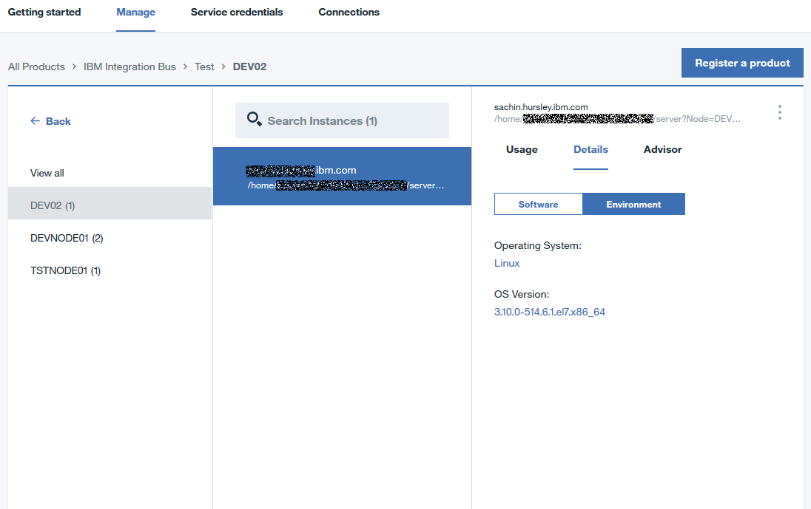
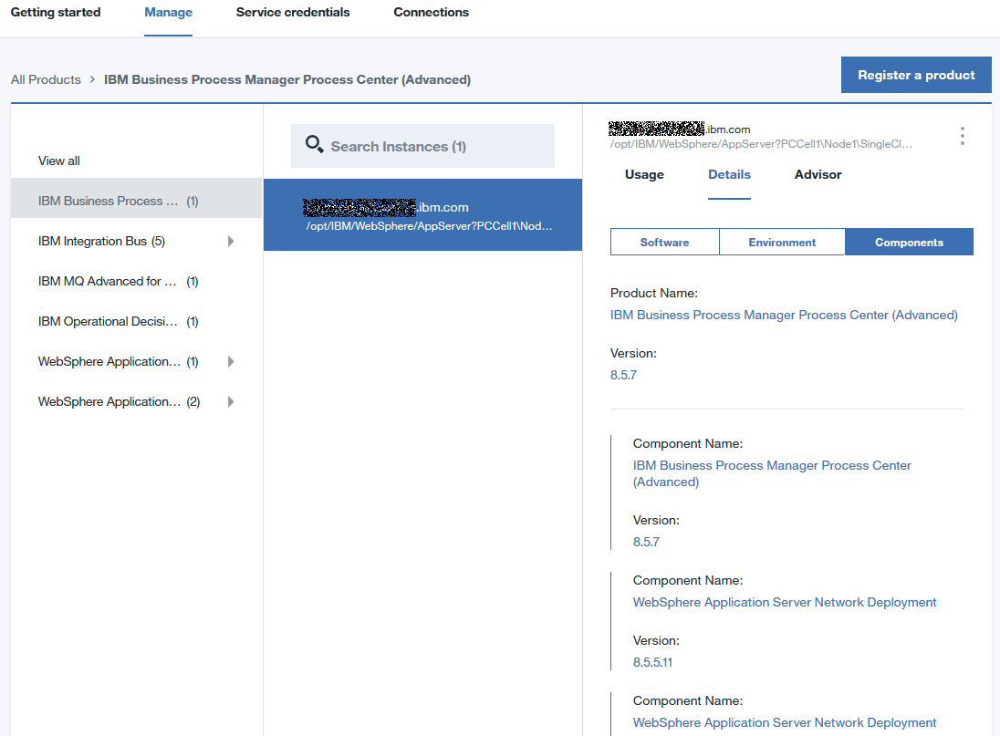

---

copyright:
  years: 2016, 2017
lastupdated: "2017-3-3"

---

<!-- Common attributes used in the template are defined as follows: -->
{:new_window: target="_blank"}
{:shortdesc: .shortdesc}

# 关于 IBM {{site.data.keyword.product-insights_short}}
{: #about_product-insights}

{{site.data.keyword.product-insights_full}} 是 IBM Bluemix 服务，其为 IBM Connect to Cloud 的一部分。它可将内部部署 IBM 软件产品连接到 {{site.data.keyword.product-insights_short}} 服务，并洞察运行清单和运行时使用情况度量值。

{:shortdesc}

{{site.data.keyword.product-insights_short}} 服务是入口点，未来可能还会添加更多功能。

{{site.data.keyword.product-insights_short}} 提供了以下功能：

* 向 IBM（特别是向 Bluemix 服务）注册内部部署 IBM 软件产品。
* 对连接的内部部署产品和相关联使用情况数据进行数据收集。
* 提供用于运行时使用情况数据的仪表板，以真正了解产品使用情况和工作负载。

要使用 {{site.data.keyword.product-insights_full}} 功能，请完成以下步骤：

1. 在 Bluemix for {{site.data.keyword.product-insights_short}} 中至少创建一个服务。
1. 将内部部署 IBM 软件产品升级至所需的发行版级别，并为每个产品安装添加启动代码。 
1. 使用 {{site.data.keyword.bluemix_short}} 凭证为 {{site.data.keyword.product-insights_short}} 服务实例配置软件安装。所有数据都安全地随这些凭证一起存储。只有对服务具有适当权限的个人才可以使用这些数据。

## 运作方式
{: #product-insights_howitworks}
{{site.data.keyword.product-insights_full}} 服务与内部部署 IBM 软件产品相集成，以收集和显示运行时产品信息和使用情况度量值。一开始，会启用一小部分 IBM 软件产品以与此服务集成。在已注册并已连接后，内部部署软件产品会定期发送启动和使用情况信息。这些信息通过已配置的凭证，存储在与此服务实例相关的位置。您可以使用服务实例仪表板，在 Bluemix 中查看该信息。

{{site.data.keyword.product-insights_short}} 解决方案包括多个组件，如下图所示：

。  

## 组织和空间
{: #product-insights_orgs}
{{site.data.keyword.product-insights_full}} 服务与单个 Bluemix 组织和空间相关联且具有唯一的凭证。您必须至少设置一个 Bluemix 组织和空间。举例来说，如果您想要分隔数据，以将访问权限制为特定个人，那么您可以在组织内创建多个空间，每个空间中一个服务实例。每个服务实例具有您需要为 IBM 软件产品提供的唯一凭证。

使用一组凭证配置的产品的信息仅在具有那些凭证的服务中可见。必要的话，可以创建多个服务以分隔数据，每个服务具有唯一的凭证。

## 服务仪表板
{: #service_dashboard}
创建服务实例后，系统会将您定向到服务仪表板。您始终可以通过单击组织仪表板中的服务图标，返回到服务仪表板。从服务仪表板中，您可以访问以下项：

* 入门文档
* 连接内部部署产品所需的服务凭证
* 向 {{site.data.keyword.product-insights_short}} 服务实例注册的受支持产品和任何运行时实例的清单
* 已连接运行时实例的使用情况信息
* 已连接运行时实例的产品和环境信息

如果在“管理”选项卡中未列出任何产品，请单击**注册产品**，以查看受支持产品的列表并访问连接产品实例的特定详细信息。

## 注册产品
{: #product-insights_register}
在**管理**选项卡中，单击**注册产品**，以查看受支持产品的列表。滚动至您的产品或使用搜索字段过滤产品列表。

要查看注册产品实例的指示信息，请从列表中选择该实例。

当您将产品实例连接到 {{site.data.keyword.product-insights_short}} 服务时，它会显示在仪表板的**管理**选项卡中。仪表板可以列出跨不同产品的多个已连接产品实例。

## 产品清单
{: #product-insights_products}
在您启用产品实例以将数据发送至 {{site.data.keyword.product-insights_short}} 之后，您可以在服务仪表板中选择**管理**以查看清单。

 

对于 {{site.data.keyword.product-insights_short}} 而言，产品与产品实例不同。产品具有产品名称，如 IBM MQ 或 IBM WebSphere Application Server Liberty Network Deployment。产品实例用于在安装并运行产品后代表产品。一些产品具有多个实例，可从同一产品安装中运行。例如，WebSphere Application Server Liberty Network Deployment 可以运行从单个产品安装创建的多个应用程序服务器。

在服务仪表板中，已注册的产品的名称会显示在**产品**窗格的*全部查看*选项下。已连接的实例会在**实例**窗格中列出。此窗格包含**产品**窗格中选择的产品实例。在以下示例中，会显示所有产品实例，这是因为在“产品”窗格中已选择*全部查看*选项。此示例显示六个产品，其中有一些已连接多个实例。您可以使用**搜索实例**字段或选择产品条目，来过滤实例列表。要查看产品实例的详细信息，请在**实例**窗格中选择其条目。

在您浏览时会过滤所显示的产品实例列表。为辅助导航，会显示所选实例的浏览路径。

 

## 产品实例信息
{: #product-insights_productinstances}
选择产品实例时，**实例详细信息**窗格中会填充信息。该窗格通过**顾问程序**选项卡，显示产品实例的使用情况数据、产品详细信息和建议。

## 使用情况信息
{: #product-insights_usage}
使用情况信息显示在**使用情况**选项卡上。使用两个下拉列表来选择要显示的度量值（如果产品实例发送多个度量值）和要显示的时间段。

如果产品实例发送多个度量值，请使用第一个下拉列表来选择要显示的度量值。从第二个下拉列表中选择要显示的时间段。部分的时间段选项为“过去 24 小时”、“1 周”、“1 个月”、“6 个月”、“1 年”。

第一部分显示所选时间段内，平均最大、平均、平均最小和总计度量值。第二部分以 X 轴为时间段，显示时间段内值的图形，其根据所选时间段而变更。例如，“过去 24 小时”显示每个小时的图形点，而“1 周”显示该周内每天的图形点。最后的部分显示所选图形点的最大、平均和最小值。要在图形上查看其他点的值，请将时间条拖到新位置。

如果该时间段没有任何数据，则会显示一条消息。例如，已停止的实例不会提供数据，所以当停止时，该时间段不会显示任何数据。其他时间段可以具有要显示的使用情况。在下拉列表中更改时间段以查看其他时间段。

**详细信息**选项卡显示产品实例信息，其可包括以下项：

* 产品名称和版本
* 产品的安装位置，包括主机名和目录
* 启动时实例发送信息的最后时间
* 产品在单个目录中可以具有多个实例时的实例标识

 

产品实例还提供以下可选信息：

* 安装的 APAR 列表。 
* 操作系统及其版本，其显示在**环境**选项卡中。

* 组件或已安装的功能，其显示在**组件**选项卡中。示例不会显示**组件**选项卡，因为 IBM Product XYZ 的实例不会提供任何其他组件信息。

* 产品实例的唯一标识，其为主机名、目录和实例标识的组合。

 

## 搜索 
{: #product-insights_search}
**产品实例**窗格提供基本搜索功能以过滤产品列表。在搜索字段中，键入要用于搜索的字符串。仅可搜索产品实例数据（即**详细信息**选项卡中的信息）。

<!-- If your service doc doesn't have a troubleshooting topic or section, you can add the following to your About: -->
<!-- Add a heading and content for how to get help and support. Use this template for beta and GA services:  -->
## 获取 {{site.data.keyword.product-insights_short}} 的帮助
{: #gettinghelp}

在 [{{site.data.keyword.product-insights_full}} 技术社区](https://developer.ibm.com/product-insights/)中可以找到创建服务、获取已启用 IBM 软件产品更新，以及安装和配置步骤的详细信息。如果在使用 {{site.data.keyword.product-insights_short}} 时有问题，请在社区的论坛部分查看或发布问题。这些问题将由开发和客户项目团队处理。

您还可以使用 Stack Overflow 和 IBM DeveloperWorks dw Answers 论坛来查看或发布问题。有关服务和入门指示信息的问题，请使用 IBM developerWorks dW Answers。当您在这两个论坛中的任何一个上发布问题时，请应用以下标记规则，以便 Bluemix 开发团队能够轻易地查看您的问题。

* 单击以在 [Stack Overflow](http://stackoverflow.com/search?q=hybrid-connect+ibm-bluemix){:new_window} 上发布问题，将您的问题以“ibm-bluemix”和“productinsights”进行标记。
* 单击以在 [IBM developerWorks dW Answers](https://developer.ibm.com/answers/smartspace/productinsights/){:new_window} 上发布问题，将您的问题以“productinsights”或“hybridconnect”进行标记。

有关使用论坛的更多信息，请参阅[获取帮助](https://www.{DomainName}/docs/support/index.html#getting-help)主题。
