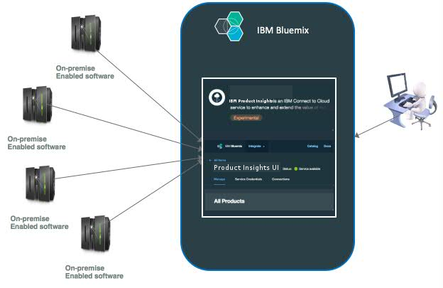

---

copyright:
  years: 2016, 2017
lastupdated: "2017-3-2"

---

<!-- Common attributes used in the template are defined as follows: -->
{:new_window: target="_blank"}
{:shortdesc: .shortdesc}

# About IBM {{site.data.keyword.product-insights_short}}
{: #about_product-insights}

{{site.data.keyword.product-insights_full}} is an IBM Bluemix service, which is part of IBM Connect to Cloud. It connects your on-premises IBM software products to your {{site.data.keyword.product-insights_short}} service and provides insights into your running inventory and runtime usage metrics.

{:shortdesc}

The {{site.data.keyword.product-insights_short}} service is an entry point and more functions may be added in the future.

{{site.data.keyword.product-insights_short}} provides the following features:

* Registration of your on-premises IBM software products with IBM, specifically with a Bluemix service.
* Data collection for connected on-premise products and associated usage data.
* Dashboard for runtime usage data to provide real insights into your product usage and workload.

To use the {{site.data.keyword.product-insights_full}} capabilities, complete the following steps:

1. Create at least one service within Bluemix for {{site.data.keyword.product-insights_short}}.
1. Upgrade your on-premises IBM software products to the required release levels, and add the enablement code for each product installation. 
1. Configure the software installation with the {{site.data.keyword.bluemix_short}} credentials for your {{site.data.keyword.product-insights_short}} service instance. All of your data is securely stored with these credentials. The data is available only to the individuals with proper permissions to the service.

## How it works
{: #product-insights_howitworks}
The {{site.data.keyword.product-insights_full}} service integrates with your on-premises IBM software products to gather and display runtime product information and usage metrics. Initially, a subset of IBM software products is enabled to integrate with this service. When registered and connected, on-premise software products periodically send startup and usage information. The information is stored in relation to this service instance through the configured credentials. You can use the service instance dashboard to view the information within Bluemix.

The {{site.data.keyword.product-insights_short}} solution includes multiple components, as shown in the following graphic:

.  

## Organizations and spaces
{: #product-insights_orgs}
Your {{site.data.keyword.product-insights_full}} service is associated with a single Bluemix organization and space and has unique credentials. You must set up at least one Bluemix organization and space. If you want to separate the data, for example, to limit access to specific individuals, you can create multiple spaces within an organization with one service instance in each space. Each service instance has unique credentials that you need to provide for your IBM software products.

Information for the products that are configured with a set of credentials is only visible within the service with those credentials. Multiple services can be created to separate the data if needed, each with unique credentials.

## Service dashboard
{: #service_dashboard}
After you create your service instance, you are directed to the service dashboard. You can always return to the service dashboard by clicking the service icon in your organization dashboard. From the service dashboard, you can access the following items:

* The Getting started documentation
* The service credentials that you need to connecct your on-premises products
* An inventory of supported products and any runtime instances that are registered to the {{site.data.keyword.product-insights_short}} service instance
* Usage information for connected runtime instances
* Product and environment information for connected runtime instances

If there are no products listed in the Manage tab, click **Register a product** to view a list of supported products and access specific details on connecting product instances.

## Register a product
{: #product-insights_register}
In the **Manage** tab, click **Register a product** to view a list of supported products. Scroll to your product, or use the search field to filter the list of products.

To view instructions on registering an instance of a product, select it from the list.

When you connect a product instance to the {{site.data.keyword.product-insights_short}} service, it is displayed in the **Manage** tab of the dashboard. A dashboard can list multiple connected product instances across different products.

## Product inventory
{: #product-insights_products}
After you enable product instances to send data to {{site.data.keyword.product-insights_short}}, you can view your inventory by selecting **Manage** in the service dashboard.

 

For {{site.data.keyword.product-insights_short}}, a product is different from a product instance. A product has a product name, like IBM MQ or IBM WebSphere Application Server Liberty Network Deployment. A product instance is used to represent a product after the product is installed and running. Some products have multiple instances that are run from within the same installation of the product. For example, WebSphere Application Server Liberty Network Deployment can run multiple applications servers that are created from a single installation of the product.

In the service dashboard, the names of the registered products are shown under the *View all* choice in the **Products** pane. Connected instances are listed in the **Instances** pane. This pane contains instances of the products that are selected in the **Products** pane. In the following example, all of the product instances are shown because the *View all* choice is selected in the Products pane. This example shows six products, some with multiple instances connected. You can filter the list of instances using the **Search Instances** field or by selecting a product entry. To view details for a product instance, select its entry in the **Instances** pane.

The list of product instances that are displayed is filtered as you browse. To aid navigation, the browsed path to a selected instance is displayed.

 

## Product instance information
{: #product-insights_productinstances}
When a product instance is selected, the **Instance details** pane is populated. The pane shows usage data, product details, and recommendations for the product instance through an **Advisor** tab.

## Usage information
{: #product-insights_usage}
The usage information is shown on the **Usage** tab. Use the two drop-down lists to select the metric to display (if the product instance sends more than one metric) and the time period to be displayed.

If the product instance sends more than one metric, use the first drop-down to select which metric to display. Select the time period to display from the second drop-down. The selections impact the sections below the drop-downs. The options for the time period for the sections are Last 24 hours, 1 week, 1 month, 6 months, 1 year.

The first section shows the average maximum, average, average minimum, and total of the metric values over the selected time period. The second section shows a graph of the values within the time period with the x-axis period, which changes based on the selected time period. For example, Last 24 hours shows graph points for each hour, while the 1-week display shows graph points for each day within that week). The final section shows the maximum, average, and minimum for the selected graph point. To see the values for another point on the graph, drag the blue time bar left and right.

A message is shown if there is no data for that time period. For example, a stopped instance would not provide data and no data will be shown for the time period when it was stopped. Other time periods can have usage to display. Change the time period in the drop-down to see other time periods.

The **Details** tab shows product instance information, which can include the following items:

* The product name and version
* The location where the product is installed, including the host name and directory
* The last time when the instance sent information on startup
* The instance identifier if the product can have multiple instances within a single directory

 

The product instance also provides the following optional information:

* A list of APARs that are installed. 
* The operating system and its version, which is shown in the **Environment** tab.

* Components or installed features, which are shown in the **Components** tab. The example does not show the  **Components** tab because the instance of IBM Product XYZ does not provide any additional component information.

* The unique identifier for the product instance, which is a combination of the host name, directory, and instance identifier.

 

## Searching 
{: #product-insights_search}
The **Product instance** pane provides a basic search capability to filter the product list. In the search field, type in the string that you want to use for the search. The search can be done only for product instance data (that is, the information in the **Details** tab).

<!-- If your service doc doesn't have a troubleshooting topic or section, you can add the following to your About: -->
<!-- Add a heading and content for how to get help and support. Use this template for beta and GA services:  -->
## Getting help for {{site.data.keyword.product-insights_short}}
{: #gettinghelp}

Detailed information about creating a service, getting the updates to the enabled IBM software products, and installation and configuration steps are found in the [{{site.data.keyword.product-insights_full}} Technical Community](https://developer.ibm.com/product-insights/). If you have problems or questions when you are using {{site.data.keyword.product-insights_short}}, view or post questions in the forums section of the Community. These questions are handled by the development and customer programs team.

You can also use Stack Overflow and IBM DeveloperWorks dw Answers forums to view or post questions. For questions about the service and getting start instructions, use IBM developerWorks dW Answers. When you post a question on either of those two forums, apply the following tagging rules so that the Bluemix development teams can easily see your question.

* If you post on [Stack Overflow](http://stackoverflow.com/search?q=hybrid-connect+ibm-bluemix){:new_window}, tag your question with "ibm-bluemix" and "productinsights".
* If you post on [IBM developerWorks dW Answers](https://developer.ibm.com/answers/smartspace/productinsights/){:new_window}, tag your questions with "productinsights" or "hybridconnect".

For more information about using the forums, see the [Getting help](https://www.{DomainName}/docs/support/index.html#getting-help) topic.
