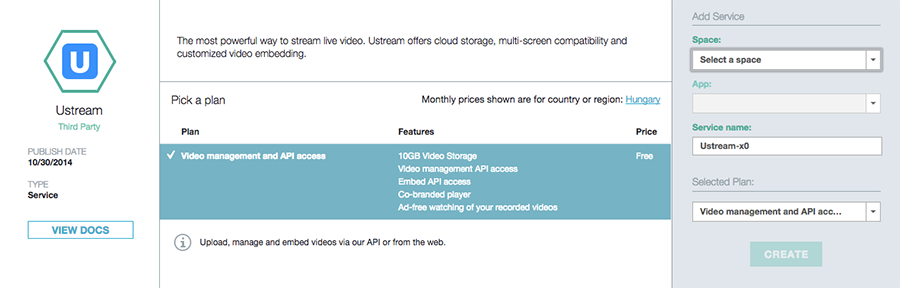
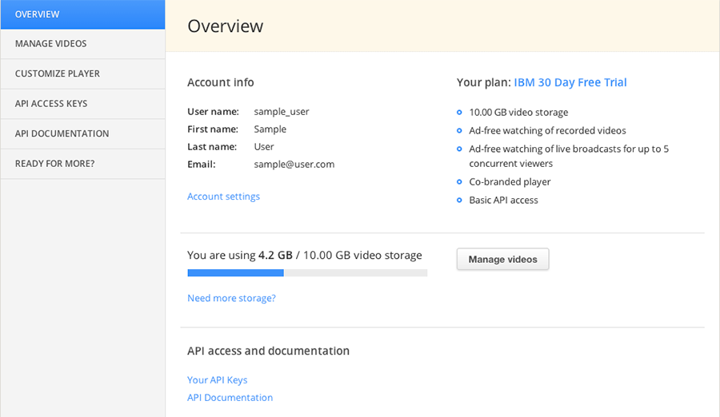
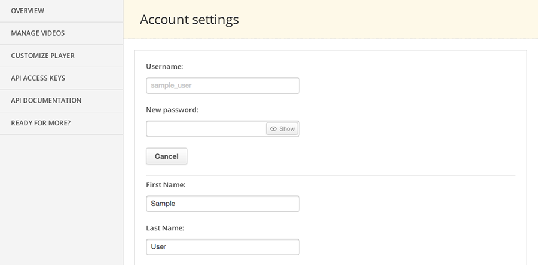
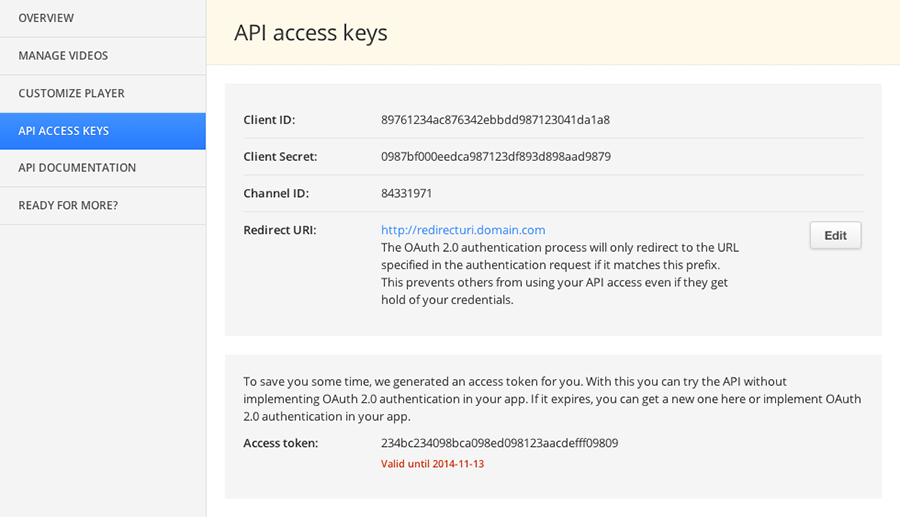

---

copyright:
  years: 2015, 2016
lastupdated: "2016-04-18"
---

{:shortdesc: .shortdesc}
{:new_window: target="_blank"}
{:codeblock: .codeblock}

# Getting started with Ustream for IBM Cloud

Ustream's powerful API lets you host, embed, upload and manage videos right from your Bluemix app. Let Ustream's robust platform do the work under the hood, so you can focus on building great apps.
 
As a Bluemix user you get:

* 10 GB video hosting (upgradable)
* Access to our API so you manage videos directly from your app
* Superior control over the Ustream player
* A super easy method to enhance your viewing experience with logos and custom colors
 
## Installing Ustream for IBM Cloud

### Add Ustream service in Bluemix

After installing Cloud Foundry to your computer, you'll be able to use the cf command from your command line interface. You can install Cloud Foundry CLI from here: https://github.com/cloudfoundry/cli#downloads

Set up the Bluemix API endpoint with the **cf api https://api.ng.bluemix.net** command, and then you can log in to Bluemix with **cf login**. After providing your IBM id credentials and choosing your organization and space, you are ready to add the Ustream for IBM Cloud service.

>```
>$ cf create-service ustream basic ustream01
>```
>
>{:elementKind="pre" class="codeblock"}

This creates a services instance with the name 'ustream01' inside the selected space. That's it, now you have a Ustream service!

Currently there is only this 'ustream basic' Ustream offering in the Bluemix Catalog, but as we start rolling out additional plans, you'll be able to list them with the **cf marketplace** command. You can also use the **cf services** command to list your previously created services.

### Bind Ustream for IBM Cloud to your application

Binding a Ustream for IBM Cloud service instance to your application is easy, just follow these steps.

Use the **cf bind-service** command with the name of the application you want the service to be bound to, and the service name as parameters. Here is an example that binds 'ustream01' service to the 'MyApp' application.

>```
>$ cf bind-service MyApp ustream01
>```
>
>{:elementKind="pre" class="codeblock"}

The **cf services** command now lists the service as bound to your application.

Please note that this documentation does not fully cover creating and managing apps and services inside Bluemix. On how to create an app, please refer to Creating Web Apps or Creating Mobile Apps sections of the Bluemix docs.

### Use the Ustream API

Once you bind Ustream for IBM Cloud to an app, the Ustream API specific configuration will appear in your VCAP_SERVICES environment variable, that you can list with the **cf env** command, followed by your application's name (eg. cf env MyApp).

>```
>{
>	"credentials": {
>		"accessToken": "7da97cef47bfd50448c87bcddc2845092dd23",
>		"channelID": "18917840",
>		"clientID": "0b1d4394f50eb4b786df8eed70e5d6fbe051df95",
>		"clientSecret": "0b1d4394f50eb4b786dfeed70e5d6fbe051df95"
>	},
>	"label": "ustream",
>	"name": "my-service-name",
>	"plan": "basic"
>}
>```
>
>{:elementKind="pre" class="codeblock"}

Under the **credentials** block you can find everything that's needed to use the Ustream API.

**channelId**

On Ustream, you upload videos under a channel. This is your Ustream channel. Channel id is a frequent parameter of our API endpoints.

**clientId, clientSecret**

You can use these to authenticate with OAuth 2.0 against our API, and request an access token.

**accessToken**

To save you some time, we generated an access token for you. With this you can try the API without implementing OAuth 2.0 authentication in your app. If it expires, you can get a new one on the service dashboard or implement OAuth 2.0 authentication - it's pretty easy!

For a detailed walkthrough on authentication and using the API to manage your videos and control your player, visit the API documentation at [https://ibmcloud.ustream.tv/dashboard/api](https://ibmcloud.ustream.tv/dashboard/api).

### Unbind or delete Ustream for IBM Cloud

To unbind the service from an application use the **cf unbind-service** command, for deletion there is the **cf delete-service**.

## Installing Ustream for IBM Cloud from your a browser

Alternatively you can install our service from the browser interface of the Bluemix catalog.

1. Select Ustream for IBM Cloud in the Bluemix catalog, select a space and optionally an application, and click Create.  
> 

2. Select the newly added Ustream service on your dashboard, and click on Launch Ustream for IBM Cloud dashboard.  
> 

3. You will be automatically logged in to the Ustream for IBM Cloud dashboard  
> 

4. Go to Account settings and set a new password. This will let you access Ustream for IBM Cloud dashboard directly by logging in at ibmcloud.ustream.tv later.  
> 

5. Set the redirect URL for your app on the API access keys page to secure your access to the Ustream API.  
> 

6. You are done! On the Ustream for IBM Cloud dashboard you will find everything to get started. You can choose to start uploading and embedding videos through the dashboard or start experimenting with the Ustream API. For a detailed walkthrough on authentication and using the API to manage your videos and control your player, visit the API documentation at [https://ibmcloud.ustream.tv/dashboard/api](https://ibmcloud.ustream.tv/dashboard/api).

># Related Links {:class="linklist"}
>## Related Links {:id="general"}
>* [Ustream API documentation](https://ibmcloud.ustream.tv/dashboard/api)
>* [Ustream for IBM Cloud dashboard](https://ibmcloud.ustream.tv)
>* [Ustream website](http://ustream.tv)
>
>{:elementKind="article" id="rellinks"}

