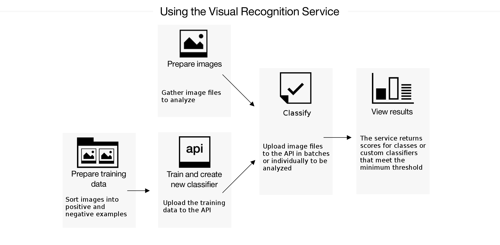

---

copyright:
  years: 2015, 2017
lastupdated: "2017-03-31"

---

{:new_window: target="_blank"}
{:shortdesc: .shortdesc}

# About the IBM Watson Visual Recognition Dedicated service
{: #about}
The {{site.data.keyword.visualrecognitionfull}} Dedicated service uses deep learning algorithms to analyze images for scenes, objects, and other content. The response includes keywords that provide information about the content.
{: shortdesc}

A set of built-in classes provides highly accurate results without training. You can train custom classifiers to create specialized classes.

## How to use the service
{: notoc}
The following image shows the process of creating and using the classifier:

## What to use the service for
{: #use-cases}
The {{site.data.keyword.visualrecognitionshort}} Dedicated service can be used for diverse applications and industries, such as:

- **Manufacturing:** Use images from a manufacturing setting to make sure products are being positioned correctly on an assembly line

- **Visual Auditing:** Look for visual compliance or deterioration in a fleet of trucks, planes, or windmills out in the field, train custom classifiers to understand what defects look like

- **Insurance:** Rapidly process claims by using images to classify claims into different categories.

- **Social listening:** Use images from your product line or your logo to track buzz about your company on social media

- **Social commerce:** Use an image of a plated dish to find out which restaurant serves it and find reviews, use a travel photo to find vacation suggestions based on similar experiences, use a house image to find similar homes that are for sale

- **Retail:** Take a photo of a favorite outfit to find stores with those clothes in stock or on sale, use a travel image to find retail suggestions in that area

- **Education:** Create image-based applications to educate about taxonomies, use pictures to find educational material on similar subjects

## Supported languages
{: #supported-languages}
The **Classify an image** method supports English (en), Spanish (es), Arabic (ar), and Japanese (ja) for default classes. Custom classifiers returned with this method support only English.

All other methods support English only.

# Related Links
{: #rellinks notoc}

## Tutorials and Samples
{: #samples}

* [View a video introduction ](https://www.youtube.com/watch?v=vnWblT50w1Y){:new_window} about training and retraining classifiers.

* [Get started with the service](getting-started.html).

* [Try out the demo ](http://visual-recognition-demo.mybluemix.net){:new_window}.