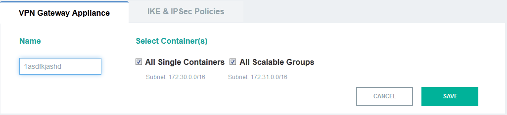
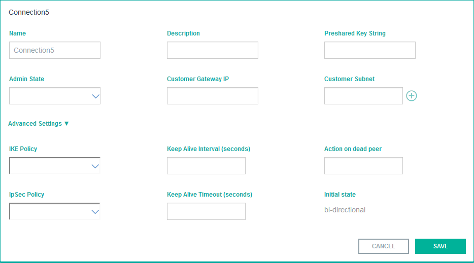
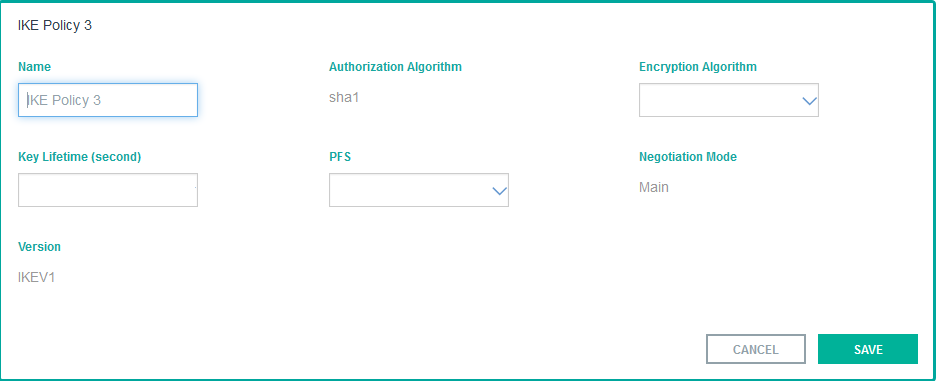
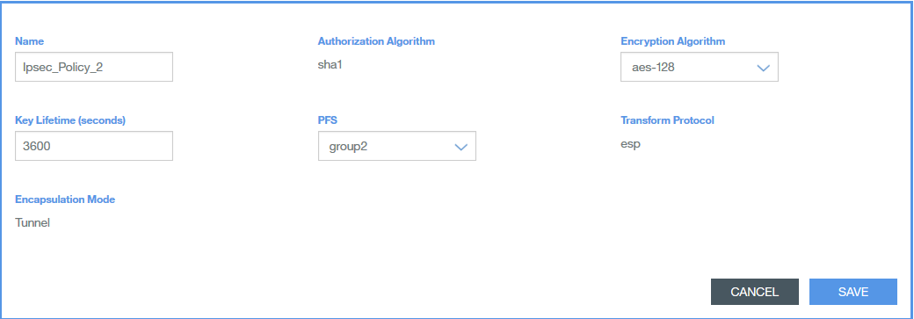

{: new_window: target="_blank"} 

# Getting started with IBM VPN (BETA)

{{site.data.keyword.vpn_full}} (VPN) provides a secure communication channel between your corporate data center and your resources inside IBM cloud. The connection is established over the Internet. You can use IBM cloud as an extension of your corporate data center. 

IBM VPN service is available to securely access IBM containers (Docker containers) inside IBM cloud. The IBM VPN service offering is available at: IBM Bluemix® > Catalog > Services > Network. 

Before you begin, ensure that you have an IBM Docker container ready to use. See [IBM Containers for Bluemix](https://www.ng.bluemix.net/docs/containers/container_index.html) for details on how to create and manage IBM containers.  

### To use IBM VPN service:
{: #ibm-vpn}

1. Open IBM Bluemix > Catalog > Services > Network. You will see the available network services.
2. Select **VPN**. You will see the VPN service description, available plans, and pricing details. 
3. Select a suitable plan. 
4. Select options in the **Add Service** section:
    <ul><li>Space:</li><li>Service Name:</li></ul>
5. Select **CREATE**. The service instance is created.
6. Select IBM Bluemix > Dashboard > Services > Virtual Private Network (VPN).

Proceed with configuring the gateway, site connections, and the Internet Key Exchange (IKE) and IPSec policies. See also: [Configuration at Your Data Center](index.html#yourdatacenter) 

#### Gateway Configuration
{: #gateway}

Configure the gateway as follows:  
1. Select **EDIT**.  
2. Specify the gateway name.  
2. Select the containers or groups with which you want to use the VPN service.  
3. Select **SAVE**. 

**Note:** The IBM VPN gateway IP address is displayed after you complete the site connection configuration and when the connection is established.

#### VPN Site Connection Configuration
{: #site}

1. Select **ADD NEW**.
2. Specify the following site connection details:  
	* **Name**: Name of the connection  
	* **Description**: Description of the connection parameters (optional)  
	* **Preshared Key String**: Preshared (secret) key to be used for authentication
	* **Admin State**: Status of the VPN connection. Select from drop-down: UP or DOWN. Default value: UP  
	* **Customer Gateway IP**: Remote endpoint IP address of the VPN tunnel  
	* **Customer Subnet**: Remote subnet address in CIDR format. 
3. (Optional) Configure the following **Advanced Settings** parameters:  
	* **IKE Policy**: Name of the IKE policy
	* **Keep Alive Interval**: Keepalive interval in seconds. Send keepalive messages at the configured interval to check liveliness of the peer. Default value: 15. Range: 5-86399
	* **Action on dead peer**: Action to be taken when the peer is detected as dead; Values: hold, clear; disabled; restart; restart-by-peer. Default value: hold
	* **IPSec Policy**: Name of the IPSec policy
	* **Keep Alive Timeout**: Timeout value in seconds after which the session is terminated. Default value: 120. Range: 6-86400
4. Select **SAVE**.

**Note:** You will see a ***pending create*** message when the connection is being established. When you see this message, refresh the screen a few times to see the connection active message.

**Important:** If you are using a web application, you must bind the web application to the Docker container you are using. This binding is required for the traffic to pass through the IPSec VPN tunnel.

#### IKE and IPSec Policy Configuration

**Note:** You can use the default IKE and IPSec policies or configure custom policies.

  
Select the **IKE & IPSec Policies** tab.

#####IKE Policy Configuration
{: #ike}

To configure IKE policy:

1. Select **ADD NEW**.  
2. Specify the following details:
	* **Name**: Name of the IKE policy
	* **Authorization Algorithm**: sha1; cannot be changed  
	* **Encryption Algorithm**: Select from drop-down. Values: aes-128 (default); aes-192; aes-256; 3des
	* **Key Lifetime**: Lifetime value (in seconds) of the IKE security association. Range: 60-86400. Default Value: 86400
	* **PFS**: Diffie-Hellman (DH) group identifier. Values: Group2; Group5; Group14. Default value: Group2
	* **Negotiation Mode**: Main; cannot be changed
	* **Version**: IKEV1; cannot be changed
3. Select **SAVE**.

#####IPSec Policy Configuration
{: #ipsec}

To configure IPSec policy:

1. Select **ADD NEW**.  
2. Specify the following details:
	* **Name**: Name of the IPSec policy  
	* **Authorization Algorithm**: sha1; cannot be changed  
	* **Encryption Algorithm**: Select from drop-down. Values: aes-128 (default); aes-192; aes-256; 3des
	* **Key Lifetime**: Lifetime value (in seconds) of the security association. Range: 60-86400. Default Value: 3600
	* **PFS**: Diffie-Hellman (DH) group identifier. Values: Group2; Group5; Group14. Default value: Group2
	* **Transform Protocol**: ESP; cannot be changed
	* **Encapsulation Mode**: Tunnel; cannot be changed
3. Select **SAVE**.  

###Configuration at Your Data Center 
{: #yourdatacenter}

The following VPN gateway configurations are required at your data center:

* Enable NAT traversal at your VPN gateway only if your VPN gateway is behind NAT. 
* Use the same preshared key that you had used while configuring the IBM VPN service.
* Configure the subnets for all the containers or container groups for which you have enabled the IBM VPN service.
* Ensure that the encryption, authentication, and PFS group settings are same at the IBM VPN gateway and your VPN gateway.

**Note:** IBM VPN device always acts as the initiator. 
    
###IBM VPN Overview
IBM VPN provides the following features:

####Security 
IBM VPN uses industry-standard Internet Protocol Security (IPSec) protocol suite to authenticate and encrypt IP communication between your corporate data center and IBM cloud. IPSec provides network-level peer authentication, data integrity, and data confidentiality (encryption).

IBM VPN supports the following IPSec protocols and transforms:

* Authentication Algorithm:
	* HMAC-SHA1-96; the length of the shared key is 160 bits (default)  
* Encryption Algorithm:
	* 3DES-CBC; the length of the shared key is 192 bits
	* AES-CBC; the lengths of the shared key are 128 (default), 192, 256 bits
* Authentication and Encryption Protocols:
	* Authentication Header (AH) and Encapsulating Security Payload (ESP) protocols are supported. AH is used for authentication only. ESP is used for providing authentication and encryption.
* IKEv1 Diffie-Hellman (DH) Key Exchange groups 2, 5, and 14(default)

IBM VPN supports IPSec tunnel Mode. In this mode, IPSec protects the entire original IP packet. IPSec encrypts the packet, encapsulates it within a new IP packet, and forwards the new packet to the IPSec peer. 

IBM VPN uses Diffie-Hellman key exchange and the preshared key to secure the association between two peers. Authentication fails if any one party does not provide the preshared key. 
 
IBM VPN service is compliant with the following IETF RFCs:

* RFCs 2407, 2408, and 2409 for IKEv1
* RFC 4301 for IPv4 security   
* RFC 4302 for the IPv4 Authentication Header  
* RFC 4303 for IPv4 Encapsulating Security Payload (ESP)  
* RFC 2104 HMAC and RFC 2404 HMAC-SHA-1-96 for authentication  
* RFC 2451 3DES-CBC; RFC 3602 AES128-CBC, AES192-CBC, and AES256-CBC for encryption

####Simplicity
You can create IBM VPN service by using a simple and intuitive graphical interface. You can specify your gateway IP address, your data center subnets, and either use default IPSec and IKE policies or customize the policies to suit your needs.  

####Management
 
You can manage the IBM VPN service by using graphical interface, command line interface, or API.

* [IBM VPN graphical interface](https://console.ng.bluemix.net/?direct=classic)
* [IBM VPN RESTful APIs](http://vpn-api-docs.mybluemix.net)
* [IBM VPN command line interface](../../cli/plugins/vpn/index.html)

##FAQs 
{: #faq}

**1. Which third-party vendor devices are qualified in IBM labs for interoperability with IBM VPN service?**

IBM lab has tested the following VPN gateway devices for interoperation with IBM VPN service:

* Cisco Adaptive Security Appliance (ASA) Software Version 8.2(1) 
* Brocade Vyatta 5415 vRouter 6.7 R7. [See configuration example](onpremises_gateway.html#vyatta){: new_window}
* Linux StrongSwan U5.1.2/K3.13.0-55-generic. [See configuration example](onpremises_gateway.html#strongswan){: new_window}
* Linux StrongSwan U5.2.2/K3.13.0-55-generic. [See configuration example](onpremises_gateway.html#strongswan){: new_window}

In addition, an IPSec standards-compliant VPN gateway device from any other vendor is expected to work well with IBM VPN service.

**2. How soon will a peer failure be detected?**
 
A failed peer is detected at the configured keepalive timeout value. The default setting is 60 seconds.

**3. How many VPN gateways and connections can I create per VPN service?**
 
You can create one VPN gateway appliance per VPN service in a Bluemix space. You can define up to 16 connections to different destinations per VPN gateway. 

**4. When should I use IBM VPN service versus Bluemix Secure Gateway service?**

Both the services are used to provide secure connectivity between your Bluemix resources and your on-premises data center. 

Use the IBM VPN service when you are looking to ensure connectivity between any two endpoints. The VPN service forms a secure, Layer-3 IPSec connection between your on-premises networks and Bluemix cloud. 

Use the Bluemix Secure Gateway service if you want to establish a secure connection from a specific application endpoint in Bluemix to another endpoint inside your on-premises data center. 

**5. Can I use the IBM VPN service to access my containers and VMs inside Bluemix cloud by using their private IP addresses?**
 
Currently, the IBM VPN service is available for accessing Bluemix containers only.

**6. Can I define IBM VPN service at Bluemix Organization level?**

Currently, the IBM VPN service is available only at the Bluemix Space level. If your Bluemix Organization has multiple Spaces, then a separate VPN service can be defined for each space.

**7. How do I connect IBM VPN service with SoftLayer Gateway Appliance service (GaaS)?**

You can build an IPSec tunnel to establish secure communication between IBM VPN service and SoftLayer GaaS. [See configuration example.](onpremises_gateway.html#gaas){: new_window}

># Related Links {:class="linklist"}
>## API Reference {:id="api"}
>* [IBM VPN RESTful APIs](http://vpn-api-docs.mybluemix.net){: new_window}
>
># Related Links {:class="linklist"}
>## Related Links {:id="general"}
>* [IBM VPN Command line Interface](../../cli/plugins/vpn/index.html){: new_window}
>* [IBM VPN FAQs](index.html#faq){: new_window}
>
># Related Links {:class="linklist"}
>## Tutorials and Samples {:id="samples"}
>* [On-premises strongSwan Gateway Configuration Example](onpremises_gateway.html#strongswan){: new_window}
>* [On-premises Vyatta Gateway Configuration Example](onpremises_gateway.html#vyatta){: new_window}
>* [On-premises SoftLayer Gateway Appliance Service (GaaS) Configuration Example](onpremises_gateway.html#gaas){: new_window}
>
>{:elementKind="article" id="rellinks"}

